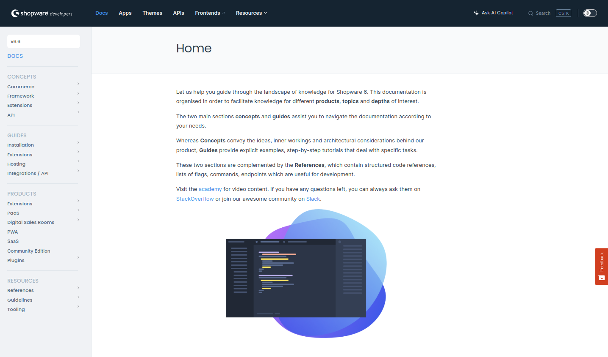

---
nav:
  hidden: true
---

# Shopware Developer Documentation

[](https://github.com/shopware/docs/issues)
[](https://github.com/shopware/docs/pulls)
[](https://developer.shopware.com)

This repository contains general **developer** documentation for Shopware 6 which is served on [developer.shopware.com/docs](https://developer.shopware.com/docs/). However, the primary hub for all our [developer resources](https://developer.shopware.com/) is managed through the [developer portal](https://github.com/shopware/developer-portal) repository.
The developer documentation is organized into sections covering :

- [Concepts](./concepts/)
- [Guides](./guides/)
- [Products](./products/)
- [Resources](./resources/)

Refer to its [structure](./index.md) to understand better. Contributions to improve the content are welcome, following the outlined [contribution guidelines](./resources/guidelines/documentation-guidelines/06-doc-process.md). The markdown content undergoes workflow checks for easier maintenance. Further details are outlined below.



## Workflows

They are defined in the [`.github/workflows`](./.github/workflows/) folder and help the DX team to maintain the documentation. The workflows are triggered by events like `push`, `pull_request`, `schedule` and `workflow_dispatch`. The workflows are used to build, test, and deploy the documentation. If a PR pipeline fails, the PR will be marked as failed, and it won't be possible to merge it. In this case, check the below-mentioned workflows to see what went wrong and where to fix it.

### Grammar and language check

All changed content is checked with Reviewdog for grammar and language. The configuration for Reviewdog can be found in [`.reviewdog.yml`](./.github/workflows/reviewdog.yml). It will create warnings in the pull request if the language or grammar is not correct. A more in-depth explanation can be found in [Language and Grammar](./resources/guidelines/documentation-guidelines/03-language-and-grammar.md) section.

### Markdown check

The markdown files are checked with [markdown-lint](https://github.com/avto-dev/markdown-lint) to identify issues such as formatting errors, style inconsistencies, etc. By doing so, it facilitates the creation of well-structured and consistent Markdown documents.. The configuration for markdown-lint can be found in [`markdown-style-check.yml`](./.github/workflows/markdown-style-check.yml).

### Spellcheck

The markdown files are checked with [py-spelling](https://facelessuser.github.io/pyspelling/) to rectify spelling errors. The configuration for py-spelling can be found in [`.spellcheck.yml`](./.spellcheck.yml).

#### Via Docker

```bash
make spellcheck
```

#### Locally (requires `aspell` and `py-spelling`)

```bash
make spellcheck-local
```

This will automatically create a virtual environment and install the required dependencies if needed.

#### Excluding words

To exclude a word from being spellchecked, add it to the [`.wordlist.txt`](./.wordlist.txt) file.
Make sure to add the word at the right position, as the file doesn't automatically sort alphabetically.
You can use the following command to sort the file:

```bash
LC_ALL=C sort .wordlist.txt -o .wordlist.txt
```

### Media file format check

The `/docs/assets` folder stores images, videos, and other files linked in markdown. They follow the naming convention outlined in [Methodize Assets](./resources/guidelines/documentation-guidelines/05-methodize-assets.md#visual-diagram-guidelines). The [`file-format-check.yml`](.github/workflows/file-format-check.yml) ensures adherence to these naming guidelines.

### External link check

[Lychee](https://github.com/lycheeverse/lychee) is used to check if external links are working properly or broken. The configuration for lychee can be found in [`validate-external-links.yml`](./.github/workflows/validate-external-links.yml).

### Synced files

Certain files within the `shopware/shopware` repository are duplicated in the `shopware/docs` repository for reference purposes. Any modifications made to the former files will automatically synchronize with the corresponding files in the latter repository by the [`update-adrs`](./.github/workflows/update-adrs.yml) workflow.

| `shopware/shopware` files | `shopware/docs` files                     |
|-----------------------|-------------------------------------------|
| [shopware's adr](https://github.com/shopware/shopware/tree/trunk/adr) | [adr folder](./resources/references/adr/) |
| [adr assets](https://github.com/shopware/shopware/tree/trunk/adr/assets) | [assets adr folder](./assets/adr/)        |
| [coding guideline](https://github.com/shopware/shopware/tree/trunk/coding-guidelines/core) | [core](./resources/guidelines/code/core)  |

> Please create a PR in the [shopware](https://github.com/shopware/shopware/pulls) repository if you want to change something in the above folders.
