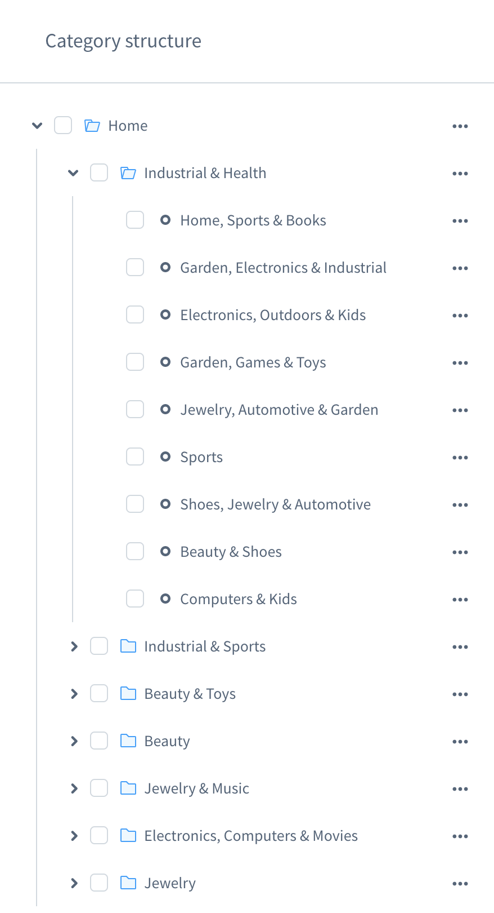
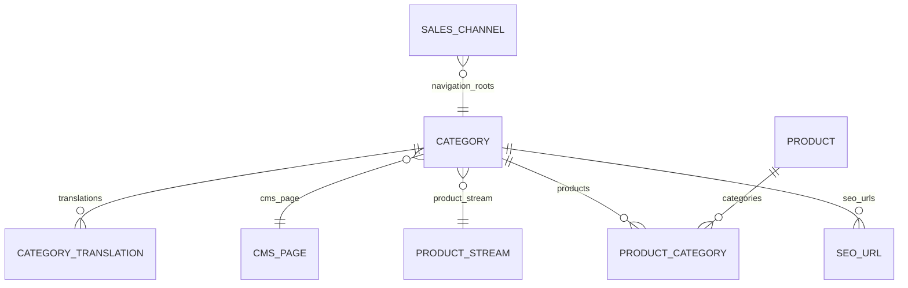

---
nav:
  title: Categories
  position: 20

---

# Categories

Categories in Shopware organize products, drive storefront navigation, and define SEO-relevant URLs. The entire catalog lives in one category tree, and every sales channel chooses entry points inside that tree. For how to use the Admin UI, see the [user documentation on categories](https://docs.shopware.com/en/shopware-6-en/catalogues/categories) and [Dynamic Product Groups](https://docs.shopware.com/en/shopware-6-de/Catalogues/Dynamicproductgroups). This page focuses on developer details.

## Category model and tree

- Each category stores `parentId`, `path`, and `level` to build breadcrumbs, infer inheritance, and traverse efficiently.
- Flags:
  - `active` determines whether the category participates in navigation and listings.
  - `visible` and `hideInNavigation` control menu rendering without disabling the category entirely.
- Types:
  - `page`: regular category (listing or landing page).
  - `folder`: structuring element; not rendered as a page and typically used to group children.
  - `link`: redirects to an external URL or internal static link.

## Entity associations and database schema

- `category`: tree structure plus `cmsPageId` for layout inheritance; `productAssignmentType` controls explicit vs. stream-based listings.
- `category_translation`: localized names, breadcrumbs, links, and SEO text.
- `product_category`: explicit product links used for listings when not driven by a product stream.
- `product_stream`: dynamic filters attached to a category when assignments are stream-based.
- `cms_page`: CMS layout referenced by categories (inherited when missing).
- `sales_channel`: entry categories (`navigation`, `footer`, `service`) anchoring storefront menus.
- `seo_url`: generated URLs per category and sales channel domain, rebuilt by the SEO indexer.

## Sales channel entry points and navigation

Every [Sales Channel](sales-channels) defines `navigation`, `footer`, and `service` entry categories. The storefront builds menus from the children of those entry points, inheriting explicit assignments from lower levels.

Store API endpoints:

- `/store-api/navigation/{activeId}/{rootId}` for hierarchical menus.
- `/store-api/category/{navigationId}` for category details including assigned CMS layout data.

Navigation responses are cached; adjust cache identity or tags via `NavigationRouteCacheKeyEvent` and `NavigationRouteCacheTagsEvent`. Use `NavigationLoadedEvent` to enrich or modify the tree before it is returned.

::: info
Categories can be hidden from navigation via the hide-in-navigation flag while remaining reachable by direct URL if they are still `active`.
:::

## Product assignments and Dynamic Product Groups

- Explicit assignments: stored in `product_category` (and `product_category_tree` for inherited links) to put category IDs directly on products.
- Dynamic Product Groups (product streams): attached to a category to evaluate saved filters at runtime and automate listings (for example, brand filters or price ranges). See the [user docs](https://docs.shopware.com/en/shopware-6-de/Catalogues/Dynamicproductgroups) for configuration guidance.

Both assignment types are merged for a category listing. `ProductListingRoute` builds the listing criteria from the category configuration, sales channel, and request filters. Extend or alter the listing query with `ProductListingCriteriaEvent`.

## CMS layout integration

Categories can reference a [CMS layout](../content/shopping-experiences-cms.md). Layout selection is inherited: if `cmsPageId` is missing, the parent layout is used. Category-specific slot configuration is stored on the category and merged at runtime, so one layout can serve many categories with different media and copy. `folder` categories ignore layouts; `link` categories redirect immediately.

## SEO and URLs

Per-category SEO fields include `metaTitle`, `metaDescription`, `keywords`, `seoUrl`, and robot flags (`noIndex`, `noFollow`). SEO URLs are generated from templates under *Settings → SEO* and are rebuilt when categories change or when the SEO indexer runs.

- Customize URL templates (e.g., include the breadcrumb) and priorities per sales channel domain.
- React to regenerated URLs via `SeoUrlUpdateEvent`, or enqueue additional updates when categories are changed programmatically.
- Emit canonical links when rendering custom category pages.

## Extensibility and events

- `NavigationLoadedEvent`: navigation tree loaded; enrich or adjust nodes.
- `SalesChannelCategoryIdsFetchedEvent`: category IDs resolved for a sales channel.
- `CategoryIndexerEvent`: keep de-normalized data or external search indices in sync.
- `ProductListingCriteriaEvent`: customize listing filters, sorting, and aggregations for category pages.
- `SeoUrlUpdateEvent`: observe or react to SEO URL regeneration.

Categories are fully extensible via custom fields or entity extensions. Expose custom data through Store API response extensions when it is needed in storefronts or external channels.
