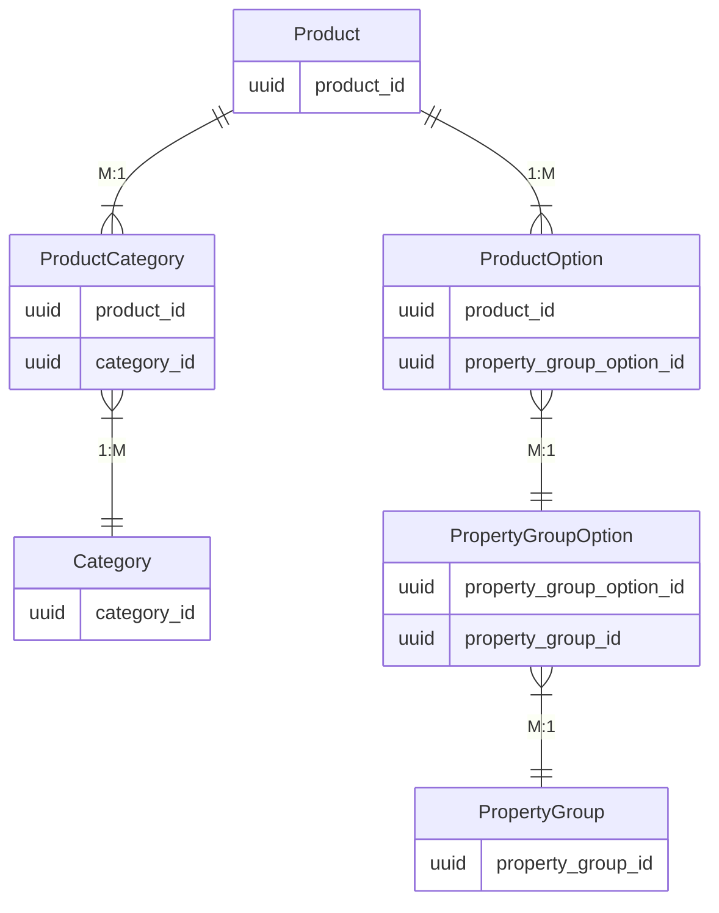
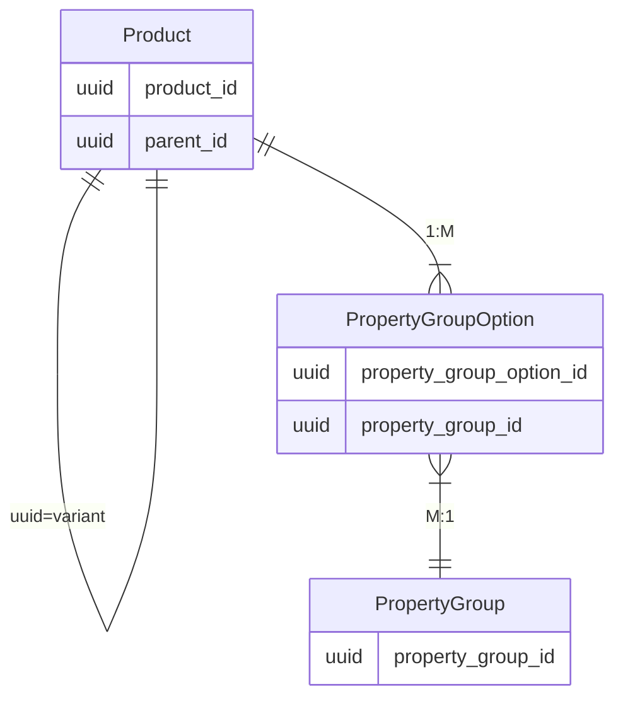

---
nav:
  title: Products
  position: 10

---

# Products

Products are sellable entities (physical and digital products) within your shop.

Depending on your setup, Shopware can easily handle thousands of products. However, an upsurge in the product quantity (in millions) needs some tweaks for robust running of the environment as it depends on factors like the number of [categories](../../../concepts/commerce/catalog/categories), [sales channels](../../../concepts/commerce/catalog/sales-channels), [product properties](../../../concepts/commerce/catalog/products), etc. Every product added to your shop can be made available on one or more [sales channels](../../../concepts/commerce/catalog/sales-channels).

Let's delve into a more detailed understanding of products using the example of garments:

* **Product details**: General information about a Product.

| Title              | Product Id | Manufacturer | Prices | .... |
|--------------------|------------|--------------|--------|------|
| Levis Ocean Hoodie | SW1001     | CA           | 40     | ...  |

* **Product properties**: Product properties encapsulate property groups and options. They are displayed in a table on product details page, in listings, or even be used for filtering. A product can have arbitrarily many property group options.

| Property Group | Property Group Options          |
|----------------|---------------------------------|
| Size           | *S*, *M*, *L*, *XL*, etc        |
| Color          | *Red*, *Blue*, *Green*, *Black* |
| Material       | *Leather*, *Cotton*, *Jeans*    |

* **Category**: Products in Shopware are organized in categories. It is a grouping of products based on characteristics, marketing or search concerns. Categories are represented as a hierarchical tree to form a navigation menu. A product can be contained in multiple categories.

* **Packaging dimensions**: Physical dimensions and weight of the product packaging. These values are stored in standardized units: weight in kilograms (kg) and dimensions (width, length, height) in millimeters (mm). This information is crucial for shipping calculations, storage planning, and logistics operations. However, these units can be configured to be displayed differently on storefront and APIs depending on the sales channel context.

| Dimension | Stored Value | Display Value (configurable) |
|-----------|--------------|------------------------------|
| Weight    | 1.5          | 3.3 lbs/1500g/1.5kg          |
| Width     | 300          | 11.8 in/300mm/0.3m           |
| Length    | 400          | 15.7 in/400mm/0.4m           |
| Height    | 200          | 7.9 in/200mm/0.2m            |

::: info
The configurable measurement units are only available in Shopware v6.7.1.0 and later version. Before that, the values are always stored in the metric system and displayed in the same way.
:::

Below you find an overview of relationships between the entities. Products, categories, options, and property groups are interconnected in the database schema.

* **Product variant**: A sellable product. Products are a self-referencing entity, which is interpreted as a parent-child relationship. Similarly, product variants are also generally mapped to products. This mechanism is used to model variants. This also provides inheritance between field values from parent products to child products.

It is also useful to attach some additional properties to differentiate product variants next to the field inheritance. For that reason, it is critical to understand the difference between *properties* and *options*:

**Properties** are used to model facts about a product, but usually, different product variants share these facts. We can refer to properties as *non variant defining*. They could be useful to represent the following information:

* Product Series / Collection
* Washing Instructions
* Manufacturing country

Opposed to that, **options** are considered variant defining, as they are the facts that differ from one product variant to another. Such as

* Shirt Size
* Color
* Container volume

It is important to understand the difference between those two because both provide a relation between the *product* and the *property group option* entity. However, only one constitutes to *product variants*.

| Variant   | Product            | Category          | Product Group | Product Group Option |
|-----------|--------------------|-------------------|---------------|----------------------|
| Variant 1 | Levis Ocean Hoodie | Hoodie & Sweaters | Color         | Red                  |
| Variant 2 | Levis Ocean Hoodie | Hoodie & Sweaters | Color         | Black                |

## Configurator

When a variant product is loaded for a [Store API](../../api/store-api)-scoped request, Shopware assembles a configurator object which includes all different property groups and the corresponding variants. This way client applications, such as the [Storefront](../../../guides/plugins/plugins/storefront/) or [Composable Frontends](../../../../frontends/) can display the different variant options of the product.

The following section is a detailed understanding on category.
