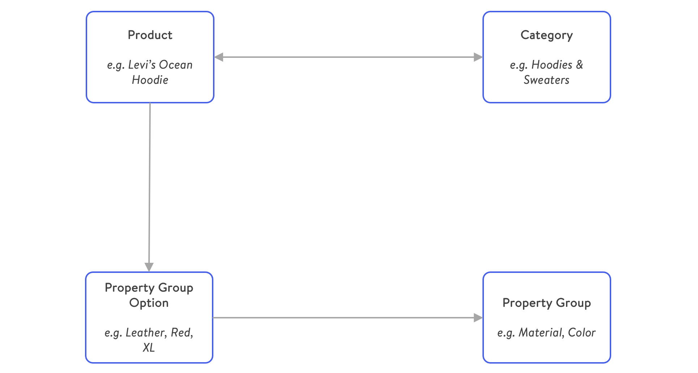

---
nav:
  title: Products
  position: 10

---

# Products

Products are sellable entities (physical and digital products) within your shop.

Depending on your setup, Shopware can easily handle thousands of products. However, an upsurge in the product quantity (in millions) needs some tweaks for robust running of the environment as it depends on factors like the number of [categories](../../../../docs/concepts/commerce/catalog/categories), [sales channels](../../../../docs/concepts/commerce/catalog/sales-channels), [product properties](../../../../docs/concepts/commerce/catalog/products#property-groups--options), etc. Every product added to your shop can be made available on one or more [sales channels](../../../../docs/concepts/commerce/catalog/sales-channels).

Let us start understanding about product more in detail:

* **Product details**: General information about a Product - for example, title, manufacturer, prices, media, etc.
* **Product properties**: Product properties encapsulates property groups and options.
* **Product variant**: A sellable good. Product Variants are generally mapped to products. Inventory is modeled per variant.
* **Category**: Products in Shopware are organised in categories. It is a grouping of products based on characteristics, marketing or search concerns. Categories are represented as a hierarchical tree to form a navigation menu. A product can be contained in multiple categories.

Look at the below condensed overview of the product data model:

Besides their relation to categories, products can also link to a set of *property group options*.

## Property groups and options

Product properties can be modeled using property groups and -options. They can be displayed in a table on your product detail pages, in listings, or even be used for filtering.

Examples of property group garments are *Size*, *Color* or *Material*. The corresponding values of each group are referred to as *property group options*. A product can have arbitrarily many property group options.

## Product variants

Different variations of a product can be modeled using *product variants*. Products are a self-referencing entity, which is interpreted as a parent-child relationship. This mechanism is also used to model variants. This also provides inheritance between field values from parent products to child products.

However, it is also useful to attach some additional properties to differentiate product variants next to the field inheritance. For that reason, it is critical to understand the difference between *properties* and *options*:

**Properties** are used to model facts about a product, but usually, different product variants share these facts. We can refer to properties as *non variant defining*. They could be useful to represent the following information:

* Product Series / Collection
* Washing Instructions
* Manufacturing country

Opposed to that **options** are considered variant defining, as they are the facts that differ from one product variant to another. Such as

* Shirt Size
* Color
* Container volume

It is important to understand the difference between those two because both provide a relation between the product and the property group option entity. However only one constitutes to product variants.

### Configurator

When a variant product is loaded for a [Store API](../../api/store-api)-scoped request, Shopware assembles a configurator object which includes all different property groups and the corresponding variants. This way client applications, such as the [Storefront](../../../guides/plugins/plugins/storefront/) or the [PWA](../../../products/pwa) can display the different variant options of the product.

The following section is a detailed understanding on category.
