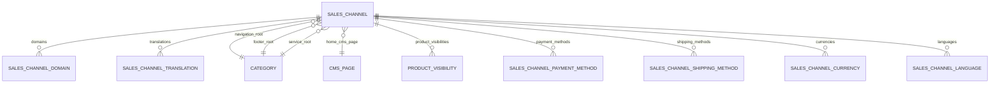

---
nav:
  title: Sales Channels
  position: 30

---

# Sales Channels

Sales channels define how your catalog is exposed to a concrete audience (storefront, headless client, feed, or app). Each channel carries defaults for language, currency, taxes, payment/shipping, domains, and navigation entry points so one Shopware instance can serve multiple “stores” without duplicating data.

## What a sales channel controls

- Channel type: Storefront, headless Store API, product feed, or custom type.
- Audience defaults: language, currency, country, tax calculation mode, customer group, default payment/shipping methods.
- Navigation roots: `navigation`, `footer`, and `service` entry categories that drive storefront menus and listings.
- Presentation: home CMS page (`homeCmsPageId` with slot config) and storefront theme config for Storefront channels.
- Availability: which domains, payment/shipping methods, languages, currencies, and countries are allowed and which products are visible.

## Core model and relations

- `sales_channel`: Holds defaults (language, currency, country, payment/shipping, tax calculation), navigation roots, home CMS page, access key, maintenance flags, hreflang config.
- `sales_channel_domain`: URL + language + currency + snippet set. Matched by host/path to build the sales channel context.
- `sales_channel_translation`: Localized channel names and home page fields.
- `product_visibility`: Per-channel visibility level for products. Required for products to appear.
- `sales_channel_*` mappings: Allow additional currencies, languages, countries, payment, and shipping methods beyond the defaults.
- `cms_page`: Optional home page layout with channel-specific slot configuration.

## Domains and localization

Configure multiple domains per sales channel. Each domain pins language, currency, and snippet set (translations). Example:

- `https://example.com/` → en-GB, GBP
- `https://de.example.com` → de-DE, EUR
- `https://example.es/` → es-ES, EUR

Use subdomains (e.g., de.example.com) rather than subpaths (e.g., example.com/de) for fully isolated sales channels. Combining the root domain with subpath-based channels means cookies are not fully isolated between channels, which can cause session conflicts.

`hreflangActive` and `hreflangDefaultDomainId` control hreflang links across these domains.

## Navigation entry categories

Every sales channel defines three category entry points: `navigation`, `footer`, and `service`. Storefront menus are built from the children of those entries. Category listings under these roots merge explicit product assignments and, if configured, dynamic product streams.

## Product availability per channel

Products must have a `product_visibility` row for each sales channel. Visibility values decide whether a product is searchable and/or directly accessible. A canonical category (`main_category`) can be set per product and sales channel for SEO-friendly URLs.

## Context creation and Store API

Incoming requests resolve a sales channel by access key or matched domain. `SalesChannelContextService` builds a `SalesChannelContext` with the defaults above plus token, customer, rule-based pricing, and permissions. Store API routes such as `/store-api/context`, `/store-api/navigation/{activeId}/{rootId}`, and `/store-api/category/{navigationId}` use that context to filter data to the channel.

## Extension points and events

- `SalesChannelContextCreatedEvent`: context built; use to enrich the context or persist session data.
- `SalesChannelContextSwitchEvent`: fired when `/store-api/context` switches currency, language, payment, shipping, or addresses.
- `SalesChannelContextRestoredEvent`: emitted when a stored context token is restored.
- Entity extensions: add custom fields or associations on `sales_channel` or mapping entities and expose them through Store API responses as needed.
