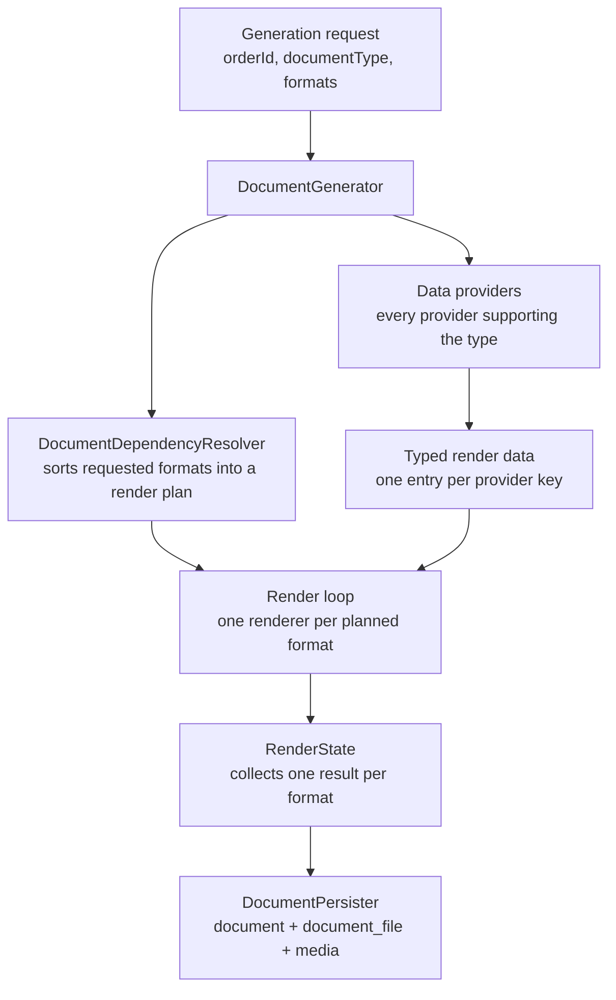
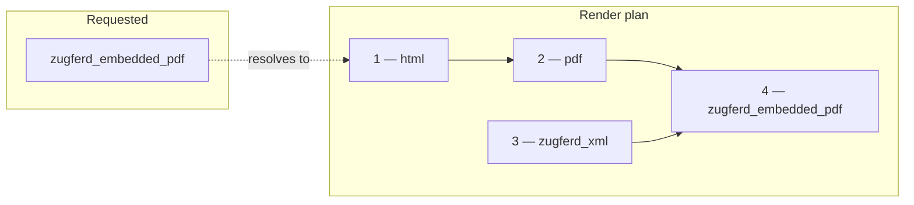
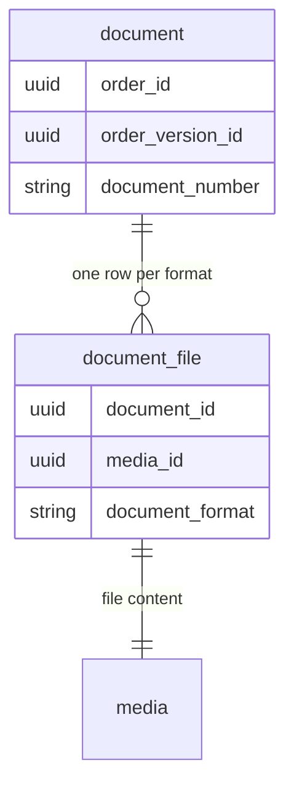

---
nav:
  title: Architecture
  position: 20
product: shopware
lifecycle: reference
---

# Document generation architecture

::: warning This page documents the new Document System (v2)
The reworked document generation is an experimental feature. Activate it with the `DOCUMENT_GENERATION_REWORK` feature flag. Its API can change until it becomes the default with Shopware 6.8.
:::

## The generation pipeline

A generation request carries an order ID, a document type, and the requested formats. `DocumentGenerator` orchestrates the rest. It loads the order once, with every matching data provider's search criteria merged in.

The `DocumentDependencyResolver` turns the requested formats into a render plan, an ordered list that includes any formats other formats depend on. In parallel, `DocumentGenerator` asks every data provider (`AbstractDocumentDataProvider`) that supports the document type for its typed render data, keyed by provider key.

The render loop then runs each renderer (`AbstractDocumentRenderer`) in the plan, writing its result into `RenderState`. Finally, `DocumentPersister` stores the document together with one `document_file` and one media entry per requested format.

The document number comes from the number range type `document_<technicalName>`, unless the caller passes one explicitly.

## Registries

Three registries form the backbone of the domain. Each one is built from tagged services, so code defines what the system can generate.

| Registry                       | Service tag                     | Resolution rule                                                                         |
| ------------------------------ | ------------------------------- | --------------------------------------------------------------------------------------- |
| `DocumentTypeRegistry`         | `shopware.document_v2.type`     | One type per technical name. Validates that requested formats are supported by the type |
| `DocumentDataProviderRegistry` | `shopware.document_v2.provider` | All providers whose `supports()` matches the type run. Duplicate provider keys throw    |
| `DocumentRendererRegistry`     | `shopware.document_v2.renderer` | First renderer per format wins, ordered by tag priority                                 |

The renderer rule doubles as the override mechanism: register a renderer for an existing format with a higher tag priority, and it replaces the built-in one.

## Render plans and format dependencies

Renderers declare the formats they need through `getDependencies()`. A PDF renderer, for example, depends on the HTML renderer it prints from. The `DocumentDependencyResolver` reads these declarations and topologically sorts them into a render plan, so every prerequisite renders before the format that consumes it.

## Render state

Each generation run owns one `RenderState`. Every renderer in the plan writes exactly one result into it and reads its declared dependencies from it.

The state lives only for the duration of the run: `DocumentPersister` copies the requested formats out of it, and dependency only intermediates are discarded with it.

## Order versions and referenced documents

Generating a document creates a new order version, which freezes the order state the document was generated from. A preview skips this and renders against the live version instead.

Some document types render against another document rather than the current order. Credit notes and cancellation invoices reference an existing invoice through `referencedDocumentId` in the generation request. Their data providers declare this by implementing the `ReferencesDocument` marker interface.

The `RendersReferencedSnapshot` interface goes one step further: a provider implementing it renders against the order version the referenced invoice was generated from. A cancellation invoice must invert exactly what the invoice billed, even if the order changed since.

## Document types and formats

Every document type supports a fixed set of formats. `storno` is the technical name for the cancellation invoice type:

| Document type   | Purpose                                                                       | Formats                                      |
| --------------- | ----------------------------------------------------------------------------- | -------------------------------------------- |
| `invoice`       | Bills the order                                                               | html, pdf, zugferd_xml, zugferd_embedded_pdf |
| `delivery_note` | Accompanies the shipment. Requires a delivery date in the generation request | html, pdf                                    |
| `credit_note`   | Credits the credit line items of a referenced invoice                         | html, pdf, zugferd_xml, zugferd_embedded_pdf |
| `storno`        | Cancels a referenced invoice by inverting its amounts                         | html, pdf, zugferd_xml, zugferd_embedded_pdf |

`DocumentTypeRegistry` in code is the source of truth for this table and is the successor to the `document_type` database row for a type that remains to satisfy the foreign key.

The formats build on each other. `html` is the base: a Twig template rendered with the document data. `pdf` prints that HTML through Dompdf.

`zugferd_xml` is a structured e-invoice (EN 16931 CII syntax, XRechnung profile), meant for accounting software instead of human readers. `zugferd_embedded_pdf` combines both: a PDF/A-3 file with the ZUGFeRD XML embedded, readable as a normal PDF by humans and through the attached XML by machines.

## Templates

Every format that renders from a template does so through Twig. HTML templates live at `@Framework/documents/<technical_name>.html.twig`, with shared partials under `@Framework/documents/includes/`.

The ZUGFeRD XML has its own template set at `@Framework/documents/zugferd/<technical_name>.xml.twig`.

Both template sets are overridable with `sw_extends`, like any other template in Shopware.

## Configuration

`DocumentConfigLoader` builds the configuration a document is rendered with. It merges the global `document_base_config` row, the sales-channel override for the same row, and the company data from the `core.basicInformation` system config, then returns a typed `DocumentConfigBundle`. The loader reads the typed columns on `document_base_config` first and falls back to the legacy JSON `config` blob.

## Storage

A `document` row represents one logical document: one order, one order version, one document number. Each requested format becomes its own `document_file` row, linked to the media entry that holds the actual file content.

## Next steps

<PageRef page="./extension-points" title="Document extension points" />

<PageRef page="../../../../guides/plugins/plugins/checkout/documents/v2/" title="Document System (v2) guides" />
