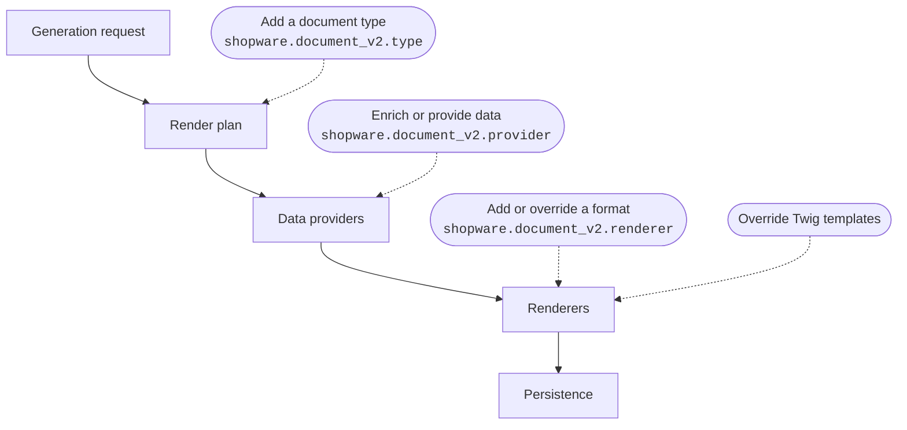

---
nav:
  title: Extension Points
  position: 30
---

# Document extension points

::: warning This page documents the new Document System (v2)
The reworked document generation is an experimental feature. Activate it with the `DOCUMENT_GENERATION_REWORK` feature flag. Its API can change until it becomes the default with Shopware 6.8.
:::

Document System (v2) extends through three tagged Symfony services and Twig template overrides. There is no service decoration.

| You want to                      | Mechanism                     |
| -------------------------------- | ----------------------------- |
| Change how a document looks      | Override a document template  |
| Add data to an existing document | Enrich document data          |
| Change how a format is produced  | Override a built-in renderer  |
| Output a new file format         | Add a document format         |
| Create a new kind of document    | Add a document type           |

Each extension point attaches to one stage of the pipeline: a document type shapes the render plan, a data provider feeds the render loop, and a renderer or a template override changes what that loop produces.

## Extend with a plugin

Plugins register the tagged services and override the templates directly:

<PageRef page="../../../../guides/plugins/plugins/checkout/documents/v2/" title="Document System (v2) plugin guides" />

## Extend with an app

Apps extend documents declaratively: the manifest registers a document type, Twig templates render it, and the `document-generation` script hook provides the data. Apps cannot add custom formats, renderers, or typed data providers, those stay plugin-only.

<PageRef page="../../../../guides/plugins/apps/checkout/document" title="Document System (v2) app guide" />
