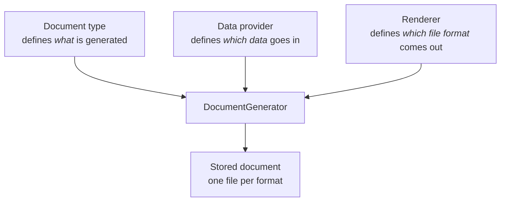
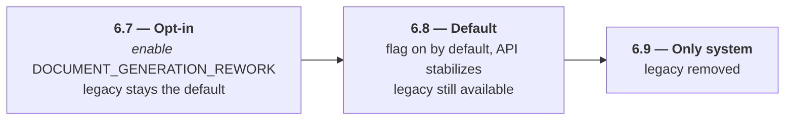

---
nav:
  title: Document (v2)
  position: 40
product: shopware
lifecycle: reference
---

# Document (v2)

::: warning This page documents the new Document System (v2)
The reworked document generation is an experimental feature. Activate it with the `DOCUMENT_GENERATION_REWORK` feature flag. Its API can change until it becomes the default with Shopware 6.8.
:::

## What it is

The Document System (v2) generates order related business documents: invoices, delivery notes, credit notes, and cancellation invoices.

Each document can be generated in one or more file formats: HTML, PDF, ZUGFeRD XML, or ZUGFeRD-embedded PDF. Shopware stores the generated files per order.

## Why a rewrite

The legacy document system coupled document type and file format, so every combination of type and format needed its own renderer. Adding a format meant touching every type, and adding a type meant touching every format.

The Document System (v2) splits generation into three independent axes instead:

## Availability

The Document System (v2) rolls out over three releases: it starts as an opt-in feature, becomes the default, and finally replaces the legacy system.

The [migration strategy ADR](../../../../resources/references/adr/2026-08-05-document-generation-v1-to-v2-migration-strategy.md) covers how the legacy system and v2 coexist during this window.

## ADRs

- [Refactor of document generation](../../../../resources/references/adr/2026-03-17-refactor-of-document-generation.md): why the legacy system needed a rewrite and the goals for the new implementation.
- [New document generation architecture](../../../../resources/references/adr/2026-03-18-new-document-generation-architecture.md): the entity model and generation flow behind the v2 architecture.
- [New document generation extension points](../../../../resources/references/adr/2026-03-19-new-document-generation-extension-points.md): how plugins and apps add document types, data providers, and renderers.
- [Document generation v1 to v2 migration strategy](../../../../resources/references/adr/2026-08-05-document-generation-v1-to-v2-migration-strategy.md): how the two systems coexist until the legacy one is removed in Shopware 6.9.
