---
nav:
  title: Orders
  position: 20

---

# Orders

From a cart instance, an `Order` can be created. The whole structure of the cart is stored in the database. Contrary to the cart, a structure that allows a great degree of freedom and is *calculation optimized*, the order is *workflow optimized*.

## Design goals

### Denormalization

The order itself does not depend on the catalog or the products. The line item with all of its data, as well as all calculated prices, is persisted in the database. Orders only get recalculated when triggered explicitly through the API.

### Workflow dependant

The order state changes in a defined, predictable and configurable way - other state transitions are blocked.

## State management

During the order placement, at least three distinct state machines are started as described in the below diagrams:

### Order state flowchart

### Order delivery flowchart

```mermaid
flowchart TD
START_STATE[Start state] --> 0189e474ee557113994b4f678ba7574a

0189e474ee557113994b4f678ba7574a(Open)
0189e474ee557113994b4f678c711eb7(Cancelled)
0189e474ee557113994b4f678c711eb7 --> FINAL_STATE[Final state]
0189e474ee557113994b4f678d696964(Shipped)
0189e474ee557113994b4f678db3c16c(Shipped partially)
0189e474ee557113994b4f678e1eb368(Returned)
0189e474ee557113994b4f678e1eb368 --> FINAL_STATE[Final state]
0189e474ee557113994b4f678e75d0e0(Returned partially)

0189e474ee557113994b4f678ba7574a -- ship --> 0189e474ee557113994b4f678d696964
0189e474ee557113994b4f678ba7574a -- ship_partially --> 0189e474ee557113994b4f678db3c16c
0189e474ee557113994b4f678ba7574a -- cancel --> 0189e474ee557113994b4f678c711eb7
0189e474ee557113994b4f678d696964 -- retour --> 0189e474ee557113994b4f678e1eb368
0189e474ee557113994b4f678d696964 -- retour_partially --> 0189e474ee557113994b4f678e75d0e0
0189e474ee557113994b4f678d696964 -- cancel --> 0189e474ee557113994b4f678c711eb7
0189e474ee557113994b4f678db3c16c -- retour --> 0189e474ee557113994b4f678e1eb368
0189e474ee557113994b4f678db3c16c -- retour_partially --> 0189e474ee557113994b4f678e75d0e0
0189e474ee557113994b4f678db3c16c -- ship --> 0189e474ee557113994b4f678d696964
0189e474ee557113994b4f678db3c16c -- cancel --> 0189e474ee557113994b4f678c711eb7
0189e474ee557113994b4f678c711eb7 -- reopen --> 0189e474ee557113994b4f678ba7574a
0189e474ee557113994b4f678d696964 -- reopen --> 0189e474ee557113994b4f678ba7574a
0189e474ee557113994b4f678db3c16c -- reopen --> 0189e474ee557113994b4f678ba7574a
0189e474ee557113994b4f678e1eb368 -- reopen --> 0189e474ee557113994b4f678ba7574a
0189e474ee557113994b4f678e75d0e0 -- reopen --> 0189e474ee557113994b4f678ba7574a
0189e474ee557113994b4f678e75d0e0 -- retour --> 0189e474ee557113994b4f678e1eb368
```

### Order payment flowchart

::: tip
The state machines displayed in the following sections can actually be modified through the API, this is just the default setup.
:::

These can be used to track the progress during the order process and notify the customer about the current state of the order.
