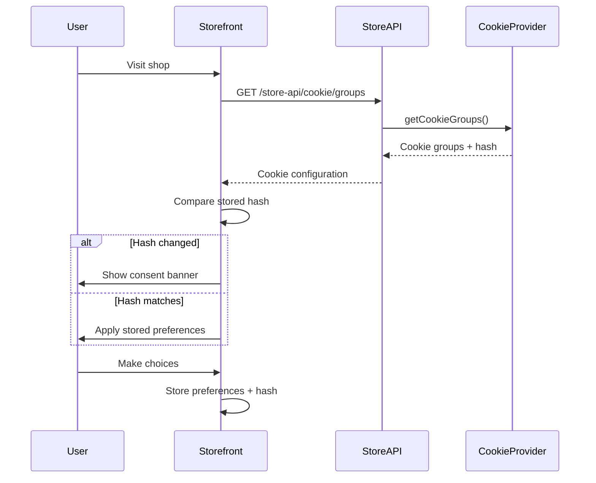

---
nav:
  title: Cookie Consent Management
  position: 40

---

# Cookie Consent Management

## Overview

Shopware provides a cookie consent management system with features designed to support GDPR compliance. The system allows shop administrators and developers to manage cookies transparently and give customers control over their data privacy. It handles cookie categorization, user consent tracking, and automatic re-consent when cookie configurations change.

::: warning
While Shopware provides tools and features to help with GDPR compliance, shop owners are ultimately responsible for ensuring their shop complies with GDPR and other applicable data protection regulations. This includes proper cookie configuration, privacy policies, and legal review of all data processing activities.
:::

::: info
The cookie-hash and re-consent functionality is available starting with Shopware 6.7.3.0.
:::

## How it works

The cookie consent system operates through several integrated components:

1. **Cookie Provider Service**: Collects all cookie definitions from core, plugins, and apps
2. **Store API Endpoint**: Exposes cookie configuration with a configuration hash
3. **Storefront Component**: Manages the cookie consent UI and user preferences
4. **Configuration Hash**: Tracks changes to trigger re-consent when needed

### Cookie Configuration Flow

## Cookie Categories

Cookies in Shopware are organized into four main categories according to GDPR requirements:

### Technically Required

Cookies that are essential for the shop to function (`cookie.groupRequired`). These cookies cannot be disabled by users.

**Examples:**

- Session management
- Shopping cart
- Security tokens
- Language preferences

### Comfort Functions

Cookies that enhance user experience but are not essential for basic functionality (`cookie.groupComfortFeatures`).

**Examples:**

- Video platform cookies (YouTube, Vimeo)
- Social media integrations
- Chat widgets
- Personalized content

### Marketing

Cookies used for marketing and advertising purposes, including tracking user behavior for personalized ads and remarketing (`cookie.groupMarketing`).

**Examples:**

- Marketing pixels (Facebook Pixel, Google Ads)
- Remarketing and advertising cookies
- Conversion tracking
- Affiliate tracking

### Statistics and Tracking

Cookies used for analytics and website optimization purposes (`cookie.groupStatistical`).

**Examples:**

- Google Analytics
- User interaction tracking (Hotjar, Crazy Egg)
- A/B testing
- User behavior analytics

## Configuration Hash Mechanism

The configuration hash is an important feature that helps support GDPR compliance by ensuring users are re-prompted when cookie handling changes.

### Mechanism Details

1. **Hash Generation**: A hash is calculated from all cookie configurations (names, descriptions, expiration times)
2. **Hash Storage**: The hash is stored in the browser as `cookie-config-hash`
3. **Change Detection**: On each visit, the current hash is compared with the stored hash
4. **Re-Consent Trigger**: If hashes differ, all non-essential cookies are removed and consent is requested again

### When Hash Changes

The configuration hash changes when:

- New cookies are added by plugins/apps
- Existing cookies are modified or removed
- Cookie groups are restructured
- Cookie descriptions or settings change

This ensures users are always informed about changes to cookie handling, maintaining GDPR compliance.

## Cookie Groups vs Individual Cookies

### Individual Cookies

Single cookies that can be accepted or rejected independently.

**Use when:**

- Cookie serves a specific, standalone purpose
- No logical grouping with other cookies
- Maximum granular control needed

### Cookie Groups

Multiple related cookies grouped together for easier management.

**Use when:**

- Multiple cookies serve the same purpose (e.g., video platform)
- Cookies are interdependent
- Simplified user interface is desired

**Example:** YouTube group containing multiple YouTube-related cookies

## Key Cookies Used by the System

The cookie consent system itself uses special cookies:

| Cookie | Purpose | Lifetime |
|--------|---------|----------|
| `cookie-preference` | Stores user's consent choices | 30 days |
| `cookie-config-hash` | Tracks configuration changes | 30 days |

### Protected Cookies

Certain cookies are **never removed** by the consent system, even during re-consent:

- `session-*` - Session cookies required for shop functionality
- `timezone` - User's timezone preference

## Technical Implementation

Cookie configurations are defined using structured objects for type safety:

- **`CookieEntry`** - Individual cookie definition
- **`CookieGroup`** - Group of related cookies

This provides better IDE support, type checking, and consistency across implementations.

## Store API Integration

::: info
The Store API endpoint for cookie groups is available starting with Shopware 6.7.3.0.
:::

The cookie consent system exposes its configuration through the Store API endpoint:

**Endpoint:** `GET /store-api/cookie/groups`

This endpoint enables headless implementations, custom frontends, and third-party integrations to retrieve cookie configuration and the configuration hash.

For full API documentation, see the [Store API - Fetch all cookie groups](https://shopware.stoplight.io/docs/store-api/f9c70be044a15-fetch-all-cookie-groups) reference.

## Extension Points

The cookie consent system can be extended in multiple ways:

### For Plugins

Use the `CookieProviderInterface` to add custom cookies via service decoration.

<PageRef page="../../../guides/plugins/plugins/storefront/add-cookie-to-manager" />

### For Apps

Define cookies in your `manifest.xml` file.

<PageRef page="../../../guides/plugins/apps/storefront/cookies-with-apps" />

### JavaScript Events

React to user consent changes in your custom JavaScript.

<PageRef page="../../../guides/plugins/plugins/storefront/reacting-to-cookie-consent-changes" />

## Best Practices

### 1. Categorize Correctly

Place cookies in the appropriate category:

- Only truly essential cookies should be "technically required" (`cookie.groupRequired`)
- User convenience features belong in "comfort functions" (`cookie.groupComfortFeatures`)
- Marketing and advertising cookies belong in "marketing" (`cookie.groupMarketing`)
- Analytics and optimization belong in "statistics and tracking" (`cookie.groupStatistical`)

### 2. Provide Clear Descriptions

Write clear, user-friendly cookie descriptions:

- Explain what the cookie does in simple terms
- Mention what data is collected
- State how long the cookie persists
- Link to privacy policy if relevant

### 3. Set Appropriate Expiration

Choose sensible expiration times:

- Session cookies for temporary data
- Days/weeks for user preferences
- Months/year for long-term settings
- Consider GDPR recommendations

### 4. Handle Consent Changes

Always check consent status before:

- Loading third-party scripts
- Setting marketing or advertising cookies
- Collecting analytics or statistics data
- Storing user behavior data

### 5. Test Re-Consent Flow

When updating cookie configurations:

- Test that hash changes trigger re-consent
- Verify non-essential cookies are removed
- Check that protected cookies remain
- Ensure UI displays correctly

## Features Supporting GDPR Compliance

Shopware's cookie consent system includes several features designed to help shop owners meet GDPR requirements:

- ✅ **Opt-in by default** - Users must actively consent (no pre-checked boxes)
- ✅ **Granular control** - Users can accept/reject individual categories
- ✅ **Re-consent on changes** - Automatic re-prompting when configuration changes
- ✅ **Clear information** - Transparent cookie descriptions and purposes
- ✅ **Easy withdrawal** - Users can change preferences at any time
- ✅ **Configuration tracking** - Hash mechanism ensures change detection
- ✅ **Documented lifecycle** - Full audit trail of cookie changes

::: info
These features provide technical support for GDPR compliance, but shop owners must also ensure they have proper legal documentation (privacy policy, terms of service), data processing agreements, and regular compliance audits. Consult with legal counsel to ensure full compliance with GDPR and other applicable regulations.
:::
