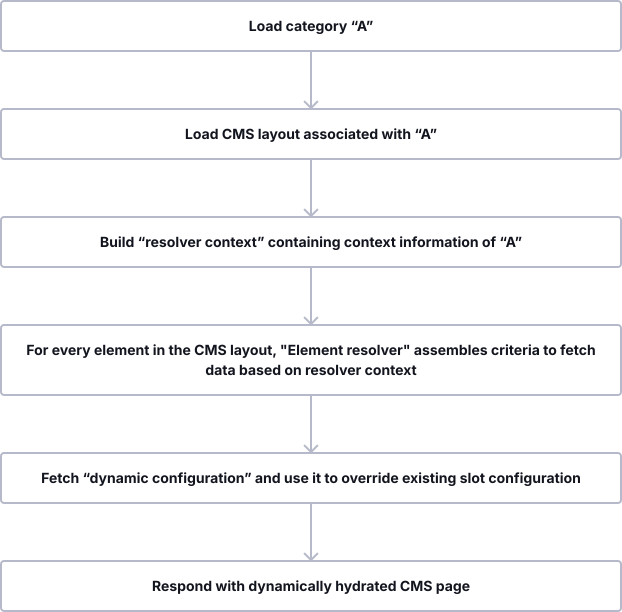

---
nav:
  title: Shopping Experiences (CMS)
  position: 10

---

# Shopping Experiences \(CMS\)

Shopware comes with an extensive CMS system referred to as *Shopping Experiences* built upon pages or layouts, which can be reused and dynamically hydrated based on their assignments to categories or other entities.

In the following concept, we will take a look at the following aspects:

* Structure of CMS pages
* Hydration of dynamic content
* Separation of content and presentation

We will start by taking a rather abstract approach to content organization and later translate that into more specific applications.

## Structure

Every CMS page or layout \(they are really technically the same\) is a hierarchical structure made of sections, blocks, elements, and additional configurations within each of those components. An exemplary CMS page printed in JSON would look similar to this:

```json
{
  "cmsPage": {
    "sections": [
      {
        "blocks": [
          {
            "slots": [
              {
                "slot": "content",
                "type": "product-listing"
              }
            ]
          }
        ]
      }
    ]
  }
}
```

It is a tree where the root node is a **page**. Each page can have multiple **sections**. Each section can contain multiple **blocks**. Each block can have zero or more **slots** where each slot contains exactly one **element**. Easy as that.

Let's go through these structural components in a top-down approach, starting from the biggest element:

### Page

A page serves as a wrapper and contains all content information as well as a `type` which denotes its purpose:

* `page` — standard CMS page \(used for shop pages, category pages\)
* `landingpage` — landing page layouts
* `product_list` — product listing/category layouts
* `product_detail` — product detail page layouts

### Section

Defines a horizontal container segment within your page. The `type` field determines the layout:

* `sidebar` — two-column layout with a sidebar and a content area
* `fullwidth` — single full-width column

A section contains blocks that are usually stacked upon each other.

### Block

A block represents a unit usually spanning an entire row which can provide custom layout and stylings. For UI purposes, blocks are clustered into categories such as:

* `text`
* `image`
* `video`
* `text-image`
* `commerce`
* `sidebar`
* `form`
* `html`

Additional categories like `favorite` \(UI-only\) or `app` \(for app-provided blocks\) may appear dynamically.

Each block can contain none up to multiple slots. A slot has a name and is just a container for one element. To be more precise, take the following block as an example:

```javascript
block: {
    type: "text-hero",
    slots: [{
        type: "text",
        slot: "content",
        config: {
            content: {
                source: "static",
                value: "Hello World"
            }
        },
    }]
}
```

It is pretty clear what this will look like. There is a block called `text-hero`  containing the text "Hello World". The block is of `type: "text-hero"` and `"type": "text"` here in the nested structure, which displays the text.

Let's take a look at another example:

```javascript
block: {
    type: "text-hero",
    slots: [{
        type: "image",
        slot: "content",
        config: {
            media: {
                source: "static",
                value: "ebc314b11cb74c2080f6f27f005e9c1d"
            }
        },
        data: {
            media: {
                url: "https://my-shop-host.com/media/ab/cd/ef/image.jpg"
            }
        }
    }]
}
```

Here, we still have the `text-hero` block, but it contains an image. That is due to the internal structure of our CMS and the generic nature of blocks. The slots defined by a block are abstract. In the examples shown above, the `text-hero` block only contains one slot, named `content`.

### Elements

Elements are the "primitives" in our tree hierarchy of structural components. Elements have no knowledge of their context and usually just contain very little markup. Ultimately and most importantly, elements are rendered inside the slots of their "parent" blocks.

Shopware ships with a range of built-in element types, each backed by a dedicated resolver:

* `text`
* `html`
* `form`
* `image`
* `image-slider`
* `video`
* `youtube-video`
* `vimeo-video`
* `product-listing`
* `product-box`
* `product-slider`
* `product-name`
* `manufacturer-logo`
* `buy-box`
* `cross-selling`
* `product-description-reviews`
* `category-navigation`

You can register additional custom element types via the `CmsElementResolverInterface`.

### Configuration

Every component \(section, block, element\) contains a configuration that specifies detailed information about how it's supposed to be rendered. Such configuration can contain:

* Product ID
* Mapped field \(e.g. category.description\)
* Static values
* CSS config \(properties, classes\)

Static values will be passed to the page as-is. Mapped fields will be resolved at runtime based on the dynamic content hydration - described subsequently.

## Hydration of dynamic content

Whereas the structure of a CMS page remains somewhat static, its content can be dynamic and context-aware. This way, you can, for example, reuse the same layout for multiple category pages where product listing, header image, and description are always loaded based on the category configuration.

### Resolving process

The following diagram illustrates how that works using the example of a category:



Let's go through the steps one by one. The main orchestrator is `SalesChannelCmsPageLoader::load()`.

1. **Dispatch `CmsPageLoaderCriteriaEvent`**: Before loading, an event is dispatched that allows listeners to adjust the loading criteria.
2. **Load CMS layout**: Shopware loads the CMS layout associated with the entity \(e.g., category\) including sections, blocks, slots, and background media.
3. **Sort by position**: Sections, blocks, and slots are sorted by their `position` field to ensure correct rendering order.
4. **Build resolver context**: This object contains information about the request, the sales channel context, and optionally the associated entity \(e.g., a category or product\).
5. **Override slot configuration**: If the associated entity provides a `slotConfig` \(e.g., category-specific overrides\), it is merged into the slot configuration.
6. **Resolve slot data**: The `CmsSlotsDataResolver` resolves all slot content in two phases:
    1. **Collect phase**: Each element resolver's `collect()` method builds a `CriteriaCollection` for the data it needs.
    2. **Optimize**: Shopware merges simple ID-based criteria and separates complex search criteria to minimize database queries.
    3. **Fetch**: The optimized criteria are executed against the DAL.
    4. **Enrich phase**: Each element resolver's `enrich()` method populates its slot with the fetched data.
7. **Dispatch `CmsPageLoadedEvent`**: After resolution, an event is dispatched allowing further post-processing.
8. **Collect cache tags**: Product IDs and other identifiers are extracted for HTTP cache invalidation.
9. **Respond with CMS page**: The fully assembled page data is returned to the view layer for rendering.

### Extensibility

The **element resolvers** play a central role in assembling CMS content. Shopware allows you to register custom resolvers by implementing the `CmsElementResolverInterface` with its three methods: `getType()`, `collect()`, and `enrich()`. For a step-by-step guide on creating custom resolvers, see [Add data to CMS elements](../../../guides/plugins/plugins/content/cms/add-data-to-cms-elements).

Since Shopware v6.6.7, you can also intercept the entire CMS resolution pipeline using event-based extensions \(`CmsSlotsDataResolveExtension`, `CmsSlotsDataCollectExtension`, `CmsSlotsDataEnrichExtension`\) without writing a full custom resolver. These are covered in detail in the [event-based extensibility section](../../../guides/plugins/plugins/content/cms/add-data-to-cms-elements#event-based-extensibility) of the same guide.

## Separation of content and presentation

The CMS is designed in a way that doesn't fix it to a single presentation channel \(also referred to it as "headless"\). What at first might seem like an unnecessary abstraction turns out to give us a lot of flexibility. Each presentation channel can have its own twist on interpreting the content and displaying it to the user. A browser can leverage the [Shopware Storefront](../../../guides/plugins/plugins/storefront/) and display the HTML or use the resulting markup from a single page application that interprets the API responses. A native mobile application can strip out unnecessary blocks and only display texts and images as view components. A smart speaker simply reads out the content of elements with the `voice` type.

By default, Shopware provides the server-side rendered Storefront as a default presentation channel, but [Composable Frontends](../../../../frontends/) also supports CMS pages. Using the CMS through the API, you will have full flexibility in how to display your content.

::: info
All this comes at a price: The admin preview of your content is only as representative of your content presentation as your presentation channel resembles it. **A major implication for headless frontends.**
:::
