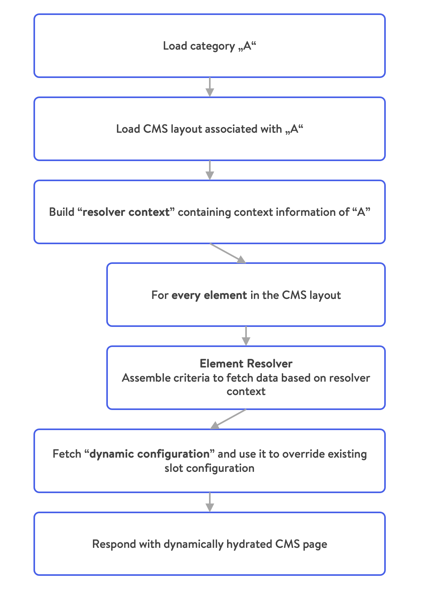

# Shopping Experiences \(CMS\)

Shopware comes with an extensive CMS system referred to as *Shopping Experiences* built upon pages or layouts, which can be reused and dynamically hydrated based on their assignments to categories or other entities.

In the following concept, we will take a look at the following aspects:

* Structure of CMS pages
* Hydration of dynamic content
* Separation of content and presentation

We will start by taking a rather abstract approach to content organization and later translate that into more specific applications.

## Structure

Every CMS page or layout \(they are really technically the same\) is a hierarchical structure made of sections, blocks, elements, and additional configurations within each of those components. An exemplary CMS page printed in JSON would look similar to this:

```json
{
  cmsPage: {
      sections: [{
          blocks: [{
              slots: [{
                  slot: "content",
                  type: "product-listing",
                  /* ... */
              }]
          }, /* ... */]
      }, /* ... */]
  }
}
```

It is a tree where the root node is a **page**. Each page can have multiple **sections**. Each section can contain multiple **blocks**. Each block can have zero or more **slots** where each slot contains exactly one **element**. Easy as that.

Let's go through these structural components in a top-down approach, starting from the biggest element:

### Page

A page serves as a wrapper and contains all content information as well as a `type` which denotes whether it serves as a

* Category/Listing page
* Shop page
* Static page
* Product pages

### Section

Defines a horizontal container segment within your page which can be either:

* Two-Columns which we refer to as `sidebar` and `content` or
* A single column

A section contains blocks that are usually stacked upon each other.

### Block

A block represents a unit usually spanning an entire row which can provide custom layout and stylings. For UI purposes, blocks are clustered into categories such as:

* Text
* Images
* Commerce
* Video

Each block can contain none up to multiple slots. A slot has a name and is just a container for one element. To be more precise, take the following block as an example:

```javascript
block: {
    type: "text-hero",
    slots: [{
        type: "text",
        slot: "content",
        config: {
            content: {
                source: "static",
                value: "Hello World"
            }
        },
    }]
}
```

It is pretty clear what this will look like. There is a block called `text-hero`  containing the text "Hello World". The block is of `type: "text-hero"` and `"type": "text"` here in the nested structure, which displays the text.

Let's take a look at another example:

```javascript
block: {
    type: "text-hero",
    slots: [{
        type: "image",
        slot: "content",
        config: {
            media: {
                source: "static",
                value: "ebc314b11cb74c2080f6f27f005e9c1d"
            }
        },
        data: {
            media: {
                url: "https://my-shop-host.com/media/ab/cd/ef/image.jpg"
            }
        }
    }]
}
```

Here, we still have the `text-hero` block, but it contains an image. That is due to the internal structure of our CMS and the generic nature of blocks. The slots defined by a block are abstract. In the examples shown above, the `text-hero` block only contains one slot, named `content`.

### Elements

Elements are the "primitives" in our tree hierarchy of structural components. Elements have no knowledge of their context and usually just contain very little markup. Ultimately and most importantly, elements are rendered inside the slots of their "parent" blocks.

Types of elements comprise:

* text,
* image,
* product-listing,
* video and more

### Configuration

Every component \(section, block, element\) contains a configuration that specifies detailed information about how it's supposed to be rendered. Such configuration can contain:

* Product ID
* Mapped field \(e.g. category.description\)
* Static values
* CSS config \(properties, classes\)

Static values will be passed to the page as-is. Mapped fields will be resolved at runtime based on the dynamic content hydration - described subsequently.

## Hydration of dynamic content

Whereas the structure of a CMS page remains somewhat static, its content can be dynamic and context-aware. This way, you can, for example, reuse the same layout for multiple category pages where product listing, header image, and description are always loaded based on the category configuration.

### Resolving process

The following diagram illustrates how that works using the example of a category:

.

Let's go through the steps one by one.

1. **Load category**: This can be initiated through an API call or a page request \(e.g., through the Storefront\).
1. **Load CMS layout**: Shopware will load the CMS layout associated with the category.
1. **Build resolver context**: This object will be passed on and contains information about the request and the sales channel context.
1. **Assemble criteria for every element**: Every CMS element within the layout has a `type` configuration which determines the correct page resolver to resolve its content. Together with the **resolver context**, the resolver is able to resolve the correct criteria for the element. All criteria are collected in a criteria collection. Shopware will optimize those criteria \(e.g. by splitting searches from direct lookups or merging duplicate requests\) and execute the resulting queries.
1. **Override slot configuration**: The resulting configuration determine the ultimate configuration of the slots that will be displayed, so Shopware will use it to override the existing configuration.
1. **Respond with CMS page**: Since the page data is finally assembled, it can be passed on to the view layer where it will be interpreted and displayed.

### Extensibility

As you can see, the **element resolvers** play a central role in the whole process of getting the configuration \( by extension, content\) of CMS elements.

Shopware allows registering custom resolvers by implementing a corresponding interface, which dictates the following methods:

* `getType() : string` -returns the matching type of elements
* `collect(CmsSlot, ResolverContext) : CriteriaCollection`- prepares the criteria object
* `enrich(CmsSlot, ResolverContext, ElemetDataCollection) : void` - performs additional logic on the data that has been resolved

## Separation of content and presentation

The CMS is designed in a way that doesn't fix it to a single presentation channel \(also referred to it as "headless"\). What at first might seem like an unnecessary abstraction turns out to give us a lot of flexibility. Each presentation channel can have its own twist on interpreting the content and displaying it to the user. A browser can leverage the [Shopware Storefront](../../../guides/plugins/plugins/storefront/) and display the HTML or use the resulting markup from a single page application that interprets the API responses. A native mobile application can strip out unnecessary blocks and only display texts and images as view components. A smart speaker simply reads out the content of elements with the `voice` type.

By default, Shopware provides the server-side rendered Storefront as a default presentation channel, but [Shopware PWA](../../../products/pwa.md) also supports CMS pages. Using the CMS through the API, you will have full flexibility in how to display your content.

::: info
All this comes at a price: The admin preview of your content is only as representative of your content presentation as your presentation channel resembles it. **A major implication for headless frontends.** For that reason, Shopware PWA has functionality built into the plugin, allowing you to preview content pages in the PWA.
:::

## Further reading

<PageRef page="../../../guides/plugins/plugins/content/cms/add-cms-block" />

<PageRef page="../../../guides/plugins/apps/content/cms/add-custom-cms-blocks" />

<PageRef page="../../../guides/plugins/plugins/content/cms/add-cms-element" />
