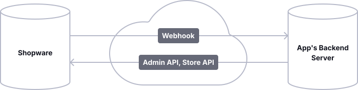

---
nav:
  title: Apps
  position: 10

---

# Apps

The app system allows you to extend and modify the functionality and appearance of Shopware. It leverages well-defined extension points you can hook into to implement your specific use case.

The app system is designed to be decoupled from Shopware itself. This has two great advantages:

1. **Freedom of choice:** You need to understand only the interface between Shopware and your app to get started with developing your own app. You don't need special knowledge of the inner workings and internal structure of Shopware itself. Additionally, you have the freedom to choose a programming language or framework of your choice to implement your app. This is achieved by decoupling the deployment of Shopware itself and your app and by using the Admin API and webhooks to communicate between Shopware and your app instead of using programming language constructs directly.
2. **Fully cloud compatible:** By decoupling Shopware and your app, your app is automatically compatible with multi-tenant cloud systems. Therefore, your app can be used within self-hosted shops and shops on [Shopware SaaS](../../products/saas.md).

The central interface between your app and Shopware is defined by a dedicated manifest file. The manifest is what glues Shopware and your app together. It defines your app's features and how Shopware can connect to it. You can find more information about how to use the manifest file in the [App base Guide](../../guides/plugins/apps/app-base-guide.md).

## Communication between Shopware and your app

Shopware communicates with your app exclusively via HTTP requests. Therefore, you are free to choose a tech stack for your app, as long as you can serve HTTP requests. Shopware will notify you of events happening in the shop that your app is interested in by posting to HTTP endpoints that you define in the manifest file. While processing these events, your app can use the Shopware API to get additional data that your app needs. A schematic overview of the communication may look like this:

To secure this communication, a registration handshake is performed during the installation of your app. During this registration, it is verified that Shopware talks to the right app backend server, and your app gets credentials used to authenticate against the API. See [App registration & backend setup](../../guides/plugins/apps/app-registration-setup.md).

::: info
Note that this is optional if Shopware and your app don't need to communicate, e.g., because your app provides a [Theme](/guides/plugins/themes/index.md).
:::

## Modify the appearance of the Storefront

Your app can modify the Storefront's appearance by shipping your Storefront assets \(template files, JavaScript sources, SCSS sources, snippet files\) alongside your manifest file. You don't need to serve those assets from your external server, as Shopware will rebuild the Storefront upon the installation of your app and will consider your modifications in that process. Find out more about modifying the appearance of the Storefront in the [App Storefront guide](../../guides/plugins/apps/storefront/index.md).

## Integrate payment providers

::: info
This functionality is available starting with Shopware 6.4.1.0.
:::

Shopware provides functionality that allows your app to integrate payment providers. You can use synchronous payments with providers that do not require user interaction; in that case, approval can be requested with a simple background request. You can use asynchronous payments if you want to redirect the user to a payment provider. Your app then provides a URL for redirection. After the user returns to the shop, Shopware will verify the payment status with your app. Find out more about providing payment endpoints in the [App payment guide](../../guides/plugins/apps/payment.md).

## Execute business logic inside Shopware with App Scripts

::: info
This functionality is available starting with Shopware 6.4.8.0.
:::

[App scripts](../../guides/plugins/apps/app-scripts/index.md) allow your app to execute custom business logic inside the Shopware execution stack. This allows for new use cases, e.g., if you need to load additional data that should be rendered in the Storefront or need to manipulate the cart.

## Add conditions to the Rule Builder

::: info
This functionality is available starting with Shopware 6.4.12.0.
:::

Your app may introduce custom conditions for use in the [Rule builder](../framework/rule-system/index.md). For more information, refer to [Add custom rule conditions](../../guides/plugins/apps/rule-builder/add-custom-rule-conditions.md) in the guides.
