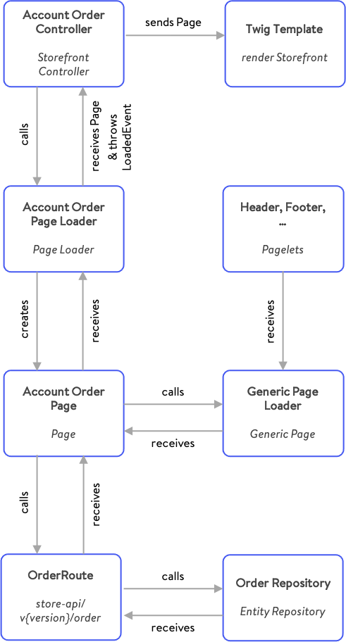

# Storefront

In this article, we'll get to know our Storefront component and learn a lot of its main concepts. Along the way, you'll find answers to the following questions:

* What is the Storefront component & what's its main purpose?
* What technologies are being used?
* How is the Storefront structured?
* Which parts of other Platform components are being used?
* How does the composite data handling work?
* What's the definition & main purpose of Pages, Pagelets, Controllers and their corresponding Templates?
* How is the Storefront handling translations?

## Introduction

The Storefront component is a frontend written in PHP. It conceptually sits on top of our Core - similar to the [Administration](administration-concept.md) component. As the Storefront can be seen as a classical PHP application, it makes usage of HTML rendering, JavaScript and a CSS preprocessor. Speaking of technologies, the Storefront component uses Twig as the templating engine and SASS for styling purposes. The foundation of the Storefront template is based on the Bootstrap framework and therefore fully customizable.

## Main concerns

There are a few main concerns which the Storefront component has. To give you a brief summary, these main concerns are listed below. Furthermore, we are diving deeper into these in the following chapters.

* Creating Pages and Pagelets
* Mapping requests to the Core
* Rendering templates
* Provide theming

Contrary to API calls that result in single resource data, a whole page in the Storefront displays multiple different data sets on a single page. Think of partials, which lead to a single page being displayed. Imagine a page which displays the order overview in the customer account environment. There are partials which are generic and will be displayed on almost every page. These partials include for example Header and Footer information and are being wrapped into a `GenericPage` as our so called `Pagelets` \(`HeaderPagelet`, `FooterPagelet`\). This very generic page will afterwards be enriched with the specific information you want to display through a separate loader \(e.g. a list of orders\).

To achieve getting information from a specific resource, the Storefronts second concern is to map requests to the Core. Internally, the Storefront makes use of our [Store API](../../api/store-api.md) routes to enrich the Page with additional information like e.g. a list of orders, which is being fetched through the order route. Once all needed information were added to the page, the corresponding page loader returns the page to a Storefront controller.

Contrary to the Core that can almost completely omit templating in favor JSON responses, the Storefront contains a rich set of Twig templates to display a fully functional shop. Having said that, another concern of the Storefront is to provide templating with Twig. The page object, which was enriched beforehand, will afterwards be passed to a specific Twig page template throughout a controller. A more detailed look into an example can be found in [Composite data handling](storefront-concept.md#composite-data-handling).

Last, but not least, the Storefront not only contains static templates but also inhibits a theming engine to modify the rendered templates or change the default layout programmatically with your own [Themes](../../../guides/plugins/themes/) or [Plugins](storefront-concept.md).

## Structure

Let's have a look at the Storefront's general component structure. When opening this directory you will find several sub-directories & a vast part of the functionality of the Storefront component includes templates \(`./Resources`\). But beside that, there are other directories worth having a look at.

```bash
<Storefront>
|- Controller
|- DependencyInjection
|- Event
|- Framework
|- Migration
|- Page
|- Pagelet
|- Resources
|- Test
|- Theme
|- .gitignore
|- composer.json
|- phpunit.xml.dist
|- README.md
|- Storefront.php
```

Starting at the top of this list, you'll find all Storefront controllers inside the `Controller` directory. As said beforehand, a page is being built inside that controller with the help of the corresponding page loaders, pages, pagelets and events, which you'll find in the directories: `Pages`, `Pagelets` and their sub-directories. Each controller method will also give detailed information about its routing with the help of annotations. The directory `DependencyInjection` includes all dependencies, which are used in the specific controllers. Whereas the `Event` directory includes route request events, the `Framework` directory amongst other things includes the Routing, Caching and furthermore. `Migration` and `Test` obviously include migrations and tests for our Storefront component \(e.g. tests for each Storefront controller\).

As the Storefront theme is using Boostrap, the template structure inside `./Resources` is a derivative of the Bootstrap starter template. Beside using Twig as the templating engine and SASS as the CSS preprocessor, we are also using Webpack for bundling and transpiling purposes. This templating directory structure is considered best practice. If you are interested in developing your own Themes or Plugins, you'll find more information [here](storefront-concept.md).

## Composite data handling

Composite data loading describes the process of preparing and fetching data for a whole template page worth of content. As a web application the page rendering process is a central concern of the Storefront. Contrary to solutions through `postDispatch`-Handling or `lazy loading` from templates, the controller actions of the Storefront do a full lookup and handle data loading transparently and fully. The Storefront provides a general solution for this problem - the Page System.

### Pages and Pagelets

The pages in the Storefront component can roughly be categorized into pages and pagelets. Although functionally identical, they represent different usages of the page's data. A page is generally rendered into a full template, whereas a **pagelet** is either a part of a page or accessible through a XHR route, sometimes even both.

A single **page** is always a three class namespace. There is the Page-Struct \(`GenericPage`\), representing the data. The PageLoader \(`PageLoaderInterface`\) handling creation of page structs, and the PageEvent \(`NestedEvent`\) adding a clean extension point to the pages.

### Example: Composition of the account order page

Getting back to our example described at the [main concerns chapter](storefront-concept.md#main-concerns), we'd now like to have a detailed look at the composition of the Storefronts `AccountOrderPage` with Header and Footer information. The composition is handled through the page loaders themselves, by triggering loading of associated data internally. Information: Following example will also be used for any other page being displayed in our Storefront.

Starting to describe how the composition of the page works, we would at first like to know what the _result_ of composition should be.

* By calling a specific route \(e.g. `/account/order`\) one should receive a specific page in our Storefront.
* This page exists of generic information \(e.g. Header, Footer\) and detailed information \(e.g. a list of orders\).
* Detailed information should be fetched throughout the Core component to make usage of

the [Store API routes](../../api/store-api.md).

The best entry point to give you a good understanding how the composition works, is the corresponding Controller. In our case it is the `AccountOrderController`. The main and only task of the controller is to assign a page struct to a variable, which will later be passed to a Twig template. The page is received by the specific `AccountOrderPageLoader`. Additionally, the method annotations of the controller do also set routing information like path, name, options and methods.

Speaking of the page loader \(`AccountOrderPageLoader`\) which returns the page \(`AccountOrderPage`\), you'll see that we are doing the composition in here. At first, a generic page is being created by the usage of the `GenericPageLoader`. As described above, this generic page includes information, which obviously are generic like Header, Footer and Meta information. This information is wrapped inside our `Pagelets` and display a specific part of the page.

Afterwards, our `AccountOrderPage` is created from the generic page, because we also would like to add more information to this page. Per definition our `AccountOrderPage` can set and get a list of orders, we can receive by calling a Store API route through the `OrderRoute` of our Core component. With that being said, we make sure that our Storefront is using the same data, as we would use by calling the API directly, which really is a big advantage.

Once we have set all the necessary information to our page \(`AccountOrderPage`\) in our page loader \(`AccountOrderPageLoader`\), we are making usage of our event dispatcher to throw a `PageLoadedEvent`. For each page, there should be a specific event, which will be thrown to ensure extensibility throughout plugins \(`AccountOrderPageLoadedEvent`\).

To summarize the composition of a page, have a look at this diagram:



## Translations

Extending or adjusting a **translation** in Shopware 6 can be done by adding your own snippets inside a plugin. Beside that, there is also a set of translations inside our default Storefront component. We have decided to save snippets as JSON files, so it is very easy to structure and find snippets you want to change. However, when using pluralization and/or variables, you can expect slight differences between snippets in the Administration and the Storefront. In theory, you are free to place your snippets anywhere as long as you load your JSON files correctly. However, we recommend that you mirror the core structure of Shopware.


Storefront snippets can be found in: `platform/src/Storefront/Resources/snippet`.


Inside that directory you will find a specific sub-directory for each language like e.g. `de_DE` following the ISO standard. The localization is done via the exact ISO. In addition to the language, the country of destination is also supplied. By default, there are two Storefront translations provided: `de_DE` and `en_GB`. There are of course language plugins for other locales available. Inside these JSON files you will find simple translation, but also the possibility to work with variables and pluralization, which are wrapped with the `%` character. The reference of a translated value is used inside our Twig templates by calling the Twig function `trans` and working with interpolations \( e.g. `{{ "general.homeLink"|trans }}`\).

