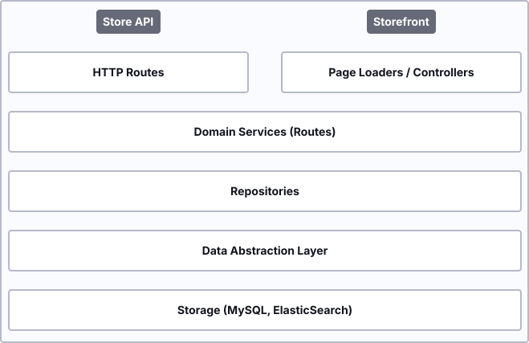
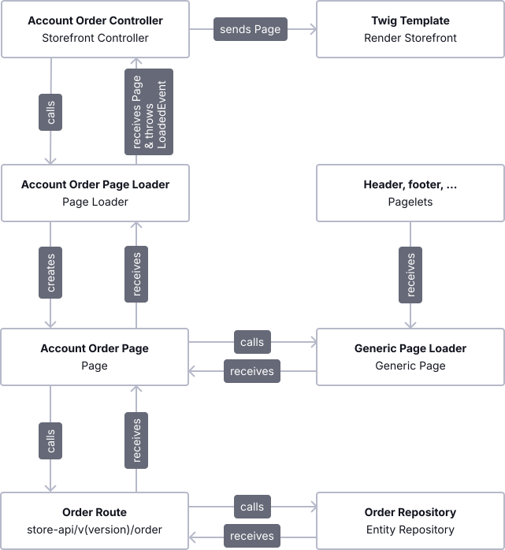

---
nav:
  title: Storefront
  position: 10

---

# Storefront

In this article, you will get to know the Storefront component and learn a lot of its main concepts. Along the way, you will find answers to the following questions:

* What is the Storefront component & what is its main purpose?
* What technologies are being used?
* How is the Storefront structured?
* Which parts of other Platform components are being used?
* How does the composite data handling work?
* What is the definition and main purpose of Pages, Pagelets, Controllers, and their corresponding Templates?
* How is the Storefront handling translations?

## Introduction

The Storefront component is a frontend written in PHP. It conceptually sits on top of the Core, similar to the [Administration](administration-concept) component. As the Storefront can be seen as a classical PHP application, it makes use of HTML rendering, JavaScript, and a CSS preprocessor. The Storefront component uses Twig as the templating engine and SASS for styling purposes. The foundation of the Storefront template is based on the Bootstrap framework and, therefore, fully customizable.

## Main concerns

The main concerns that the Storefront component has are listed below. Furthermore, we are diving deeper into these in the following chapters.

* Creating Pages and Pagelets
* Mapping requests to the Core
* Rendering templates
* Provide theming

Contrary to API calls that result in single resource data, a whole page in the Storefront displays multiple different data sets on a single page. Think of partials, which lead to a single page being displayed. Imagine a page that displays the order overview in the customer account environment. There are partials that are generic and will be displayed on almost every Page. These partials include - for example, Header and Footer information wrapped into a `GenericPage` as `Pagelets` \(`HeaderPagelet`, `FooterPagelet`\). This very generic Page will later be enriched with the specific information you want to display through a separate loader \(e.g. a list of orders\).

To obtain information from a specific resource, the Storefront's second concern is to map requests to the Core. Internally, the Storefront makes use of the [Store API](https://shopware.stoplight.io/docs/store-api/38777d33d92dc-quick-start-guide) routes to enrich the Page with additional information, e.g., a list of orders, which is being fetched through the order route.



Once all needed information is added to the Page, the corresponding page loader returns the Page to a Storefront controller.

### Store API and the traditional Twig storefront

In the traditional server-side rendered Twig storefront, the Store API is not called directly by the browser. Instead, custom storefront controllers internally use the Store API to fetch data from the Core.

The Store API is stateless and expects authentication information via request headers (for example the `sw-context-token`). In contrast, the traditional storefront relies on session-based authentication, so authentication does not need to be handled manually on every request.

Contrary to the Core, which can almost completely omit templating in favor of JSON responses, the Storefront contains a rich set of Twig templates to display a fully functional shop. Another concern of the Storefront is to provide templating with Twig. The page object, which was enriched beforehand, will later be passed to a specific Twig page template throughout a controller. A more detailed look into an example can be found in [Composite data handling](storefront-concept#composite-data-handling).

Last but not least, the Storefront not only contains static templates but also includes a theming engine to modify the rendered templates or change the default layout programmatically with your own [Themes](../../../guides/plugins/themes/) or [Plugins](storefront-concept).

## Structure

Let's have a look at the Storefront's general component structure. When opening this directory, you will find several sub-directories, and a vast part of the functionality of the Storefront component includes templates \(`./Resources`\). But besides that, there are other directories worth having a look at:

```bash
<Storefront>
|- Controller
|- DependencyInjection
|- Event
|- Framework
|- Migration
|- Page
|- Pagelet
|- Resources
|- Test
|- Theme
|- .gitignore
|- composer.json
|- phpunit.xml.dist
|- README.md
|- Storefront.php
```

Starting at the top of this list, you will find all Storefront controllers inside the `Controller` directory. As said beforehand, a page is being built inside that controller with the help of the corresponding page loaders, Pages, Pagelets, and events, which you will find in the directories: `Pages`, `Pagelets`, and their sub-directories. Each controller method will also give detailed information about its routing with the help of attributes. The directory `DependencyInjection` includes all dependencies which are used in the specific controllers, whereas the `Event` directory includes route request events, and the `Framework` directory, amongst other things, also includes the Routing, Caching, and furthermore. `Migration` and `Test` obviously include migrations and tests for the Storefront component \(e.g., tests for each Storefront controller\).

As the Storefront theme uses Bootstrap, the template structure inside `./Resources` is a derivative of the Bootstrap starter template. Besides using Twig as the templating engine and SASS as the CSS preprocessor, we are also using Webpack for bundling and transpiling purposes. This templating directory structure is considered the best practice. If you are interested in developing your own themes or plugins, this section will give more information.

## Composite data handling

Composite data loading describes the process of preparing and fetching data for a whole template page worth of content. As a web application, the page rendering process is a central concern of the Storefront. Contrary to solutions through `postDispatch`-Handling or `lazy loading` from templates, the controller actions of the Storefront do a full lookup and handle data loading transparently and fully. The Storefront provides a general solution for this problem - the Page System.

### Pages and Pagelets

The pages in the Storefront component can roughly be categorized into Pages and Pagelets. Although functionally identical, they represent different usages of Page's data. A Page is generally rendered into a full template, whereas a Pagelet is either a part of a Page or accessible through an XHR route, sometimes even both.

A single Page is always a three class namespace:

* The Page-Struct \(`GenericPage`\) - represents the data
* The PageLoader \(`PageLoaderInterface`\) - handles the creation of page structs
* The PageEvent \(`NestedEvent`\) - adds a clean extension point to the pages

### Example: Composition of the account order page

Referring to the example described in the [main concerns chapter](storefront-concept#main-concerns), have a detailed look at the composition of the Storefronts `AccountOrderPage` with Header and Footer information. The composition is handled through the page loaders themselves by triggering the loading of associated data internally. The following example will also be used for any other Page being displayed on the Storefront.

To describe how the composition of the Page works, first get to know what the result of the composition should be.

* By calling a specific route \(e.g. `/account/order`\), one should receive a specific page in the Storefront.
* This page consists of generic information \(e.g. Header, Footer\) and detailed information \(e.g. a list of orders\).
* Detailed information should be fetched throughout the Core component to make use of the [Store API routes](../../api/store-api).

The best entry point to give you a good understanding of how the composition works is the corresponding controller. In our case, it is the `AccountOrderController`. The main and only task of the controller is to assign a page struct to a variable, which will later be passed to a Twig template. The Page is received by the specific `AccountOrderPageLoader`. Additionally, the method attributes of the controller also set routing information like path, name, options, and methods.

Speaking of the page loader \(`AccountOrderPageLoader`\), which returns the page \(`AccountOrderPage`\), you will see that we are doing the composition here. At first, a generic page is created by using the `GenericPageLoader`. As described above, this generic Page includes information, which is generic like Header, Footer, and Meta information. This information is wrapped inside our `Pagelets` and displays a specific part of the Page.

Later, the `AccountOrderPage` is created from the generic Page because we also would like to add more information to this Page. Per definition, the `AccountOrderPage` can set and get a list of orders we can receive by calling a Store API route through the `OrderRoute` of our Core component. That said, we make sure that our Storefront uses the same data as we would use by calling the API directly, which is a big advantage.

Once we have set all the necessary information to our page \(`AccountOrderPage`\) in our page loader \(`AccountOrderPageLoader`\), we are making usage of our event dispatcher to throw a `PageLoadedEvent`. For each Page, there should be a specific event, which will be thrown to ensure extensibility throughout plugins \(`AccountOrderPageLoadedEvent`\).

To summarize the composition of a page, have a look at this diagram:



## Translations

Extending or adjusting a **translation** in Shopware 6 can be done by adding your own snippets inside a plugin. Besides that, there is also a set of translations inside our default Storefront component. We have decided to save snippets as JSON files, so it is easy to structure and find snippets you want to change. However, when using pluralization and/or variables, you can expect slight differences between snippets in the Administration and the Storefront. In theory, you can place your snippets anywhere as long as you load your JSON files correctly. However, we recommend that you mirror the core structure of Shopware.

::: info
Storefront snippets can be found in `platform/src/Storefront/Resources/snippet`.
:::

Inside that directory, you will find a specific sub-directory for each language, e.g., `de_DE` following the ISO standard. The localization is done via the exact ISO. In addition to the language, the country of destination is also supplied. By default, two Storefront translations are provided: `de_DE` and `en_GB`. There are, of course, language plugins for other locales available. Inside these JSON files, you will find a simple translation and the possibility to work with variables and pluralization, which are wrapped with the `%` character. The reference of a translated value is used inside our Twig templates by calling the Twig function `trans` and working with interpolations \( e.g. `{{ "general.homeLink"|trans }}`\).
