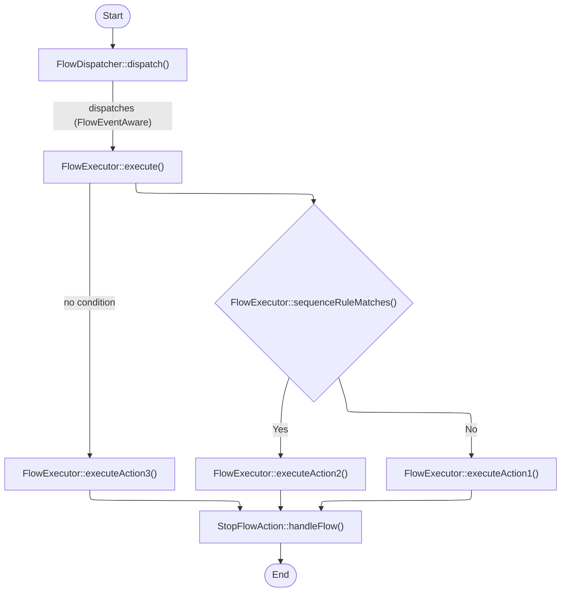
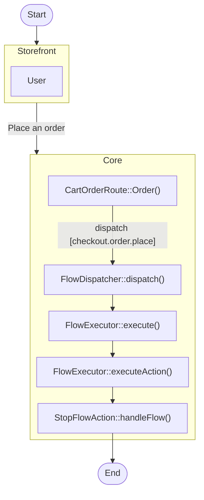

---
nav:
  title: Flow
  position: 70

---

# Flow Builder

Flow Builder is a Shopware automation solution for shop owners with great adaptability and flexibility. With Flow Builder, you can build workflows to automate tasks tailored to your business needs without programming knowledge.

## Flow

A flow is an automation process in your business. From here, you can specify which actions are triggered by a trigger. Additionally, you can define conditions for these actions under which the actions are to be executed. If multiple flows with the same trigger exist, the priority point will decide which flow will perform first.

## Trigger

A trigger is an event that starts the flow and detects the event from the Storefront or the application. A trigger could have multiple actions.

## Condition

A condition is a business rule to determine whether the action should be executed.

## Action

An action is a task that executes on a trigger or when certain conditions are met.

A special action called "Stop flow" stops any further action in the flow sequence.

## Flow Templates

A flow template is a pre-created [flow](#flow).

The flow library contains the flow template listing shipped with Shopware. Two main ways to create a flow template in the template library are by [apps](../../guides/plugins/plugins/framework/flow/) and [plugins](../../guides/plugins/apps/flow-builder/).

We can help merchants reduce the complexity of creating an automation process in their business by using a flow template rather than building a flow. As a merchant, you may design a flow more easily by using the flow templates. So you don't have to create complicated flows on your own.

You can view the details of a flow template just like a regular flow. However, flow templates can't be modified.

## How a flow sequence is evaluated

In Shopware, you have multiple interfaces and classes for different types of events. For Flow Builder, those triggers mentioned above are implements from the *Aware* interface.

Once the action on the Storefront or from the app happens, the FlowDispatcher will dispatch FlowEventAware to the FlowExecutor. From here, the FlowExecutor will check the condition to decide whether to execute the action.

Here is an example flow of what happens in the system when an order is placed on the Storefront.

## Storer concept

Every flow can have data stored and associated with it. This data can be used in the actions when the flow is triggered (for example, for fetching the order that triggered the flow).

There are many storer classes (`ProductStorer`, `OrderStorer`, `MailStorer` etc.) that extend an abstract `FlowStorer` class. They have the methods `store` and `restore`. These are called when the flow (`StorableFlow`) is created in the `FlowFactory` class. The `restore` method can either directly or in some cases lazy load the data that was stored in the `store` method.

Usually the storer classes are linked to different `*Aware` interfaces and store data relevant to these interfaces. The triggering events can implement multiple `*Aware` interfaces. For example, the `CheckoutOrderPlacedEvent` implements the  `OrderAware` interface and when the flow object is created, the `OrderStorer` will be used to store and then restore the order data.

By default, the flow data is not persisted in the database because it's restored already in the same request cycle for actions that are triggered instantly. Only in the case of delayed flows, the data is persisted so that it can be later retrieved when the delayed flow is executed.
