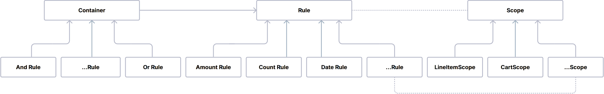
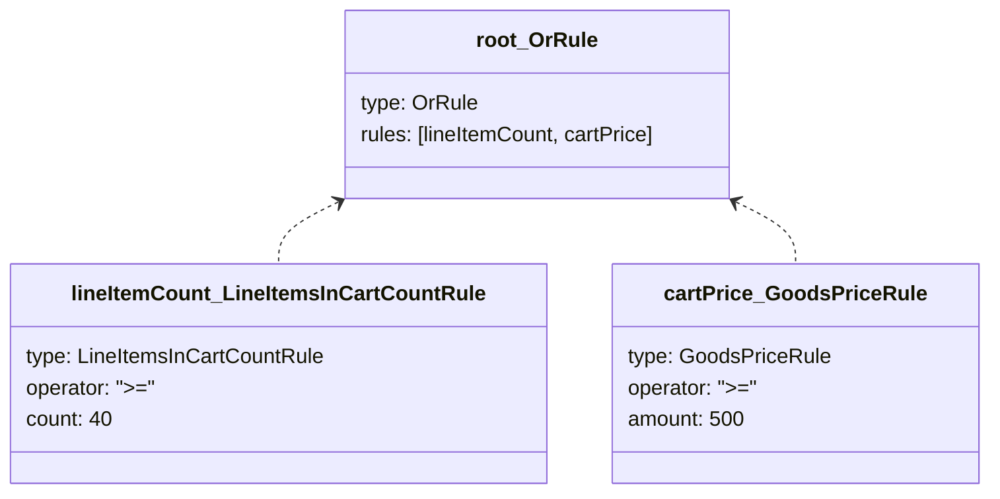

---
nav:
  title: Rule concepts
  position: 20
---

# Rule concepts

## Rule

A **rule** represents a single condition that can be evaluated to either `true` or `false`.

Rules can represent very different things (customer attributes, cart content, dates, tags and more), but they follow the same contract: they evaluate against a given scope and return a boolean.

### Responsibilities

A rule answers a specific question, such as "Does the customer belong to the standard customer group?" or "Is the cart total greater than 50?".

### Input

A rule does not fetch the data needed for the evaluation on its own. Instead, it receives all required data through a **rule scope**.

### Output

A rule always returns a boolean result and has no side effects. It does not modify the cart, orders or any other state.

## Rule scopes

A **rule scope** defines the context in which a rule is evaluated and provides the data that is available for the evaluation.

### Context carrier

The scope provides access to the technical context (`Context`, `SalesChannelContext`) and, depending on the use case, domain-specific data, such as the current cart, customer, order or products.

### Specialization

Different parts of the system use different scopes. For example:

- `CheckoutRuleScope` provides access to the `SalesChannelContext` (customer, sales channel, currency, etc.).
- `CartRuleScope` extends `CheckoutRuleScope` and adds access to the current cart.
- `FlowRuleScope` includes checkout information plus the related order.

Rules depend only on what the scope exposes to them. This keeps rule implementations focused and makes them reusable across features that share the same scope.

## Container rules

Rules can be **combined into trees** using special rules called **container rules**. Container rules do not evaluate any conditions on their own, but instead combine the results of other rules using logical operators.

### Logical composition

Container rules implement logical behavior such as:

- "All of these conditions must match" (`AndRule`)
- "At least one of these conditions must match" (`OrRule`)
- "This condition must not match" (`NotRule`)

### Tree structure

A complete rule definition is represented as a tree:

- Container nodes (AND, OR, NOT, etc.)
- Leaf nodes (concrete rule conditions that check a single condition)

The following diagram shows an example rule tree with an `OrRule` container and two leaf conditions:

This tree structure allows for complex rule definitions that can express a wide variety of conditions with the same building blocks.

## Operators and comparisons

Most rules compare values (for example, a number, string or date) against a given input using standardized **operators**.

Conceptually, a rule can be read as: "Compare **this input value** from the scope with **this configured value** using **this operator**".

### Standard operator set

Common operators include:

- Equality or inequality (`=`, `!=`)
- Ranges (`<`, `<=`, `>`, `>=`)
- Emptiness checks (`empty`)

### Consistent semantics

Rules that compare similar types of values (numbers, strings, dates, IDs) share consistent comparison semantics (`RuleComparison`). This makes behavior predictable across different rules, contexts and domains.

## Rule configuration

Each rule condition defines which operators it supports in **the rule config** (`RuleConfig`). The Rule Builder uses this information to present the correct operator choices and fields in the administration UI. You can think of the rule config as the **UI contract** for a rule: it defines what users can enter and how it is presented. The rule config declares:

### Operator set

A rule defines which operators are valid for its comparison. For example, a numeric rule might support range operators (`<`, `>`, etc.), while string-based rules might only support equality checks (`=`, `!=`).

### Field definitions

A rule describes each configurable field by:

- **Name:** Identifier of the field (for example `amount` or `customerGroupId`).
- **Type:** How the field is represented in the UI (for example `number`, `text`, `date`).
- **Additional config:** Extra information the UI needs (for example, available options for select fields, a unit for number fields, or a placeholder for text fields).

## Rule constraints

To ensure that rules are configured correctly, each rule also defines **rule constraints** (`RuleConstraints`). These constraints describe what counts as a valid configuration for a rule. They are used to validate rule payloads before evaluating them.

### Value constraints

A rule can specify which kinds of values are allowed for each property, for example:

- A number field must be present and must contain a numeric value.
- A string field must not be blank.
- A list of IDs must contain valid identifiers.

### Operator constraints

A rule can also restrict which operator values are allowed. For example, a rule might only allow equality checks (`=`, `!=`) and disallow range comparisons (`<`, `>`).
