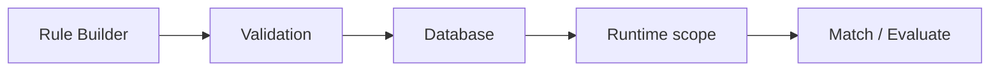
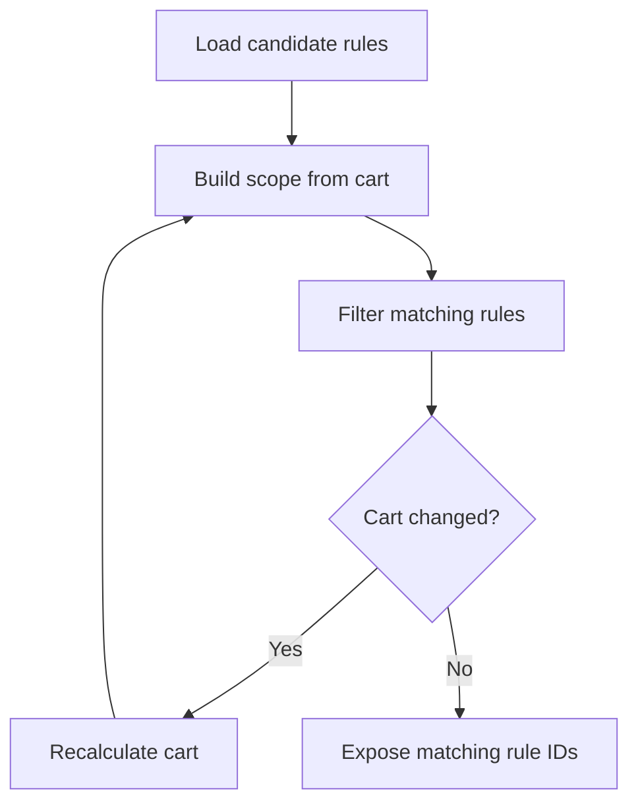
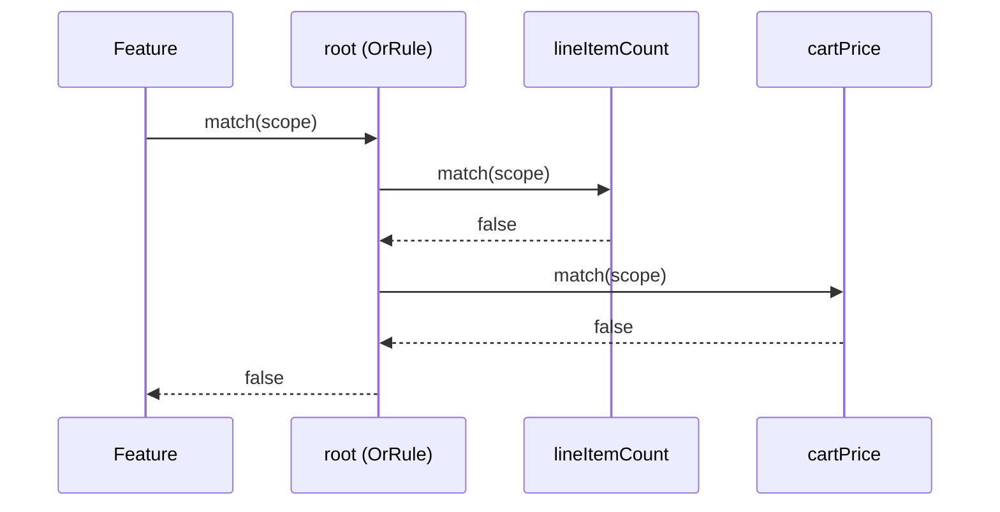

---
nav:
  title: Rule evaluation
  position: 30
---

# Rule evaluation

The lifecycle of rule evaluation from UI to decision making can be summarized as follows:

1. The Rule Builder lets a user create a rule tree (containers and conditions).
2. The rule system validates each condition against the corresponding rule class from the registry.
3. Valid rule and rule condition records are stored in the database.
4. At runtime, a domain builds an appropriate rule scope and, if needed, computes matching rules for that scope in advance.
5. Features either filter by rule IDs exposed on the context or evaluate a specific rule tree directly by calling it.

The sections below explain the individual steps in more detail.

## 1. From Rule Builder to stored rule definition

### 1.1. Rule trees and conditions

When a user configures a rule in the Rule Builder:

- The **visual tree** is mapped to a `rule` entity representing the whole rule and multiple `rule_condition` records representing both container nodes and leaf conditions.
- The tree structure is stored via `parent_id` references between `rule_condition` records.
- Each `rule_condition` has a **type** that maps to a rule class (implementing `Rule`) and stores its configured values (operator, thresholds, IDs, etc.) in a `value` JSON field.

So the Rule Builder is building the **structure and configuration** that will later be hydrated into a tree of `Rule` objects for evaluation.

### 1.2. Validation

Before writes are accepted, `RuleValidator` validates each condition. It subscribes to write events and inspects commands targeting `RuleConditionEntity`. For each condition, it:

- Resolves the condition type to a rule class via the `RuleConditionRegistry`.
- Instantiates the rule and uses its constraints to understand which fields and operators are valid.

If the payload does not match what the rule class declares (wrong fields, types, operators), the write is rejected.

## 2. Preparing evaluation

Rules do not fetch data themselves, they always evaluate against a provided **rule scope**.

### 2.1. Rule scope specification

The abstract `RuleScope` defines the minimal contract for evaluation. Domains extend it to add domain-specific data.

- `CheckoutRuleScope` - base for checkout-related rules.
- `CartRuleScope` - adds access to cart data.
- `FlowRuleScope` - adds access to order data.
- `LineItemScope` - focuses on a single line item.

### 2.2. Scope owners

Different parts of the system are responsible for constructing scopes:

- **Cart / Checkout:** `CartRuleLoader` is the main entry point for cart and checkout rule evaluation, building the necessary scopes and evaluating rules against them.

- **Flows:** `FlowRuleScopeBuilder` is responsible for building `FlowRuleScope`. It reconstructs a cart-like context from an order and runs data collectors so rules see realistic checkout data.

- **Line items:** Classes like `AnyRuleLineItemMatcher` construct `LineItemScope` when they need to test rules against individual line items.

The important point is: rules themselves are pure functions that depend only on the scope they receive. They do not depend on global state.

## 3. Matching rules

For some domains (checkout), the system evaluates all rules upfront and exposes the IDs of matching rules in the context so features can filter by them.

### 3.1. Candidate loading

`CartRuleLoader` is central for checkout. It uses the `AbstractRuleLoader` to load a collection of rules and narrows these to context-relevant rules before evaluating anything.

### 3.2. Iterative matching

To determine which of these candidates actually match the current cart context, `CartRuleLoader` builds the scope and uses `RuleCollection::filterMatchingRules(...)` to keep only rules whose payload rule tree evaluates to `true` for that scope. The matching rule IDs are then exposed on the `SalesChannelContext`.

Because the set of matching rules can affect cart processors (promotions, shipping, etc.) which in turn change the cart, the loader may need to iterate:

The result is a **self-consistent pair** of (cart, matching rule IDs) in the context.

## 4. Rules at runtime

Once rules are validated and the context knows which rules match, features can consume them in two ways.

### 4.1. ID-based decisions

Features that only need to know "is this entity available in the current context?" attach a rule ID then filter by IDs exposed on the context. For example:

- Entities like `shipping_method`, `payment_method` or `tax_provider` have an `availability_rule_id` field.
- Items with availability rules are allowed if their rule ID is in `SalesChannelContext::getRuleIds()`.

### 4.2. Direct evaluation

Other features need to evaluate a particular rule against a specific scope (flow, cart calculation, etc.). In these cases, the feature fetches the rule tree from the database, builds the appropriate scope for the current need and calls `Rule::match(RuleScope $scope)` on the root rule.

The following sequence shows how a container rule delegates to its children:

Since the `OrRule` requires at least one child to match, and both return `false`, the entire rule evaluates to `false`.
