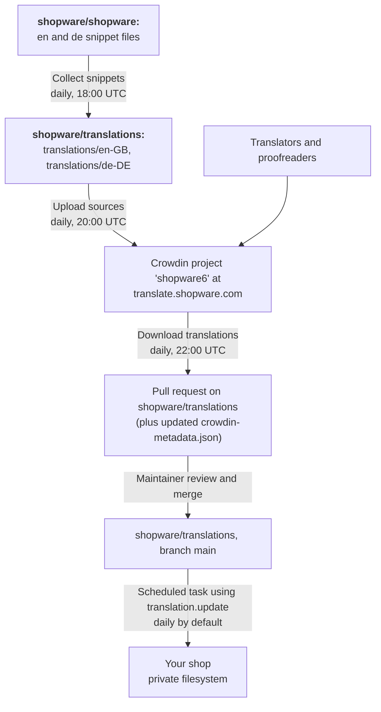

---
nav:
  title: Automated translation updates
  position: 55

---

# Automated translation updates

## Overview

Translations are not part of a Shopware release. They are maintained in Crowdin ([translate.shopware.com](https://translate.shopware.com)), published to the
[shopware/translations](https://github.com/shopware/translations) repository, and pulled into an installation by the
built-in translation system. Two automated processes keep this chain moving:

* Upstream: A set of scheduled GitHub Actions workflows exchanges snippets between `shopware/shopware`, Crowdin, and
  the translations repository.
* Downstream: The `translation.update` scheduled task refreshes the translations that are installed in a shop.

This page describes both halves: how a changed snippet reaches the translations repository, and how the scheduled task
brings it into a shop. For installing translations in the first place, see
[Built-in translation handling](built-in-translation-system.md).

## The delivery chain



The following table lists where each step of that chain runs and when it is triggered.

| Step                                  | Where it runs                                | Schedule                     |
|---------------------------------------|----------------------------------------------|------------------------------|
| Collect source snippets from the code | `shopware/translations`, `update-translations.yml` | Daily, 18:00 UTC        |
| Upload sources to Crowdin             | `shopware/translations`, `crowdin-upload.yml`     | Daily, 20:00 UTC        |
| Download translations from Crowdin    | `shopware/translations`, `crowdin-download.yml`   | Daily, 22:00 UTC        |
| Update the installed translations     | Your installation, `translation.update` task      | Daily, by default       |

::: info
Expect roughly one to two workdays between approving a translation in Crowdin and seeing it in a shop: the download
workflow runs once a day, its pull request needs a maintainer review, and the scheduled task then picks the change up
on its next run.
:::

## Update snippets in Crowdin

### Source strings come from the code, not from Crowdin

English and German snippets are shipped with Shopware and its plugins. English is the source language of the Crowdin
project, and German is uploaded as an already existing translation, so neither of them is edited in Crowdin. To add or
reword such a string, change the snippet file in the respective repository, for example in `shopware/shopware`, and
create a pull request:

| Bundle         | Source file                                                       | File in the translations repository                       |
|----------------|-------------------------------------------------------------------|-----------------------------------------------------------|
| Administration | `src/**/Resources/app/administration/src/**/{en,de}.json`          | `translations/en-GB/Platform/Administration/administration.json` |
| Core           | `src/Core/Framework/Resources/snippet/messages.{en,de}.base.json`  | `translations/en-GB/Platform/Core/messages.json`           |
| Storefront     | `src/Storefront/Resources/snippet/storefront.{en,de}.json`         | `translations/en-GB/Platform/Storefront/storefront.json`   |

The collect workflow merges these files into the `en-GB` and `de-DE` directories of the translations repository every
day at 18:00 UTC and does the same for the official plugins listed in its workflow configuration, which end up under
`translations/<locale>/Plugins/<name>/`. From there, the upload workflow pushes `en-GB` to Crowdin as the source
strings at 20:00 UTC, so a merged snippet change becomes translatable on the following day.

For adding snippets to your own extension, see
[Adding snippets to plugins](../../../guides/plugins/plugins/administration/templates-styling/adding-snippets.md) and
[Adding snippets to apps](../../../guides/plugins/apps/administration/adding-snippets.md).

::: warning
Changing an existing source string invalidates its translations. The Crowdin configuration uploads sources with
`update_as_unapproved`, so all languages of that key need to be translated and approved again. Prefer adding a new
snippet key over rewording one that is already translated.
:::

### Translate and approve strings in Crowdin

Translations are maintained in the public Crowdin project `shopware6` at
[translate.shopware.com](https://translate.shopware.com/). Everyone can contribute:

1. Create a Crowdin account and open the project.
2. Choose your language and the file you want to work on. The Shopware snippets are split by bundle
   (`administration.json`, `messages.json`, and `storefront.json`), and official plugins contribute their own files.
3. Translate the strings, or suggest an alternative for an existing translation.
4. A proofreader approves the suggestion. Only approved strings are considered final; unapproved suggestions still get
   downloaded, but they are the reason a language reports a progress below 100 percent.

New languages, new plugin files, and proofreader permissions are managed by the Shopware translation maintainers.

### From Crowdin to the translations repository

At 22:00 UTC, the download workflow pulls the translations from Crowdin into the `i18n_crowdin_translations` branch of
the translations repository and opens a pull request against `main`. A follow-up job runs
`scripts/update-metadata.mjs` for the changed files and commits the resulting
[`crowdin-metadata.json`](https://github.com/shopware/translations/blob/main/crowdin-metadata.json) with the new
`updatedAt` and `progress` values per locale. That metadata is what installations compare against, as described in
[How does the system recognize new updates?](built-in-translation-system.md#how-does-the-system-recognize-new-updates).

A maintainer reviews and merges the pull request. Two things need attention during that review:

* **Snippets containing HTML** — Crowdin tends to move content out of its HTML block, which breaks the markup.
  Right-to-left languages are affected most often.
* **Changes to `de-DE` or `en-GB`** — these are the source languages, so a diff here usually means a source string was
  changed but the corresponding suggestion has not been approved in Crowdin yet. Approve it there instead of editing
  the file in the pull request.

Once the pull request is merged into `main` of `shopware/translations`, the translations are available for download by
every installation.

## The `translation.update` scheduled task

::: info
The scheduled task is available starting with Shopware 6.7.13.0. In older versions, translations are updated only by
running the `translation:update` command.
:::

The task keeps the translations that are installed in a shop in sync with the translations repository, without anyone
having to run a command. The following table lists its registration details.

| Property               | Value                                                                  |
|------------------------|------------------------------------------------------------------------|
| Task name              | `translation.update`                                                   |
| Default interval       | `86400` seconds (daily)                                                |
| Task                   | `Shopware\Core\System\Snippet\ScheduledTask\UpdateTranslationsTask`     |
| Handler                | `Shopware\Core\System\Snippet\ScheduledTask\UpdateTranslationsTaskHandler` |
| Reschedules on failure | Yes                                                                    |

### What the task does

On every run, the handler refreshes all currently installed translations:

1. Read the local `crowdin-metadata.lock` file from the private filesystem. If no translation is installed, the task
   ends immediately and sends no request to the translations repository.
2. Fetch the remote metadata for the installed locales and compare their `updatedAt` timestamps.
3. Download the snippet files of every locale whose remote timestamp is newer and write them to the private
   filesystem. Locales that are already current are skipped.
4. Store the new timestamps in `crowdin-metadata.lock`.

The task is the automated equivalent of `bin/console translation:update`: both compare the same metadata and update the
same set of locales, so it does not matter whether an update is triggered manually or by the task. They reach that
result through different code paths, though, so do not rely on one to report what the other did.

### Requirements

* A running background worker, so the task is scheduled and consumed. See
  [Scheduled Task](../../../guides/hosting/infrastructure/scheduled-task.md) for `scheduled-task:run` and the
  Symfony scheduler variant.
* Outbound HTTPS access from the shop to the configured `repository-url` and `metadata-url`, which point to
  `raw.githubusercontent.com` by default. In an isolated network, mirror the translations repository and override those
  URLs as described in [Configuration override](built-in-translation-system.md#configuration-override).
* Write access to the `shopware.filesystem.private` Flysystem adapter, which stores the downloaded files and the
  metadata lock file.

### Inspect and control the task

```bash
# Show the task, its interval, its status, and its next execution time
$ php bin/console scheduled-task:list

# Run the task once, regardless of its schedule
$ php bin/console scheduled-task:run-single translation.update

# Update the installed translations right away, without the queue
$ php bin/console translation:update

# Stop the automatic updates
$ php bin/console scheduled-task:deactivate translation.update
```

Deactivate the task if you want full control over when translations change, for example when snippets are part of a
reviewed deployment artifact. Run `translation:update` during the deployment instead.

### What the task does not do

* **It does not install new languages.** Only locales that are already installed are refreshed. Use
  [`translation:install`](built-in-translation-system.md#install-translations) to add a locale.
* **It does not change the activation state of a language.** The `active` flag of an existing language is left
  untouched, so a language that was deliberately deactivated stays deactivated while still receiving snippet updates.
* **It does not overwrite database translations.** Snippets edited in the Administration keep the highest priority, as
  described in [Loading priority](built-in-translation-system.md#loading-priority).
* **It does not remove languages** when a locale disappears from the translations repository.

### Failure handling

If a run fails, for example because the repository is unreachable, the error is written to the log with the
`scheduledTask` context set to `translation.update`, and the task is rescheduled for the next interval instead of being
marked as failed. Because the metadata lock file is only written after all locales have been downloaded, a failed run
leaves the previous state intact and the next run retries the same locales.

## Troubleshooting

The following table lists the symptoms you are most likely to run into, together with their cause and solution.

| Symptom                                       | Cause and solution                                                                                                                                                                               |
|-----------------------------------------------|--------------------------------------------------------------------------------------------------------------------------------------------------------------------------------------------------|
| The task never runs                           | No background worker is consuming the queue. See [Scheduled Task](../../../guides/hosting/infrastructure/scheduled-task.md)                                                                       |
| The task runs but nothing changes             | No installed locale has a newer remote `updatedAt` timestamp, or no translation is installed at all. Run `bin/console translation:list` — locales without a **Last update** value are not installed |
| A translation approved in Crowdin is missing  | The download workflow has not run yet, or its pull request is still open. Check the open pull requests on `shopware/translations`                                                                  |
| The task fails with a network error           | The shop cannot reach `repository-url` or `metadata-url`. Check outbound HTTPS access or point the URLs at a mirror                                                                               |
| A language shows a progress below 100 percent | Strings are translated but not approved, or new source strings were added. Both are resolved in Crowdin                                                                                           |
| A storefront text is broken after an update   | Most likely a snippet with HTML markup. Report it on [shopware/translations](https://github.com/shopware/translations/issues) and fix it in Crowdin                                               |
