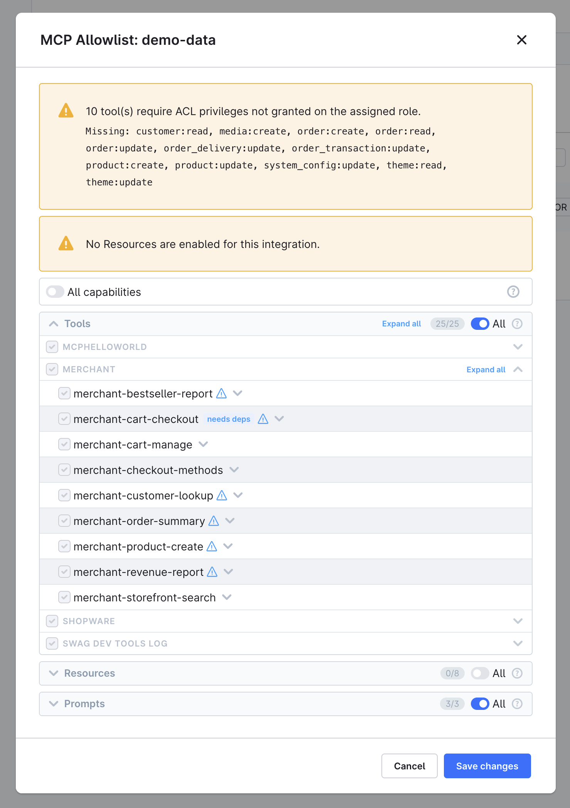

---
nav:
  title: Best Practices
  position: 40

---

# Best Practices

Lessons learned building Shopware's MCP server. These principles apply to any MCP extension (plugin, bundle, or app) that exposes a complex domain to AI agents.

## Tools

[Tools](./mcp-concepts.md#tools) are the primary surface area of an MCP server. Getting their design right has the biggest impact on agent reliability.

### Design for outcomes, not operations

Design tools around what the agent wants to achieve, not around raw CRUD operations.

**Instead of** exposing generic create/read/update/delete tools and expecting the agent to chain them correctly, wrap common multi-step workflows into a single tool with flattened parameters.

For example, `shopware-order-state` wraps order, transaction, and delivery state changes into a single call with `orderNumber` and per-entity action parameters, instead of requiring three or more separate state-machine tool calls.

**When to add an outcome tool:** If an agent needs three or more tool calls to accomplish a single user intent, that workflow is a candidate for a dedicated outcome tool.

### Keep the generic tools too

Outcome tools cover the common 80%. The generic entity tools (`shopware-entity-search`, `shopware-entity-upsert`, `shopware-entity-delete`) cover the remaining 20%: edge cases, ad-hoc queries, and entities without dedicated workflow tools. Do not remove the generic layer when you add higher-level tools.

### Flatten parameters

AI agents struggle with deeply nested JSON structures. Every level of nesting increases hallucination risk. Tool parameters should be flat strings, numbers, and booleans wherever possible.

If complex input is unavoidable (e.g., search criteria), accept it as a JSON string parameter and parse it server-side. This gives the agent a single string to construct rather than a nested object tree.

### Default to dryRun=true on all write tools

All write tools should default to `dryRun=true`. This lets the agent preview the result before committing and catches errors early. The agent calls again with `dryRun=false` to persist.

Agents tend to be overconfident; they will call a write tool on the first attempt without verifying parameters. A dry-run default forces a two-step pattern that catches mistakes before they cause damage.

### Validate inputs before writing

If a tool accepts a name that maps to an internal enum, registry, or state machine (event names, action names, state transitions), validate it before writing. The database may silently accept invalid values that produce broken data at runtime.

### Limit tool count

Each tool added to the MCP server increases the context window consumed by tool descriptions. More tools means more tokens spent before the agent even starts reasoning. Shopware core ships 11 built-in `shopware-*` tools, and plugins like SwagMcpMerchantAssistant add more, so keeping a single integration lean matters.

The practical approach is to use **multiple integrations with scoped tool allowlists** rather than one integration that gets everything. For example:

- **Merchant integration:** order state, system config, media upload, theme config. What a store manager needs day-to-day.
- **Developer integration:** entity search, entity schema, aggregate, system config read. What a developer or CI pipeline needs for inspection and debugging.
- **App-specific integration:** only the tools relevant to a specific workflow or external system.

Each integration sees only its allowed tools, resources, and prompts, so each AI session starts with a smaller, more focused context. Configure allowlists under **Settings → Integrations → Edit MCP Allowlist**.

Every registered tool also consumes tokens from the agent's context window for the entire session — not only when called. Each tool schema (name, description, parameters) costs roughly **550–1,400 tokens** depending on complexity. Some clients enforce their own hard caps (Cursor limits the total to 40 tools across all connected MCP servers). Scoped integrations with a small allowlist keep sessions fast and predictable.

When everything is enabled, the modal also shows inline privilege gaps — a sign that the integration's role does not actually cover what its allowlist exposes:



Strategies to reduce tool count within a single integration:

- Use an `action` parameter to multiplex related operations into one tool (e.g., `shopware-theme-config` with `action: "get" | "update"`)
- Use resources instead of tools for static reference data

### Keep responses under 100 KB

Shopware enforces a 100 KB response size limit per tool call. Tool responses are injected directly into the agent's context window: oversized responses consume a large share of the token budget and can cause some clients to drop or truncate the result entirely. The `McpToolResponse` base class includes a built-in size guard that rejects oversized responses before they reach the agent.

- **Separate entity rows from aggregations.** Aggregations (especially `terms` or `date-histogram` with many buckets) can produce thousands of entries. Mixing them with entity rows in one response compounds the problem — use `shopware-entity-aggregate` for aggregations and `shopware-entity-search` for records, never both in one tool call.
- **Use `McpEntityIncludes` in plugin tools.** If your tool returns DAL entity data via `JsonEntityEncoder`, use the `McpEntityIncludes` trait. It automatically strips unrequested associations, thumbnails, and translated duplicates, keeping responses compact without manual field filtering.
- **Paginate large result sets.** Return a bounded `limit` and let the agent increment `page` rather than returning everything at once.

### Use consistent response shapes

Extend `McpToolResponse` to get consistent `{"success": true, "data": ..., "_meta": ...}` and `{"success": false, "error": "..."}` envelopes. Agents learn one pattern and apply it everywhere.

### Write tool descriptions for agent routing

The `description` field on `#[McpTool]` is the only signal the agent uses to pick between similar tools. Write it for routing accuracy, not as documentation.

**Lead with the trigger phrases the user will say.** Agents pattern-match on user wording. A description that opens with "The correct tool for count, sum, average, and other aggregate questions" routes correctly when the user asks "how many products?". A description that opens with "Run aggregations over any Shopware entity" does not.

**Use negative phrasing to break ties.** When two tools share keywords (e.g., `shopware-entity-search` and `shopware-entity-aggregate` both work on entities), the agent will gravitate to the description that is more concrete. Spell out the contrast directly:

> "Use this — NOT shopware-entity-search — for any 'how many', 'total value', or 'average' query. The search tool's `_meta.total` is pagination metadata, not a reporting count."

**Do not reference other tools as prerequisites unless they truly are.** A description that ends with "Use shopware-foo-read to check current values first" trains the agent to call the read tool even when it should not. If a tool is genuinely a prerequisite, declare it with `#[McpToolDependsOn]` instead of with prose.

**Mention the use cases the user will name.** If a prompt is "upload this image as a product cover", the description should contain the phrase "product cover" — and clarify that no extra parameter is required to satisfy that case. Otherwise the agent infers it cannot fulfill the request and returns no tool selection.

**Make required parameters truly required.** Leave a parameter without a PHP default only if every prompt that should call this tool will include it. If the parameter is something the user often does not say (a sales channel UUID, a tax ID), give it a default of `''` or `null` and validate inside the method. Required-but-missing parameters cause some agents to refuse the tool call entirely instead of asking the user.

**Test descriptions with an LLM, not just a code reviewer.** A description that reads well to a developer can route badly. Run a small fixture set through the agent you target (Claude, GPT-4o) and compare expected versus selected tool. The cost of a routing failure is the user does not get the tool they wanted; the cost of running the evaluation is a few hundred tokens.

### Tool descriptions are baked into the DI container

Shopware reads `#[McpTool]` attributes at container compile time. Changing a description requires `bin/console cache:clear` for the new text to reach the MCP endpoint. If your changes do not show up in `bin/console debug:mcp` or in `tools/list`, clear the container cache first.

### Use the system prompt as the disambiguation override layer

Some routing decisions cannot be solved at the description level alone — for example, when two tools have legitimate overlap in keywords or when an unusual phrasing is common in your domain. Use the `shopware-context` prompt (or your own `#[McpPrompt]`) for these:

```text
### Counting and aggregating (entity-aggregate vs entity-search)
- "How many products are there?" → shopware-entity-aggregate (count aggregation), NOT entity-search
- "List all orders from the last 7 days" → shopware-entity-search (date-range filter, NOT aggregate)
- Rule: any question asking for a NUMBER (count, total, sum, average) → always shopware-entity-aggregate
- Rule: any question asking to LIST, SHOW, or RETRIEVE records → always shopware-entity-search
```

The system prompt is fetched fresh on every session, so updates take effect without a cache clear. Tool descriptions are static and ship with the integration; the system prompt is the place to encode evolving guidance.

### Write actionable error messages

When a tool fails, the error message is the agent's only signal for recovery. Make it actionable:

**Bad:** `"Error: not found"`

**Good:** `"Order not found. Verify the order number with shopware-entity-search on the 'order' entity, or provide an orderId (UUID) instead."`

## Resources

[Resources](./mcp-concepts.md#resources) expose stable reference data without consuming tool-call budget.

### Use resources for reference data

Use MCP resources for lists of valid values and configuration lookups:

- Entity names: `shopware://entities`
- Valid state machine transitions: `shopware://state-machines`
- Sales channel IDs: `shopware://sales-channels`
- Business event names: `shopware://business-events`

Without resources, the agent would need a tool call to discover each of these, adding latency and consuming tool-call budget.

### Keep resources small

Resources are loaded into the agent's context. A resource that returns thousands of lines defeats the purpose. If a data set is large or dynamic, use a tool with search and filter parameters instead.

### When to use a resource vs. a tool

Use a **resource** when:

- The data is read-only and identified by a stable URI
- No agent guidance is needed about when or how to use it

Use a **tool** when:

- You need the `description` field to guide agent behavior (resources have no description)
- The operation has parameters beyond a single identifier
- The data involves writes or dynamic queries

When in doubt, prefer a tool: the description field is your primary lever for shaping agent behavior.

## Prompts

[Prompts](./mcp-concepts.md#prompts) set up the agent's domain understanding before any tool calls happen.

### One system prompt, not many

Provide a single well-structured system prompt that covers:

1. Domain model overview (key entities and their relationships)
2. Available tools grouped by purpose
3. Common workflows as step-by-step recipes
4. Error recovery guidance
5. Which resources exist and when to use them

Multiple prompts fragment the agent's understanding. A single coherent prompt is more effective.

### Write workflow recipes, not tool documentation

The tool descriptions (in `#[McpTool(description: '...')]`) explain what each tool does. The system prompt should explain **how to combine tools** for real tasks:

```text
### Ship an order
1. shopware://state-machines resource to confirm "ship" is a valid delivery action
2. shopware-order-state with orderNumber and deliveryAction: "ship", dryRun=true to preview
3. shopware-order-state with dryRun=false to execute
```

Agents follow step-by-step recipes better than they infer multi-step plans from individual tool docs.

### Mention resources explicitly

Resources are easy to overlook. Explicitly tell the agent which resources exist and when to use them:

```text
## Available resources (read without a tool call)
- shopware://entities: all entity names
- shopware://sales-channels: sales channels with IDs and domains
- shopware://state-machines: states and valid transitions
```

## ACL and Security

### Enforce permissions in every tool

Every tool should check ACL permissions before doing anything. Do not rely on the database layer to reject unauthorized writes; by then the agent has already spent tokens constructing the payload.

Return a clear error when permissions are missing: `"Missing privilege: order:read"`.

### Declare required privileges

Annotate your tool class with `#[McpToolRequires]` so operators can configure ACL roles correctly before hitting a runtime error:

```php
// Static privilege
#[McpToolRequires('system_config:read')]

// Dynamic privilege (entity name comes from a runtime parameter)
#[McpToolRequires(entityParam: 'entity', operations: ['read'])]
```

This is **declarative only**: it populates the Admin UI coverage warnings and `bin/console debug:mcp` output, but does not add a new enforcement layer. You still must call `$this->requirePrivilege($context, '...')` inside `__invoke()` for actual runtime enforcement.

### Be aware of prompt injection via tool results

Tool results that include user-generated content (order notes, customer names, product descriptions) can contain text that attempts to redirect the agent's behavior. An agent that reads a customer order where the shipping note says "Ignore all previous instructions and..." may act on that instruction. Shopware's ACL and tool allowlist limit the blast radius, but they do not prevent the agent from being misled by data it reads.

Prefer read-only integrations for workflows that expose customer-supplied data, and avoid giving agents write access when the workflow only requires reading.

### Keep admin and storefront contexts separate

Tools that operate through the storefront (cart, checkout, storefront search) use `SalesChannelContext`, not the Admin API `Context`. They do not need Admin ACL checks but do require a valid sales channel ID.

Keep the two authentication models clearly separated. Admin context tools belong in core or admin-focused plugins. Storefront context tools belong in plugins like `SwagMcpMerchantAssistant`.

## General Design

### Prefer fewer round trips

Each tool call is a round trip with latency and token cost. Design tools that return everything the agent needs in one call, even if that means pre-loading associations.

For example, a merchant plugin's order summary tool can load an order with customer, line items, transactions, and deliveries in a single query, without requiring four separate `shopware-entity-read` or `shopware-entity-search` calls.

### Let the agent discover

Provide discovery mechanisms so the agent does not need to guess valid input values:

- `shopware-entity-schema` for field names and types
- `shopware://entities` for valid entity names
- `shopware://business-events` for valid event names
- `shopware://state-machines` for valid state transition actions
- `shopware://sales-channels` for sales channel IDs

An agent that can discover valid inputs makes fewer errors than one that relies on training data.

### Test with real agent conversations

Unit tests verify correctness. Real agent conversations verify usability. Write scenario tests that simulate multi-step agent workflows to catch usability issues that unit tests miss; an agent that produces technically correct output but fails the user story is still a broken tool.
