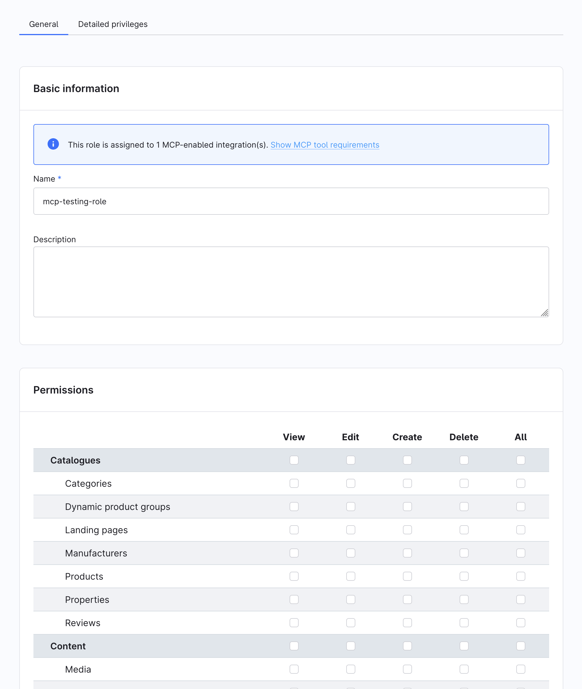
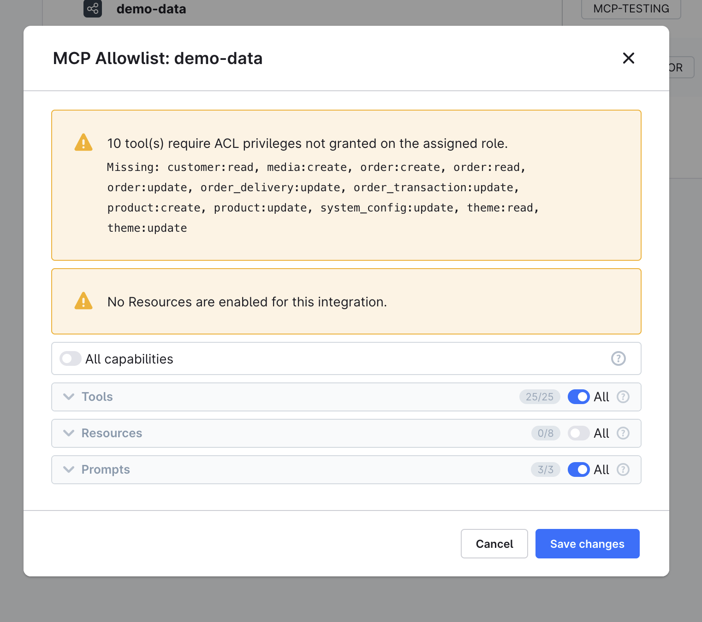

---
nav:
  title: Configuration
  position: 30

---

# Configuration

## Feature flag

The MCP server is gated behind the `MCP_SERVER` feature flag. Add it to your `.env` file:

```bash
MCP_SERVER=1
```

When inactive, all MCP services are removed from the container at compile time with no runtime overhead.

## Shopware MCP configuration

Shopware-specific MCP settings live under the `shopware.mcp` key in `config/packages/shopware.yaml` or any config file loaded in your application:

```yaml
shopware:
    mcp:
        allowed_tools: []       # Empty = all tools allowed. List tool names to restrict globally.
        app_tool_timeout: 10    # Timeout in seconds for app webhook tool calls.
```

### Global tool allowlist

`allowed_tools` is an installation-wide safety switch. It restricts which tools are available across **all** integrations at compile time:

```yaml
shopware:
    mcp:
        allowed_tools:
            - shopware-entity-schema
            - shopware-entity-search
            - shopware-system-config-read
```

An empty list (the default) means no compile-time restriction; all registered tools are available. The per-integration allowlist in the Admin UI is the primary control for day-to-day access management.

:::info Per-integration allowlist
For production use, manage tool access per integration under **Settings → Integrations → Edit MCP Allowlist**. The global `allowed_tools` is a coarse safety switch, not the main product control.

The per-integration allowlist is stored in the `integration.mcp_allowlist` column as a JSON object with `tools`, `resources`, and `prompts` keys. `null` per key means all capabilities of that type are allowed; a JSON array restricts to the listed names; an empty array `[]` means no capabilities of that type are accessible.

**Scope:** the allowlist only applies to integration-authenticated requests, i.e. those using `sw-access-key` + `sw-secret-access-key` headers or an OAuth `client_credentials` token minted for an integration access key (`SWIA...`). Admin user bearer tokens (issued via password or refresh-token grant with `client_id = administration`) bypass the allowlist entirely and see all capabilities, subject only to the user's ACL.
:::

## MCP bundle configuration

The underlying `symfony/mcp-bundle` is configured in `config/packages/mcp.php`. Shopware ships this file and it is loaded automatically when the `MCP_SERVER` feature flag is active. You do not need to create or modify it for standard setups.

## Session store

MCP sessions track an ongoing conversation across multiple requests. The client performs an `initialize` handshake first, then sends subsequent `tools/call` requests referencing that session ID. Session data must survive between requests.

Shopware defaults to a file-based session store that writes to `%kernel.cache_dir%/mcp-sessions/`.

| Store | Multi-worker | Multi-server | Backend |
|---|---|---|---|
| `file` (default) | No | No | `%kernel.cache_dir%/mcp-sessions/` |
| `memory` | No | No | Per-process RAM |
| `cache` (avoid) | No in dev | No | `cache.app` (ArrayAdapter in dev) |
| `framework` (unusable in Shopware) | Yes | Yes | Requires active PHP session, not available because the Admin API is stateless |
| Custom Redis store (recommended for production) | Yes | Yes | Redis / Valkey |

### Production: Redis session store

The file store works on a single machine. In a multi-server or Kubernetes environment, `initialize` and subsequent tool calls may land on different workers that do not share a local filesystem. Switch to Redis:

**`config/services.yaml`:**

```yaml
services:
    mcp.session.cache_psr16:
        class: Symfony\Component\Cache\Psr16Cache
        arguments: ['@cache.mcp_sessions']

    mcp.session.store:
        class: Mcp\Server\Session\Psr16SessionStore
        arguments:
            - '@mcp.session.cache_psr16'
            - 3600   # TTL in seconds
```

**`config/packages/framework.yaml`:**

```yaml
framework:
    cache:
        pools:
            cache.mcp_sessions:
                adapter: cache.adapter.redis_tag_aware
                provider: 'redis://your-redis-host:6379'
                default_lifetime: 3600
```

If you already have a Redis/Valkey connection configured for Shopware, point `provider` at that same DSN to avoid opening a second connection.

## ACL and permissions

All MCP tool operations respect the integration's Admin API ACL role. To restrict what an MCP client can do:

1. Create an ACL role in **Settings → Users & Permissions → Roles** with only the required permissions.
2. Assign that role to the integration (omit `--admin` when creating via CLI).
3. Under **Settings → Integrations → Edit MCP Allowlist**, enable only the tools needed for this integration.

The Admin UI surfaces two helpers for getting ACL right:

- The **Role detail** page shows which integrations reference that role and highlights any privilege gaps:



- The **Edit MCP Allowlist** modal shows a coverage warning when an assigned role is missing privileges required by an allowed tool:



## CLI: `debug:mcp`

List all registered capabilities:

```bash
bin/console debug:mcp
```

The output shows four columns: **Name**, **Source**, **Dependencies**, and **Privileges**. It reads from the live server registry and covers core tools, plugin tools, and app tools in one view.

Filter by capability type:

```bash
bin/console debug:mcp --tools      # tools only
bin/console debug:mcp --prompts    # prompts only
bin/console debug:mcp --resources  # resources only
```

Drill into a single capability by name:

```bash
bin/console debug:mcp shopware-entity-search
```

See the registry from a specific integration's perspective (honors its per-integration allowlist):

```bash
bin/console debug:mcp --integration=SWIA...
```

If a tool is missing from this output, it is also missing from the live endpoint. Common causes:

- Plugin is not installed or activated
- Service tag is missing (`shopware.mcp.tool`)
- `#[McpTool]` attribute is on `__invoke()` instead of the class
- App tool's webhook URL is not reachable

## Rate limiting

The MCP endpoint applies per-integration rate limiting. Each set of credentials gets its own rate limit bucket. Rate limiting protects the endpoint from brute-force attempts and runaway agent loops.
