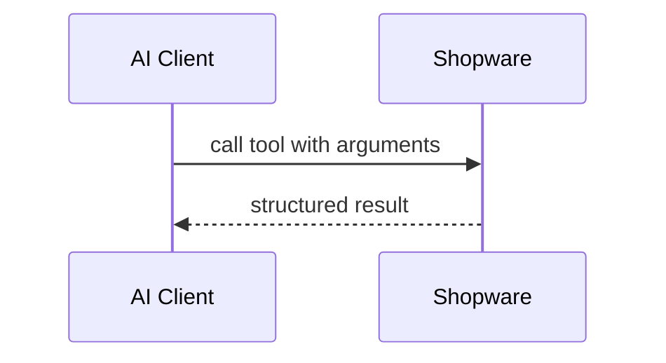
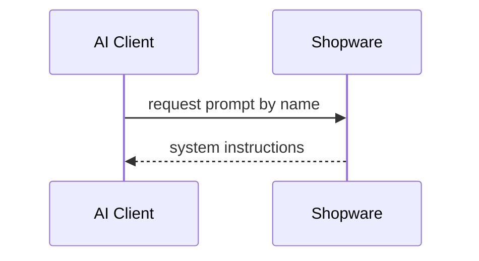

---
nav:
  title: MCP Concepts
  position: 10

---

# MCP Concepts

The Model Context Protocol defines three building blocks that servers can expose: **tools**, **resources**, and **prompts**. Knowing what each one does and when to use it is the starting point for working with Shopware's MCP server or building your own extensions.

The full specification is available at [modelcontextprotocol.io](https://modelcontextprotocol.io/specification/).

## Tools

A tool is a callable function that the AI agent invokes to take an action or retrieve data. The agent reads the tool's name and description and decides when to call it based on the user's request. Tools accept typed parameters and return structured results.



**When to use a tool:**

- The agent needs to decide when and whether to call it
- The operation requires parameters beyond a simple identifier
- The capability involves writes, state changes, or dynamic queries
- You want the tool description to guide agent behavior (for example, "use this before building search criteria")

**Shopware examples:** `shopware-entity-search`, `shopware-entity-upsert`, `shopware-order-state`

## Resources

A resource is a read-only data endpoint identified by a URI. Resources expose stable reference data that the agent or client can fetch without any decision-making. Unlike tools, resources have no description to guide the agent; they are simply data at a known address.

```text
shopware://entities          → list of all entity names
shopware://sales-channels    → sales channels with IDs and domains
shopware://state-machines    → states and valid transitions per machine
```

**When to use a resource:**

- The data is read-only and identified by a stable, predictable URI
- The information is needed frequently and does not change mid-session (entity names, currencies, languages)
- You want the client or agent to load context without consuming tool-call budget
- The dataset is small enough to fit in context (for large or dynamic data, use a tool with filter parameters instead)

**Shopware examples:** `shopware://entities`, `shopware://business-events`, `shopware://flow-actions`

## Prompts

A prompt is a named instruction template that sets up the AI's behavior for a specific domain. Prompts explain how to combine tools for real tasks, describe entity relationships, and provide error recovery guidance. They are user-triggered (the client requests a specific prompt) rather than agent-driven.



**When to use a prompt:**

- You want to provide step-by-step sequences for common tasks
- You want to explain domain-specific concepts (entity relationships, state machine semantics)
- You want to mention available resources and when to use them

**Shopware example:** `shopware-context` explains the DAL criteria format, core entity relationships, available tools by purpose, and error recovery guidance.

## Comparison

| | Tool | Resource | Prompt |
|---|---|---|---|
| **Invocation** | Agent decides when to call | Client or agent fetches | User selects in client |
| **Parameters** | Yes, typed and named | URI only | Optional arguments |
| **Can write data** | Yes | No | No |
| **Has description to guide agent** | Yes | No | Yes |
| **Counts as a tool call** | Yes | No | No |
| **Best for** | Actions, queries with parameters | Reference lookups, pre-loaded context | System instructions, workflow recipes |

## How they work together

A well-designed MCP server uses all three:

1. **Resources** provide reference data (entity names, sales channel IDs, state transitions) so the agent does not waste tool calls on lookups.
2. **Prompts** explain how to combine tools for real tasks and remind the agent which resources exist.
3. **Tools** do the actual work: search, read, write, transition state.

For example, to ship an order the agent would:

1. Read `shopware://state-machines` to confirm `ship` is a valid delivery action
2. Call `shopware-order-state` with `deliveryAction: "ship"` and `dryRun: true` to preview
3. Call again with `dryRun: false` to execute

The resource saved one tool call; the tool did the work; the prompt explained the pattern.

## Next steps

- [Getting Started](./getting-started.md): connect an AI client to your Shopware shop
- [Tools Reference](./tools-reference.md): all built-in tools, resources, and prompts
- [Best Practices](./best-practices.md): design principles for building your own tools
- [Extending via Plugin](../../plugins/plugins/mcp-server.md): add custom tools to Shopware
