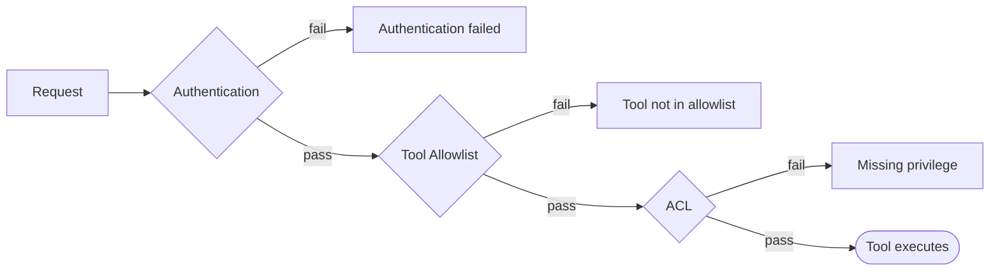

---
nav:
  title: Troubleshooting
  position: 60

---

# Troubleshooting

## Quick reference

| Symptom | Likely cause | Fix |
|---|---|---|
| `Authentication failed. Configure your MCP client...` | Wrong or missing credentials | Check `sw-access-key` / `sw-secret-access-key` in your client config |
| `Tool "X" is not in the allowlist...` | Tool not enabled for this integration | Settings → Integrations → Edit MCP Tools → enable the tool |
| `Missing privilege: {entity}:read` | Integration role lacks the permission | Assign an ACL role with the required privilege, or use `--admin` |
| Tool missing from `tools/list` | Blocked by allowlist | Enable the tool under Edit MCP Tools |
| No tools in `tools/list` at all | Allowlist is an empty array | "All tools" toggle is OFF with nothing selected. Enable tools or turn the toggle back ON |
| Admin integration but tool still blocked | Per-integration allowlist is set | Admin bypasses ACL (layer 3) only; the allowlist (layer 2) still applies regardless |
| Tool missing entirely | Plugin inactive, missing tag, or attribute misplaced | Check `bin/console debug:mcp` |
| `ECONNREFUSED` or "fetch failed" | Server not running or wrong URL | Start Shopware and verify the URL in your client config |

## Connection issues

### ECONNREFUSED or "fetch failed"

Your MCP client cannot reach the Shopware server.

1. Start the Shopware server (Docker, ddev, or your usual local setup).
2. Verify the URL in your MCP client config matches how you access the shop (host and port).
3. For local development, confirm the shop is reachable at the same URL in a browser before retrying the MCP client.

## Client-specific issues

### Claude Code: "Does not adhere to MCP server configuration schema"

Claude Code requires `"type": "http"` in `.mcp.json`. The MCP spec transport name is `"streamable-http"`, which other clients accept, but Claude Code only accepts the shorter `"http"` form. Change your config:

```json
{
    "mcpServers": {
        "shopware": {
            "type": "http",
            "url": "http://localhost:8000/api/_mcp",
            "headers": {
                "sw-access-key": "SWIA...",
                "sw-secret-access-key": "..."
            }
        }
    }
}
```

### Cursor: schema lookups on every tool call

Cursor reads MCP tool schema descriptor files before every tool call, adding a visible file-lookup step to each interaction. You can eliminate this by embedding tool schemas directly in a Cursor rule:

1. Create `.cursor/rules/shopware-mcp-tools.mdc` in your project root.
2. Set `alwaysApply: true` in the front matter.
3. List all tool schemas inline so Cursor can skip the descriptor lookup.

**Example rule file:**

```markdown
---
description: Shopware MCP tool schemas, call tools directly without reading schema files first
alwaysApply: true
---

# Shopware MCP Tools

When using Shopware MCP tools, call them directly without reading schema files first.

## shopware-entity-search
Search entity records. Required: `entity` (string). Optional: `criteria` (JSON string), `limit` (int, default 25), `page` (int, default 1), `term` (string).

## shopware-entity-schema
Get field/association schema of an entity. Required: `entity` (string).

## shopware-entity-read
Read a single entity by UUID. Required: `entity` (string), `id` (string). Optional: `criteria` (JSON string).

## shopware-entity-upsert
Create or update entity data. Required: `entity` (string), `payload` (JSON string). Optional: `dryRun` (bool, default true).

## shopware-entity-delete
Delete entities. Required: `entity` (string), `ids` (JSON array string). Optional: `dryRun` (bool, default true).

## shopware-entity-aggregate
Run aggregations. Required: `entity` (string), `aggregations` (JSON string). Optional: `filters` (JSON string).

## shopware-order-state
Change order/transaction/delivery state. One of `orderNumber` or `orderId` required. Optional: `orderAction`, `transactionAction`, `deliveryAction` (strings), `dryRun` (bool, default true).

## shopware-system-config-read
Read system config. Required: `key` (string). Optional: `salesChannelId` (string).

## shopware-system-config-write
Write system config. Required: `key` (string), `value` (string). Optional: `salesChannelId` (string), `dryRun` (bool, default true).

## shopware-media-upload
Upload media from URL. Required: `url` (string). Optional: `fileName` (string), `mediaFolderId` (string), `productId` (string).

## shopware-theme-config
Read/update theme config. Required: `salesChannelId` (string), `action` ("get" or "update"). Optional: `config` (JSON string), `dryRun` (bool, default true).
```

Add any additional tools from installed plugins to this file. Tools not listed still work. Cursor falls back to reading the descriptor file.

## Tool registration issues

### Tool missing from `bin/console debug:mcp`

If a tool does not appear in `debug:mcp` output, it will also be missing from the live endpoint.

**For plugin tools:**

- Confirm the plugin is installed and activated: `bin/console plugin:list`
- Confirm the service has `<tag name="shopware.mcp.tool"/>` in `services.xml`
- Confirm `#[McpTool]` is on the **class**, not on `__invoke()`
- Run `bin/console cache:clear` after changes

**For core / bundle tools:**

- Confirm the directory is listed in `mcp.yaml` `scan_dirs`
- Confirm the service has the correct DI tag (`mcp.tool` for in-tree bundles)

## Security layers

The MCP endpoint passes every request through three independent security layers. A request must clear all three before a tool executes:



**Authentication (Layer 1):** Pass `sw-access-key` and `sw-secret-access-key` headers. Obtain credentials from Settings → Integrations.

**Tool Allowlist (Layer 2):** Each integration has its own allowlist. `null` means all tools are accessible; an empty array `[]` means no tools are accessible. The `admin` flag on an integration does **not** bypass the allowlist; it only bypasses layer 3 (ACL).

**ACL (Layer 3):** Even if a tool is in the allowlist, the integration's ACL role must have the required entity-level permissions.
