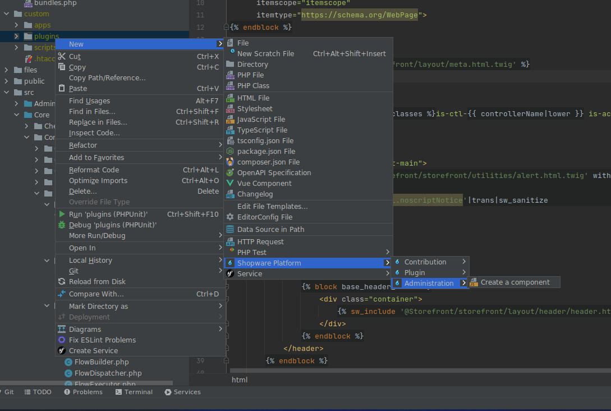
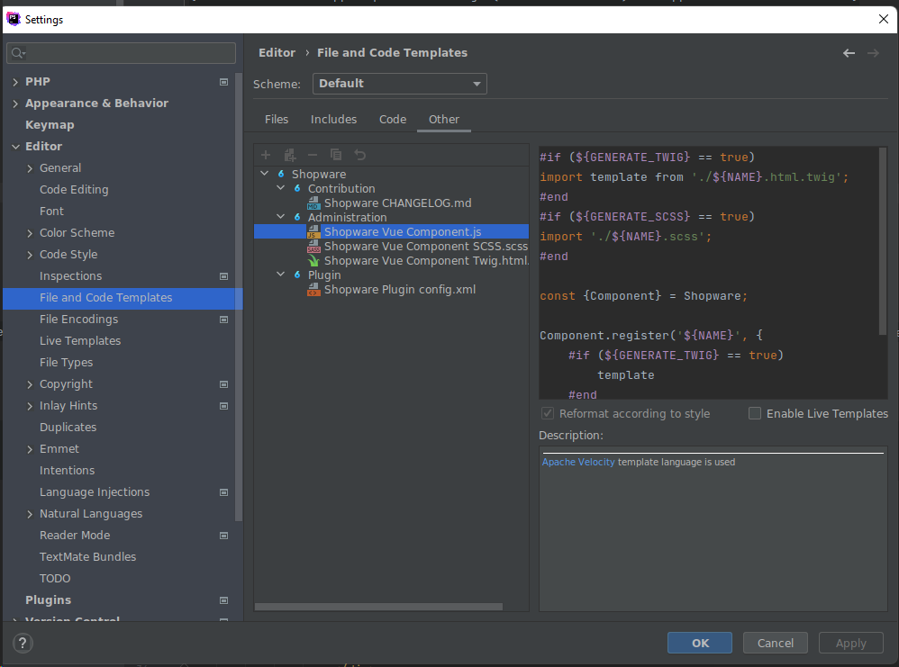

---
nav:
  title: Shopware Toolbox
  position: 10

---

# Shopware 6 Toolbox

[Shopware 6 Toolbox](https://plugins.jetbrains.com/plugin/17632-shopware-6-toolbox) is a productivity plugin for JetBrains IDEs (e.g., PhpStorm) that enhances the Shopware 6 development experience. It provides live templates and scaffolding for common Shopware tasks.

Shopware Toolbox is not a standalone application. It runs inside PhpStorm (and other JetBrains IDEs) and provides Shopware-specific development helpers.

## Current features

### Live templates

Multiple live templates for development. Use Cmd/Ctrl + J to see all live templates available.

### Code generators

* Vue.js Admin component
* config.xml
* Extend Storefront blocks with automatic file creation
* Vue module
* Scheduled task
* Changelog

### Static code checks

Inspection to show an error when abstract class is used incorrectly in the constructor (guideline check).

### Auto-completion

* Admin components
* Snippets in Administration and Storefront
* Storefront functions `theme_config`, `config`, `seoUrl`, `sw_include` and `sw_extends`
* Repository auto-completion at `this.repositoryFactory.create`
* Module.register labels
* Context-aware admin component auto-completion (only when Twig file is next to an `index.js`)
* Feature flags

## Installation

Follow these steps:

1. Open PhpStorm
2. Go to Settings → Plugins
3. Search for “Shopware 6 Toolbox”
4. Install and restart the IDE
