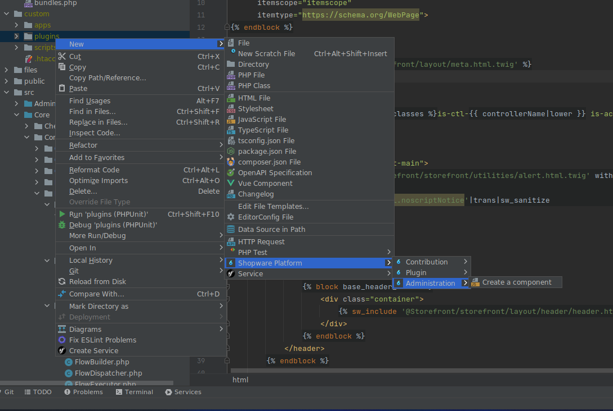
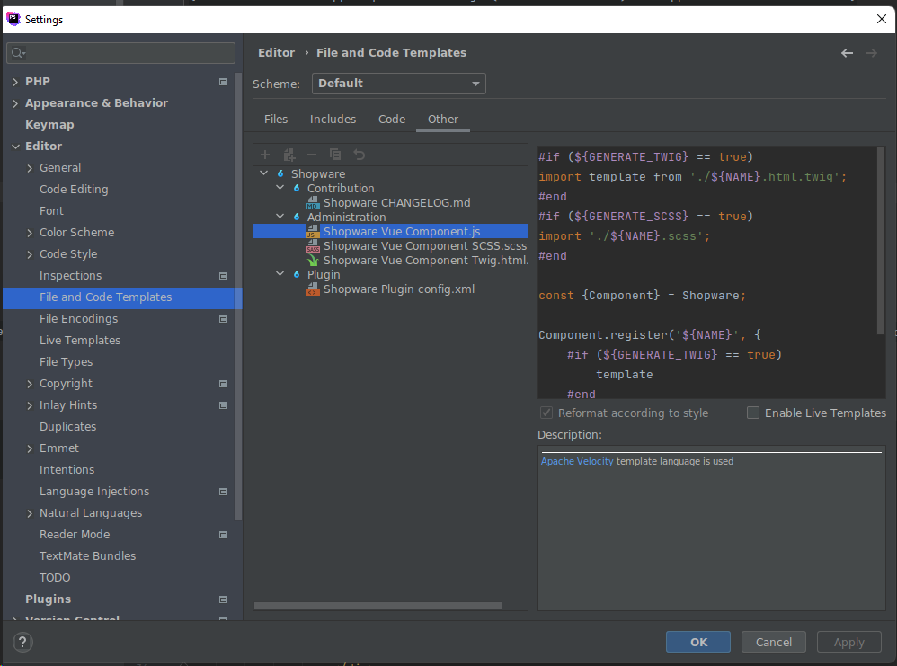

---
nav:
  title: Shopware 6 Toolbox
  position: 40

---

# Shopware 6 Toolbox

The [Shopware 6 Toolbox plugin](https://plugins.jetbrains.com/plugin/17632-shopware-6-toolbox) is a productivity plugin for JetBrains IDEs that enhances the Shopware 6 development experience. It provides live templates, scaffolding, inspections, and navigation for common Shopware tasks.

It is not a standalone application. It runs inside PHPStorm (and other JetBrains IDEs) and provides Shopware-specific development helpers.

For plugin development, the Shopware 6 Toolbox plugin covers much of the same ground as `bin/console plugin:create` and the manual file creation described in [Creating plugins](../../plugins/plugins/creating-plugins.md), but from inside the editor: it creates the plugin skeleton, generates single files (scheduled task, migration, admin module, CMS block), turns an event class into a subscriber, and validates `composer.json` against Shopware Store requirements. Because the generators use JetBrains file templates, you can adapt every generated file to your own conventions — see [Customize the generated files](#customize-the-generated-files).





## Current features

### Live templates

Multiple live templates for development. Use Cmd/Ctrl + J to view all live templates.

### Code generators

Generators are available under *File → New → Shopware Platform* (or **Ctrl/Cmd + N** in the project tree):

| Group | Generates |
| --- | --- |
| Plugin | Plugin skeleton, `config.xml` |
| PHP | Scheduled task, database migration |
| App | App skeleton, custom entities, app script, CMS block or CMS element for an app |
| Administration | Vue component, Vue module, CMS block, CMS element |

Further generators are available as context actions: *Extend this block* on a Storefront Twig block creates the override file, and *Extend component* / *Extend method* in the editor context menu create the corresponding Administration override. Changelog entries and other boilerplate are available as live templates.

### Intentions

Place the cursor on the relevant code and press **Alt+Enter** (macOS: **Option+Enter**):

* **Extend Twig block** — creates the override file and the `sw_extends` block in your plugin
* **Create event listener** — on an event class, creates a subscriber in a plugin you select and registers the event
* **Extend admin component** — creates a component override in your plugin
* **Extend admin component method** — adds the selected method to the override
* **Add/Update the Shopware 6 versioning comment** and **Show Twig block difference** — see [Twig block versioning](#twig-block-versioning)

::: info
*Create event listener* is the fastest way to subscribe to an event: navigate to the event class in the core (see [Finding events](../../plugins/plugins/framework/event/finding-events.md)), trigger the intention, pick the target plugin, and the subscriber file plus its service registration are created for you.
:::

### Inspections

Inspections are grouped under *Shopware 6* in *Settings → Editor → Inspections*.

| Group | Inspection | Severity |
| --- | --- | --- |
| PHP | Class used instead of abstract class (constructor type hints a concrete class that is meant to be decorated) | Error |
| PHP | Criteria IDs set by filter instead of constructor | Warning |
| Administration | Snippet translation is missing | Warning |
| Administration | Using Vue template slots is deprecated | Warning |
| Script | Requested service is not available in this scope | Warning |
| Script | Permission is missing in `manifest.xml` | Warning |
| Store check | `composer.json`: missing `extra.label`, `extra.description`, `extra.manufacturerLink`, `extra.supportLink`, or `require.shopware/core` | Warning |

All of the above are enabled by default. The Twig group is listed under [Twig block versioning](#twig-inspections).

The *Class used instead of abstract class* inspection enforces the decoration guideline: services that expose an abstract class as their contract must be injected as that abstract class, otherwise the [decoration chain](../../plugins/plugins/services/adjusting-service.md#decoration-in-a-shared-codebase) breaks. The *Store check* group flags `composer.json` fields that the Shopware Store requires before an extension can be published.

### Navigation

**Ctrl/Cmd + Click** resolves Shopware-specific references to their definition: Administration components, mixins and modules, Administration and Storefront snippets, theme and system configuration keys, entity definitions, feature flags, Twig templates, and Twig blocks. Administration components are also indexed for *Navigate → Symbol* and get a gutter marker showing overrides.

Template and block navigation are handled by the Toolbox itself, not by the Symfony plugin:

* Navigating a `sw_extends` or `sw_include` reference lists every template registered under that view path — the referenced bundle first, followed by all plugin overrides — so you can jump to any layer of the inheritance chain.
* Navigating a block name resolves to the upstream block it overrides, following the `sw_extends` chain and offering the nearest parent first.

Templates are indexed by view path and `sw_extends` target, so resolving a template, walking its chain, and completing template names do not scan the file system.

### Twig block versioning

When you override a Twig block with `sw_extends`, the override can silently become outdated. A Shopware update may change the upstream block, for example with an accessibility fix, and nothing tells you that your copy no longer matches. Twig block versioning records which version of the upstream block your override is based on and warns you when the upstream block changes.

The plugin stores this information in a comment above the block:

```twig
{# shopware-block: c1954b12f0c4...@v6.6.6.0 #}

    ...

```

The comment contains a SHA-256 hash of the upstream block content and the version of the extension the block belongs to, taken from the Composer package or from the extension's `composer.json`. This works for Shopware core templates and for third-party extensions, both installed via Composer and located in `custom/plugins` — so overriding another plugin's block is covered the same way as overriding a core block.

The upstream block is resolved through the template's `sw_extends` chain. That keeps versioning correct when you extend a template at a different relative path, and prevents sibling overrides from other plugins from being mistaken for the upstream. When the chain cannot be resolved, blocks that carry a versioning comment are treated as overrides rather than upstream, so a broken chain cannot mask upstream changes or removals.

#### Twig inspections

The following table lists the available inspections, their default state, and when they are reported:

| Inspection | Enabled by default | Reported when |
| --- | --- | --- |
| The upstream block has changed | Yes | The recorded hash no longer matches the upstream block. Check that your override is still correct. |
| The upstream block has been removed | Yes | The block no longer exists upstream. Check that your override is still needed. |
| Twig block is deprecated | Yes | The upstream block is marked as deprecated and will be removed in a future version. |
| Shopware versioning block comment is missing | No | A block in a template that extends another template via `sw_extends` has no versioning comment yet. Templates that do not extend anything, including the core templates themselves, are not reported. |

#### Twig versioning intentions

Place the cursor on a block and press **Alt+Enter** (macOS: **Option+Enter**):

* **Add/Update the Shopware 6 versioning comment** writes or refreshes the `shopware-block` comment for the block.
* **Show Twig block difference** opens a diff between your override and the current upstream block, so you can review what changed after an update. The diff is available for Shopware core templates only; for third-party extensions, the inspections report the change but cannot show a diff.

#### Add versioning comments to a whole project

Enable the inspection *Shopware versioning block comment is missing* in *Settings → Editor → Inspections*, then run *Code → Inspect Code*. Apply its quick fix to add versioning comments to all template files at once.

For more background, read the [Twig block versioning announcement](https://www.shopware.com/en/news/twig-block-versioning-in-shopware-phpstorm-plugin/).

### Auto-completion

* Admin components
* Snippets in Administration and Storefront
* Storefront functions `theme_config`, `config`, `seoUrl`, `sw_include`, and `sw_extends`
* Template paths in `sw_extends` and `sw_include`, covering every bundle including plugins in `custom/plugins`
* Repository at `this.repositoryFactory.create`
* Module.register labels
* Context-aware admin component auto-completion (only when Twig file is next to an `index.js`)
* Feature flags

### Project setup

* Create a new Shopware project from the IDE welcome screen (*New Project → Shopware*)
* *Tools → Configure Shopware Project* applies Shopware-specific project settings to an existing project

## Customize the generated files

The generators use regular JetBrains file templates, so every generated file can be adapted to your own conventions — for example to add a company copyright header to all generated PHP classes.

Open *Settings → Editor → File and Code Templates* and edit the Shopware templates. Changes apply to all files created by the Toolbox generators from then on, project-wide or per IDE, depending on the tab you edit them in.

::: info
The core scaffolding of `bin/console plugin:create` is not customizable this way. If your team needs generated files to follow in-house conventions, the Toolbox templates are the place to enforce that.
:::

## Installation

The Shopware 6 Toolbox plugin builds on the PHP, Twig, Sass, YAML, and JavaScript plugins bundled with PHPStorm, and integrates with the [Symfony Support](https://plugins.jetbrains.com/plugin/7219-symfony-support) plugin when it is installed.

Follow these steps:

1. Open PHPStorm
2. Go to Settings → Plugins
3. Search for “Shopware 6 Toolbox”
4. Install and restart the IDE

Telemetry can be reviewed and disabled under *Settings → Tools → Shopware 6 Toolbox*.
