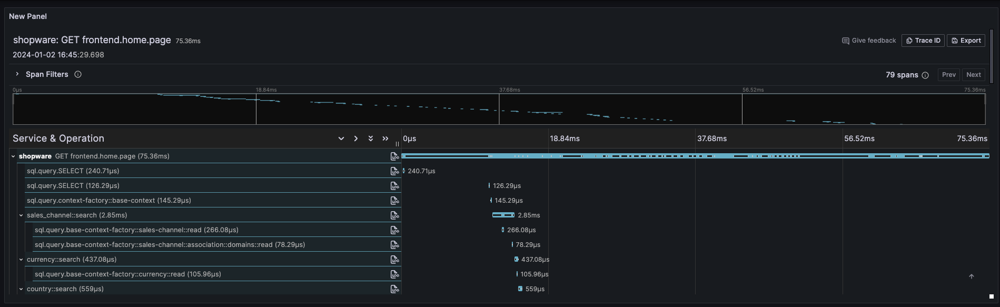
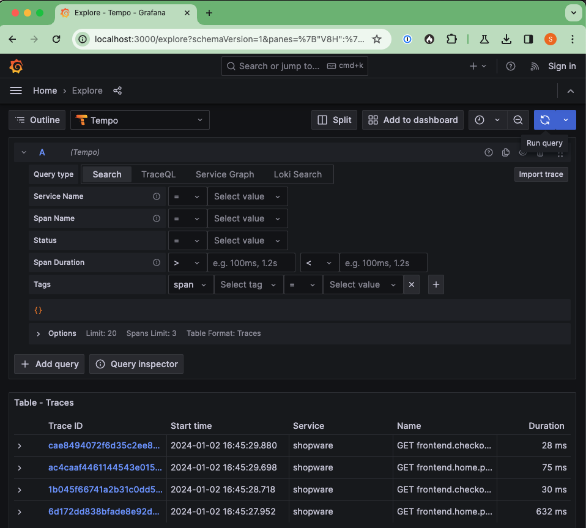

---
nav:
  title: OpenTelemetry
  position: 30

---

# OpenTelemetry

OpenTelemetry is a standard to collect distributed traces, metrics and logs from the application. It is similar to tools like NewRelic, Datadog, Blackfire Monitoring and Tideways, but it is completely open source and vendor neutral. That means you can use OpenTelemetry to collect the data and push it to one of the vendors mentioned earlier, or you can use it to collect the data and push it to your own infrastructure with tools like Grafana Stack (Tempo, Loki, Prometheus, Grafana) or other tools.

## Requirements

To use OpenTelemetry with Shopware, you need to have the following requirements met:

- `ext-opentelemetry` [PHP extension](https://github.com/open-telemetry/opentelemetry-php-instrumentation)
- `ext-grpc` (optional, required when the transport method is gRPC)

## Installation

To install the OpenTelemetry Shopware extension, you need to run the following command:

```bash
composer require shopware/opentelemetry
```

This will install the OpenTelemetry Shopware bundle and create new configuration file `config/packages/prod/opentelemetry.yaml` with Symfony Flex plugin.

This configuration file enables the Shopware Profiler integration with OpenTelemetry in a production environment. Additionally, it specifies that the Monolog output will be directed to OpenTelemetry.

## Configuration

After the installation, you will need to set some environment variables to configure both, the OpenTelemetry and its exporter.

### Basic configuration

The following configuration enables the OpenTelemetry auto-instrumentation and sets the service name.

```text
OTEL_PHP_AUTOLOAD_ENABLED=true
OTEL_SERVICE_NAME=shopware
```

Refer to all possible [environment variables](https://opentelemetry.io/docs/instrumentation/php/sdk/#configuration) for better understanding.

### Exporter configuration

The OpenTelemetry extension needs to be configured to export the data to your collector. Here is an example configuration for the OpenTelemetry Collector using gRPC:

```text
OTEL_TRACES_EXPORTER=otlp
OTEL_LOGS_EXPORTER=otlp
OTEL_METRICS_EXPORTER=otlp
OTEL_EXPORTER_OTLP_PROTOCOL=grpc
OTEL_EXPORTER_OTLP_ENDPOINT=http://localhost:4317
```

If you use gRPC with OpenTelemetry Protocol (OTLP) , you will need to install `open-telemetry/transport-grpc open-telemetry/exporter-otlp` as composer packages.

Refer to this doc for more information about the [exporters](https://opentelemetry.io/docs/instrumentation/php/exporters/).

## Available instrumentation

The OpenTelemetry instrumentation collects following traces:

- Controller
- Symfony HTTP Client
- MySQL Queries



## Example Grafana Stack

You can find an example [Stack](https://github.com/shopwareLabs/opentelemetry/tree/main/docker) with:

- Grafana (Dashboard)
- Loki (Log storage)
- Prometheus (Metrics storage)
- Tempo (Trace storage)
- OpenTelemetry Collector (Collector for all data and batches it to the storage)

You will need to have the following environment variables in Shopware:

```text
OTEL_PHP_AUTOLOAD_ENABLED=true
OTEL_SERVICE_NAME=shopware
OTEL_TRACES_EXPORTER=otlp
OTEL_LOGS_EXPORTER=otlp
OTEL_METRICS_EXPORTER=otlp
OTEL_EXPORTER_OTLP_PROTOCOL=grpc
OTEL_EXPORTER_OTLP_ENDPOINT=http://localhost:4317
```

And following two composer packages installed: `open-telemetry/transport-grpc open-telemetry/exporter-otlp`.

The example Grafana is pre-configured to use the data sources, and it is enabled to go from logs to traces and from traces to the logs.



