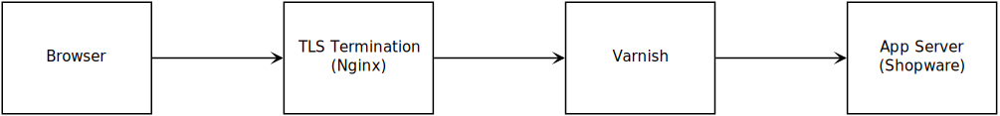

---
nav:
  title: Reverse HTTP Cache
  position: 30

---

# Reverse HTTP Cache

## Overview

A reverse HTTP cache is a cache server placed before the web shop. If you are not familiar with HTTP caching, please refer to the [HTTP cache](../../../concepts/framework/http_cache) concept. The reverse http cache needs the following capabilities to function with Shopware fully:

* Able to differentiate the request with multiple cookies
* Allow clearing the cache using a web request for a specific site or with `/` for all pages

::: info
In this guide, we will use Varnish as an example for HTTP cache.
:::

### The example Setup with Varnish

::: warning
This setup is compatible from Shopware version 6.4.
:::



### Configure Shopware

First, we need to activate the reverse proxy support in Shopware. To enable it, we need to create a new file in `config/packages/storefront.yaml`:

```yaml
storefront:
    csrf:
        enabled: true
        # The internal Shopware HTTP cache replaces the CSRF token on the fly. This can't be done in reverse proxy. So we use AJAX to get a CSRF token
        mode: ajax
    reverse_proxy:
        enabled: true
        ban_method: "BAN"
        # This needs to point to your varnish hosts
        hosts: [ "http://varnish" ]
        # Max parallel invalidations at same time for a single worker
        max_parallel_invalidations: 3
        # Redis Storage for the HTTP cache tags
        redis_url: "redis://redis"
```

Also set `SHOPWARE_HTTP_CACHE_ENABLED=1` in your `.env` file.

#### Trusted proxies

For the most part, using Symfony and Varnish doesn't cause any problem. But, when a request passes through a proxy, certain request information is sent using either the standard Forwarded header or *X-Forwarded* headers. For example, instead of reading the *REMOTE_ADDR* header (which will now be the IP address of your reverse proxy), the user's true IP will be stored in a standard Forwarded: for="..." header or an *X-Forwarded-For* header.

If you don't configure Symfony to look for these headers, you will get incorrect information about the client's IP address. Whether or not the client connects via https, the client's port and the hostname are requested.

Go through [Proxies](https://symfony.com/doc/current/deployment/proxies.html) section for more information.

### Configure Varnish

As Shopware is now prepared to work with a reverse proxy, we need to configure Varnish to use a Shopware specific configuration (VCL). Below you can find an example Shopware 6 Varnish configuration.

On hard purge, the cache will be immediately purged and the next requesting user will get a slow response, as the cache has been deleted. On soft purge, the user still gets the cached response after the purge, but in the configured time interval, the cache will be refreshed. This makes sure that the client gets the fastest response possible.

#### Hard purge

```text
vcl 4.0;

import std;

# You should specify here all your app nodes and use round robin to select a backend
backend default {
    .host = "<app-host>";
    .port = "80";
}

# ACL for purgers IP. (This needs to contain app server ips)
acl purgers {
    "127.0.0.1";
    "localhost";
    "::1";
}

sub vcl_recv {
    # Mitigate httpoxy application vulnerability, see: https://httpoxy.org/
    unset req.http.Proxy;

    # Strip query strings only needed by browser javascript. Customize to used tags.
    if (req.url ~ "(\?|&)(pk_campaign|piwik_campaign|pk_kwd|piwik_kwd|pk_keyword|pixelId|kwid|kw|adid|chl|dv|nk|pa|camid|adgid|cx|ie|cof|siteurl|utm_[a-z]+|_ga|gclid)=") {
        # see rfc3986#section-2.3 "Unreserved Characters" for regex
        set req.url = regsuball(req.url, "(pk_campaign|piwik_campaign|pk_kwd|piwik_kwd|pk_keyword|pixelId|kwid|kw|adid|chl|dv|nk|pa|camid|adgid|cx|ie|cof|siteurl|utm_[a-z]+|_ga|gclid)=[A-Za-z0-9\-\_\.\~]+&?", "");
    }
    set req.url = regsub(req.url, "(\?|\?&|&)$", "");

    # Normalize query arguments
    set req.url = std.querysort(req.url);

    # Make sure that the client ip is forward to the client.
    if (req.http.x-forwarded-for) {
        set req.http.X-Forwarded-For = req.http.X-Forwarded-For + ", " + client.ip;
    } else {
        set req.http.X-Forwarded-For = client.ip;
    }

    # Handle BAN
    if (req.method == "BAN") {
        if (!client.ip ~ purgers) {
            return (synth(405, "Method not allowed"));
        }

        ban("req.url ~ "+req.url);
        return (synth(200, "BAN URLs containing (" + req.url + ") done."));
    }

    # Normalize Accept-Encoding header
    # straight from the manual: https://www.varnish-cache.org/docs/3.0/tutorial/vary.html
    if (req.http.Accept-Encoding) {
        if (req.url ~ "\.(jpg|png|gif|gz|tgz|bz2|tbz|mp3|ogg)$") {
            # No point in compressing these
            unset req.http.Accept-Encoding;
        } elsif (req.http.Accept-Encoding ~ "gzip") {
            set req.http.Accept-Encoding = "gzip";
        } elsif (req.http.Accept-Encoding ~ "deflate") {
            set req.http.Accept-Encoding = "deflate";
        } else {
            # unkown algorithm
            unset req.http.Accept-Encoding;
        }
    }

    if (req.method != "GET" &&
        req.method != "HEAD" &&
        req.method != "PUT" &&
        req.method != "POST" &&
        req.method != "TRACE" &&
        req.method != "OPTIONS" &&
        req.method != "PATCH" &&
        req.method != "DELETE") {
        /* Non-RFC2616 or CONNECT which is weird. */
        return (pipe);
    }

    # We only deal with GET and HEAD by default
    if (req.method != "GET" && req.method != "HEAD") {
        return (pass);
    }

    # Don't cache Authenticate & Authorization
    if (req.http.Authenticate || req.http.Authorization) {
        return (pass);
    }

    # Always pass these paths directly to php without caching
    # Note: virtual URLs might bypass this rule (e.g. /en/checkout)
    if (req.url ~ "^/(checkout|account|admin|api)(/.*)?$") {
        return (pass);
    }

    return (hash);
}

sub vcl_hash {
    # Consider Shopware HTTP cache cookies
    if (req.http.cookie ~ "sw-cache-hash=") {
        hash_data("+context=" + regsub(req.http.cookie, "^.*?sw-cache-hash=([^;]*);*.*$", "\1"));
    } elseif (req.http.cookie ~ "sw-currency=") {
        hash_data("+currency=" + regsub(req.http.cookie, "^.*?sw-currency=([^;]*);*.*$", "\1"));
    }
}

sub vcl_hit {
  # Consider client states for response headers
  if (req.http.cookie ~ "sw-states=") {
     set req.http.states = regsub(req.http.cookie, "^.*?sw-states=([^;]*);*.*$", "\1");

     if (req.http.states ~ "logged-in" && obj.http.sw-invalidation-states ~ "logged-in" ) {
        return (pass);
     }

     if (req.http.states ~ "cart-filled" && obj.http.sw-invalidation-states ~ "cart-filled" ) {
        return (pass);
     }
  }
}

sub vcl_backend_response {
    # Fix Vary Header in some cases
    # https://www.varnish-cache.org/trac/wiki/VCLExampleFixupVary
    if (beresp.http.Vary ~ "User-Agent") {
        set beresp.http.Vary = regsub(beresp.http.Vary, ",? *User-Agent *", "");
        set beresp.http.Vary = regsub(beresp.http.Vary, "^, *", "");
        if (beresp.http.Vary == "") {
            unset beresp.http.Vary;
        }
    }

    # Respect the Cache-Control=private header from the backend
    if (
        beresp.http.Pragma        ~ "no-cache" ||
        beresp.http.Cache-Control ~ "no-cache" ||
        beresp.http.Cache-Control ~ "private"
    ) {
        set beresp.ttl = 0s;
        set beresp.http.X-Cacheable = "NO:Cache-Control=private";
        set beresp.uncacheable = true;
        return (deliver);
    }

    # strip the cookie before the image is inserted into cache.
    if (bereq.url ~ "\.(png|gif|jpg|swf|css|js|webp)$") {
        unset beresp.http.set-cookie;
    }

    # Allow items to be stale if needed.
    set beresp.grace = 6h;

    # Save the bereq.url so bans work efficiently
    set beresp.http.x-url = bereq.url;
    set beresp.http.X-Cacheable = "YES";

    # Remove the exact PHP Version from the response for more security
    unset beresp.http.x-powered-by;

    return (deliver);
}

sub vcl_deliver {
    ## we don't want the client to cache
    set resp.http.Cache-Control = "max-age=0, private";

    # remove link header if session is already started to save client resources
    if (req.http.cookie ~ "session-") {
        unset resp.http.Link;
    }

    # Set a cache header to allow us to inspect the response headers during testing
    if (obj.hits > 0) {
        unset resp.http.set-cookie;
        set resp.http.X-Cache = "HIT";
    }  else {
        set resp.http.X-Cache = "MISS";
    }
    
    # Remove the exact PHP Version from the response for more security (e.g. 404 pages)
    unset resp.http.x-powered-by;

    # invalidation headers are only for internal use
    unset resp.http.sw-invalidation-states;

    set resp.http.X-Cache-Hits = obj.hits;
}
```

To verify if it works, you can look for a new response header `X-Cache` in the HTTP response. It shows you if it was a cache hit or miss.

#### Soft purge

```text
vcl 4.0;

import std;
import purge;

# You should specify here all your app nodes and use round robin to select a backend
backend default {
    .host = "<app-host>";
    .port = "80";
}

# ACL for purgers IP. (This needs to contain app server ips)
acl purgers {
    "127.0.0.1";
    "localhost";
    "::1";
}

sub vcl_recv {
    set req.http.host = "sw6.dev.localhost";

    # Mitigate httpoxy application vulnerability, see: https://httpoxy.org/
    unset req.http.Proxy;

    # Strip query strings only needed by browser javascript. Customize to used tags.
    if (req.url ~ "(\?|&)(pk_campaign|piwik_campaign|pk_kwd|piwik_kwd|pk_keyword|pixelId|kwid|kw|adid|chl|dv|nk|pa|camid|adgid|cx|ie|cof|siteurl|utm_[a-z]+|_ga|gclid)=") {
        # see rfc3986#section-2.3 "Unreserved Characters" for regex
        set req.url = regsuball(req.url, "(pk_campaign|piwik_campaign|pk_kwd|piwik_kwd|pk_keyword|pixelId|kwid|kw|adid|chl|dv|nk|pa|camid|adgid|cx|ie|cof|siteurl|utm_[a-z]+|_ga|gclid)=[A-Za-z0-9\-\_\.\~]+&?", "");
    }
    set req.url = regsub(req.url, "(\?|\?&|&)$", "");

    # Normalize query arguments
    set req.url = std.querysort(req.url);

    # Make sure that the client ip is forward to the client.
    if (req.http.x-forwarded-for) {
        set req.http.X-Forwarded-For = req.http.X-Forwarded-For + ", " + client.ip;
    } else {
        set req.http.X-Forwarded-For = client.ip;
    }

    # Handle BAN
    if (req.method == "BAN") {
        if (!client.ip ~ purgers) {
            return (synth(405, "Method not allowed"));
        }

        return (hash);
    }

    # Normalize Accept-Encoding header
    # straight from the manual: https://www.varnish-cache.org/docs/3.0/tutorial/vary.html
    if (req.http.Accept-Encoding) {
        if (req.url ~ "\.(jpg|png|gif|gz|tgz|bz2|tbz|mp3|ogg)$") {
            # No point in compressing these
            unset req.http.Accept-Encoding;
        } elsif (req.http.Accept-Encoding ~ "gzip") {
            set req.http.Accept-Encoding = "gzip";
        } elsif (req.http.Accept-Encoding ~ "deflate") {
            set req.http.Accept-Encoding = "deflate";
        } else {
            # unkown algorithm
            unset req.http.Accept-Encoding;
        }
    }

    if (req.method != "GET" &&
        req.method != "HEAD" &&
        req.method != "PUT" &&
        req.method != "POST" &&
        req.method != "TRACE" &&
        req.method != "OPTIONS" &&
        req.method != "PATCH" &&
        req.method != "DELETE") {
        /* Non-RFC2616 or CONNECT which is weird. */
        return (pipe);
    }

    # We only deal with GET and HEAD by default
    if (req.method != "GET" && req.method != "HEAD") {
        return (pass);
    }

    # Don't cache Authenticate & Authorization
    if (req.http.Authenticate || req.http.Authorization) {
        return (pass);
    }

    # Always pass these paths directly to php without caching
    # Note: virtual URLs might bypass this rule (e.g. /en/checkout)
    if (req.url ~ "^/(checkout|account|admin|api)(/.*)?$") {
        return (pass);
    }

    return (hash);
}

sub vcl_hash {
    # Consider Shopware HTTP cache cookies
    if (req.http.cookie ~ "sw-cache-hash=") {
        hash_data("+context=" + regsub(req.http.cookie, "^.*?sw-cache-hash=([^;]*);*.*$", "\1"));
    } elseif (req.http.cookie ~ "sw-currency=") {
        hash_data("+currency=" + regsub(req.http.cookie, "^.*?sw-currency=([^;]*);*.*$", "\1"));
    }
}

sub vcl_hit {
    if (req.method == "BAN") {
        call soft_purge_page;
    }

    # Consider client states for response headers
    if (req.http.cookie ~ "sw-states=") {
        set req.http.states = regsub(req.http.cookie, "^.*?sw-states=([^;]*);*.*$", "\1");

        if (req.http.states ~ "logged-in" && obj.http.sw-invalidation-states ~ "logged-in" ) {
            return (pass);
        }

        if (req.http.states ~ "cart-filled" && obj.http.sw-invalidation-states ~ "cart-filled" ) {
            return (pass);
        }
    }
}

sub vcl_miss {
    if (req.method == "BAN") {
        call soft_purge_page;
    }
}

sub vcl_backend_response {
    # Fix Vary Header in some cases
    # https://www.varnish-cache.org/trac/wiki/VCLExampleFixupVary
    if (beresp.http.Vary ~ "User-Agent") {
        set beresp.http.Vary = regsub(beresp.http.Vary, ",? *User-Agent *", "");
        set beresp.http.Vary = regsub(beresp.http.Vary, "^, *", "");
        if (beresp.http.Vary == "") {
            unset beresp.http.Vary;
        }
    }

    # Respect the Cache-Control=private header from the backend
    if (
        beresp.http.Pragma        ~ "no-cache" ||
        beresp.http.Cache-Control ~ "no-cache" ||
        beresp.http.Cache-Control ~ "private"
    ) {
        set beresp.ttl = 0s;
        set beresp.http.X-Cacheable = "NO:Cache-Control=private";
        set beresp.uncacheable = true;
        return (deliver);
    }

    # strip the cookie before the image is inserted into cache.
    if (bereq.url ~ "\.(png|gif|jpg|swf|css|js|webp)$") {
        unset beresp.http.set-cookie;
    }

    # Allow items to be stale if needed.
    set beresp.grace = 6h;

    # Save the bereq.url so bans work efficiently
    set beresp.http.x-url = bereq.url;
    set beresp.http.X-Cacheable = "YES";

    # Remove the exact PHP Version from the response for more security
    unset beresp.http.x-powered-by;

    return (deliver);
}

sub vcl_deliver {
    ## we don't want the client to cache
    set resp.http.Cache-Control = "max-age=0, private";

    # remove link header, if session is already started to save client resources
    if (req.http.cookie ~ "session-") {
        unset resp.http.Link;
    }

    # Set a cache header to allow us to inspect the response headers during testing
    if (obj.hits > 0) {
        unset resp.http.set-cookie;
        set resp.http.X-Cache = "HIT";
    }  else {
        set resp.http.X-Cache = "MISS";
    }
    
    # Remove the exact PHP Version from the response for more security (e.g. 404 pages)
    unset resp.http.x-powered-by;

    # invalidation headers are only for internal use
    unset resp.http.sw-invalidation-states;

    set resp.http.X-Cache-Hits = obj.hits;
}

sub soft_purge_page {
    # See https://docs.varnish-software.com/varnish-cache-plus/vmods/purge/ for all possible options
    set req.http.purged = purge.soft(ttl = 0s, grace = 300s, keep = 3600s);
    return (synth(200));
}
```

### Using Varnish XKey module without Redis

Varnish XKey is a cache key module that allows you to use Varnish with surrogate keys. It is a module that is not included in the default Varnish installation. It is available for Varnish 4.1 and 6.0.

The module is available for download on [GitHub](https://github.com/varnish/varnish-modules/blob/master/src/vmod_xkey.vcc)

::: warning
This feature has been introduced with Shopware version 6.4.17.0
:::

And also needs to be enabled in the `config/packages/shopware.yml` file:

```yaml
storefront:
  reverse_proxy:
    enabled: true
    use_varnish_xkey: true
    hosts:
      - 'varnish-host'
```

Varnish Config:

```txt
vcl 4.0;

import std;
import xkey;

# Specify your app nodes here. Use round-robin balancing to add more than one.
backend default {
    .host = "<app-host>";
    .port = "80";
}

# ACL for purgers IP. (This needs to contain app server ips)
acl purgers {
    "127.0.0.1";
    "localhost";
    "::1";
}

sub vcl_recv {
    # Mitigate httpoxy application vulnerability, see: https://httpoxy.org/
    unset req.http.Proxy;

    #  Ignore query strings that are only necessary for the js on the client. Customize as needed.
    if (req.url ~ "(\?|&)(pk_campaign|piwik_campaign|pk_kwd|piwik_kwd|pk_keyword|pixelId|kwid|kw|adid|chl|dv|nk|pa|camid|adgid|cx|ie|cof|siteurl|utm_[a-z]+|_ga|gclid)=") {
        # see rfc3986#section-2.3 "Unreserved Characters" for regex
        set req.url = regsuball(req.url, "(pk_campaign|piwik_campaign|pk_kwd|piwik_kwd|pk_keyword|pixelId|kwid|kw|adid|chl|dv|nk|pa|camid|adgid|cx|ie|cof|siteurl|utm_[a-z]+|_ga|gclid)=[A-Za-z0-9\-\_\.\~]+&?", "");
    }
    set req.url = regsub(req.url, "(\?|\?&|&)$", "");

    # Normalize query arguments
    set req.url = std.querysort(req.url);

    # Make sure that the client ip is forward to the client.
    if (req.http.x-forwarded-for) {
        set req.http.X-Forwarded-For = req.http.X-Forwarded-For + ", " + client.ip;
    } else {
        set req.http.X-Forwarded-For = client.ip;
    }

    # Handle PURGE
    if (req.method == "PURGE") {
        if (client.ip !~ purgers) {
            return (synth(403, "Forbidden"));
        }
        if (req.http.xkey) {
            set req.http.n-gone = xkey.purge(req.http.xkey);

            # To enable soft-purge replace this line with the line above
            #set req.http.n-gone = xkey.softpurge(req.http.xkey);

            return (synth(200, "Invalidated "+req.http.n-gone+" objects"));
        } else {
            return (purge);
        }
    }

    if (req.method == "BAN") {
        if (!client.ip ~ purgers) {
            return (synth(405, "Method not allowed"));
        }

        ban("req.url ~ "+req.url);
        return (synth(200, "BAN URLs containing (" + req.url + ") done."));
    }

    # Normalize Accept-Encoding header
    # straight from the manual: https://www.varnish-cache.org/docs/3.0/tutorial/vary.html
    if (req.http.Accept-Encoding) {
        if (req.url ~ "\.(jpg|png|gif|gz|tgz|bz2|tbz|mp3|ogg)$") {
            # No point in compressing these
            unset req.http.Accept-Encoding;
        } elsif (req.http.Accept-Encoding ~ "gzip") {
            set req.http.Accept-Encoding = "gzip";
        } elsif (req.http.Accept-Encoding ~ "deflate") {
            set req.http.Accept-Encoding = "deflate";
        } else {
            # unkown algorithm
            unset req.http.Accept-Encoding;
        }
    }

    if (req.method != "GET" &&
        req.method != "HEAD" &&
        req.method != "PUT" &&
        req.method != "POST" &&
        req.method != "TRACE" &&
        req.method != "OPTIONS" &&
        req.method != "PATCH" &&
        req.method != "DELETE") {
        /* Non-RFC2616 or CONNECT which is weird. */
        return (pipe);
    }

    # We only deal with GET and HEAD by default
    if (req.method != "GET" && req.method != "HEAD") {
        return (pass);
    }

    # Don't cache Authenticate & Authorization
    if (req.http.Authenticate || req.http.Authorization) {
        return (pass);
    }

    # Always pass these paths directly to php without caching
    # Note: virtual URLs might bypass this rule (e.g. /en/checkout)
    if (req.url ~ "^/(checkout|account|admin|api)(/.*)?$") {
        return (pass);
    }

    return (hash);
}

sub vcl_hash {
    # Consider Shopware HTTP cache cookies
    if (req.http.cookie ~ "sw-cache-hash=") {
        hash_data("+context=" + regsub(req.http.cookie, "^.*?sw-cache-hash=([^;]*);*.*$", "\1"));
    } elseif (req.http.cookie ~ "sw-currency=") {
        hash_data("+currency=" + regsub(req.http.cookie, "^.*?sw-currency=([^;]*);*.*$", "\1"));
    }
}

sub vcl_hit {
  # Consider client states for response headers
  if (req.http.cookie ~ "sw-states=") {
     set req.http.states = regsub(req.http.cookie, "^.*?sw-states=([^;]*);*.*$", "\1");

     if (req.http.states ~ "logged-in" && obj.http.sw-invalidation-states ~ "logged-in" ) {
        return (pass);
     }

     if (req.http.states ~ "cart-filled" && obj.http.sw-invalidation-states ~ "cart-filled" ) {
        return (pass);
     }
  }
}

sub vcl_backend_response {
    # Fix Vary Header in some cases
    # https://www.varnish-cache.org/trac/wiki/VCLExampleFixupVary
    if (beresp.http.Vary ~ "User-Agent") {
        set beresp.http.Vary = regsub(beresp.http.Vary, ",? *User-Agent *", "");
        set beresp.http.Vary = regsub(beresp.http.Vary, "^, *", "");
        if (beresp.http.Vary == "") {
            unset beresp.http.Vary;
        }
    }

    # Respect the Cache-Control=private header from the backend
    if (
        beresp.http.Pragma        ~ "no-cache" ||
        beresp.http.Cache-Control ~ "no-cache" ||
        beresp.http.Cache-Control ~ "private"
    ) {
        set beresp.ttl = 0s;
        set beresp.http.X-Cacheable = "NO:Cache-Control=private";
        set beresp.uncacheable = true;
        return (deliver);
    }

    # strip the cookie before the image is inserted into cache.
    if (bereq.url ~ "\.(png|gif|jpg|swf|css|js|webp)$") {
        unset beresp.http.set-cookie;
    }

    # Allow items to be stale if needed.
    set beresp.grace = 6h;

    # Save the bereq.url so bans work efficiently
    set beresp.http.x-url = bereq.url;
    set beresp.http.X-Cacheable = "YES";

    # Remove the exact PHP Version from the response for more security
    unset beresp.http.x-powered-by;

    return (deliver);
}

sub vcl_deliver {
    ## we don't want the client to cache
    set resp.http.Cache-Control = "max-age=0, private";

    # remove link header, if session is already started to save client resources
    if (req.http.cookie ~ "session-") {
        unset resp.http.Link;
    }

    # Set a cache header to allow us to inspect the response headers during testing
    if (obj.hits > 0) {
        unset resp.http.set-cookie;
        set resp.http.X-Cache = "HIT";
    }  else {
        set resp.http.X-Cache = "MISS";
    }

    # Remove the exact PHP Version from the response for more security (e.g. 404 pages)
    unset resp.http.x-powered-by;

    # invalidation headers are only for internal use
    unset resp.http.sw-invalidation-states;
    unset resp.http.xkey;

    set resp.http.X-Cache-Hits = obj.hits;
}
```

### Disable the verification headers

The `X-Cache` and `X-Cache-Hits` headers are only meant to verify that Varnish is doing its job. You typically don't want to have those headers enabled in a production environment.

To disable these headers, comment out the lines by prefixing them with the `#` character. The lines in question are:

```txt
# Set a cache header to allow us to inspect the response headers during testing
if (obj.hits > 0) {
    unset resp.http.set-cookie;
    set resp.http.X-Cache = "HIT";
}  else {
    set resp.http.X-Cache = "MISS";
}

set resp.http.X-Cache-Hits = obj.hits;
```

Make it so that the lines look like the following:

```txt
# Set a cache header to allow us to inspect the response headers during testing
if (obj.hits > 0) {
    unset resp.http.set-cookie;
    #set resp.http.X-Cache = "HIT";
}  else {
    #set resp.http.X-Cache = "MISS";
}

#set resp.http.X-Cache-Hits = obj.hits;
```

## Configure Fastly

Fastly is supported since Shopware 6.4.11.0 is out-of-the-box with some configurations. To enable it, we need to create a new file in `config/packages/storefront.yaml`

```yaml
storefront:
    csrf:
        enabled: true
        mode: ajax
    reverse_proxy:
        enabled: true
        fastly:
          enabled: true
          api_key: '<personal-token-from-fastly>'
          service_id: '<service-id>'
```

### Fastly soft-purge

::: warning
This feature has been introduced with Shopware version 6.4.15.0
:::

By default, the cache will be immediately purged and the next requesting user will get a slow response as the cache has been deleted. On soft purge, the user still gets the cached response after the purge, but in the configured time interval, the cache will be refreshed. This makes sure that the client gets the fastest response possible.

```yaml
storefront:
  csrf:
    enabled: true
    mode: ajax
  http_cache:
    # Allow to serve the out-dated cache for 300 seconds
    stale_while_revalidate: 300
    # Allow to serve the out-dated cache for an hour if the origin server is offline
    stale_if_error: 3600
  reverse_proxy:
    enabled: true
    fastly:
      enabled: true
      api_key: '<personal-token-from-fastly>'
      service_id: '<service-id>'
      soft_purge: '1'
```

### Fastly VCL Snippets

Additionally, we need to set up some VCL Snippets in the Fastly interface:

<PageRef page="https://github.com/shopware/recipes/blob/main/shopware/fastly-meta/6.4/config/fastly/deliver.vcl" title="vcl_deliver" target="_blank" />

<PageRef page="https://github.com/shopware/recipes/blob/main/shopware/fastly-meta/6.4/config/fastly/fetch.vcl" title="vcl_fetch" target="_blank" />

<PageRef page="https://github.com/shopware/recipes/blob/main/shopware/fastly-meta/6.4/config/fastly/hash.vcl" title="vcl_hash" target="_blank" />

<PageRef page="https://github.com/shopware/recipes/blob/main/shopware/fastly-meta/6.4/config/fastly/hit.vcl" title="vcl_hit" target="_blank" />

<PageRef page="https://github.com/shopware/recipes/blob/main/shopware/fastly-meta/6.4/config/fastly/recv.vcl" title="vcl_recv" target="_blank" />
