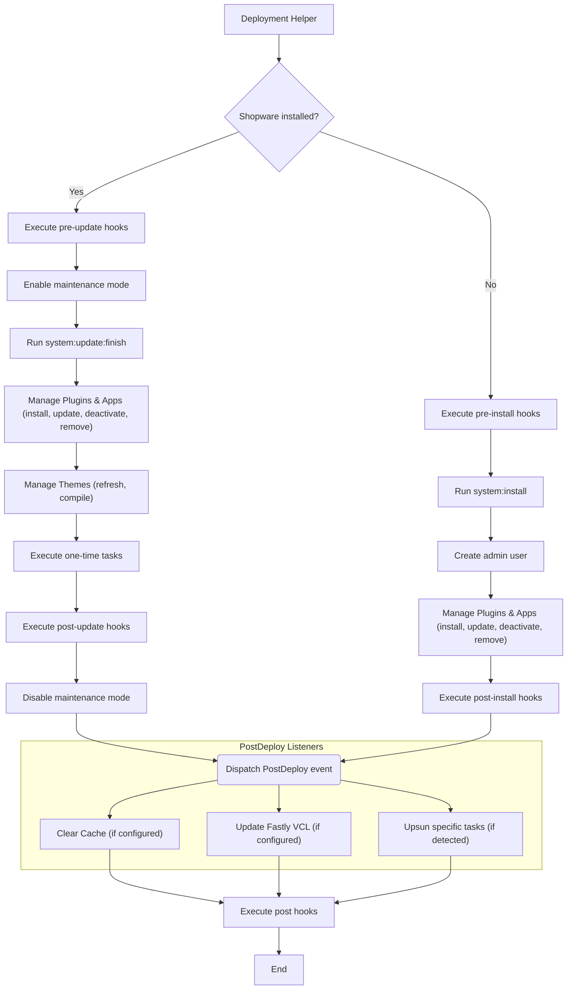

---
nav:
  title: Deployment Helper
  position: 15

---

# Deployment Helper

The Deployment Helper is a tool that unifies the steps executed after the Code has been uploaded to the server.
On a traditional deployment, you would run it after the files have been uploaded.
When using a Containerized environment, you would run Deployment Helper with the new source code and then switch over the traffic.

## Installing the Deployment Helper

The Deployment Helper is a composer package and can be installed via composer:

```bash
composer require shopware/deployment-helper
```

Then the helper can be executed via:

```bash
vendor/bin/shopware-deployment-helper run
```

## What does the Deployment Helper exactly do?

The Deployment Helper checks for you, if Shopware is installed and if not, it will install it for you.
It will also check if the database server is accessible, and if not, it will wait until it is.

Besides installing or updating Shopware, it also simplifies common tasks which normally are executed during the deployment like:

- Installing or updating the extensions (apps and plugins)
- Compiling the theme
- Run custom commands
- Run one time commands

## Execution Flow



## Configuration

The Deployment Helper can be configured via a `.shopware-project.yml` file in the root of your project.
The following configuration options are available:

```yaml
deployment:
  hooks:
    pre: |
      echo "Before deployment general"
    post: |
      echo "After deployment general"
    pre-install: |
      echo "Before running system:install"
    post-install: |
      echo "After running system:install"
    pre-update: |
      echo "Before running system:update"
    post-update: |
      echo "After running system:update"

  # Automatically installs and updates all extensions included in custom/plugins and custom/apps and composer
  extension-management:
    enabled: true

    # These extensions are not managed, you should use one-time-tasks to manage them
    exclude:
      - Name

    # These extensions are always updated even if their version does not change
    # This is useful for project-specific plugins that are not versioned
    force-update:
      - Name

    overrides:
      # the key is the extension name (app or plugin)
      MyPlugin:
        # Same as exclude
        state: ignore

      AnotherPlugin:
        # This plugin can be installed, but should be inactive
        state: inactive

      RemoveThisPlugin:
        # This plugin will be uninstalled if it is installed
        state: remove
        # should the extension data of an uninstalled extension be kept
        keepUserData: true

  one-time-tasks:
    - id: foo
      script: |
        # runs one time in deployment, then never again
        ./bin/console --version

  store:
    license-domain: 'example.com'
```

## Environment Variables

Additionally, you can configure the Shopware installation using the following environment variables:

- `INSTALL_LOCALE` - The locale to install Shopware with (default: `en-GB`)
- `INSTALL_CURRENCY` - The currency to install Shopware with (default: `EUR`)
- `INSTALL_ADMIN_USERNAME` - The username of the admin user (default: `admin`)
- `INSTALL_ADMIN_PASSWORD` - The password of the admin user (default: `shopware`)
- `SALES_CHANNEL_URL` - The URL of the Storefront sales channel (default: `http://localhost`)
- `SHOPWARE_DEPLOYMENT_TIMEOUT` - The timeout allowed for setup commands, that are executed (default: `300`)
- `SHOPWARE_STORE_ACCOUNT_EMAIL` - The email address of the Shopware account
- `SHOPWARE_STORE_ACCOUNT_PASSWORD` - The password of the Shopware account
- `SHOPWARE_STORE_LICENSE_DOMAIN` - The license domain of the Shopware Shop (default: license-domain value in YAML file)
- `SHOPWARE_USAGE_DATA_CONSENT` - Controls Shopware Usage Data sharing (`accepted` or `revoked`), overwrites Administration choice

## One Time Tasks

One time tasks are tasks that should be executed only once during the deployment, like a migration script.

You can check with `./vendor/bin/shopware-deployment-helper one-time-task:list` which tasks were executed and when.
To remove a task, use `./vendor/bin/shopware-deployment-helper one-time-task:unmark <id>`. This will cause the task to be executed again during the next update.
To manually mark a task as run you can use `./vendor/bin/shopware-deployment-helper one-time-task:mark <id>`.

## Fastly Integration

The Deployment Helper can also deploy Fastly VCL Snippets for you and keep them up to date. After installing the Deployment Helper, you can install the Fastly meta package:

```bash
composer require shopware/fastly-meta
```

After that, make sure that environment variable `FASTLY_API_KEY` and `FASTLY_SERVICE_ID` are set and the Fastly VCL Snippets will be deployed with the regular deployment process of the Deployment Helper.

The deployment helper has also two commands to manage the Fastly VCL Snippets:

- `./vendor/bin/shopware-deployment-helper fastly:snippet:list` - List all VCL snippets that are currently deployed
- `./vendor/bin/shopware-deployment-helper fastly:snippet:remove <name>` - Remove a VCL snippet by name

## Automatic Store Login

The Deployment Helper can automatically log in to the Shopware Store, so you can install Apps from the Store. For this the environment variables: `SHOPWARE_STORE_ACCOUNT_EMAIL` and `SHOPWARE_STORE_ACCOUNT_PASSWORD` need to be set, and a license domain needs to be configured in the `.shopware-project.yml` file.
The license domain can be set also by env variable `SHOPWARE_STORE_LICENSE_DOMAIN`, which will overwrite the value from the `.shopware-project.yml` file.

When you open the extension manager, you will see that you are not logged in. This is normal as the Deployment Helper does log you in only for system tasks like extension installation or updates. For the extension manager, every Administration user needs to log in manually.

## Removal of extensions

To find the name (for example `SwagPlatformDemoData`) of the extension you want to remove, use the `./bin/console plugin:list` command.

```shell
./bin/console plugin:list

Shopware Plugin Service
=======================

 ----------------------------- ------------------------------------------ ---------------------------------------------- --------- ----------------- ------------------- ----------- -------- ------------- ---------------------- 
  Plugin                        Label                                      Composer name                                  Version   Upgrade version   Author              Installed   Active   Upgradeable   Required by composer  
 ----------------------------- ------------------------------------------ ---------------------------------------------- --------- ----------------- ------------------- ----------- -------- ------------- ----------------------
  SwagPlatformDemoData          Shopware 6 Demo data                       swag/demo-data                                 2.0.1                       shopware AG         Yes         No       No            No 
 ----------------------------- ------------------------------------------ ---------------------------------------------- --------- ----------------- ------------------- ----------- -------- ------------- ----------------------
```

If you want to remove an extension, you need to do it in two steps:

1.) Set the extension to `remove` in the `.shopware-project.yml` file

```yaml
deployment:
  extension-management:
    enabled: true

    overrides:
      TheExtensionWeWantToGetRidOf:
        # This plugin will be uninstalled if it is installed
        state: remove
        # should the extension data of an uninstalled extension be kept
        keepUserData: true

```

and deploy the changes. The extension will be uninstalled and is inactive.

2.) Remove the extension from source code

After the deployment, you can remove the extension from the source code, remove the entry from the `.shopware-project.yml` file and deploy the changes again.

## Usage examples

### Container

In a Docker environment, you have a base image with a running PHP Webserver.
From that image you make a new image with your Shopware source code.
To prepare the Shopware source code, you can run [shopware-cli project ci](../../../../products/cli/) to install the dependencies and build the assets.
On deployment, you spawn a second container or init a container, which runs the Deployment Helper.
The Deployment Helper sets up Shopware when it is not installed, installs the extensions and runs the one-time tasks.

### SFTP / Deployer

When using SFTP or Deployer, you clone the repository to the CI/CD server, run the [shopware-cli project ci](../../../../products/cli/) command to install the dependencies and build the assets.
Then you upload the source code to the server and run the Deployment Helper on the server.
The Deployment Helper sets up Shopware when it is not installed, installs the extensions and runs the one-time tasks.
