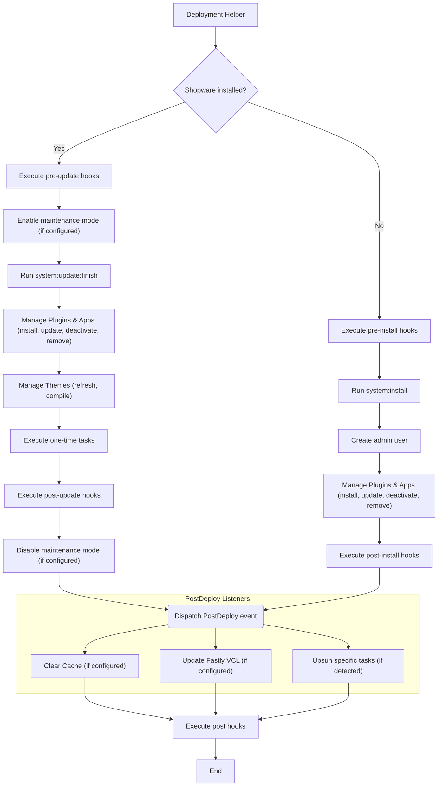

---
nav:
  title: Deployment Helper
  position: 15

---

# Deployment Helper

The [Deployment Helper](https://github.com/shopware/deployment-helper) is a standalone, Shopware-version-independent PHP tool that unifies the steps executed after code has been uploaded to the server. In a traditional deployment, it runs once the files are in place. In a containerized environment, it runs against the new source code before traffic is switched over.

Deployment Helper does not replace your CI build, like the [Shopware CLI](https://github.com/shopware/shopware-cli) `project ci` command does, but complements it by handling deploy-time tasks. Its `run` command supports both fresh installations and updates by automatically detecting the required action, so your deployment script only needs to call `run`.

## What the Deployment Helper does

Before running any steps, it checks that the database server is accessible, and if not, it waits for it, retrying up to 10 times with a one-second pause between attempts before giving up (see [`MySQLFactory`](https://github.com/shopware/deployment-helper/blob/main/src/DependencyInjection/MySQLFactory.php)). It then detects whether Shopware is already installed, verifying that the database schema is present and that at least one user and sales channel exist, and either installs or updates it.

Beyond installing or updating Shopware, it also simplifies common tasks that are normally executed during deployment, such as:

- Installing or updating the extensions (apps and plugins)
- Compiling the theme
- Running custom and one-time commands

For common failures and how to resolve them, see [Deployment Helper Troubleshooting](deployment-helper-troubleshooting.md).

## Execution flow


```mermaid

graph TD
    A[Deployment Helper] --> B{Shopware installed?};
    B -- Yes --> E[Execute pre-update hooks];
    B -- No --> N[Execute pre-install hooks];

    E --> F["Enable maintenance mode (if configured)"];
    F --> G[Run system:update:finish];
    G --> H["Manage Plugins & Apps (install, update, deactivate, remove)"];
    H --> I["Manage Themes (refresh, compile)"];
    I --> J[Execute one-time tasks];
    J --> K[Execute post-update hooks];
    K --> L["Disable maintenance mode (if configured)"];
    L --> M(Dispatch PostDeploy event);

    N --> O[Run system:install];
    O --> P[Create admin user];
    P --> R["Manage Plugins & Apps (install, update, deactivate, remove)"];
    R --> S[Execute post-install hooks];
    S --> M;

    subgraph PostDeploy Listeners
        direction LR
        M --> M1["Clear Cache (if configured)"];
        M --> M2["Update Fastly VCL (if configured)"];
        M --> M3["Upsun specific tasks (if detected)"];
    end

    M1 --> T[Execute post hooks];
    M2 --> T;
    M3 --> T;

    T --> U[End];
```

On an update, the `system:update:finish` step (migrations) runs only when the Shopware version actually changed between deployments; redeploying the same version skips it (see [`UpgradeManager`](https://github.com/shopware/deployment-helper/blob/main/src/Services/UpgradeManager.php)).

## Installing the Deployment Helper

The Deployment Helper is a Composer package and can be installed via Composer:

```bash
composer require shopware/deployment-helper
```

Then Deployment Helper can be executed via:

```bash
vendor/bin/shopware-deployment-helper run
```

## Usage examples

A deployment splits into two phases: a build and a deploy. The CI build must produce the dependencies, installed assets, and compiled theme. The deploy step then runs the Deployment Helper against that pre-built artifact.

A typical pipeline:

```bash
# 1. Build (CI): install dependencies and compile assets
shopware-cli project ci .

# 2. Deploy (server / new container): install or update Shopware.
#    Consume the pre-built artifact; do not build assets during deploy.
vendor/bin/shopware-deployment-helper run --skip-theme-compile --skip-assets-install
```

`run` detects whether Shopware is installed and either installs or updates it, then manages extensions and runs one-time tasks. Only pass `--skip-theme-compile` / `--skip-assets-install` if the build genuinely produced them.

### Container

In a Docker environment, you have a base image with a running PHP Webserver. From that image you create a new image with your Shopware source code.

To prepare the Shopware source code, run the [Shopware CLI `project ci`](../../../../products/tools/cli/project-commands/build.md) command to install the dependencies and build the assets.
On deployment, either spawn a second container or init a container, which runs the Deployment Helper. The Deployment Helper sets up Shopware when it is not installed, installs the extensions, and runs the one-time tasks.

### SFTP / Deployer

When using SFTP or Deployer, clone the repository to the CI/CD server and run the [Shopware CLI `project ci`](../../../../products/tools/cli/project-commands/build.md) command to install the dependencies and build the assets. Then upload the source code to the server and run the Deployment Helper on the server.

The Deployment Helper sets up Shopware when it is not installed, installs the extensions, and runs the one-time tasks.

## Configuration

::::info
If you have multiple PHP versions locally or on your server, make sure to use `%php.bin%` instead of directly `php` in your custom scripts to use the same PHP version as the Deployment Helper.
::::

The Deployment Helper can be configured via a `.shopware-project.yml` file in the root of your project. Configure only the keys you use. Every section is optional. A minimal file that manages extensions from code and sets a Store license domain looks like this:

```yaml
deployment:
  extension-management:
    enabled: true
  store:
    license-domain: 'example.com'
```

The full set of available options:

```yaml
deployment:
  hooks:
    pre: |
      echo "Before deployment general"
    post: |
      echo "After deployment general"
    pre-install: |
      echo "Before running system:install"
    post-install: |
      echo "After running system:install"
    pre-update: |
      echo "Before running system:update"
    post-update: |
      echo "After running system:update"

  # Automatically installs and updates all extensions included in custom/plugins, custom/apps, and Composer.
  # When enabled, extensions installed at runtime (e.g., via the Store in Administration) may cause
  # conflicts during deployment. See "Extension management and Store-installed plugins" section below.
  extension-management:
    enabled: true

    # These extensions are not managed, you should use one-time-tasks to manage them
    exclude:
      - Name

    # These extensions are always updated even if their version does not change
    # This is useful for project-specific plugins that are not versioned
    force-update:
      - Name

    overrides:
      # The key is the extension name (app or plugin)
      MyPlugin:
        # Same as exclude
        state: ignore

      AnotherPlugin:
        # This plugin can be installed but should be inactive
        state: inactive

      RemoveThisPlugin:
        # This plugin will be uninstalled if it is installed
        state: remove
        # Keep data of an uninstalled extension
        keepUserData: true

  one-time-tasks:
    - id: foo
      # "before" runs prior to system:update; "after" runs once the update completes (default).
      when: after # defaults to after
      script: |
        # runs one time in deployment, then never again
        ./bin/console --version

  store:
    license-domain: 'example.com'

  # Automatically runs `system:setup:staging --no-interaction --force` after deployment
  # and extension management has completed, as a `PostDeploy` event listener.
  # Use this on staging environments, so the instance is switched into staging mode
  # on every deployment. See "Staging Mode Integration" below.
  staging:
    enabled: false

  # Enable maintenance mode during updates. When enabled, the storefront is put into
  # maintenance mode before running `system:update:finish` and restored afterwards.
  # Both enable and disable operations are followed by a cache clear.
  maintenance:
    enabled: false

  # Clear the HTTP and object cache after every deployment (via PostDeploy listener).
  # This is independent of the maintenance-mode cache clears.
  cache:
    always_clear: false
```

### Multi-step hooks

Each hook can either be a single script (as shown above) or a list of steps that are executed individually. Splitting a hook into steps gives clearer output during deployment, as each step is run and reported separately.

A step can be an object with a `title` and a `script`, where the `title` is shown in the deployment output:

```yaml
deployment:
  hooks:
    post:
      - title: Warm up the cache
        script: |
          %php.bin% bin/console cache:warmup
      - title: Notify the team
        script: ./notify.sh
```

As shorthand, a step can also be a plain script string (without a title):

```yaml
deployment:
  hooks:
    pre-update:
      - echo "first step"
      - echo "second step"
```

The single-script form remains fully supported, so existing configurations keep working unchanged.

## Local configuration overrides

You can create a `.shopware-project.local.yml` file alongside your `.shopware-project.yml` to override configuration values for local development without modifying the base config. This file should be added to your `.gitignore`.

The local file is deep-merged on top of the base configuration:

- **Scalar values** (strings, numbers) are replaced by the local value.
- **Maps** (associative arrays) are deep-merged recursively.
- **Lists** (indexed arrays): for each list-valued key, the list from `.shopware-project.local.yml` is appended to the end of the list from `.shopware-project.yml`. The relative order of items within each list is preserved, nested lists are treated the same way, and no automatic deduplication is performed.

```yaml
# .shopware-project.local.yml
deployment:
  hooks:
    pre: |
      echo "Local pre hook"

  store:
    license-domain: local.example.com

  one-time-tasks:
    - id: local-task
      script: echo "additional local task"
```

### YAML tags for advanced merging

The local config file supports custom YAML tags to control how values are merged. These tags (such as `!reset` and `!override`) are interpreted by the Deployment Helper itself and are not part of the YAML standard.

> Note: Generic YAML parsers or linters that are not configured to allow custom tags may emit errors or warnings when loading `.shopware-project.local.yml`. Ensure your tooling supports custom tags or excludes this file, and use a Deployment Helper version that documents support for `!reset` and `!override` (see the Deployment Helper changelog for the minimum supported version).

#### `!reset` — clear and replace a field

Use `!reset` on a single field to ignore the value from the base configuration and use only the tagged value. It can be applied to scalars, lists, or maps, and it affects only that one field: the parent object is still merged as usual, but the value for this key is completely replaced. For lists, all inherited items are dropped; for maps, only the keys you define remain for that field.

```yaml
# .shopware-project.local.yml
deployment:
  extension-management:
    # Resets just this exclude field: the base exclude list is discarded and replaced
    exclude: !reset
      - OnlyThisPlugin

  # Resets the one-time-tasks field: all inherited tasks are removed, and only these remain
  one-time-tasks: !reset
    - id: only-task
      script: only-script
```

#### `!override` — fully replace a section

Use `!override` on a mapping/section to disable deep-merging for that whole mapping. The tagged section completely replaces the corresponding section from the base configuration: nested keys are not merged recursively, and any keys that are not listed in the overriding section are removed.

```yaml
# .shopware-project.local.yml
deployment:
  # Overrides the entire hooks section: all hooks from the base config are removed
  hooks: !override
    pre: |
      echo "Only this hook"
```

## Extension management and Store-installed plugins

When `extension-management` is enabled (default), the Deployment Helper automatically manages all extensions it finds in `custom/plugins`, `custom/apps`, and via Composer. This means it will install, update, activate, or deactivate extensions based on what is present in your codebase.

It is possible to install several plugins at once; the Deployment Helper batches them instead of calling `plugin:install` once per plugin. Fresh plugins are grouped by whether they should be activated, and each group is installed in a single command. This speeds up first-time installs and large deployments. The activation behavior of already-installed plugins is unchanged (see [`PluginManagementPlanner`](https://github.com/shopware/deployment-helper/blob/main/src/Services/Plugin/PluginManagementPlanner.php)).

:::warning
Installing plugins later via the Shopware Store (Admin UI) while `extension-management` is enabled can cause conflicts during deployment. The Deployment Helper does not know about extensions installed at runtime through the Store and may interfere with their state. For example, a Store-installed plugin might be deactivated or behave unexpectedly after the next deployment.
:::

You have two options to handle this:

### Option 1: Manage all extensions through code (recommended)

Install all extensions via Composer and let the Deployment Helper manage them. Disable runtime extension management in the Administration to prevent ad-hoc installations:

```yaml
# config/packages/z-shopware.yaml
shopware:
    deployment:
        runtime_extension_management: false
```

See [Extension Management](../extension-management.md) for details on installing extensions via Composer.

### Option 2: Disable the Deployment Helper's extension management

If you prefer to manage extensions manually through the Store or Administration, disable the extension management in your `.shopware-project.yml`:

```yaml
deployment:
  extension-management:
    enabled: false
```

With this setting, the Deployment Helper will skip extension installation and updates entirely. You are then responsible for managing extension states yourself (e.g., via `bin/console plugin:install`, `plugin:update`, etc.).

### Removing an extension

To find the name (for example `SwagPlatformDemoData`) of the extension you want to remove, use the `./bin/console plugin:list` command.

```shell
./bin/console plugin:list

Shopware Plugin Service
=======================

 ----------------------------- ------------------------------------------ ---------------------------------------------- --------- ----------------- ------------------- ----------- -------- ------------- ----------------------
  Plugin                        Label                                      Composer name                                  Version   Upgrade version   Author              Installed   Active   Upgradeable   Required by composer
 ----------------------------- ------------------------------------------ ---------------------------------------------- --------- ----------------- ------------------- ----------- -------- ------------- ----------------------
  SwagPlatformDemoData          Shopware 6 Demo data                       swag/demo-data                                 2.0.1                       shopware AG         Yes         No       No            No
 ----------------------------- ------------------------------------------ ---------------------------------------------- --------- ----------------- ------------------- ----------- -------- ------------- ----------------------
```

Removing an extension requires you to follow two steps:

First, set the extension to `remove` in the `.shopware-project.yml` file:

```yaml
deployment:
  extension-management:
    enabled: true

    overrides:
      TheExtensionWeWantToGetRidOf:
        # This plugin will be uninstalled if it is installed
        state: remove
        # Keep data of an uninstalled extension
        keepUserData: true

```

and deploy the changes. The extension will be uninstalled and is inactive.

Secondly, remove the extension from source code, remove the entry from the `.shopware-project.yml` file, and deploy the changes again.

## One-time tasks

One-time tasks are tasks that should be executed only once during the deployment, like a migration script. Their execution state is stored in a `one_time_tasks` database table. A task is only marked as done after it succeeds, so a failed task is retried on the next deployment.

You can check with `./vendor/bin/shopware-deployment-helper one-time-task:list` which tasks were executed and when.
To remove a task, use `./vendor/bin/shopware-deployment-helper one-time-task:unmark <id>`. This will cause the task to be executed again during the next update.
To manually mark a task as run, use `./vendor/bin/shopware-deployment-helper one-time-task:mark <id>`.

## Staging mode integration

In a staging environment, you usually want Shopware's staging mode to be re-applied every time the database is refreshed from production, so that emails remain disabled, app connections are reset, URLs are rewritten, and so on. The Deployment Helper can do this for you automatically.

Enable it either in `.shopware-project.yml`:

```yaml
deployment:
  staging:
    enabled: true
```

…or via the environment variable `SHOPWARE_DEPLOYMENT_STAGING=1`. The latter is convenient when the same `.shopware-project.yml` is shared between production and staging. Set the env variable only on the staging environment.

When enabled, the Deployment Helper runs `system:setup:staging --no-interaction --force` as a `PostDeploy` event listener after extensions have been managed, for both the installation and update flows. To configure what staging mode actually changes (banners, URL rewriting, email delivery, ElasticSearch checks, etc.), see [Creating a Staging Instance](../creating-a-staging-instance.md#configuring-staging-mode).

:::warning
Do not enable this on your production environment. `system:setup:staging` is a destructive operation that, among other things, deletes apps with active external connections and disables email delivery.
:::

## Fastly integration

The Deployment Helper can also deploy Fastly VCL Snippets and keep them up to date. After installing the Deployment Helper, install the [Fastly meta package](https://github.com/shopware/fastly-meta):

```bash
composer require shopware/fastly-meta
```

After that, make sure that environment variables `FASTLY_API_TOKEN` and `FASTLY_SERVICE_ID` are set and the Fastly VCL Snippets will be deployed with Deployment Helper's regular deployment process. Automatic deployment only runs when a `config/fastly` directory exists in the project and `FASTLY_DISABLE_SNIPPET_UPDATE` is not set to `1`; see [`FastlyServiceUpdater`](https://github.com/shopware/deployment-helper/blob/main/src/Integration/Fastly/FastlyServiceUpdater.php).

The Deployment Helper also has three commands to manage the Fastly VCL Snippets:

- `./vendor/bin/shopware-deployment-helper fastly:snippet:list` - List all VCL snippets that are currently deployed
- `./vendor/bin/shopware-deployment-helper fastly:snippet:deploy` - Deploy all Fastly VCL snippets manually
- `./vendor/bin/shopware-deployment-helper fastly:snippet:remove <name>` - Remove a VCL snippet by name

## Automatic store login

The Deployment Helper can automatically log in to the Shopware Store so that you can install extensions from the Store. For this, set the environment variables `SHOPWARE_STORE_ACCOUNT_EMAIL` and `SHOPWARE_STORE_ACCOUNT_PASSWORD`, and configure a license domain in the `.shopware-project.yml` file. Do **not** commit `.shopware-project.yml` to Git.

The license domain can be set also by env variable `SHOPWARE_STORE_LICENSE_DOMAIN`, which will overwrite the value from the `.shopware-project.yml` file.

When you open the extension manager, you will see that you are not logged in. This is normal as the Deployment Helper does log you in only for system tasks like extension installation or updates. For the extension manager, every Administration user needs to log in manually.

## Available commands

The Deployment Helper ships with the following CLI commands:

| Command | Description |
|---|---|
| `run` | Install or update Shopware (the main deployment command) |
| `is-installed` | Check whether Shopware is installed; exits `0` if installed, `1` if not. Useful as a guard in shell scripts |
| `one-time-task:list` | List all one-time tasks and their execution status |
| `one-time-task:mark <id>` | Mark a one-time task as executed without running it |
| `one-time-task:unmark <id>` | Remove the mark from a one-time task so it runs again on the next deployment |
| `fastly:snippet:list` | List all deployed Fastly VCL snippets |
| `fastly:snippet:deploy` | Deploy all Fastly VCL snippets manually |
| `fastly:snippet:remove <name>` | Remove a Fastly VCL snippet by name |

## Run command options

The `run` command accepts the following options:

| Option | Description |
|---|---|
| `--skip-theme-compile` | Skip theme compilation (use when the theme was already compiled in CI/CD) |
| `--skip-assets-install` | Skip asset installation (use when assets were already copied in CI/CD) |
| `--skip-asset-install` | Deprecated alias for `--skip-assets-install` |
| `--timeout=<seconds>` | Set script execution timeout in seconds. Set to `null` to disable. Takes precedence over `SHOPWARE_DEPLOYMENT_TIMEOUT`, which in turn defaults to `300` (see [`RunCommand`](https://github.com/shopware/deployment-helper/blob/main/src/Command/RunCommand.php)). |
| `--project-config=<path>` | Path to a custom `.shopware-project.yml` file (absolute or relative to project root) |

`run` returns a non-zero exit code if any step fails. In CI/CD, treat a non-zero exit as a failed deployment and stop the rollout.

## Environment variables

Additionally, you can configure the Shopware installation using the following environment variables.

Install-time values:

- `INSTALL_LOCALE` - The locale to install Shopware with (default: `en-GB`)
- `INSTALL_CURRENCY` - The currency to install Shopware with (default: `EUR`)
- `INSTALL_ADMIN_USERNAME` - The username of the admin user (default: `admin`)
- `INSTALL_ADMIN_PASSWORD` - The password of the admin user (default: `shopware`)
- `INSTALL_ADMIN_EMAIL` - The email address of the admin user (default: empty)
- `SALES_CHANNEL_URL` - The URL of the Storefront sales channel (default: `http://localhost`)
- `APP_URL` - Fallback URL for the Storefront sales channel when `SALES_CHANNEL_URL` is not set

Change `INSTALL_ADMIN_PASSWORD` from the default before any real use.

Deployment control:

- `SHOPWARE_DEPLOYMENT_TIMEOUT` - The timeout allowed for setup commands that are executed (default: `300`)
- `SHOPWARE_DEPLOYMENT_FORCE_REINSTALL` - Set to `1` to force reinstallation with `--drop-database`
- `SHOPWARE_DEPLOYMENT_STAGING` - Set to `1` to enable staging mode (equivalent to `deployment.staging.enabled: true` in `.shopware-project.yml`)
- `SHOPWARE_PROJECT_CONFIG_FILE` - Path to a custom `.shopware-project.yml` file (absolute or relative to project root)

Database:

- `DATABASE_URL` - The database connection string. Required; the Deployment Helper aborts if it is not set.
- `DATABASE_SSL_CA` - Path to the TLS CA certificate for the database connection
- `DATABASE_SSL_CERT` - Path to the TLS client certificate
- `DATABASE_SSL_KEY` - Path to the TLS client key
- `DATABASE_SSL_DONT_VERIFY_SERVER_CERT` - Set to any value to skip server-certificate verification (non-production only)

Store authentication:

- `SHOPWARE_STORE_ACCOUNT_EMAIL` - The email address of the Shopware account
- `SHOPWARE_STORE_ACCOUNT_PASSWORD` - The password of the Shopware account
- `SHOPWARE_STORE_SHOP_SECRET` - A pre-configured shop secret for Store authentication (alternative to email/password)
- `SHOPWARE_STORE_LICENSE_DOMAIN` - The license domain of the Shopware Shop (default: license-domain value in YAML file)

Other integrations:

- `SHOPWARE_USAGE_DATA_CONSENT` - Controls Shopware Usage Data sharing (`accepted` or `revoked`), overwrites Administration choice
- `FASTLY_API_TOKEN` - The API token for Fastly VCL snippet deployment
- `FASTLY_SERVICE_ID` - The Fastly Service ID for VCL snippet deployment
- `FASTLY_DISABLE_SNIPPET_UPDATE` - Set to `1` to disable automatic Fastly snippet updates during `run`
- `DO_NOT_TRACK` - Set to any value to opt out of telemetry tracking
