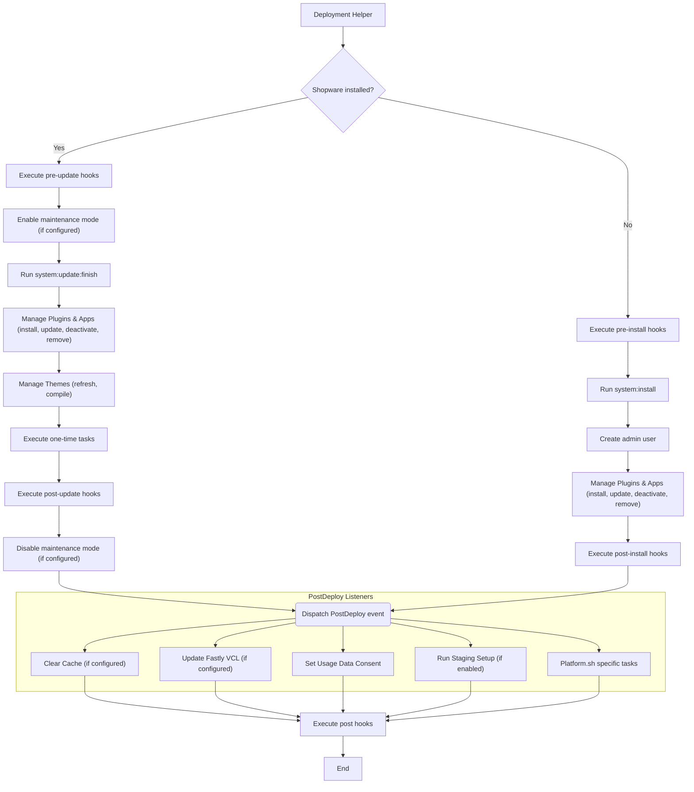

---
nav:
  title: Deployment Helper
  position: 15

---

# Deployment Helper

The [Deployment Helper](https://github.com/shopware/deployment-helper) is a standalone, Shopware-version-independent PHP tool that unifies the steps executed after code has been uploaded to the server. In a traditional deployment, it runs once the files are in place. In a containerized environment, it runs against the new source code before traffic is switched over.

Deployment Helper does not replace your CI build, like the [Shopware CLI](https://github.com/shopware/shopware-cli) `project ci` command does, but complements it by handling deploy-time tasks. Its `run` command supports both fresh installations and updates by automatically detecting the required action, so your deployment script only needs to call `run`.

## What the Deployment Helper does

Before running any steps, it checks that the database server is accessible, and if not, it waits for it, retrying up to 10 times with a one-second pause between attempts before giving up (see [`MySQLFactory`](https://github.com/shopware/deployment-helper/blob/main/src/DependencyInjection/MySQLFactory.php)). It then detects whether Shopware is already installed, verifying that the database schema is present and that at least one user and sales channel exist, and either installs or updates it.

Beyond installing or updating Shopware, it also simplifies common tasks that are normally executed during deployment, such as:

- Installing or updating the extensions (apps and plugins)
- Compiling the theme
- Running custom and one-time commands

For common failures and how to resolve them, see [Deployment Helper Troubleshooting](deployment-helper-troubleshooting.md).

### Why Deployment Helper exists outside the core

Deployment Helper is a **standalone PHP tool** installed via Composer, not part of Shopware core. This design choice exists for several reasons:

- **Safety**: the tool runs on a stable, installed Shopware. Core's install state is undefined and fragile; running complex logic against an unprepared codebase risks crashes.
- **Flexibility**: keeping it separate allows deployment flows to exist outside the core release cycle, so teams can adopt improvements faster.
- **Database connection reuse**: because DH is in PHP and installed via Composer, it reuses the same database connection libraries as Shopware, making reliable DB access natural.
- **Version independence**: the same DH version works across multiple Shopware versions by reading the database directly rather than relying on unstable console command APIs.

Deployment Helper is invoked at deploy time, when code is already in place and the database exists (or is about to be created).

## Execution flow


```mermaid

graph TD
    A[Deployment Helper] --> B{Shopware installed?};
    B -- Yes --> E[Execute pre-update hooks];
    B -- No --> N[Execute pre-install hooks];

    E --> F["Enable maintenance mode (if configured)"];
    F --> G[Run system:update:finish];
    G --> H["Manage Plugins & Apps (install, update, deactivate, remove)"];
    H --> I["Manage Themes (refresh, compile)"];
    I --> J[Execute one-time tasks];
    J --> K[Execute post-update hooks];
    K --> L["Disable maintenance mode (if configured)"];
    L --> M(Dispatch PostDeploy event);

    N --> O[Run system:install];
    O --> P[Create admin user];
    P --> R["Manage Plugins & Apps (install, update, deactivate, remove)"];
    R --> S[Execute post-install hooks];
    S --> M;

    subgraph PostDeploy Listeners
        direction LR
        M --> M1["Clear Cache (if configured)"];
        M --> M2["Update Fastly VCL (if configured)"];
        M --> M3["Set Usage Data Consent"];
        M --> M4["Run Staging Setup (if enabled)"];
        M --> M5["Platform.sh specific tasks"];
    end

    M1 --> T[Execute post hooks];
    M2 --> T;
    M3 --> T;
    M4 --> T;
    M5 --> T;

    T --> U[End];
```

### Fresh install vs update flow

**Fresh install** (Shopware not yet installed):
1. Creates database schema via `system:install`
2. Creates one admin user with credentials from environment variables
3. Creates one Storefront sales channel
4. Sets default theme (Storefront)
5. Disables first-run wizard
6. Installs and activates all plugins and apps (unless overridden)
7. Runs post-install hooks

**Update** (Shopware already installed):
1. Runs `system:update:finish` (migrations) **only if Shopware version changed**
2. If same version redeployed, skips migrations entirely
3. Refreshes plugins and apps from codebase
4. Installs new extensions, updates outdated ones, deactivates/removes as configured
5. Recompiles themes (unless skipped)
6. Runs one-time tasks (if any)
7. Runs post-update hooks

**Detection**: Shopware is considered installed if database has `system_config` table, at least one user, and at least one sales channel.

### Maintenance mode scope and duration

When `deployment.maintenance.enabled: true`, maintenance mode is **toggled only during the update step** (`system:update:finish`):

1. **Enabled before** `system:update:finish` runs
2. **Cache cleared** to ensure banner is visible
3. Migrations/updates run
4. **Disabled after** updates complete
5. **Cache cleared again** to restore storefront visibility

Maintenance mode affects only the **Storefront** (customer-facing shop), not the Administration. Admin users can still access `/admin/` during maintenance.

Scope is per-**sales channel**, not global.

## Installing the Deployment Helper

The Deployment Helper is a Composer package and can be installed via Composer:

```bash
composer require shopware/deployment-helper
```

Then Deployment Helper can be executed via:

```bash
vendor/bin/shopware-deployment-helper run
```

## Usage examples

A deployment splits into two phases: a build and a deploy. The CI build must produce the dependencies, installed assets, and compiled theme. The deploy step then runs the Deployment Helper against that pre-built artifact.

A typical pipeline:

```bash
# 1. Build (CI): install dependencies and compile assets
shopware-cli project ci .

# 2. Deploy (server / new container): install or update Shopware.
#    Consume the pre-built artifact; do not build assets during deploy.
vendor/bin/shopware-deployment-helper run --skip-theme-compile --skip-assets-install
```

`run` detects whether Shopware is installed and either installs or updates it, then manages extensions and runs one-time tasks. Only pass `--skip-theme-compile` / `--skip-assets-install` if the build genuinely produced them.

### Container

In a Docker environment, you have a base image with a running PHP Webserver. From that image you create a new image with your Shopware source code.

To prepare the Shopware source code, run the [Shopware CLI `project ci`](../../../../products/tools/cli/project-commands/build.md) command to install the dependencies and build the assets.
On deployment, either spawn a second container or init a container, which runs the Deployment Helper. The Deployment Helper sets up Shopware when it is not installed, installs the extensions, and runs the one-time tasks.

### SFTP / Deployer

When using SFTP or Deployer, clone the repository to the CI/CD server and run the [Shopware CLI `project ci`](../../../../products/tools/cli/project-commands/build.md) command to install the dependencies and build the assets. Then upload the source code to the server and run the Deployment Helper on the server.

The Deployment Helper sets up Shopware when it is not installed, installs the extensions, and runs the one-time tasks.

## Getting started

- [Environment and Database Setup](deployment-helper-environment.md): Prerequisites, database, environment variables
- [Store Authentication and License](deployment-helper-store.md): If using apps, set up store credentials first
- [Extensions and Apps](deployment-helper-extensions.md): Understanding apps vs plugins and extension lifecycle

## Configuration and operation

- [YAML Configuration](deployment-helper-configuration.md): Hooks, extension management, theme compilation
- [One-Time Tasks](deployment-helper-one-time-tasks.md): Migrations, data fixes, one-off commands
- [Staging Mode](deployment-helper-staging.md): Safe staging environment setup

## Advanced topics

- [Hosting Integration](deployment-helper-hosting.md): Platform.sh, PaaS Native, Kubernetes, Fastly
- [Commands and Reference](deployment-helper-reference.md): Full command reference and best practices
- [Troubleshooting](deployment-helper-troubleshooting.md): Common errors and solutions
