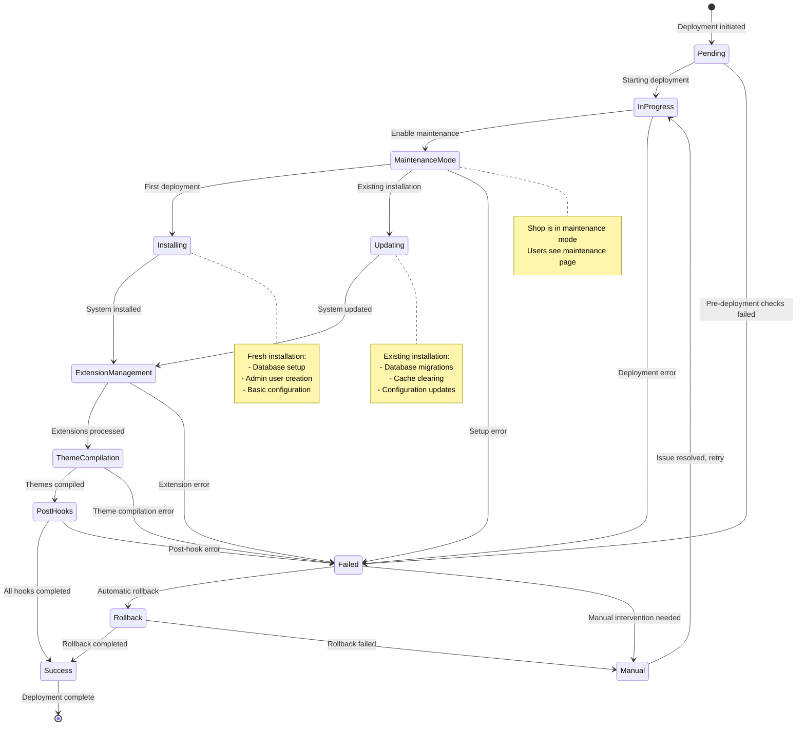

---
nav:
  title: Deployments
  position: 10

---

# Deployments

The following guide explains the fundamental steps to deploy Shopware 6 to a specific infrastructure and how to build assets for Shopware's Administration and Storefront without a database.

## Deployment Status Overview

Understanding the different statuses during a deployment is crucial for monitoring and troubleshooting. The diagram below illustrates the various states a deployment can be in and the possible transitions between them:

### Status Descriptions

- **Pending**: Deployment has been triggered and is waiting to start
- **In Progress**: Deployment process is actively running
- **Maintenance Mode**: Shop is temporarily unavailable for users during deployment
- **Installing**: Fresh Shopware installation is being performed
- **Updating**: Existing Shopware installation is being updated
- **Extension Management**: Plugins and apps are being installed, updated, or removed
- **Theme Compilation**: Storefront and Administration themes are being compiled
- **Post Hooks**: Final deployment tasks and cleanup are being executed
- **Success**: Deployment completed successfully and shop is operational
- **Failed**: Deployment encountered an error and stopped
- **Rollback**: Automatic or manual rollback to previous stable state
- **Manual**: Manual intervention required to resolve deployment issues
