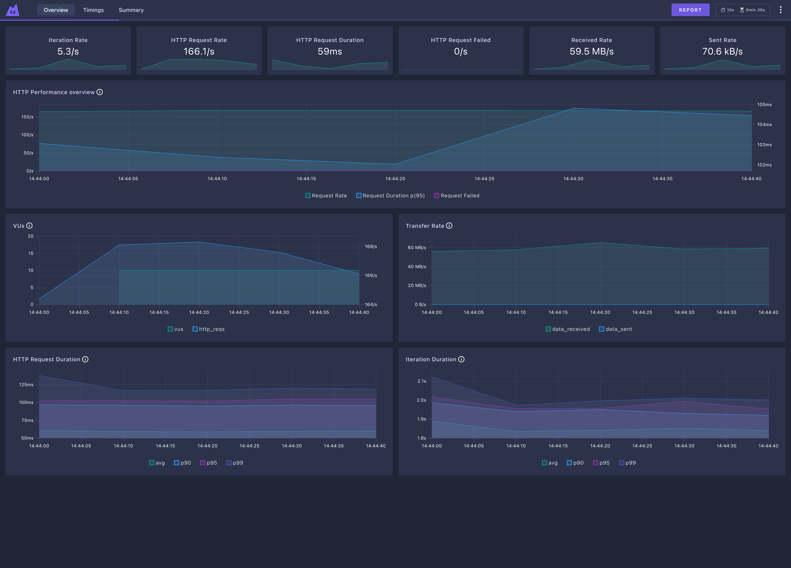
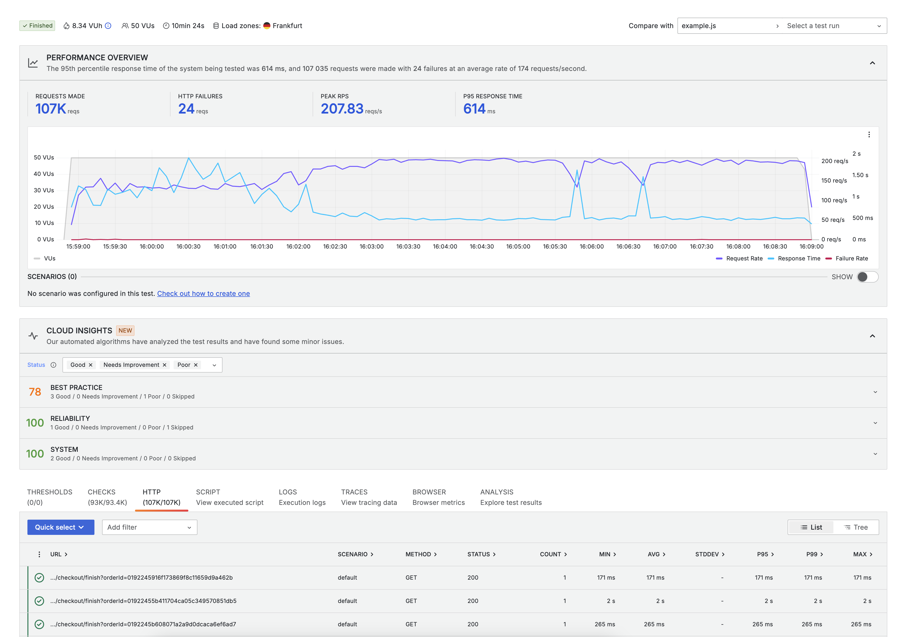

---
nav:
  title: Performance Test with K6
  position: 20

---

# Testing Shopware Performance with K6

K6 is a modern load testing tool that makes it easy to test the performance of your Shopware store. It runs scenario's defined in JavaScript and can be used to simulate hundreds of users accessing your store at the same time, so you can see how your store performs under load.

## Prerequisites

Before you start, make sure you have the following prerequisites:

* A Shopware store
* [K6 installed locally](https://github.com/grafana/k6/releases)
* [Bun](https://bun.sh/)

## Setting up K6 to run against your Shop

1.) First we need to clone the [Shopware K6 repository](https://github.com/shopware/k6-shopware) and install the dependencies:

```bash
git clone https://github.com/shopware/k6-shopware.git
cd k6-shopware
bun install
```

2.) Next copy `.env.example` to `.env` and adjust the values to your Shopware store:

```bash
cp .env.example .env
```

3.) After setting up the credentials we need to fetch the fixtures (salutation IDs, country IDs, sales channel configuration):

```bash
bun run fetch-fixtures.ts
```

The K6 test will use the fixtures to find the correct sales channel domain and basic information to create user and orders.

## Preparations on Shopware end

Before running the tests on your Shopware store, you need to make sure that the following settings are configured:

* No captcha is active in login/register form
* Email sending has been disabled (Admin -> Settings -> System -> Mailer -> Disable email sending)

Also, make sure the Shopware Store has some products and categories, so the test can interact with the store. If you don't have any products, you can use the following command to create some test products:

```bash
APP_ENV=prod php bin/console framework:demodata
APP_ENV=prod php bin/console dal:refresh:index
```

If you need more than the default 1000 products, you can run the command again with:

```bash
APP_ENV=prod php bin/console framework:demodata --reset-defaults --products=5000
APP_ENV=prod php bin/console dal:refresh:index
```

The command `framework:demodata` can also execute multiple times in parallel, so you can create a lot of products in a short time. Just make sure that you run `dal:refresh:index` after all processes are finished.

## Running the tests

::: info
When running against a production environment, make sure you have informed your hosting provider as maybe your IP will be blocked for a short time or limited to a certain amount of requests, which could lead to a false positive. Generally Grafana Cloud is recommended as it allows to distribute the load across multiple locations.
:::

To run the tests, we need an scenario file. The repository comes with a example scenario file that you can use to test your store.

```javascript
// example.js
import {
  accountRegister,
  addProductToCart,
  placeOrder,
  visitCartPage,
  visitConfirmPage,
  visitNavigationPage,
  visitProductDetailPage,
  visitSearchPage,
  visitStorefront,
} from "./helpers/storefront.js";

export default function () {
  visitStorefront();
  visitSearchPage();
  visitNavigationPage();
  accountRegister();
  visitNavigationPage();
  addProductToCart(visitProductDetailPage().id);
  visitCartPage();
  visitConfirmPage();
  placeOrder();
}
```

So the test does:

* Visits home page
* Visits a search page with random term
* Visits a random navigation page
* Registers a new account
* Visits a random navigation page
* Visits a product detail page and adds the product to the cart
* Visits the cart page
* Visits the confirm page
* Places an order

and then the session ends and a new session starts and does it again.

To run the test, you can use the following command:

```bash
k6 run example.js
```

This will run the test with 1 virtual user and 1 iteration, so you can verify that the test is working correctly. To run the test with more virtual users and iterations, you can use the following command:

```bash
k6 run --vus 10 --iterations 100 example.js
```

so now the test will run with 10 virtual users and 100 iterations.

## Running multiple scenarios

You can also run multiple scenarios in the same file. To do this, you can define them in the options like so:

```javascript
// example.js
import { productChangePrice, productChangeStocks, fetchBearerToken, useCredentials, productImport } from "./helpers/api.js";
import {
  accountRegister,
  addProductToCart,
  placeOrder,
  visitNavigationPage,
  visitProductDetailPage,
  visitSearchPage,
  visitStorefront,
} from "./helpers/storefront.js";

export const options = {
  scenarios: {
    browse_only: {
      executor: 'constant-vus',
      vus: 10,
      duration: '5m',
      exec: 'browseOnly',
    },
    fast_buy: {
      executor: 'constant-vus',
      vus: 1,
      duration: '5m',
      exec: 'fastBuy',
    },
    import: {
      executor: 'constant-vus',
      vus: 1,
      duration: '5m',
      exec: 'importer',
    }
  },
};

export function browseOnly() {
  visitStorefront();
  visitSearchPage();
  visitNavigationPage();
  visitProductDetailPage();
}

export function fastBuy() {
  addProductToCart(visitProductDetailPage().id);
  accountRegister();
  placeOrder();
}

export function setup() {
  const token = fetchBearerToken();

  return { token };
}

export function importer(data) {
  useCredentials(data.token);
  productImport();
  productChangePrice();
  productChangeStocks();
}
```

and then you can run the test with the following command:

```bash
k6 run example.js
```

This will run the test with 3 scenarios, `browse_only`, `fast_buy` and `import`. When using scenarios, you cannot define the users and iterations anymore in the command-line. They need to be configured in the `options` object in your script.

There are a lot of options how the scenarios should work together, you can find more information in the [K6 documentation](https://k6.io/docs/using-k6/scenarios/).

## Enabling the K6 dashboard

K6 has an embedded dashboard that you can use to monitor the test results in real-time. To enable the dashboard, you can use the following command:

```bash
K6_WEB_DASHBOARD=true k6 run --vus 10 --duration 5m example.js
```

and then you can open <http://127.0.0.1:5665/ui/?endpoint=/> in your browser to see the dashboard.



## Running the tests in the Cloud with K6 Cloud

You can also run the tests in the cloud with K6 Cloud. To do this, you need to create an account on the [K6 Cloud](https://grafana.com/products/cloud/k6/) and get an API token.
This allows you to utilize the K6 Cloud infrastructure to run the tests with a lot of more users, customize the location of the users and get more detailed reports with Grafana Dashboards.


