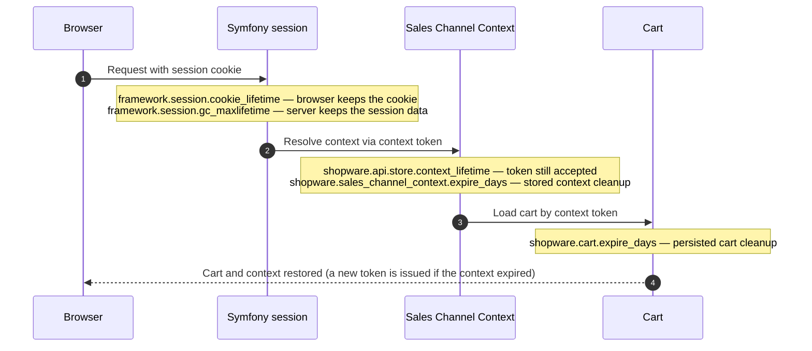

---
nav:
  title: Session
  position: 30

---

# Shopware Session

Shopware, by default, uses the session storage configured in PHP. On most installations, this is the file system. In smaller setups, you will not need to take care of sessions. However, for larger setups using clustering or with a lot of traffic, you will probably configure alternative session storage, such as Redis, to reduce the load on the database.

## Session, context, and cart lifetime

Shopware runs several lifecycles in parallel. The Symfony session, the sales channel context, and the persisted cart each have their own lifetime, and each is controlled by a different configuration value. The diagram below shows how they are resolved on a request and which setting governs each step.



Each hop in the diagram is governed by its own setting, so the lifecycles are independent: a customer can still have a valid cart token while the Symfony session is already gone, or keep a session cookie long after the persisted context has been cleaned up. The following table compares the settings that control each lifecycle.

| Scope                           | Key / token                   | Controlled by                                | What it limits                                                                               |
|---------------------------------|-------------------------------|----------------------------------------------|----------------------------------------------------------------------------------------------|
| Browser session cookie          | Symfony session cookie        | `framework.session.cookie_lifetime`          | How long the browser keeps the cookie                                                        |
| Server-side session data        | Symfony session storage entry | `framework.session.gc_maxlifetime`           | When session data can be garbage collected                                                   |
| Store API context token         | Sales channel context token   | `shopware.api.store.context_lifetime`        | How long a context token stays valid before a new one is issued (`DateInterval`, e.g. `P1D`) |
| Persisted sales channel context | Sales channel context record  | `shopware.sales_channel_context.expire_days` | When the cleanup task removes stored context records                                         |
| Cart persistence                | Cart token and cart data      | `shopware.cart.expire_days`                  | When the cleanup task removes persisted carts                                                |

::: info
**Symfony session: cookie vs. server data**

`framework.session.cookie_lifetime` and `framework.session.gc_maxlifetime` control different sides of the same session:

- **`cookie_lifetime`** - how long the **browser** keeps and sends the session cookie. If not set in Symfony, PHP's `session.cookie_lifetime` applies (typically `0`, meaning until the browser closes).
- **`gc_maxlifetime`** - how long the **server** keeps session data before it can be garbage-collected. If not set in Symfony, PHP's `session.gc_maxlifetime` applies (typically `1440` seconds / 24 minutes).

These values can diverge. A customer may still send a session cookie while the server has already deleted the session data, which starts a new empty session on the next request. If you need predictable login duration, configure both values explicitly to similar lengths.

The same pattern applies further down the stack: `shopware.api.store.context_lifetime` controls when a context token is still accepted, while `shopware.sales_channel_context.expire_days` and `shopware.cart.expire_days` control when cleanup tasks remove stored records.
:::

### Configuration

The Symfony session settings from the first two table rows belong in `config/packages/framework.yaml`. The Shopware-specific lifetimes belong in `config/packages/shopware.yaml`. Override only the values you need; unset keys keep the Symfony or Shopware defaults.

Symfony session lifetimes (browser cookie and server-side session data):

```yaml
# config/packages/framework.yaml
framework:
    session:
        cookie_lifetime: 86400   # seconds
        gc_maxlifetime: 86400    # seconds
```

If you cannot change Symfony configuration, set the PHP ini values instead (`session.cookie_lifetime` and `session.gc_maxlifetime` in `php.ini`).

Store API context token and cleanup lifetimes (context token, persisted context, and cart):

```yaml
# config/packages/shopware.yaml
shopware:
    api:
        store:
            context_lifetime: 'P1D'   # DateInterval - token validity (default: 1 day)
    sales_channel_context:
        expire_days: 120              # days - cleanup of stored context records
    cart:
        expire_days: 120              # days - cleanup of persisted carts
```

`context_lifetime` uses [PHP DateInterval notation](https://www.php.net/manual/en/dateinterval.construct.php#refsect1-dateinterval.construct-parameters), for example `P1D` (1 day) or `P7D` (7 days). The `expire_days` values are used by scheduled cleanup tasks; see [Scheduled tasks](../infrastructure/scheduled-task.md).

Longer lifetimes improve convenience, but they increase risk on shared devices because user-related data remains available for a longer time. They can also increase infrastructure usage, for example Redis memory consumption, because session and context data stay in storage longer.

## Session adapters

### Configure Redis using PHP.ini

By default, Shopware uses the settings configured in PHP. You can reconfigure the Session config directly in your `php.ini`. Here is an example of configuring it directly in PHP.

```ini
session.save_handler = redis
session.save_path = "tcp://host:6379?database=0"
```

Please refer to the official [PhpRedis documentation](https://github.com/phpredis/phpredis#php-session-handler) for all possible options.

### Configure Redis using Shopware configuration

If you don't have access to the php.ini configuration, you can configure it directly in Shopware itself. For this, create a `config/packages/redis.yml` file with the following content:

```yaml
# config/packages/redis.yml
framework:
    session:
        handler_id: "redis://host:port/0"
```

### Redis configuration

As the information stored here is durable and should be persistent, even in the case of a Redis restart, it is recommended to configure the used Redis instance that it will not just keep the data in memory, but also store it on the disk. This can be done by using snapshots (RDB) and Append Only Files (AOF), refer to the [Redis docs](https://redis.io/docs/latest/operate/oss_and_stack/management/persistence/) for details.

As key eviction policy you should use `allkeys-lru`, which only automatically deletes the last recently used entries when Redis reaches max memory consumption. For a detailed overview of Redis key eviction policies see the [Redis docs](https://redis.io/docs/latest/develop/reference/eviction/).

### Other adapters

Symfony also provides PHP implementations of some adapters:

- [PdoSessionHandler](https://github.com/symfony/symfony/blob/6.3/src/Symfony/Component/HttpFoundation/Session/Storage/Handler/PdoSessionHandler.php)
- [MemcachedSessionHandler](https://github.com/symfony/symfony/blob/6.3/src/Symfony/Component/HttpFoundation/Session/Storage/Handler/MemcachedSessionHandler.php)
- [MongoDbSessionHandler](https://github.com/symfony/symfony/blob/6.3/src/Symfony/Component/HttpFoundation/Session/Storage/Handler/MongoDbSessionHandler.php)

To use one of these handlers, you must create a new service in the dependency injection and set the `handler_id` to the service id.

Example service definition:

```php
$services->set('session.db', Symfony\Component\HttpFoundation\Session\Storage\Handler\PdoSessionHandler::class)
    ->args([/* ... */]);
```

Example session configuration:

```yaml
# config/packages/redis.yml
framework:
    session:
        handler_id: "session.db"
```
