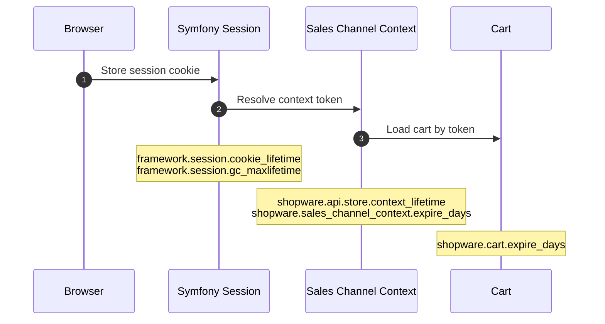

---
nav:
  title: Session
  position: 30

---

# Shopware Session

Shopware, by default, uses the session storage configured in PHP. On most installations, this is the file system. In smaller setups, you will not need to take care of sessions. However, for larger setups using clustering or with a lot of traffic, you will probably configure alternative session storage, such as Redis, to reduce the load on the database.

## Session, context, and cart lifetime

Shopware uses multiple lifecycles in parallel. A customer can still have a valid cart token while the Symfony session is already gone, or the other way around.



| Scope | Key / token | Controlled by | What expires |
| --- | --- | --- | --- |
| Browser session cookie | Symfony session cookie | `framework.session.cookie_lifetime` | How long the browser keeps the cookie |
| Server-side session data | Symfony session storage entry | `framework.session.gc_maxlifetime` | When session data can be garbage collected |
| Store API context token | Sales channel context token | `shopware.api.store.context_lifetime` | Store API context token validity |
| Persisted sales channel context | Sales channel context record | `shopware.sales_channel_context.expire_days` | Stored context data in Shopware |
| Cart persistence | Cart token and cart data | `shopware.cart.expire_days` | Persisted cart data |

Longer lifetimes improve convenience, but they increase risk on shared devices because user-related data remains available for a longer time. They can also increase infrastructure usage, for example Redis memory consumption, because session and context data stay in storage longer.

## Session adapters

### Configure Redis using PHP.ini

By default, Shopware uses the settings configured in PHP. You can reconfigure the Session config directly in your `php.ini`. Here is an example of configuring it directly in PHP.

```ini
session.save_handler = redis
session.save_path = "tcp://host:6379?database=0"
```

Please refer to the official [PhpRedis documentation](https://github.com/phpredis/phpredis#php-session-handler) for all possible options.

### Configure Redis using Shopware configuration

If you don't have access to the php.ini configuration, you can configure it directly in Shopware itself. For this, create a `config/packages/redis.yml` file with the following content:

```yaml
# config/packages/redis.yml
framework:
    session:
        handler_id: "redis://host:port/0"
```

### Redis configuration

As the information stored here is durable and should be persistent, even in the case of a Redis restart, it is recommended to configure the used Redis instance that it will not just keep the data in memory, but also store it on the disk. This can be done by using snapshots (RDB) and Append Only Files (AOF), refer to the [Redis docs](https://redis.io/docs/latest/operate/oss_and_stack/management/persistence/) for details.

As key eviction policy you should use `allkeys-lru`, which only automatically deletes the last recently used entries when Redis reaches max memory consumption. For a detailed overview of Redis key eviction policies see the [Redis docs](https://redis.io/docs/latest/develop/reference/eviction/).

### Other adapters

Symfony also provides PHP implementations of some adapters:

- [PdoSessionHandler](https://github.com/symfony/symfony/blob/6.3/src/Symfony/Component/HttpFoundation/Session/Storage/Handler/PdoSessionHandler.php)
- [MemcachedSessionHandler](https://github.com/symfony/symfony/blob/6.3/src/Symfony/Component/HttpFoundation/Session/Storage/Handler/MemcachedSessionHandler.php)
- [MongoDbSessionHandler](https://github.com/symfony/symfony/blob/6.3/src/Symfony/Component/HttpFoundation/Session/Storage/Handler/MongoDbSessionHandler.php)

To use one of these handlers, you must create a new service in the dependency injection and set the `handler_id` to the service id.

Example service definition:

```php
$services->set('session.db', Symfony\Component\HttpFoundation\Session\Storage\Handler\PdoSessionHandler::class)
    ->args([/* ... */]);
```

Example session configuration:

```yaml
# config/packages/redis.yml
framework:
    session:
        handler_id: "session.db"
```
