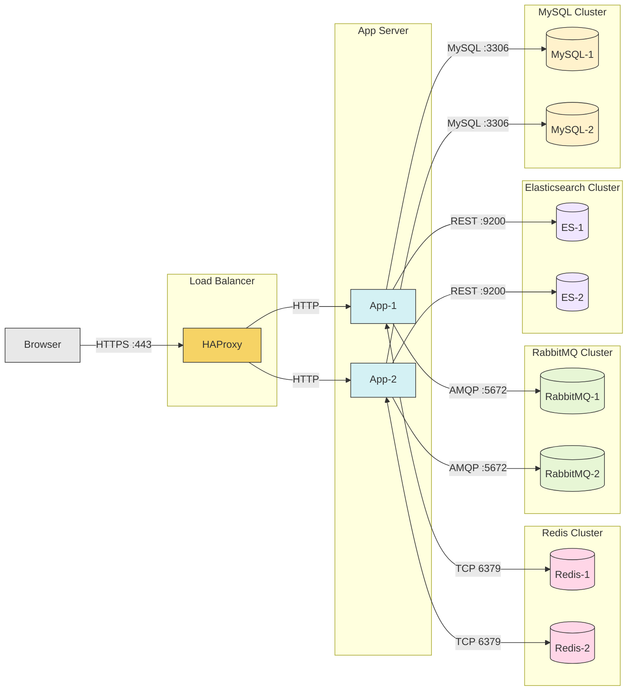

---
nav:
  title: Cluster Setup
  position: 5

---

# Cluster Setup

The setup of multiple app servers / instances is a common requirement for high-availability and high-traffic scenarios. In this guide we provide best practices and recommendations for such setups.

## Typical architecture



::: info
If you use an external cache server like Varnish / Fastly, that would be placed between the client and the load balancer.
:::

## Shopware configuration

To configure Shopware for a cluster setup, you have to set the following configuration in your shopware.yaml file:

```yaml
shopware:
    deployment:
        # Cache clearing only deletes object cache files, no Symfony cache files on node
        cluster_setup: true
        # Disables the extension management in the administration
        runtime_extension_management: false
    auto_update:
        # Disables updates via the administration
        enabled: false
```

This option prevents Shopware from running operations locally (meaning only on one node in a cluster), that potentially can corrupt the state of the cluster by having the state of the nodes diverge from each other, e.g. clearing symfony cache files at runtime.

## Sharing services

In a clustered environment, it is important to share certain services across all nodes to ensure consistency and reliability. This includes:

- **Cache**: Implement a distributed cache solution (e.g. Redis) to share cached data between nodes.
- **File storage**: Use a shared file storage solution (e.g. S3) to ensure all nodes have access to the same files.
- **Sessions**: Store sessions in a shared storage (e.g. Redis) to allow users to maintain their sessions across different nodes.

## Database cluster

If you need high availability for your database, you can set up a database cluster. This typically involves setting up multiple database instances with replication and failover mechanisms.

<PageRef page="../configurations/database-cluster" />

## Performance tweaks

Besides the generally sharing of services, there are some performance tweaks that can be applied in a clustered environment:

<PageRef page="../configurations/performance-tweaks" />
