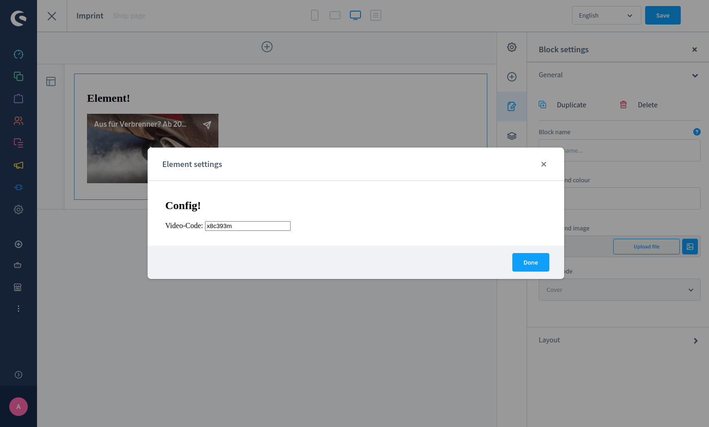
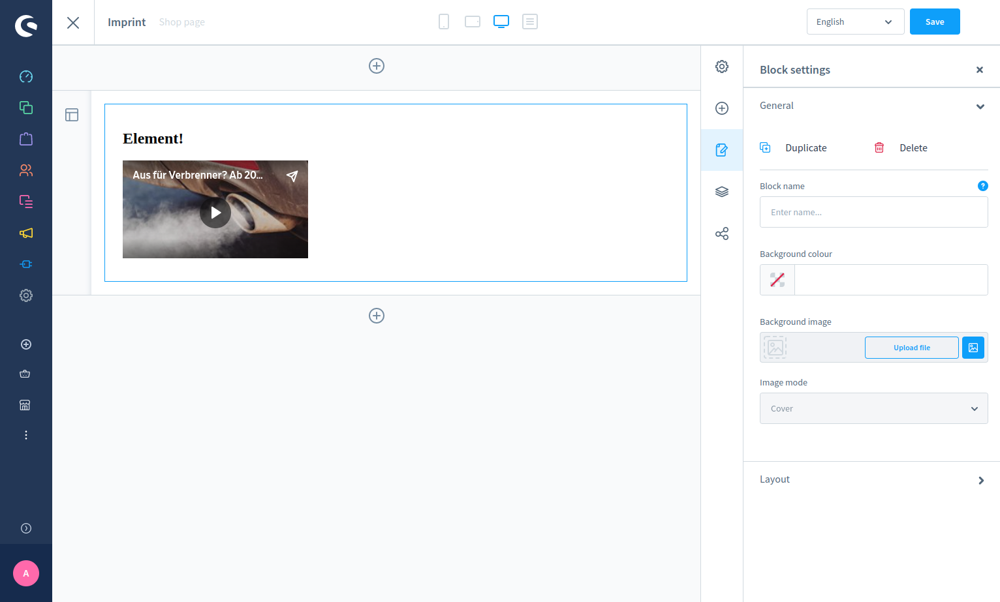
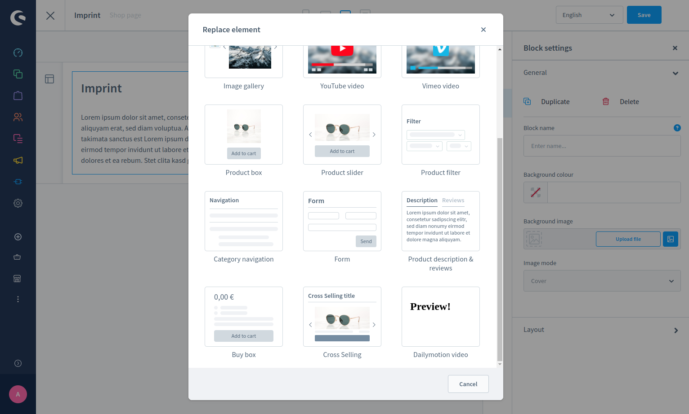

---
nav:
  title: Add CMS element
  position: 25

---

# Add CMS Element

## Overview

This guide explains how to create a new CMS element using the Meteor Admin SDK. The example plugin is named
`SwagBasicAppCmsElementExample`, following the naming conventions used in other guides.

## Prerequisites

* Familiarity with creating [Plugins][plugins-guide] or [Apps][apps-guide]
* Familiarity with [creating custom admin components][custom-component-creation]
* Understanding of the [Meteor Admin SDK][meteor-sdk-installation]

::: info
This example uses TypeScript, which is recommended but not required to develop Shopware.
:::

## Creating your custom element

Similar to [creating a new custom element via plugin][custom-cms-element], this guide describes how to create a new
custom element via an app. Creating a new element requires the Meteor Admin SDK.

In this example, you will build a scenario where a shop manager can configure a link to display a Dailymotion video.

### Target structure

You can choose your preferred approach when creating apps, as everything is loaded via iFrame. However, Shopware
recommends using a full Vue.js approach.

When the extension is complete, the file structure will look like this:

```bash
// <plugin root>/src/Resources/app/administration/src
├── base
│   └── mainCommands.ts
├── main.ts
├── viewRenderer.ts
└── views
    └── swag-dailymotion
        ├── swag-dailymotion-config.ts
        ├── swag-dailymotion-element.ts
        └── swag-dailymotion-preview.ts
```

## Initial loading of components

The entry point is the `main.ts` file:

```javascript
// Prior to 6.7
import 'regenerator-runtime/runtime';
import { location } from '@shopware-ag/meteor-admin-sdk';

// Only execute extensionSDK commands when
// it is inside an iFrame
if (location.isIframe()) {
    if (location.is(location.MAIN_HIDDEN)) {
        // Execute the base commands
        import('./base/mainCommands');
    } else {
        // Render different views
        import('./viewRenderer');
    }
}
```

```javascript
// 6.7 and above (inside meteor-app folder)
import 'regenerator-runtime/runtime';
import { location } from '@shopware-ag/meteor-admin-sdk';

if (location.is(location.MAIN_HIDDEN)) {
    // Execute the base commands
    import('./base/mainCommands');
} else {
    // Render different views
    import('./viewRenderer');
}
```

This is the main file, which is executed first and functions as the entry point.

Use `if(location.is(location.MAIN_HIDDEN))` to **load the main commands**, which are defined in the `mainCommands.ts`
file. This will only be used to load logic, but not templates into the Administration.

Lastly, the `else` case will be responsible for specific loading of views via `viewRenderer.ts`. This is where the view
templates will be loaded.

### Loading all required templates

Next, create the `viewRenderer.ts` file, which loads the three required files for a CMS element:

* `swag-dailymotion-config.ts`, which will handle the content of the CMS element configuration
* `swag-dailymotion-element.ts`, which represents the actual target element in the CMS
* `swag-dailymotion-preview.ts`, which is responsible for the preview, when selecting the CMS element in its selection
  screen

Observe that every file is named according to the component and prefixed with `swag-dailymotion`, (vendor prefix) to
ensure no other developer accidentally chooses the same name.

The following example shows how component loading via `viewRenderer.ts` is implemented:

```javascript
import Vue from 'vue';
import { location } from '@shopware-ag/meteor-admin-sdk';

// watch for height changes
location.startAutoResizer();

// start app views
const app = new Vue({
    el: '#app',
    data() {
        return { location };
    },
    components: {
        'SwagDailymotionElement':
            () => import('./views/swag-dailymotion/swag-dailymotion-element'),
        'SwagDailymotionConfig':
            () => import('./views/swag-dailymotion/swag-dailymotion-config'),
        'SwagDailymotionPreview':
            () => import('./views/swag-dailymotion/swag-dailymotion-preview'),
    },
    template: `
        <SwagDailymotionElement
            v-if="location.is('swag-dailymotion-element')"
        ></SwagDailymotionElement>
        <SwagDailymotionConfig
            v-else-if="location.is('swag-dailymotion-config')"
        ></SwagDailymotionConfig>
        <SwagDailymotionPreview
            v-else-if="location.is('swag-dailymotion-preview')"
        ></SwagDailymotionPreview>
    `,
});
```

Really straightforward, isn't it? As you probably know from Vue.js's Options API, you just need to load, register and
use the Vue.js component to make them work.

What's especially interesting here is the use of the `location` object. This is a main concept of the Meteor Admin SDK,
where Shopware provides dedicated `locationIds` to offer you places to inject your templates into. For further
information on that, it is recommended to take a look at the documentation of the
[Meteor Admin SDK][meteor-sdk-locations] to learn more about its concepts.

In your case, we will get your own **auto-generated** `locationIds`, depending on the name of your CMS element and
suffixes, such as `-element`, `-config`, and `-preview`.

Those will be available after **registering the component**, which we will do in the following chapter.

## Registering a new element

For this step, go to `mainCommands.ts`, as registering CMS elements should be done in a global scope.

```javascript
import { cms } from '@shopware-ag/meteor-admin-sdk';

const CMS_ELEMENT_NAME = 'swag-dailymotion';
const CONSTANTS = {
    CMS_ELEMENT_NAME,
    PUBLISHING_KEY: `${CMS_ELEMENT_NAME}__config-element`,
};

void cms.registerCmsElement({
    name: CONSTANTS.CMS_ELEMENT_NAME,
    label: 'Dailymotion video',
    defaultConfig: {
        dailyUrl: {
            source: 'static',
            value: '',
        },
    },
});

export default CONSTANTS;
```

At first, you import the Meteor Admin SDK's CMS object used for `cms.registerCmsElement` to register a new element.

That is all about what is required to register your CMS element. As a best practice, it is recommended to create a
**constant** for the CMS element name and the publishing key. This makes it easier to maintain and keep track of
changes. The publishing key can be predefined since the name must be a combination of CMS element name and the
`__config-element` suffix as shown above.

## Templates and communication with the Administration

The remaining files are the components inside the `views` folder. As with typical CMS element loading, create a folder
with the full component name containing three files as shown below:

```bash
// <plugin root>/src/Resources/app/administration/src
views
└── swag-dailymotion
    ├── swag-dailymotion-config.ts
    ├── swag-dailymotion-element.ts
    └── swag-dailymotion-preview.ts
```

You can vary the structure of `swag-dailymotion`'s contents and create folders for each of the three. However, for
simplicity, use single file components.

### The config file

The following section describes each file, starting with `swag-dailymotion-config.ts`:

```javascript
import Vue from 'vue'
import { data } from "@shopware-ag/meteor-admin-sdk";
import CONSTANTS from "../../base/mainCommands";

export default Vue.extend({
    template: `
        <div>
          <h2>
            Config!
          </h2>
          Video-Code: <input v-model="dailyUrl" type="text"/><br/>
        </div>
    `,

    data(): Object {
        return {
            element: null
        }
    },

    computed: {
        dailyUrl: {
            get(): string {
                return this.element?.config?.dailyUrl?.value || '';
            },

            set(value: string): void {
                this.element.config.dailyUrl.value = value;

                data.update({
                    id: CONSTANTS.PUBLISHING_KEY,
                    data: this.element,
                });
            }
        }
    },

    created() {
        this.createdComponent();
    },

    methods: {
        async createdComponent() {
            this.element = await data.get({ id: CONSTANTS.PUBLISHING_KEY });
        }
    }
});
```

This file is the config component used to define every type of configuration for the CMS element. Most of the code will
be common for experienced Shopware 6 developers, so here are some important highlights:

* Import `data` from the Meteor Admin SDK, which is required for data handling between this app and Shopware
* The `element` variable contains the typical CMS element object and is also used to manage the element configuration
  you want to edit
* The `publishingKey` is used to tell the Meteor Admin SDK in Shopware what piece of information you want to fetch. In
  this case, you need the `element` data

So, now you need a simple input field to get a `dailyUrl` for the Dailymotion video to be displayed. For that, first
fetch the element via `data.get()` as seen in `createdComponent` and then link it to the computed property `dailyUrl`
with getters and setters to mutate it. Using `data.update({ id, data })` you provide the publishing key `id` as a target
and `data` for the data you want to save in Shopware.

With these small additions to typical CMS element behavior, you have already done with the config modal.



### The element file

Now let's have a look at the result of `swag-dailymotion-element.ts`:

```javascript
import Vue from 'vue'
import { data } from "@shopware-ag/meteor-admin-sdk";
import CONSTANTS from "../../base/mainCommands";

export default Vue.extend({
    template: `
        <div>
            <h2>
              Element!
            </h2>
            <div class="sw-cms-el-dailymotion">
                <div class="sw-cms-el-dailymotion-iframe-wrapper">
                    <iframe
                        frameborder="0"
                        type="text/html"
                        width="100%"
                        height="100%"
                        :src="dailyUrl">
                    </iframe>
                </div>
            </div>
        </div>
    `,

    data(): { element: object|null } {
        return {
            element: null
        }
    },

    computed: {
        dailyUrl(): string {
            return `https://www.dailymotion.com/embed/video/${this.element?.config?.dailyUrl?.value || ''}`;
        }
    },

    created() {
        this.createdComponent();
    },

    methods: {
        async createdComponent() {
            this.element = await data.get({ id: CONSTANTS.PUBLISHING_KEY });
            data.subscribe(CONSTANTS.PUBLISHING_KEY, this.elementSubscriber);
        },

        elementSubscriber(response: { data: unknown, id: string }): void {
            this.element = response.data;
        }
    }
});
```

Here, you have the main rendering logic for the Administration's CMS element. This file shows what your element will
look like when it's done. So besides a template and the computed `dailyUrl`, used to correctly load the Dailymotion
video player, the only interesting part is the `createdComponent` method.

It initially fetches the `element` data, as you've already seen it in the config file. After that, using
`data.subscribe(id, method)` it subscribes to the publishing key, which will update the element data automatically if
something changes. It doesn't matter if the changes originate from our config modal outside Shopware or from somewhere
else inside Shopware.



### The preview file

Lastly, have a look at `swag-dailymotion-preview.ts`. In most cases, this file contains minimal logic, as it is only
used for the preview when selecting a CMS element for your block. It is common to show an example preview, a skeleton
of the result, or just the Dailymotion logo. The following code is sufficient for this example:

```javascript
import Vue from 'vue'

export default Vue.extend({
    template: `
        <h2>
          Preview!
        </h2>
    `,
});
```



## Storefront implementation

After completing the admin implementation, you also need a storefront representation of your blocks. This is similar to
typical plugin development, except for the path. All storefront templates must follow this pattern:
`<app-name>/Resources/views/storefront/element/<elementname>.html.twig`

For more details, see the guide on [CMS element development for plugins][add-cms-element-storefront].
Below is an example of how your storefront template
(`swag-dailymotion/Resources/views/storefront/element/cms-element-swag-dailymotion.html.twig`) could look:

```twig

<div class="cms-element-swag-dailymotion" style="height: 100%; width: 100%">
    
    <div class="cms-el-swag-dailymotion">
        <div style="position:relative; padding-bottom:56.25%; height:0; overflow:hidden;">
            <iframe style="width:100%; height:100%; position:absolute; left:0px; top:0px; overflow:hidden"
                    src="https://www.dailymotion.com/embed/video//{{ element.config.dailyUrl.value }}"
                    frameborder="0"
                    type="text/html"
                    width="100%"
                    height="100%">
            </iframe>
        </div>
    </div>
    
</div>

```

[plugins-guide]: ../../plugins/plugin-base-guide
[apps-guide]: ../app-base-guide
[custom-component-creation]: ../../plugins/administration/module-component-management/add-custom-component#creating-a-custom-component
[meteor-sdk-installation]: /resources/admin-extension-sdk/getting-started/installation
[meteor-sdk-locations]: /resources/admin-extension-sdk/concepts/locations
[custom-cms-element]: ../../plugins/content/cms/add-cms-element#creating-your-custom-element
[add-cms-element-storefront]: ../../plugins/content/cms/add-cms-element#storefront-implementation
