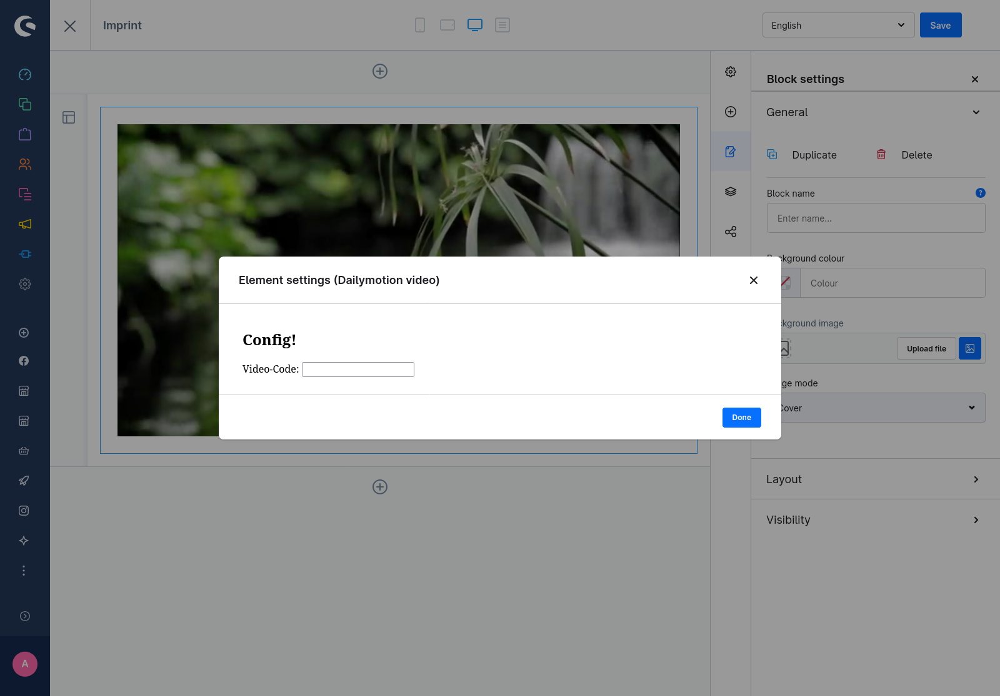
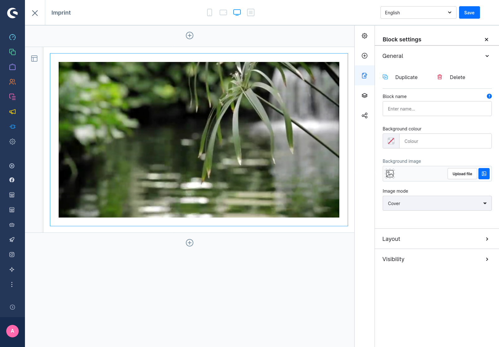
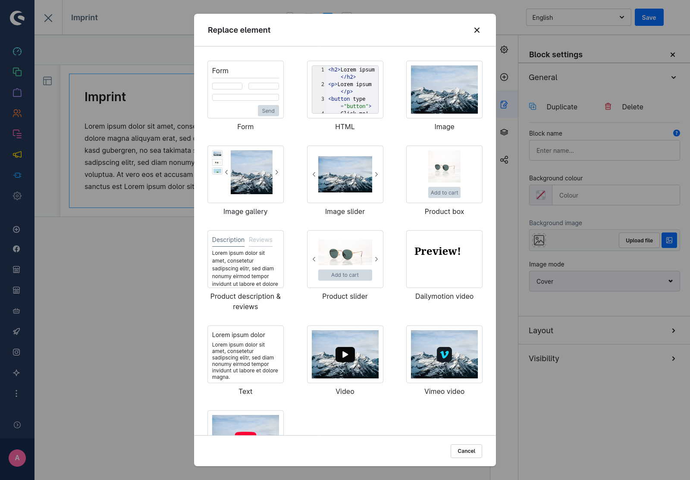

---
nav:
  title: Add CMS element
  position: 25

---

# Add CMS Element

## Overview

This guide explains how to create a new CMS element using the Meteor Admin SDK. The example plugin is named
`SwagBasicAppCmsElementExample`, following the naming conventions used in other guides.

## Prerequisites

* Familiarity with creating [Plugins](../../plugins/plugin-base-guide.md) or [Apps](../app-base-guide.md)
* Familiarity with [creating custom admin components](../../plugins/administration/module-component-management/add-custom-component.md#creating-a-custom-component)
* Understanding of the [Meteor Admin SDK](meteor-admin-sdk.md)

::: info
This example uses TypeScript, which is recommended but not required to develop Shopware.
:::

## Creating your custom element

Similar to [creating a new custom element via plugin](../../plugins/content/cms/add-cms-element.md), this guide describes how to create a new custom element via an app.
Creating a new element requires the Meteor Admin SDK.

::: info
Apps can also add CMS blocks declaratively via `cms.xml` without the Meteor Admin SDK.
That approach is simpler but limited to reusing existing Shopware elements inside the block's slots.
See [Add custom CMS blocks](../content/cms/add-custom-cms-blocks) for details.
:::

The example demonstrates a scenario where a shop manager can configure a video ID to display a Dailymotion video.

### Target structure

Any file structure works for apps, as everything is loaded via iFrame. Shopware recommends using Vue 3 single-file components (SFCs).

When the app is complete, the file structure will look like this:

```bash
// SwagBasicAppCmsElementExample/src/Resources/app/administration/src
├── base
│   └── mainCommands.ts
├── main.ts
├── viewRenderer.ts
└── views
    └── swag-dailymotion
        ├── swag-dailymotion-config.vue
        ├── swag-dailymotion-element.vue
        └── swag-dailymotion-preview.vue
```

## Initial loading of components

The entry point is the `main.ts` file:

```javascript
import { location } from '@shopware-ag/meteor-admin-sdk';

if (location.is(location.MAIN_HIDDEN)) {
    // Execute the base commands
    import('./base/mainCommands');
} else {
    // Render different views
    import('./viewRenderer');
}
```

Use `if(location.is(location.MAIN_HIDDEN))` to **load the main commands** defined in `mainCommands.ts`.
This branch loads logic only — no templates are rendered into the Administration here.

The `else` case loads the view templates via `viewRenderer.ts`.

### Loading all required templates

Next, create the `viewRenderer.ts` file, which loads the three required Vue SFCs for a CMS element:

* `swag-dailymotion-config.vue`, which will handle the content of the CMS element configuration
* `swag-dailymotion-element.vue`, which represents the actual target element in the CMS
* `swag-dailymotion-preview.vue`, which is responsible for the preview when selecting the CMS element in its selection
  screen

Each file is named after its component and prefixed with `swag-dailymotion` (vendor prefix) to avoid naming conflicts.

The following example shows how component loading via `viewRenderer.ts` is implemented:

```javascript
import { createApp, defineAsyncComponent, h } from 'vue';
import { location } from '@shopware-ag/meteor-admin-sdk';

// watch for height changes
location.startAutoResizer();

const locations = {
    'swag-dailymotion-element': defineAsyncComponent(
        () => import('./views/swag-dailymotion/swag-dailymotion-element.vue'),
    ),
    'swag-dailymotion-config': defineAsyncComponent(
        () => import('./views/swag-dailymotion/swag-dailymotion-config.vue'),
    ),
    'swag-dailymotion-preview': defineAsyncComponent(
        () => import('./views/swag-dailymotion/swag-dailymotion-preview.vue'),
    ),
};

const app = createApp({
    render: () => h(locations[location.get()]),
});

app.mount('#app');
```

The `locations` map connects each Shopware-provided location ID to the corresponding Vue component. `location.get()`
returns the current location ID so the correct component is rendered inside the iFrame.

Location IDs are a core concept of the Meteor Admin SDK — Shopware provides dedicated `locationIds` as injection points
for your templates. For CMS elements, these IDs are **auto-generated** from the element name plus the suffixes
`-element`, `-config`, and `-preview`. They become available once the element is registered (see the next section).

> **Learn more**: See the [Meteor Admin SDK locations reference](/resources/admin-extension-sdk/concepts/locations) for a full overview of the concept.

## Registering the block and element

The Shopware CMS distinguishes between two concepts:

* A **block** is the selectable container that appears in the block picker (organised by categories such as *Text*, *Image*, *Video*, etc.).
  Users add blocks to a section, and each block contains one or more slots.
* An **element** is the content type that lives inside a slot (e.g., a video player, an image, a text).
  Elements can also be swapped inside an existing slot via the element-replacement modal.

The registration method you call determines where your addition is reachable:

| What you call                 | Where it appears                                                                                                                            |
|-------------------------------|---------------------------------------------------------------------------------------------------------------------------------------------|
| `registerCmsElement` only     | Element-replacement modal only (the <SwagIcon icon="repeat" style="display:inline-block;vertical-align:middle" /> icon on an existing slot) |
| `registerCmsBlock` only       | Block picker under the chosen category — but the slot renders nothing until an element is also registered                                   |
| Both                          | Block picker **and** element-replacement modal                                                                                              |

To make your CMS addition fully discoverable and functional, call both.

Go to `mainCommands.ts` and add both registrations:

```javascript
import { cms } from '@shopware-ag/meteor-admin-sdk';

const CMS_ELEMENT_NAME = 'swag-dailymotion';
export const CONSTANTS = {
    CMS_ELEMENT_NAME,
    PUBLISHING_KEY: `${CMS_ELEMENT_NAME}__config-element`,
};

// Makes the block appear in the block picker under the "Video" category
void cms.registerCmsBlock({
    name: CONSTANTS.CMS_ELEMENT_NAME,
    label: 'Dailymotion video',
    category: 'video',
    slots: [{ element: CONSTANTS.CMS_ELEMENT_NAME }],
});

// Registers the element that fills the block's slot
void cms.registerCmsElement({
    name: CONSTANTS.CMS_ELEMENT_NAME,
    label: 'Dailymotion video',
    defaultConfig: {
        dailyUrl: {
            source: 'static',
            value: '',
        },
    },
});
```

The `category` field of `registerCmsBlock` controls which group the block appears in:
`'video'`, `'text'`, `'image'`, `'text-image'`, `'commerce'`, `'sidebar'`, `'form'`, or a custom string (which creates a new category group).
The `slots` array lists the element types each slot of the block accepts.

As a best practice, use a **constant** for the CMS element name and the publishing key.
The publishing key must be the element name followed by the `__config-element` suffix.

## Templates and communication with the Administration

The remaining files are the Vue single-file components inside the `views` folder. Create a folder with the full
component name containing three files as shown below:

```bash
// SwagBasicAppCmsElementExample/src/Resources/app/administration/src
views
└── swag-dailymotion
    ├── swag-dailymotion-config.vue
    ├── swag-dailymotion-element.vue
    └── swag-dailymotion-preview.vue
```

### Element ID

When Shopware renders any of the three CMS iFrames, it automatically appends the ID of the current CMS element instance as an `elementId` query parameter to the iFrame URL:

```http request
https://your-app-server/...?elementId=<uuid>
```

Use this ID together with the publishing key to address the correct element's data in Shopware:

```javascript
const params = new URLSearchParams(window.location.search);
const elementId = params.get('elementId');
const dataId = `${CONSTANTS.PUBLISHING_KEY}__${elementId}`;
```

### The config file

The following section describes each file, starting with `swag-dailymotion-config.vue`:

```html
<template>
  <div>
    <h2>Config!</h2>
    Video-Code: <input v-model="dailyUrl" type="text"><br>
  </div>
</template>

<script setup lang="ts">
import { onBeforeMount, ref, computed } from 'vue';
import { data } from '@shopware-ag/meteor-admin-sdk';
import { CONSTANTS } from '../../base/mainCommands';

const dailyUrlValue = ref('');
const dailyUrlSource = ref('static');

const selectors = ['config.dailyUrl.value', 'config.dailyUrl.source'];

const dataId = computed(() => {
    const params = new URLSearchParams(window.location.search);
    const elementId = params.get('elementId');

    return elementId
        ? `${CONSTANTS.PUBLISHING_KEY}__${elementId}`
        : CONSTANTS.PUBLISHING_KEY;
});

const dailyUrl = computed({
    get(): string {
        return dailyUrlValue.value || '';
    },

    set(value: string): void {
        dailyUrlValue.value = value;

        data.update({
            id: dataId.value,
            data: {
                config: {
                    dailyUrl: {
                        value: dailyUrlValue.value,
                        source: dailyUrlSource.value,
                    },
                },
            },
        });
    },
});

onBeforeMount(async () => {
    const value = await data.get({
        id: dataId.value,
        selectors,
    }) as { 'config.dailyUrl.value': string; 'config.dailyUrl.source': string };

    if (value) {
        dailyUrlValue.value = value['config.dailyUrl.value'];
        dailyUrlSource.value = value['config.dailyUrl.source'];
    }
});
</script>
```

**Key points:**

* `data` is imported from the Meteor Admin SDK and handles all data exchange between the app and Shopware
* `dataId` is derived from the `elementId` query parameter appended by Shopware to the iFrame URL, combined with `CONSTANTS.PUBLISHING_KEY`
* `data.get()` accepts an optional `selectors` array so only the relevant fields are fetched; the result is a flat object keyed by selector path (e.g. `value['config.dailyUrl.value']`)
* `data.update()` sends only the changed config structure back to Shopware — not the entire element
* The current config is fetched via `data.get()` in `onBeforeMount` and linked to the computed property `dailyUrl`; the setter calls `data.update({ id, data })` to persist changes



### The element file

`swag-dailymotion-element.vue` contains the main rendering logic for the CMS element in the Administration:

```html
<template>
  <div class="sw-cms-el-dailymotion">
    <div class="sw-cms-el-dailymotion-iframe-wrapper">
      <iframe
        frameborder="0"
        type="text/html"
        width="100%"
        height="100%"
        :src="dailyUrl"
      />
    </div>
  </div>
</template>

<script setup lang="ts">
import { ref, computed, onBeforeMount } from 'vue';
import { data } from '@shopware-ag/meteor-admin-sdk';
import { CONSTANTS } from '../../base/mainCommands';

const dailyUrlValue = ref('');
const dailyUrlSource = ref('static');

const selectors = ['config.dailyUrl.value', 'config.dailyUrl.source'];

const dailyUrl = computed(() => {
    const code = dailyUrlValue.value || 'x8hc5d6';
    return `https://www.dailymotion.com/embed/video/${code}`;
});

const dataId = computed(() => {
    const params = new URLSearchParams(window.location.search);
    const elementId = params.get('elementId');

    return elementId
        ? `${CONSTANTS.PUBLISHING_KEY}__${elementId}`
        : CONSTANTS.PUBLISHING_KEY;
});

onBeforeMount(async () => {
    const value = await data.get({
        id: dataId.value,
        selectors,
    }) as { 'config.dailyUrl.value': string; 'config.dailyUrl.source': string };

    if (value) {
        dailyUrlValue.value = value['config.dailyUrl.value'];
        dailyUrlSource.value = value['config.dailyUrl.source'];
    }

    data.subscribe(
        dataId.value,
        (response) => {
            const responseData = response.data as {
                'config.dailyUrl.value': string;
                'config.dailyUrl.source': string;
            };
            dailyUrlValue.value = responseData['config.dailyUrl.value'];
            dailyUrlSource.value = responseData['config.dailyUrl.source'];
        },
        { selectors },
    );
});
</script>

<style scoped>
.sw-cms-el-dailymotion-iframe-wrapper {
    height: 500px;
}
</style>
```

**Key points:**

* `data.get()` fetches the initial element config using the element-specific `dataId`
* `data.subscribe()` keeps the element in sync whenever the config changes — it receives the same flat selector-keyed object as `data.get()` and is called regardless of where the change originates



### The preview file

`swag-dailymotion-preview.vue` is the thumbnail shown in the block picker when a user browses the *Video* category.
In most cases it contains minimal logic — a static image, a skeleton, or a logo is sufficient:

```html
<template>
  <h2>Preview!</h2>
</template>
```



## Storefront implementation

After completing the admin implementation, you also need a Storefront representation of your blocks. This is similar to typical plugin development, except for the path. All Storefront templates must follow this pattern:

`<app-name>/Resources/views/storefront/element/<elementname>.html.twig`

For more details, see the guide on [CMS element development for plugins](../../plugins/content/cms/add-cms-element#storefront-implementation).
Below is an example of how your storefront template
(`SwagBasicAppCmsElementExample/Resources/views/storefront/element/cms-element-swag-dailymotion.html.twig`) could look:

```twig

<div class="cms-element-swag-dailymotion" style="height: 100%; width: 100%">
    
    <div class="cms-el-swag-dailymotion">
        <div style="position:relative; padding-bottom:56.25%; height:0; overflow:hidden;">
            <iframe style="width:100%; height:100%; position:absolute; left:0px; top:0px; overflow:hidden"
                    src="https://www.dailymotion.com/embed/video/{{ element.config.dailyUrl.value }}"
                    frameborder="0"
                    type="text/html"
                    width="100%"
                    height="100%">
            </iframe>
        </div>
    </div>
    
</div>

```
