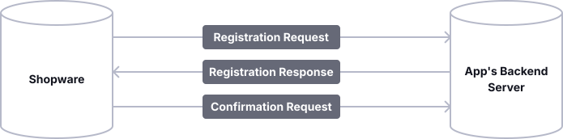

---
nav:
  title: App Base Guide
  position: 10

---

# App Base Guide

## Overview

This guide will walk you through the process of adding your own app to Shopware and configuring it to be able to communicate with your external backend server.

## Prerequisites

If you are not familiar with the app system, take a look at the [App concept](../../../concepts/extensions/apps-concept) first.

## Name your app

Choose a technical name for your application that accurately reflects its plugin functionality.
Specify the name using UpperCamelCase. For instance: "PaymentGatewayApp".

However, throughout this section "MyExampleApp" is used as it serves as an illustrative example of the plugin.

## File structure

To get started with your app, create an `apps` folder inside the `custom` folder of your Shopware dev installation.
In there, create another folder for your application and provide a manifest file in it.

```text
└── custom
    ├── apps
    │   └── MyExampleApp
    │       └── manifest.xml
    └── plugins
```

## Manifest file

The manifest file is the central point of your app.
It defines the interface between your app and the Shopware instance.
It provides all the information concerning your app, as seen in the minimal version below:

::: code-group

```xml [manifest.xml]
<?xml version="1.0" encoding="UTF-8"?>
<manifest xmlns:xsi="http://www.w3.org/2001/XMLSchema-instance" xsi:noNamespaceSchemaLocation="https://raw.githubusercontent.com/shopware/shopware/trunk/src/Core/Framework/App/Manifest/Schema/manifest-2.0.xsd">
    <meta>
        <name>MyExampleApp</name>
        <label>Label</label>
        <label lang="de-DE">Name</label>
        <description>A description</description>
        <description lang="de-DE">Eine Beschreibung</description>
        <author>Your Company Ltd.</author>
        <copyright>(c) by Your Company Ltd.</copyright>
        <version>1.0.0</version>
        <icon>Resources/config/plugin.png</icon>
        <license>MIT</license>
    </meta>
</manifest>
```

:::

::: warning
The name of your app that you provide in the manifest file needs to match the folder name of your app.
:::

The app can now be installed and activated by running the following command:

```bash
bin/console app:install --activate MyExampleApp
```

After activating an app, you might need to clear the cache for the changes to take effect. First try:

```bash
bin/console cache:clear
```

If the changes are still not visible, try:

```bash
bin/console cache:clear:http
```

or

```bash
bin/console cache:clear:all
```

By default, your app files will be [validated](app-base-guide#validation) before installation.
To skip the validation, you may use the `--no-validate` flag.

::: info
Without the `--activate` flag the Apps get installed as inactive.
By executing the `app:activate` command after installation this can be activated, too.
:::

For a complete reference of the structure of the manifest file, take a look at the [Manifest reference](../../../resources/references/app-reference/manifest-reference).

## Setup (optional)

::: info
Only if your app backend server and Shopware need to communicate, it is necessary that registration is performed during the installation of your app.
This process is called setup.
:::

::: warning
Suppose your app makes use of the Admin Module, Payment Method, Tax providers or Webhook app system features.
In that case, you need to implement the registration, in order to exchange a secret key, that is later used to authenticate the shops.
:::

During the setup, it is verified that Shopware connects to the right backend server and keys are exchanged to secure all further communications.
During the setup process, your app backend will obtain credentials that can be used to authenticate against the Shopware API.
Additionally, your app will provide a secret that Shopware will use to sign all further requests it makes to your app backend, allowing you to verify that the incoming requests originate from authenticated Shopware installations.

The setup workflow is shown in the following schema.
Each step will be explained in detail.



::: info
The timeout for the requests against the app server is 5 seconds.
:::

### SDK Integration

Integrating apps into your application can be a daunting task, but with our PHP SDK, the process becomes much easier.
Our SDK simplifies the registration flow and other typical tasks.

* [Official PHP SDK](app-sdks/php/01-getting_started)
* [Official Symfony Bundle](app-sdks/symfony-bundle/index)

If there is no SDK available for your language, you can implement the registration process by yourself.

### Registration request

The registration request is made as a `GET` request against a URL you provide in your app's manifest file.

<<< @/docs/snippets/config/app/setup.xml

The following query parameters will be sent with the request:

* `shop-id`: The unique identifier of the shop the app was installed.
* `shop-url`: The URL of the shop, this can later be used to access the Shopware API.
* `timestamp`: The Unix timestamp when the request was created.

Additionally, the request has the following headers:

* `shopware-app-signature`: The signature of the query string
* `sw-version`: The Shopware version of the shop *(since 6.4.1.0)*

An example request looks like this:

```txt
GET https://my.example.com/registration?shop-id=KIPf0Fz6BUkN&shop-url=http%3A%2F%2Fmy.shop.com&timestamp=159239728
shopware-app-signature: a8830aface4ac4a21be94844426e62c77078ca9a10f694737b75ca156b950a2d
sw-version: 6.4.5.0
```

Additionally, the `shopware-app-signature` header will be provided, which contains a cryptographic signature of the query string.  
The secret used to generate this signature is the `app secret`, which is unique per app and will be provided by the Shopware Account if you upload your app to the store.
This secret won't leave the Shopware Account, so it won't even be leaked to the shops installing your app.

::: danger
You and the Shopware Account are the only parties that should know your `app-secret`.
Therefore, make sure you never accidentally publish your `app-secret`.
:::

::: warning
For **local development**, you can specify a `<secret>` in the manifest file that is used for signing the registration request.
However, if an app uses a hard-coded secret in the manifest, it can't be uploaded to the store.

If you are developing a **private app** not published in the Shopware Store, you **must** provide the `<secret>` in case of an external app server.
:::

To verify that the registration can only be triggered by authenticated Shopware shops, you need to recalculate the signature and check that the signatures match.
Thus, you have verified that the sender of the request possesses the `app secret`.

The following code snippet can be used to recalculate the signature:

<Tabs>
<Tab title="PHP">

```php
use Psr\Http\Message\RequestInterface;

/** @var RequestInterface $request */
$queryString = $request->getUri()->getQuery();
$signature = hash_hmac('sha256', $queryString, $appSecret);
```

</Tab>

<Tab title="App PHP SDK">

```php
$verifier = new \Shopware\App\SDK\Authentication\RequestVerifier();
$verifier->authenticateRegistrationRequest($request, new AppConfiguration('AppName', 'AppSecret', 'confirm-url'));
```

</Tab>

<Tab title="Symfony Bundle">

The Symfony Bundle handles all verification automatically.

</Tab>

</Tabs>

### Registration response

There may be valid cases where the app installation fails because the domain is blocked or some other prerequisite in that shop is not met, in which case you can return the message error as follows:

```json
{
  "error": "The shop URL is invalid"
}
```

When the registration is successful.
To verify that you are also in possession of the `app secret`, you need to provide proof that it is signed with the `app secret` too.
The proof consists of the sha256 hmac of the concatenated `shopId`, `shopUrl`, and your app's name.

The following code snippet can be used to calculate the proof:

<Tabs>
<Tab title="PHP">

```php
use Psr\Http\Message\RequestInterface;

/** @var RequestInterface $request */
$queryString = $request->getUri()->getQuery();
parse_str($queryString, $queryValues);
$proof = \hash_hmac(
    'sha256',
    $queryValues['shop-id'] . $queryValues['shop-url'] . $appname,
    $appSecret
);
```

</Tab>

<Tab title="App PHP SDK">

```php
$signer = new ResponseSigner();
$signer->getRegistrationSignature(new AppConfiguration('AppName', 'AppSecret', 'confirm-url'), $shop);
```

</Tab>

</Tabs>

For detailed instructions on signing requests and responses, refer to the app signing guide.

<PageRef page="app-signature-verification" />

Besides the proof, your app needs to provide a randomly generated secret that should be used to sign every further request from this shop.
Make sure to save the `shopId`, `shopUrl`, and generated secret so that you can associate and use this information later.

::: info
This secret will be called \`shop-secret\` to distinguish it from the \`app-secret\`.
The \`app-secret\` is unique to your app and is used to sign the registration request of every shop that installs your app.
The \`shop-secret\` will be provided by your app during the registration and should be unique for every shop and have a minimum length of 64 characters and maximum length of 255 characters.
:::

The last thing needed in the registration response is a URL to which the confirmation request will be sent.

A sample registration response looks like this:

```json
{
  "proof": "94b42d39280141de84bd6fc8e538946ccdd182e4558f1e690eabb94f924e7bc7",
  "secret": "random secret string",
  "confirmation_url": "https://my.example.com/registration/confirm"
}
```

### Confirmation request

If the proof you provided in the [registration response](app-base-guide#registration-response) matches the one generated on the shop side, the registration is completed.
As a result, your app will receive a `POST` request against the URL specified as the `confirmation_url` of the registration with the following parameters send in the request body:

* `apiKey`: The API key used to authenticate against the Shopware Admin API.
* `secretKey`: The secret key used to authenticate against the Shopware Admin API.
* `timestamp`: The Unix timestamp when the request was created.
* `shopUrl`: The URL of the shop.
* `shopId`: The unique identifier of the shop.

The payload of that request may look like this:

```json
{
  "apiKey":"SWIARXBSDJRWEMJONFK2OHBNWA",
  "secretKey":"Q1QyaUg3ZHpnZURPeDV3ZkpncXdSRzJpNjdBeWM1WWhWYWd0NE0",
  "timestamp":"1592398983",
  "shopUrl":"http:\/\/my.shop.com",
  "shopId":"sqX6cqHi6hbj"
}
```

Make sure that you save the API credentials for that `shopId`.
You can use the `apiKey` and the `secretKey` as `client_id` and `client_secret`, respectively, when you request an OAuth token from the Admin API.

You can find out more about how to use these credentials in our Admin API authentication guide:

<PageRef page="https://shopware.stoplight.io/docs/admin-api/ZG9jOjEwODA3NjQx-authentication-and-authorisation#integration-client-credentials-grant-type" title="Admin API Authentication & Authorisation" target="_blank" />

::: info
Starting from Shopware version 6.4.1.0, the current Shopware version will be sent as a `sw-version` header.
Starting from Shopware version 6.4.5.0, the current language id of the Shopware context will be sent as a  `sw-context-language` header, and the locale of the user or locale of the context language is available under the `sw-user-language` header.
:::

The request is signed with the `shop-secret` that your app provided in the [registration response](app-base-guide#registration-response) and the signature can be found in the `shopware-shop-signature` header.  
You need to recalculate that signature and check that it matches the provided one to make sure that the request is really sent from the shop with that shopId.

You can use the following code snippet to generate the signature:

<Tabs>
<Tab title="PHP">

```php
use Psr\Http\Message\RequestInterface;

/** @var RequestInterface $request */
$hmac = \hash_hmac('sha256', $request->getBody()->getContents(), $shopSecret);
```

</Tab>
</Tabs>

## Permissions

Shopware comes with the possibility to create fine-grained [Access Control Lists](../plugins/administration/add-acl-rules) \(ACLs\).
It means you need to request permissions if your app needs to read or write data over the API or wants to receive webhooks.
The permissions your app needs are defined in the manifest file and are composed of the privilege \(`read`, `create`, `update`, `delete`\) and the entity.
Since version 6.4.12.0, your app can also request additional non-CRUD privileges with the `<permission>` element.

Sample permissions to read, create and update products, delete orders, as well as reading the cache configuration look like this:

::: code-group

```xml [manifest.xml]
<?xml version="1.0" encoding="UTF-8"?>
<manifest xmlns:xsi="http://www.w3.org/2001/XMLSchema-instance" xsi:noNamespaceSchemaLocation="https://raw.githubusercontent.com/shopware/shopware/trunk/src/Core/Framework/App/Manifest/Schema/manifest-2.0.xsd">
    <meta>
        ...
    </meta>
    <permissions>
        <read>product</read>
        <create>product</create>
        <update>product</update>

        <delete>order</delete>

        <!-- Since version 6.4.12.0 your app can request additional non-CRUD privileges-->
        <permission>system:cache:info</permission>
    </permissions>
</manifest>
```

:::

The permissions you request need to be accepted by the user during the installation of your app.
After that, these permissions are granted for your app and your API access through the credentials from the [confirmation request](app-base-guide#confirmation-request) of the [setup workflow](app-base-guide#setup) are limited to those permissions.

::: warning
Keep in mind that read permissions also extend to the data contained in the requests, so your app needs read permissions for the entities contained in the subscribed [webhooks](./webhook).
:::

### App notification

Starting from Shopware version 6.4.7.0, if you want to send notifications to the admin to inform the user about some actions that happened on the app side,
the app should send a `POST` request to the `api/notification` endpoint with a valid body and the header `Authorization` token.
Your app can request 10 times before being delayed by the system.

After 10 attempts, you need to wait 10 seconds before trying to make requests again.
After 15 attempts, it's 30 seconds.
After 20 attempts, it's 60 seconds.
After 24 hours without a failed request, the limit is reset.

Examples request body:
You need to pass the `status` property, the content of the notification as `message` property,
and you can restrict users who can read the notification by passing `requiredPrivileges` property and `adminOnly` property inside the payload.
When `adminOnly` is true, only admins can read this notification.
If you don't send the `adminOnly` or `adminOnly` is false, you can pass the `requiredPrivileges` property so that users with specific permissions can read the notification.
Otherwise, it will be displayed to every user.

```txt
POST /api/notification

{
    "status": "success",
    "message": "This is a successful message",
    "adminOnly": "true",
    "requiredPrivileges": []
}
```

* `status`: Notification status - `success`, `error`, `info`, `warning`.
* `message`: The content of the notification.
* `adminOnly`: Only admins can read this notification if this value is true.
* `requiredPrivileges`: The required privileges that users need to have to read the notification.

Remember that your app needs the `notification:create` permission to access this API.

### App lifecycle events

Apps can also register to lifecycle events of their own lifecycle, namely their installation, updates, and deletion.
For example, they may be used to delete user relevant data from your data stores once somebody removes your app from their shop.

| Event             | Description                              |
|:------------------|:-----------------------------------------|
| `app.installed`   | Triggers once the app is installed       |
| `app.updated`     | Triggers if the app is updated           |
| `app.deleted`     | Triggers once the app is removed         |
| `app.activated`   | Triggers if an inactive app is activated |
| `app.deactivated` | Triggers if an active app is deactivated |

<Tabs>

<Tab title="HTTP">

Example request body:

```json
{
  "data": {
    "payload": [],
    "event": "app_deleted"
  },
  "source": {
    "url": "http:\/\/localhost:8000",
    "appVersion": "0.0.1",
    "shopId": "wPNrYZgArBTL"
  }
}
```

</Tab>

<Tab title="App PHP SDK">

```php
use Shopware\App\SDK\Shop\ShopResolver;
use Shopware\App\SDK\Context\ContextResolver;
use Shopware\App\SDK\Response\PaymentResponse;

function webhookController(RequestInterface $request): ResponseInterface
{
    // injected or build by yourself
    $shopResolver = new ShopResolver($repository);
    $contextResolver = new ContextResolver();

    $shop = $shopResolver->resolveShop($serverRequest);
    $webhook = $contextResolver->assembleWebhook($serverRequest, $shop);

    // do something with the parsed webhook
}
```

</Tab>
</Tabs>

#### App lifecycle events for app scripts

Since Shopware 6.4.9.0, it is also possible to create [App scripts](./app-scripts/) that are executed during the lifecycle of your app.
You get access to the database and can change or create some data, e.g., when your app is activated, without needing an external server.

For a full list of the available hook points and the available services, refer to the [reference documentation](../../../resources/references/app-reference/script-reference/script-hooks-reference#app-lifecycle).

## Validation

You can run the `app:validate` command to validate the configuration of your app. It will check for common errors, like:

* non-matching app names
* missing translations
* unknown events registered as webhooks
* missing permissions for webhooks
* errors in the config.xml file, if it exists

To validate all apps in your `custom/apps` folder run:

```bash
bin/console app:validate
```

Additionally, you can specify which app should be validated by providing the app name as an argument;

```bash
bin/console app:validate MyExampleApp
```

## Handling the migration of shops

In the real world, it may happen that shops are migrated to new servers and are available under a new URL.
In the same regard, it is possible that a running production shop is duplicated and treated as a staging environment.
These cases are challenging for app developers.
In the first case, you may have to make a request against the shop, but the URL you saved during the registration process may not be valid anymore, and the shop cannot be reached over this URL.
In the second case, you may receive webhooks from both shops (prod & staging) that look like they came from the same shop (as the whole database was duplicated).
Thus, it may corrupt the data associated with the original production shop.
The main reason that this is problematic is that two Shopware installations in two different locations (on two different URLs) are associated with the same shopId, because the whole database was replicated.

That is why we implemented a safeguard mechanism that detects such situations, stops communication with the apps to prevent data corruption,
and then ultimately lets the user decide how to solve the situation.

::: info
This mechanism relies on the fact that the `APP_URL` environment variable will be set to the correct URL for the shop.
It is especially assumed that the environment variable will be changed when a shop is migrated to a new domain or a staging shop is created as a duplicate of a production shop.
:::

Remember that this is only relevant for apps that have their own backends and where communication between app backends and shopware is necessary.
That is why simple themes are not affected by shop migrations, and they will continue to work.

### Detecting APP_URL changes

Every time a request should be made against an app backend, Shopware will check whether the current APP_URL differs from the one used when Shopware generated an ID for this shop.
If the APP_URL differs, Shopware will stop sending any requests to the installed apps to prevent data corruption on the side of the apps.
Now the user has the possibility to resolve the solution by using one of the following strategies.
The user can either run a strategy with the `bin/console app:url-change:resolve` command, or with a modal that pops up when the Administration is opened.

### APP_URL change resolver

* **MoveShopPermanently**: This strategy should be used if the live production shop is migrated from one URL to another one.
This strategy will ultimately notify all apps about the change of the APP_URL and the apps will continue working like before,
including all the data the apps may already have associated with the given shop.
It is important to notice that in this case, the apps in the old installation on the old URL (if it is still running) will stop working.

Technically, this is achieved by rerunning the registration process for all apps.
During the registration, the same shopId is used as before, but now with a different shop-url and a different key pair used to communicate over the Shopware API.
Also, you must generate a new communication secret during this registration process that is subsequently used to communicate between Shopware and the app backend.

This way, it is ensured that the apps are notified about the new URL and the integration with the old installation stops working,
because a new communication secret is associated with the given shopId that the old installation does not know.

* **ReinstallApps**: This strategy makes sense to use in the case of the staging shop.
By running this strategy, all installed apps will be reinstalled.
This means that this installation will get a new shopId, that is used during registration.

As the new installation will get a new shopId, the installed apps will continue working on the old installation as before,
but as a consequence, the data on the app's side that was associated with the old shopId cannot be accessed on the new installation.

* **UninstallApps**: This strategy will simply uninstall all apps on the new installation, thus keeping the old installation working like before.

## API Docs

### Registration

`GET https://my.example.com`

#### Parameters

| Parameter               | Type    | Description                                                                               |
|-------------------------|---------|-------------------------------------------------------------------------------------------|
| **Query**               |         |                                                                                           |
| timestamp*              | integer | The current Unix timestamp when the request was created                                   |
| shop-url*               | string  | The URL of the shop where the app was installed can be used to access to the Shopware API |
| shop-id*                | string  | The unique identifier of the shop, where the app was installed                            |
| **Header**              |         |                                                                                           |
| shopware-app-signature* | string  | The hmac-signature of the query string, signed with the app secret                        |

#### Responses

`200`

```json
{
  "error": "The shop URL is invalid"
}
```

```json
{
  "proof": "94b42d39280141de84bd6fc8e538946ccdd182e4558f1e690eabb94f924e7bc7",
  "secret": "random secret string",
  "confirmation_url": "https://my.example.com/registration/confirm"
}
```

### Confirmation

`POST https://my.example.com`

#### Parameters

| Parameter                | Type    | Description                                                                                                                                                                                                                                                                                                                                                        |
|--------------------------|---------|--------------------------------------------------------------------------------------------------------------------------------------------------------------------------------------------------------------------------------------------------------------------------------------------------------------------------------------------------------------------|
| **Header**               |         |                                                                                                                                                                                                                                                                                                                                                                    |
| shopware-shop-signature* | string  | The hmac-signature of the body content, signed with the shop secret returned from the registration request                                                                                                                                                                                                                                                         |
| sw-version*              | string  | Starting from Shopware version 6.4.1.0, the current Shopware version will be sent as a `sw-version` header. Starting from Shopware version 6.4.5.0, the current language id of the Shopware context will be sent as a `sw-context-language` header, and the locale of the user or locale of the context language is available under the `sw-user-language` header. |
| **Body**                 |         |                                                                                                                                                                                                                                                                                                                                                                    |
| shopId*                  | string  | The unique identifier of the shop                                                                                                                                                                                                                                                                                                                                  |
| shopUrl*                 | string  | The URL of the shop                                                                                                                                                                                                                                                                                                                                                |
| timestamp*               | integer | The current nix timestamp when the request was created                                                                                                                                                                                                                                                                                                             |
| secretKey*               | string  | SecretKey used to authenticate against the Shopware API                                                                                                                                                                                                                                                                                                            |
| apiKey*                  | string  | ApiKey used to authenticate against the Shopware API                                                                                                                                                                                                                                                                                                               |

#### Responses

`200`
