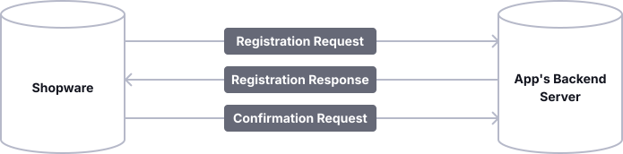

---
nav:
  title: App Registration & Backend Setup
  position: 40

---

# App Registration & Backend Setup

This page documents app setup (registration), permissions, validation, and changes to the shop URL for apps with a backend.

## Setup

::: info
Registration is necessary only when your app backend and Shopware need to communicate. It is performed during the installation of your app.
This process is called setup.
:::

::: warning
Suppose your app uses the Admin Module, Payment Method, Tax providers, or Webhook app system features.
In that case, you need to implement the registration to exchange a secret key, which is later used to authenticate the shops.
:::

During setup, it is verified that Shopware connects to the correct backend server, and keys are exchanged to secure all subsequent communications.
During setup, your app backend will receive credentials to authenticate with the Shopware API.
Additionally, your app will provide a secret that Shopware will use to sign all further requests it makes to your app backend, allowing you to verify that the incoming requests originate from authenticated Shopware installations.

The setup workflow is shown in the following schema.
Each step will be explained in detail.



::: info
The timeout for the requests against the app server is 5 seconds.
:::

### SDK Integration

Integrating apps into your application can be daunting, but our PHP SDK simplifies registration and other common tasks.

* [Official PHP SDK](./app-sdks/php/index.md)
* [Official Symfony Bundle](./app-sdks/symfony-bundle/index.md)

If no SDK is available for your language, you can implement the registration process by yourself.

### Registration request

The registration request is made via a `GET` request to the URL you provide in your app's manifest file.

<<< @/docs/snippets/config/app/setup.xml

The following query parameters will be sent with the request:

* `shop-id`: The unique identifier of the shop where the app was installed.
* `shop-url`: The URL of the shop, which can later be used to access the Shopware API.
* `timestamp`: The Unix timestamp when the request was created.

Additionally, the request has the following headers:

* `shopware-app-signature`: The signature of the query string
* `sw-version`: The Shopware version of the shop *(since 6.4.1.0)*
* `shopware-shop-signature`: *(re-registration only)* The signature of the query string, signed with the shop's current `shop-secret`. Present only when a previously registered shop re-registers.

An example request looks like this:

```txt
GET https://my.example.com/registration?shop-id=KIPf0Fz6BUkN&shop-url=http%3A%2F%2Fmy.shop.com&timestamp=159239728
shopware-app-signature: a8830aface4ac4a21be94844426e62c77078ca9a10f694737b75ca156b950a2d
sw-version: 6.4.5.0
shopware-shop-signature: b5f1e2d3c4a5... (re-registration only)
```

Additionally, the provided `shopware-app-signature` header contains a cryptographic signature of the query string.
The secret used to generate this signature is the `app secret`, which is unique to each app and will be provided by the Shopware Account when you upload your app to the store.
This secret won't leave the Shopware Account so that it won't be leaked to shops installing your app.

::: danger
You and the Shopware Account are the only parties that should know your `app-secret`.
Therefore, make sure you never accidentally publish your `app-secret`.
:::

::: warning
For **local development**, you can specify a `<secret>` in the manifest file that is used for signing the registration request.
However, if an app uses a hard-coded secret in the manifest, it can't be uploaded to the store.

If you are developing a **private app** not published in the Shopware Store, you **must** provide the `<secret>` in case of an external app server.
:::

To verify that the registration can only be triggered by authenticated Shopware shops, you need to recalculate the signature and check that the signatures match.

Thus, you have verified that the request sender possesses the `app secret`.

The following code snippet can be used to recalculate the signature:

<Tabs>
<Tab title="PHP">

```php
use Psr\Http\Message\RequestInterface;

/** @var RequestInterface $request */
$queryString = $request->getUri()->getQuery();
$signature = hash_hmac('sha256', $queryString, $appSecret);
```

</Tab>

<Tab title="App PHP SDK">

```php
$verifier = new \Shopware\App\SDK\Authentication\DualSignatureRequestVerifier();
$appConfig = new AppConfiguration('AppName', 'AppSecret', 'confirm-url');

// For new registrations, $shop can be null; for re-registrations, pass the existing shop
$verifier->authenticateRegistrationRequest($request, $appConfig, $shop);
```

</Tab>

<Tab title="Symfony Bundle">

The Symfony Bundle handles all verification automatically, including dual signature verification for re-registrations.

</Tab>

</Tabs>

### Registration response

There may be valid cases where the app installation fails because the domain is blocked or some other prerequisite in that shop is not met, in which case you can return the message error as follows:

```json
{
  "error": "The shop URL is invalid"
}
```

When the registration is successful, you must show that you possess the `app secret` by providing proof signed with the `app secret`.
The proof consists of the SHA-256 HMAC of the concatenation of `shopId`, `shopUrl`, and your app's name.

The following code snippet can be used to calculate the proof:

<Tabs>
<Tab title="PHP">

```php
use Psr\Http\Message\RequestInterface;

/** @var RequestInterface $request */
$queryString = $request->getUri()->getQuery();
parse_str($queryString, $queryValues);
$proof = \hash_hmac(
    'sha256',
    $queryValues['shop-id'] . $queryValues['shop-url'] . $appname,
    $appSecret
);
```

</Tab>

<Tab title="App PHP SDK">

```php
$signer = new ResponseSigner();
$proofParameters = ['shop-id' => $shopId, 'shop-url' => $shopUrl];
$signer->getRegistrationSignature(new AppConfiguration('AppName', 'AppSecret', 'confirm-url'), $proofParameters);
```

</Tab>

</Tabs>

For detailed instructions on signing requests and responses, refer to the app signing guide.

<PageRef page="app-signature-verification" />

Besides the proof, your app needs to provide a randomly generated secret to sign every subsequent request from this shop.
Make sure to save the `shopId`, `shopUrl`, and generated secret so that you can associate and use this information later.

::: info
This secret will be called \`shop-secret\` to distinguish it from the \`app-secret\`.
The \`app-secret\` is unique to your app and is used to sign the registration request of every shop that installs your app.
The \`shop-secret\` will be provided by your app during registration and should be unique to each shop, have a minimum length of 64 characters, and a maximum length of 255 characters.
:::

The last thing needed in the registration response is a URL to which the confirmation request will be sent.

A sample registration response looks like this:

```json
{
  "proof": "94b42d39280141de84bd6fc8e538946ccdd182e4558f1e690eabb94f924e7bc7",
  "secret": "random secret string",
  "confirmation_url": "https://my.example.com/registration/confirm"
}
```

### Confirmation request

If the proof you provided in the [registration response](app-registration-setup.md#registration-response) matches the one generated on the shop side, the registration is completed.
As a result, your app will receive a `POST` request against the URL specified as the `confirmation_url` of the registration with the following parameters sent in the request body:

* `apiKey`: The API key used to authenticate against the Shopware Admin API.
* `secretKey`: The secret key used to authenticate against the Shopware Admin API.
* `timestamp`: The Unix timestamp when the request was created.
* `shopUrl`: The URL of the shop.
* `shopId`: The unique identifier of the shop.

The payload of that request may look like this:

```json
{
  "apiKey":"SWIARXBSDJRWEMJONFK2OHBNWA",
  "secretKey":"Q1QyaUg3ZHpnZURPeDV3ZkpncXdSRzJpNjdBeWM1WWhWYWd0NE0",
  "timestamp":"1592398983",
  "shopUrl":"http:\/\/my.shop.com",
  "shopId":"sqX6cqHi6hbj"
}
```

Make sure that you save the API credentials for that `shopId`.
You can use the `apiKey` and the `secretKey` as `client_id` and `client_secret`, respectively, when you request an OAuth token from the Admin API.

You can find out more about how to use these credentials in our Admin API authentication guide:

<PageRef page="https://shopware.stoplight.io/docs/admin-api/authentication#integration-client-credentials-grant-type" title="Admin API Authentication & Authorisation" target="_blank" />

::: info
Starting with Shopware version 6.4.1.0, the current Shopware version will be sent in the `sw-version` header.
Starting with Shopware version 6.4.5.0, the current language ID of the Shopware context is sent in the `sw-context-language` header, and the user's locale or the context language's locale is available under the `sw-user-language` header.
:::

The request is signed with the `shop-secret` your app provided in the [registration response](app-registration-setup.md#registration-response), and the signature is in the `shopware-shop-signature` header.
You need to recalculate that signature and verify that it matches the provided one to ensure the request is actually sent from the shop with that shopId.

During **re-registration**, the confirmation request includes an additional header:

* `shopware-shop-signature-previous`: The signature of the request body, signed with the shop's **previous** `shop-secret` (the secret that was active before this registration). This allows you to verify that the confirmation was initiated by the same Shopware installation that previously completed registration.

For details on handling re-registration and secret rotation, see [Secret rotation and shop-url changes](app-registration-setup.md#secret-rotation-and-shop-url-changes).

You can use the following code snippet to generate the signature:

<Tabs>
<Tab title="PHP">

```php
use Psr\Http\Message\RequestInterface;

/** @var RequestInterface $request */
$hmac = \hash_hmac('sha256', $request->getBody()->getContents(), $shopSecret);
```

</Tab>
</Tabs>

### Secret rotation and shop-url changes

To rotate the secret or notify your app of a change to the shop's URL, the shop might re-initiate registration with a shop ID that is already registered.

In that case, the re-registration request will not only be signed with the `app-secret`, but also with the previous `shop-secret` (the signature is added as `shopware-shop-signature` header). Your app **must validate both signatures** to verify that the request is coming from the same shop that registered previously.

As this process is also used for secret rotation, your app **must generate a new secret** to authenticate all further communication from that shop. This will be validated on the shop side. The new secret you generate and a changed shop-url **should** only become effective after your app receives a valid confirmation request for that re-registration.

::: warning
To prevent failure of in-flight requests during the secret rotation, your app **should accept the old secret in parallel** with the new secret for a short period (e.g., 1 minute). After that grace period, the signatures based on the old secret **must be** considered invalid.
:::

## Permissions

Shopware comes with the possibility to create fine-grained [Access Control Lists](../plugins/administration/permissions-error-handling/add-acl-rules.md) \(ACLs\).
This means you need to request permissions if your app needs to read or write data via the API or receive webhooks.
The permissions your app needs are defined in the manifest file and combine a privilege (`read`, `create`, `update`, or `delete`) with an entity.
Since version 6.4.12.0, your app can also request additional non-CRUD privileges with the `<permission>` element.

For entities that need all CRUD operations (create, read, update, delete), you can use the `<crud>` shortcut element instead of declaring each permission individually:

* `<crud>product</crud>` automatically grants `read`, `create`, `update`, and `delete` permissions for the product entity

:::info
The `<crud>` shortcut element is available since version 6.7.3.0. If your app needs to support earlier Shopware versions, use the individual permission elements (`read`, `create`, `update`, `delete`) instead.
:::

Sample permissions using the CRUD shortcut for products, individual permissions for orders, as well as reading the cache configuration, look like this:

::: code-group

```xml [manifest.xml]
<?xml version="1.0" encoding="UTF-8"?>
<manifest xmlns:xsi="http://www.w3.org/2001/XMLSchema-instance" xsi:noNamespaceSchemaLocation="https://raw.githubusercontent.com/shopware/shopware/trunk/src/Core/Framework/App/Manifest/Schema/manifest-3.0.xsd">
    <meta>
 ...
    </meta>
    <permissions>
        <read>product</read>
        <create>product</create>
        <update>product</update>

        <delete>order</delete>

        <!-- Since version 6.4.12.0, your app can request additional non-CRUD privileges-->
        <permission>system:cache:info</permission>
    </permissions>
</manifest>
```

:::

The permissions you request need to be accepted by the user during the installation of your app.
After that, the permissions granted to your app and your API access via the credentials from the [confirmation request](app-registration-setup.md#confirmation-request) of the [setup workflow](app-registration-setup.md#setup) are limited to those permissions.

::: warning
Keep in mind that read permissions also extend to the data contained in the requests, so your app needs read permissions for the entities contained in the subscribed [webhooks](../apps/webhook.md).
:::

### App notification

Starting with Shopware version 6.4.7.0, if you want to notify the Administration about actions that occurred in your app, send a `POST` request to the `api/notification` endpoint with a valid body and an `Authorization` header.
Your app can make up to 10 requests before the system starts throttling.

* After 10 attempts, you need to wait 10 seconds before trying to make requests again.
* After 15 attempts, it's 30 seconds.
* After 20 attempts, it's 60 seconds.
* After 24 hours without a failed request, the limit is reset.

Example request body:

You must pass the `status` property and the notification text as the `message` property.
You can restrict who can read the notification with the `requiredPrivileges` and `adminOnly` properties in the payload.
When `adminOnly` is true, only admins can read the notification.
If you omit `adminOnly` or set it to false, you can use `requiredPrivileges` so that only users with specific permissions see the notification.
Otherwise, the notification is shown to every user.

```txt
POST /api/notification

{
 "status": "success",
 "message": "This is a successful message",
 "adminOnly": "true",
 "requiredPrivileges": []
}
```

* `status`: Notification status - `success`, `error`, `info`, `warning`.
* `message`: The content of the notification.
* `adminOnly`: Only admins can read this notification if this value is true.
* `requiredPrivileges`: The required privileges that users need to have to read the notification.

Remember that your app needs the `notification:create` permission to access this API.

### App lifecycle events

Apps can also register for lifecycle events of their own, namely installation, updates, and deletion.
For example, they may be used to delete user-relevant data from your data stores once somebody removes your app from their shop.

| Event             | Description                              |
|:------------------|:-----------------------------------------|
| `app.installed` | Triggers once the app is installed       |
| `app.updated` | Triggers if the app is updated           |
| `app.deleted` | Triggers once the app is removed         |
| `app.activated` | Triggers if an inactive app is activated |
| `app.deactivated` | Triggers if an active app is deactivated |

<Tabs>

<Tab title="HTTP">

Example request body:

```json
{
  "data": {
    "payload": [],
    "event": "app_deleted"
 },
  "source": {
    "url": "http:\/\/localhost:8000",
    "appVersion": "0.0.1",
    "shopId": "wPNrYZgArBTL"
 }
}
```

</Tab>

<Tab title="App PHP SDK">

```php
use Shopware\App\SDK\Shop\ShopResolver;
use Shopware\App\SDK\Context\ContextResolver;
use Shopware\App\SDK\Response\PaymentResponse;

function webhookController(RequestInterface $request): ResponseInterface
{
    // injected or built by yourself
    $shopResolver = new ShopResolver($repository);
    $contextResolver = new ContextResolver();

    $shop = $shopResolver->resolveShop($serverRequest);
    $webhook = $contextResolver->assembleWebhook($serverRequest, $shop);

    // do something with the parsed webhook
}
```

</Tab>
</Tabs>

#### App lifecycle events for app scripts

Since Shopware 6.4.9.0, it is also possible to create [App scripts](./app-scripts/index.md) that are executed during the lifecycle of your app.
You get access to the database and can change or create some data, e.g., when your app is activated, without needing an external server.

For a full list of the available hook points and the available services, refer to the [reference documentation](../../../resources/references/app-reference/script-reference/script-hooks-reference.md#app-lifecycle).

## Validation

You can run the `app:validate` command to validate the configuration of your app. It will check for common errors, like:

* non-matching app names
* missing translations
* unknown events registered as webhooks
* missing permissions for webhooks
* errors in the config.xml file, if it exists

To validate all apps in your `custom/apps` folder, run:

```bash
bin/console app:validate
```

Additionally, you can specify which app should be validated by providing the app name as an argument.

```bash
bin/console app:validate MyExampleApp
```

## Handling the migration of shops

In the real world, shops may be migrated to new servers and become available under a new URL.
In the same regard, it is possible that a running production shop is duplicated and treated as a staging environment.
These cases are challenging for app developers.
In the first case, you may need to file a complaint against the shop, but the URL you saved during registration may no longer be valid, and the shop cannot be reached via that URL.
In the second case, you may receive webhooks from both shops (prod & staging) that look like they came from the same shop (as the whole database was duplicated).
Thus, it may corrupt the data associated with the original production shop.
The main reason this is problematic is that two Shopware installations in different locations (on different URLs) are associated with the same shopId because the entire database was replicated.

That is why we implemented a safeguard mechanism that detects such situations, stops communication with the apps to prevent data corruption,
and then ultimately lets the user decide how to solve the situation.

::: info
This mechanism relies on the fact that the `APP_URL` environment variable will be set to the correct URL for the shop.
It is especially assumed that the environment variable will change when a shop is migrated to a new domain or when a staging shop is created as a duplicate of a production shop.
:::

Remember that this is only relevant for apps that have their own backends and where communication between app backends and shopware is necessary.
That is why simple themes are not affected by shop migrations, and they will continue to work.

### Detecting APP_URL changes

Every time a request is made against an app backend, Shopware checks whether the current APP_URL differs from the one used when Shopware generated an ID for this shop.
If the APP_URL differs, Shopware will stop sending requests to the installed apps to prevent data corruption on the apps' side.
Now the user can resolve the issue using one of the following strategies.
The user can either run a strategy with the `bin/console app:url-change:resolve` command, or with a modal that pops up when the Administration is opened.

### APP_URL change resolver

* **MoveShopPermanently**: This strategy should be used if the live production shop is migrated from one URL to another.
This strategy notifies all apps about the APP_URL change, and the apps keep working as before, including any data already associated with that shop.
It is important to note that in this case, apps in the old installation on the old URL (if it is still running) will stop working.

Technically, this is achieved by rerunning the registration process for all apps.
During registration, the same shopId is used as before, but with a different shop-url and a different key pair for communicating with the Shopware API.
Also, you must generate a new communication secret during this registration process that is subsequently used to communicate between Shopware and the app backend.

This way, it is ensured that the apps are notified of the new URL and that the integration with the old installation stops working.
because a new communication secret is associated with the given shopId that the old installation does not know.

* **ReinstallApps**: This strategy makes sense to use in the case of the staging shop.
By running this strategy, all installed apps will be reinstalled.
This means that this installation will get a new shopId, which is used during registration.

As the new installation will get a new shopId, the installed apps will continue working on the old installation as before, but, as a consequence, the data on the app's side associated with the old shopId cannot be accessed on the new installation.

* **UninstallApps**: This strategy will simply uninstall all apps on the new installation, thus keeping the old installation working like before.
