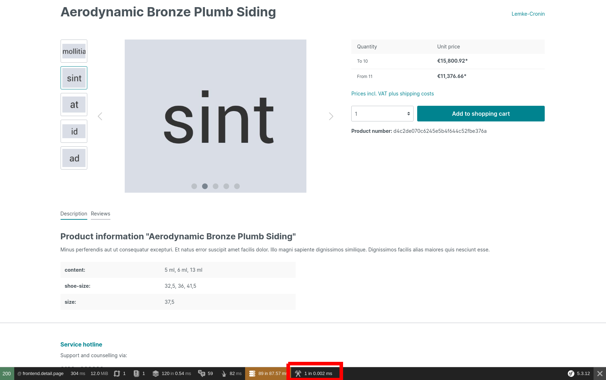
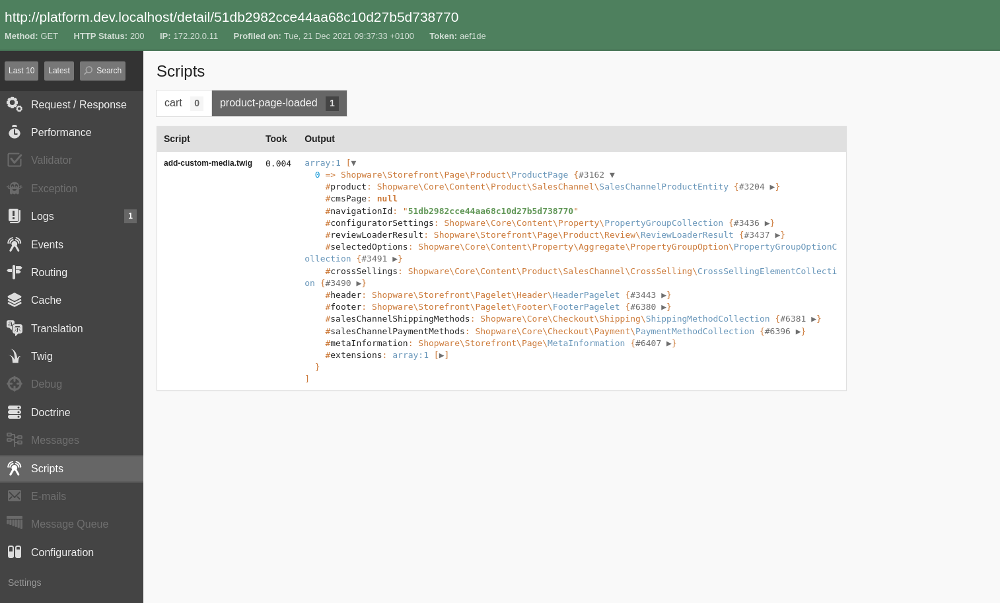

# App Scripts

App Scripts allow your app to include logic that is executed inside the Shopware execution stack. It allows you to build richer extensions that integrate more deeply with Shopware.

::: info
Note that app scripts were introduced in Shopware 6.4.8.0 and are not supported in previous versions.
:::

## Script hooks

The entry point for each script is the so-called "Hooks". You can register one or more scripts inside your app that should be executed whenever a specific hook is triggered.
Through the hook, your script gets access to the data of the current execution context and can react to or manipulate the data in some way.  

See the [Hooks reference](../../../../resources/references/app-reference/script-reference/script-hooks-reference.md) for a complete list of all available.

## Scripts

At the core, app scripts are [twig files](https://twig.symfony.com/) executed in a sandboxed environment. Based on which hook the script is registered to, the script has access to the data of that hook and pre-defined services that can be used to execute your custom logic.

Apps scripts are placed in the `Resources/scripts` directory of your app. For each hook, you want to execute a script on, create a new subdirectory. The name of the subdirectory needs to match the name of the hook.

You can place one or more `.twig` files inside each of these subdirectories, which will be executed when the hook gets triggered.

The file structure of your apps should look like this:

```text
└── DemoApp
    ├── Resources
    │   └── scripts                         // all scripts are stored in this folder
    │       ├── product-page-loaded         // each script in this folder will be executed when the `product-page-loaded` hook is triggered
    │       │   └── my-first-script.twig
    │       ├── cart
    │       │   ├── first-cart-script.twig
    │       │   └── second-cart-script.twig // you can execute multiple scripts per hook
    │       └── ...
    └── manifest.xml
```

### Including scripts

Sometimes scripts can become more complex or you want to extract common functionality. Thus it is handy to split your scripts into smaller parts that can later be included in other scripts.

In order to do that you can compose your reusable scripts into [twig macros](https://twig.symfony.com/doc/3.x/tags/macro.html), put them inside a dedicated `include` folder and then import them using the [twig import functionality](https://twig.symfony.com/doc/3.x/tags/import.html).

```text
└── DemoApp
    ├── Resources
    │   └── scripts                         
    │       ├── include    
    │       │   └── media-repository.twig         // this script may be included into the other scripts
    │       ├── cart
    │       │   ├── first-cart-script.twig
    │       └── ...
    └── manifest.xml
```

Note that app scripts can use the `return` keyword to return values to the caller.

A basic example may look like this:

```twig
// Resources/scripts/include/media-repository.twig

    
    
     

```

```twig
// Resources/scripts/cart/first-cart-script.twig



```

### Interface Hooks

Some "Hooks" describe interfaces this means that your scripts for that hook need to implement one or more functions.
E.g., the `store-api-hook` defines a `cache_key` and a `response` function. Those functions are closely related but are executed separately.
To implement the different functions, you use different twig blocks with the name of the function:

```twig

    // provide a cacheKey for the incoming request



    // produce the response for the request

```

Some functions are optional, whereas others are required. In the above example the `cache_key` function is optional.
That means you can omit that block in your script without an error (but caching for the endpoint won't work in that case).
The `response` function is required, which means that if your script does not provide a `response` block, it will lead to an error.

Note that for each function, you get access to different input data or services, so in the `cache_key` block, you don't necessarily have access to the same data and services as in the `response` block.
The available data and services are described for each hook (or each function in InterfaceHooks) in the [reference documentation](../../../../resources/references/app-reference/script-reference/script-hooks-reference.md).

### Translation

Inside the app script, you have access to the [Storefront translation mechanism](../../plugins/storefront/add-translations.md) by using the `|trans`-filter.

```twig



```

### Extended syntax

In addition to the default twig syntax, app scripts can also use a more PHP-flavoured syntax.

#### Equals check with `===`

Instead of using the rather verbose ``, you can use the more dense `===` equality checks.

```twig

    ...

```

Additionally, you can also use the `!==` not equals operator as well.

```twig

    ...

```

#### Loops with `foreach`

Instead of the `for...in` syntax for loops, you can also use a `foreach` tag.

```twig

    {{ entry }}
    

```

#### Instance of checks with `is`

You can use a `is` check to check the type of a variable.

```twig

    ...

```

The following types are supported:

* `true`
* `false`
* `boolean` / `bool`
* `string`
* `scalar`
* `object`
* `integer` / `int`
* `float`
* `callable`
* `array`

#### Type casts with `intval`

You can cast variables into different types with the `intval` filter.

```twig

    {# always evaluates to true #}

```

The following type casts are supported:

* `intval`
* `strval`
* `boolval`
* `floatval`

#### conditions with `&&` and `||`

Instead of using `AND` or `OR` in if-conditions, you can use the `&&` or `||` shorthands.

```twig

    ...

```

#### `return` tag

You can use the `return` tag to return values from inside macros.

```twig
 
     

```

## Available services

Depending on the hook that triggered the execution of your script, you get access to different services you can use inside your scripts, e.g. to access data inside Shopware or to manipulate the cart.
Take a look at the [Hook reference](../../../../resources/references/app-reference/script-reference/script-hooks-reference.md) to get a complete list of all available services per hook.

Additionally, we added a `ServiceStubs`class that can be used as typehint in your script, so you get auto-completion features of your IDE.

```twig
{# @var services \Shopware\Core\Framework\Script\ServiceStubs #}


```

::: info
The stub class contains all services, but not all of them are available depending on the hook.
:::

## Example Script - loading media entities

Assuming your app adds a [custom field set](../custom-data/custom-fields.md) for the product entity with a custom media entity select field.

When you want to display the file of the media entity in the [Storefront](../storefront/README.md), it is not easily possible because, in the template's data, you only get the id of the media entity, but not the URL of the media file itself.

For this case, you can add an app script on the `product-page-loaded`
hook, which loads the media entity by id and adds it to the page object so the data is available in templates.

```twig
// Resources/scripts/product-page-loaded/add-custom-media.twig
{# @var services \Shopware\Core\Framework\Script\ServiceStubs #}


{# @var page \Shopware\Storefront\Page\Product\ProductPage #}


    







```

For a more detailed example of how to load additional data, refer to the [data loading guide](./data-loading.md).

Alternatively, take a look at the [cart manipulation guide](./cart-manipulation.md) to get an in-depth explanation of how to manipulate the cart with scripts.

## Developing/debugging scripts

You can get information about what scripts were triggered on a specific Storefront page inside the [Symfony debug toolbar](https://symfony.com/doc/current/the-fast-track/en/5-debug.html#discovering-the-symfony-debugging-tools).

::: info
The debug toolbar is only visible if your Shopware installation is in `APP_ENV = dev`. Ensure to set the correct env, e.g., in your `.env` file, when developing app scripts.
:::

You can find all hooks that are triggered and the scripts that are executed for each by clicking on the `script` icon.



That will open the Symfony profiler in the script detail view, where you can see all triggered hooks and the count of the scripts executed for each script at the top.


Additionally, you can use the `debug.dump()` function inside your scripts to dump data to the debug view.
A script like this:

```twig

```

Will dump the page object to the debug view.


