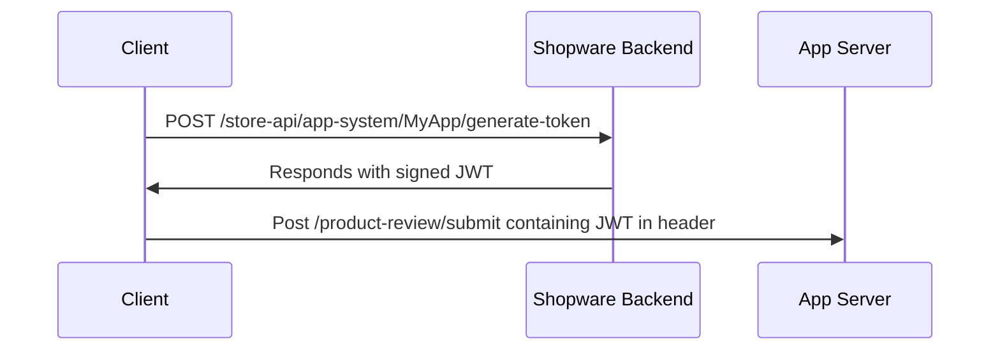

---
nav:
  title: Client-side communication to the app backend
  position: 30
---

# Client-App backend communication

Direct communication from the browser to the app backend involves generating a JSON Web Token (JWT).
This token contains session-specific information, as [claims](#the-json-web-token), and is securely signed by the shop.
This mechanism ensures a secure exchange of data between the client and the app backend.

::: warning
The JWT can be only generated when in the browser the user is logged-in.
:::

## The Flow



## The JSON Web Token

The JWT contains the following claims:

- `languageId` - the language ID of the current session
- `currencyId` - the currency ID of the current session
- `customerId` - the customer ID of the current session
- `countryId` - the country ID of the current session
- `salesChannelId` - the sales channel ID of the current session

The claims are only set when the app has permission to that specific entity like `sales_channel:read` for `salesChannelId` claim.

The JWT is signed with `SHA256-HMAC` and the secret is the `appSecret` from the app registration and the `issued by` is the shopId also from the registration.

## Generate JSON Web Token

::: info
This feature has been introduced with Shopware version 6.5.5.0
:::

The JWT is generated with a POST request against `/store-api/app-system/{name}/generate-token` or `/app-system/{name}/generate-token`.

<Tabs>

<Tab title="Storefront">

For the Storefront usage, there is a HTTP client helper, which handles the token generation and lets you directly call your app backend.

```javascript
import AppClient from 'src/service/app-client.service.ts';

const client = new AppClient('MyAppName');

// the second parameter is 
client.get('https://my-app-backend.com/foo', {
    headers: {}, // the parameters are same as https://developer.mozilla.org/en-US/docs/Web/API/Fetch_API/Using_Fetch
})
client.put('https://my-app-backend.com/foo')
client.post('https://my-app-backend.com/foo')
client.patch('https://my-app-backend.com/foo')
client.delete('https://my-app-backend.com/foo')
```

</Tab>

<Tab title="Custom">

If you want to generate the JWT yourself, you can use the following code snippet:

```javascript
const response = await fetch('/store-api/app-system/{name}/generate-token', {
    method: 'POST'
});

// send token as 'shopware-app-token' header and shopId as 'shopware-app-shop-id' header to your app server.
const { token, shopId } = await response.json();
```

</Tab>

</Tabs>

::: info
Requesting from the browser to the app backend is only possible when your app backend allows [CORS](https://developer.mozilla.org/en-US/docs/Web/HTTP/Guides/CORS) requests. Example:

- Access-Control-Allow-Origin: *
- Access-Control-Allow-Methods: GET, POST, OPTIONS
- Access-Control-Allow-Headers: shopware-app-shop-id, shopware-app-token
:::

## Validate the JSON Web Token

<Tabs>

<Tab title="App PHP SDK">

```php
$shop = $shopResolver->resolveShop($serverRequest);

$storefront = $contextResolver->assembleStorefrontRequest($serverRequest, $shop);

$storefront->claims->getCustomerId();
```

</Tab>

<Tab title="Symfony Bundle">

The request from the Storefront to your app server will require that you set up CORS on your application.
We recommend [NelmioCorsBundle](https://symfony.com/bundles/NelmioCorsBundle/current/index.html) for this with allowed headers:
`shopware-app-shop-id, shopware-app-token` and allowed origin `*`.

```php
use Shopware\App\SDK\Context\Storefront\StorefrontAction;
use Symfony\Component\HttpFoundation\Response;
use Symfony\Component\HttpKernel\Attribute\AsController;
use Symfony\Component\Routing\Attribute\Route;

#[AsController]
class StorefrontController {
    #[Route('/storefront/action')]
    public function handle(StorefrontAction $webhook): Response
    {
        // handle action
        
        return new Response(null, 204);
    }
}
```

</Tab>

<Tab title="Custom">

Fetch the shop by the `shopware-app-shop-id` header and create a JWT verifier with the app secret as `HMAC-SHA256` secret.
Verify the JWT (shopware-app-token) with the verifier.

</Tab>

</Tabs>
