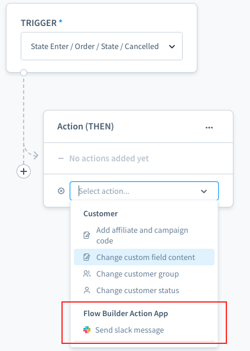

---
nav:
  title: Add custom flow action from app system
  position: 10

---

# Add custom flow actions

::: info
Custom flow actions in Shopware Apps are available starting with Shopware 6.4.10.0 and are not supported in previous versions.
:::

Besides the default actions, developers can add custom, predefined, and configurable web hook actions to the flow builder.



After reading, you will be able to

* Create the basic setup of an app
* Create custom actions for the flow builder
* Use custom actions to interact with third-party services

## Prerequisites

Please make sure you already have a working Shopware 6 store running (either cloud or self-hosted). Prior knowledge about the Flow Builder feature of Shopware 6 is useful.

Please see the [Flow Builder Concept](../../../../concepts/framework/flow-concept) for more information.

## Create the app wrapper

To get started with your app, create an `apps` folder inside the `custom` folder of your Shopware dev installation. In there, create another directory for your application and provide a `manifest.xml` file, following the structure below:

```text
└── custom
    ├── apps
    │   └── FlowBuilderActionApp
    │       └── Resources
    │           └── flow-action.xml
    │           └── app-icon.png
    │           └── slack-icon.png
    │       └── manifest.xml
    └── plugins
```

::: info
From 6.5.2.0, you can define the flow action in `flow.xml`. The `flow-action.xml` will be removed from 6.6.0.0.
:::

| File name | Description |
| :--- | :--- |
| FlowBuilderActionApp | Your app's technical name |
| app-icon.png | The app's icon |
| slack-icon.png | Your action icon will be defined for each action in the `flow-action.xml` file. (optional, icons will default to a fallback) |
| flow-action.xml | Place to define your new actions |
| manifest.xml | Base information about your app |

### Manifest file

The manifest file is the central point of your app. It defines the interface between your app and the Shopware instance. It provides all the information concerning your app, as seen in the minimal version below:

::: code-group

```xml [manifest.xml]
<?xml version="1.0" encoding="UTF-8"?>
<manifest xmlns:xsi="http://www.w3.org/2001/XMLSchema-instance" xsi:noNamespaceSchemaLocation="https://raw.githubusercontent.com/shopware/shopware/trunk/src/Core/Framework/App/Manifest/Schema/manifest-3.0.xsd">
    <meta>
        <name>FlowBuilderActionApp</name>
        <label>Flow Builder Action App</label>
        <label lang="de-DE">Flow Builder Aktions-App</label>
        <description>This is the example description for app</description>
        <description lang="de-DE">Dies ist die Beispielbeschreibung für app</description>
        <author>shopware AG</author>
        <copyright>(c) shopware AG</copyright>
        <version>4.14.0</version>
        <icon>Resources/app-icon.png</icon>
        <license>MIT</license>
    </meta>
</manifest>
```

:::

::: warning
The name of your app that you provide in the manifest file needs to match the folder name of your app.
:::

## Define the flow action

To create a flow action, you need to define a `<flow-action>` block within a file called `flow-action.xml`. Each `<flow-action>` represents one action and you can define an arbitrary number of actions.

```xml
// Resources/flow-action.xml
<flow-actions xmlns:xsi="http://www.w3.org/2001/XMLSchema-instance" xsi:noNamespaceSchemaLocation="https://raw.githubusercontent.com/shopware/shopware/trunk/src/Core/Framework/App/Flow/Schema/flow-1.0.xsd">
    <flow-action>
        ... # The first action
    </flow-action>
    <flow-action>
        ... # The second action
    </flow-action>
    <flow-action>
        ... # The third action
    </flow-action>
    ...
</flow-actions>
```

From 6.5.2.0, to create a flow action, you must define a `<flow-actions>` block within a file called `flow.xml`. Each `<flow-action>` in `<flow-actions>` represents one action, and you can define an arbitrary number of actions.

```xml
<flow-extensions xmlns:xsi="http://www.w3.org/2001/XMLSchema-instance" xsi:noNamespaceSchemaLocation="https://raw.githubusercontent.com/shopware/shopware/trunk/src/Core/Framework/App/Flow/Schema/flow-1.0.xsd">
    <flow-actions>
        <flow-action>
            ... # The first action
        </flow-action>
        <flow-action>
            ... # The second action
        </flow-action>
        <flow-action>
            ... # The third action
        </flow-action>
    </flow-actions>
    ...
</flow-extensions>
```

A single flow action would look like this:

```xml
<flow-action>
    <meta>
        <name>slackmessage</name>
        <label>Send slack message</label>
        <label lang="de-DE">Slack-Nachricht senden</label>
        <badge>Slack</badge>
        <description>Slack send message description</description>
        <description lang="de-DE">Dies ist die Beispielbeschreibung für app</description>
        <url>https://hooks.slack.com/services/{id}</url>
        <sw-icon>default-communication-speech-bubbles</sw-icon>
        <icon>slack.png</icon>
        <requirements>orderAware</requirements>
        <requirements>customerAware</requirements>
    </meta>
    ...
</flow-action>
```

| Key | Required | Description |
| :--- | :--- | :--- |
| name | yes | The technical name of your action, unique for all actions |
| label | yes | A name to be shown for your action in the actions list or action modal title |
| badge | no | An attached badge shown behind the label in the action modal title |
| description | yes | Detailed information for your action |
| sw-icon | no | An icon component name from the [icon library](https://component-library.shopware.com/icons/) |
| icon | no | Alternatively, a path to your action icon. In the case you define both `<sw-icon>` and `<icon>`, the `<icon>` will be take precedence in this case. |
| requirements | yes | Available action triggers, read more below |
| url | yes | External webhook location. Shopware will call this URL when the action is executed |

**requirements**

Requirements will decide for which trigger events your action is available.
Example: The `checkout.order.placed` has an `orderAware` requirements - indicating that your action is allow to use be used in the `checkout.order.placed` event. It is defined using `<requirements>orderAware</requirements>` in your app action definition.

For each value when you define, it'll represent one of the `aware` interfaces from the `core`.

To fulfill the requirements, refer to a subset of action triggers aware:

| Value | Interface |
| :--- | :--- |
| customerAware | Shopware\Core\Framework\Event\CustomerAware |
| customerGroupAware | Shopware\Core\Framework\Event\CustomerGroupAware |
| delayAware | Shopware\Core\Framework\Event\DelayAware |
| mailAware | Shopware\Core\Framework\Event\MailAware |
| orderAware | Shopware\Core\Framework\Event\OrderAware |
| salesChannelAware | Shopware\Core\Framework\Event\SalesChannelAware |
| userAware | Shopware\Core\Framework\Event\UserAware |

### Header parameters

```xml
<flow-action>
    <meta>
        ...
    </meta>
    <headers>
        <parameter type="string" name="content-type" value="application/json"/>
    </headers>
    ...
</flow-action>
 ```

| Key | Description |
| :--- | :--- |
| type | Parameter type - currently only `string` supported |
| name | The header key |
| value | The header value |

### Parameters

```xml
<flow-action>
    <meta>
        ...
    </meta>
    <headers>
        ...
    </headers>
    <parameters>
        <parameter type="string" name="text" value="{{ message }} \n Order Number: {{ order.orderNumber }}"/>
    </parameters>
    ...
</flow-action>
 ```

Define the `parameter` for the URL body based on your URL webhook services.

| Key | Description |
| :--- | :--- |
| type | Type of parameter, only support `string` type. |
| name | The body key for your URL. |
| value | The content message for your URL; free to design your content message here. |
| <code v-pre>{{ message }}</code> | The variable from your `<input-field>` defined in `flow-action.xml`. |
| <code v-pre>{{ order.orderNumber }}</code> | For each trigger event, the action will have the variables suitable. [Read more variables here](../../../../resources/references/app-reference/flow-action-reference). |

With the parameters configured like described above, an exemplary call of your Webhook Action could look like this:

```text
    POST https://hooks.slack.com/services/{id} {
        headers:
            content-type: application/json
        body:
            text: {{ message }} \n Order Number: {{ order.orderNumber }}
    }
```

### Action configuration

You can make your flow action configurable in the Administration by adding input fields. Based on your configuration - similar to the [app configurations](../../plugins/plugin-fundamentals/add-plugin-configuration) - you can later on use these configuration values within flow parameters.

```xml
<flow-action>
    <meta>
        ...
    </meta>
    <headers>
        ...
    </headers>
    <parameters>
        ...
    </parameters>
    <config>
        <input-field type="text">
            <name>message</name>
            <label>Message</label>
            <label lang="de-DE">Gegenstand</label>
            <place-holder>Placeholder</place-holder>
            <place-holder lang="de-DE">Platzhalter</place-holder>
            <required>true</required>
            <helpText>Help Text</helpText>
            <helpText lang="de-DE">Hilfstext</helpText>
        </input-field>
    </config>
</flow-action>
```

Available input field attributes:

| Key | Required |
| :--- | :--- |
| name | Yes |
| label | Yes |
| place-holder | No |
| required | No |
| helpText | No |

You assemble your configuration from a variety of input fields.

::: info
To get more information on how to create configuration forms, see [Plugin Configurations](../../plugins/plugin-fundamentals/add-plugin-configuration#the-different-types-of-input-field).
:::

| Type | Shopware component |
| :--- | :--- |
| text | `<sw-text-field/>` |
| textarea | `<sw-textarea-field/>` |
| text-editor | `<sw-text-editor/>` |
| url | `<sw-url-field/>` |
| password | `<sw-password-field/>` |
| int | `<sw-number-field/>` |
| float | `<sw-number-field/>`  |
| bool | `<sw-switch-field/>`  |
| checkbox | `<sw-checkbox-field/>`  |
| datetime | `<sw-datepicker/>`  |
| date | `<sw-datepicker/>` |
| time | `<sw-datepicker/>` |
| colorpicker | `<sw-colorpicker/>` |
| single-select | `<sw-single-select/>` |
| multi-select | `<sw-multi-select/>` |

## Install the App

The app can now be installed by running the following command:

```bash
bin/console app:install --activate FlowBuilderActionApp
```

## Further steps

* [Flow action example configuration](../../../../resources/references/app-reference/flow-action-reference) page
* [Schema definition for flow actions (GitHub)](https://github.com/shopware/shopware/blob/trunk/src/Core/Framework/App/Flow/Schema/flow-1.0.xsd)`
