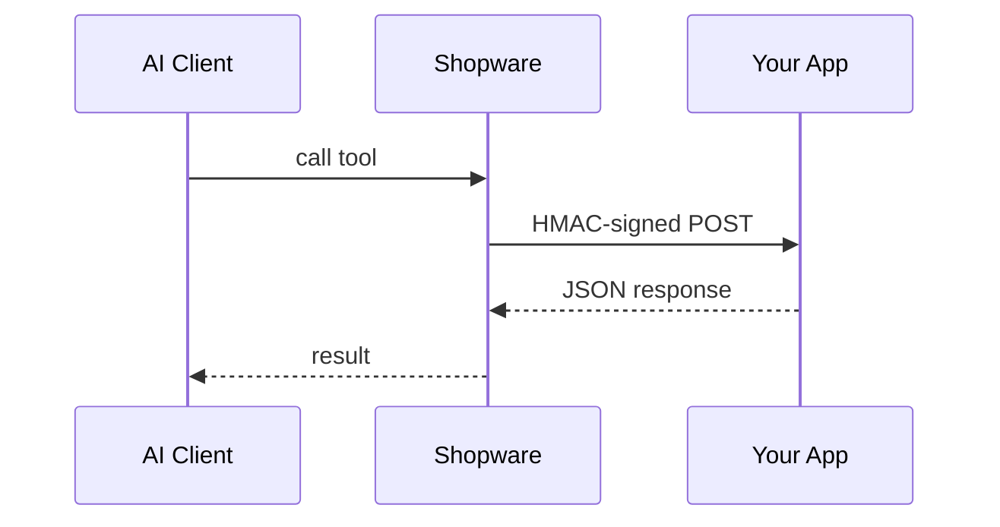

---
nav:
  title: MCP Server Extension
  position: 80

---

# Extending the MCP Server via App

Shopware apps can add custom tools, prompts, and resources to the MCP server through a declarative `Resources/mcp.xml` file. When an AI client calls an app tool, Shopware sends an HMAC-signed HTTP POST to your app's endpoint and returns the response to the client.

Use an app when:

- Your capability runs on a remote service (ERP, PIM, CRM, SaaS backend)
- You want cloud compatibility (apps work in Shopware Cloud environments where plugins cannot run)
- Your capability needs to scale or deploy independently from Shopware
- You are building a SaaS integration where isolation matters more than in-process performance

For in-process PHP with full DAL access, see [Extending via Plugin](../plugins/mcp-server.md). For a side-by-side comparison of all three extension types, see [Extending the MCP Server](../../development/tooling/mcp-server/extending.md).

## How app capabilities work



All three capability types (tools, prompts, resources) follow the same lifecycle:

| Step | Tools | Prompts | Resources |
|---|---|---|---|
| Declared in | `mcp.xml` | `mcp.xml` | `mcp.xml` |
| Persisted on install | `app_mcp_tool` | `app_mcp_prompt` | `app_mcp_resource` |
| Loaded at runtime | `AppMcpToolLoader` | `AppMcpPromptLoader` | `AppMcpResourceLoader` |
| Executed via | HMAC-signed POST | HMAC-signed POST | HMAC-signed POST |

## Naming convention

Names declared in `mcp.xml` are automatically prefixed with the app name at install time:

```text
app name: "my-erp"
declared name: "sync-orders"
→ final tool name: "my-erp-sync-orders"
```

Names must only contain `a-zA-Z0-9_-` (no dots). The `shopware-` prefix is reserved for core tools; app names that would produce a `shopware-` prefixed capability are silently skipped.

## `mcp.xml` structure

Place `Resources/mcp.xml` in your app bundle:

```xml
<?xml version="1.0" encoding="UTF-8"?>
<mcp xmlns:xsi="http://www.w3.org/2001/XMLSchema-instance"
     xsi:noNamespaceSchemaLocation="https://developer.shopware.com/docs/assets/mcp-1.0.xsd">

    <mcp-tools>
        <mcp-tool name="sync-orders" url="https://app.example.com/mcp/sync-orders">
            <label>Sync Orders</label>
            <label lang="de-DE">Bestellungen synchronisieren</label>
            <description>Synchronize orders with the external ERP system</description>
            <input-schema>
                <property name="since" type="string" description="ISO 8601 date, sync orders after this date" required="true"/>
                <property name="limit" type="integer" description="Maximum number of orders to sync" required="false"/>
            </input-schema>
            <required-privileges>
                <privilege>order:read</privilege>
                <privilege>order:update</privilege>
            </required-privileges>
        </mcp-tool>
    </mcp-tools>

    <mcp-prompts>
        <mcp-prompt name="erp-context" url="https://app.example.com/mcp/prompts/erp-context">
            <label>ERP Context</label>
            <description>Background context for working with ERP-synced data</description>
        </mcp-prompt>
    </mcp-prompts>

    <mcp-resources>
        <mcp-resource name="erp-status" url="https://app.example.com/mcp/resources/erp-status">
            <label>ERP Status</label>
            <description>Current ERP connection status and last sync timestamp</description>
        </mcp-resource>
    </mcp-resources>

</mcp>
```

### Input schema properties

Each `<property>` maps to a JSON Schema property in the tool's `inputSchema`:

| Attribute | Required | Description |
|---|---|---|
| `name` | yes | Parameter name |
| `type` | yes | JSON Schema type: `string`, `integer`, `number`, `boolean`, `array`, `object` (default: `string`) |
| `description` | no | Description shown to the AI client |
| `required` | no | Whether the parameter is required (default: `false`) |

### Required privileges

List the ACL privileges your tool needs with `<required-privileges>`. The admin UI uses this list to warn operators when an integration's role is missing privileges a tool expects.

How strictly these privileges are enforced depends on the URL mode:

- **External URL** (`https://...`): informational only. Shopware does not check these privileges before calling your webhook. Your app must enforce them on its own side — for example by validating `source.shopId` against what that shop is permitted to do in your backend.
- **Internal path** (`/api/...`): enforced by Shopware. The call is dispatched as a Symfony subrequest through the normal Admin API stack, so the integration's ACL role is checked just like any other API call. Declare the privileges accurately so the Admin UI can warn operators about gaps.

## URL modes: external vs internal

The `url` attribute supports two modes:

- **External URL** (`https://...`): Shopware sends an HMAC-signed POST to your remote endpoint. This is the default for SaaS integrations and any app hosted outside Shopware.
- **Internal path** (`/...`): Shopware dispatches the call as a Symfony subrequest. This lets an app use [app scripts](../app-scripts/) to serve capability logic without running an external server. Example: `url="/api/script/mcp-greet"`.

Use the internal-path mode when your tool is a thin wrapper around data Shopware already has. Use external URLs when you need to call out to an ERP, PIM, or any system Shopware cannot reach directly.

## Webhook protocol

When the AI client calls a tool, Shopware sends an HTTP POST to the URL declared in `mcp.xml`:

**Request body:**

```json
{
  "tool": "my-erp-sync-orders",
  "arguments": {
    "since": "2026-01-01",
    "limit": 100
  },
  "source": {
    "url": "https://shop.example.com",
    "shopId": "abc123def456",
    "appVersion": "1.2.0"
  }
}
```

| Field | Description |
|---|---|
| `tool` | The full tool name (app prefix + declared name) |
| `arguments` | The arguments provided by the AI client |
| `source.url` | The shop's base URL |
| `source.shopId` | Unique shop identifier. Use this for multi-tenant app backends |
| `source.appVersion` | Installed version of the app |

For prompts, the request body uses `prompt` instead of `tool`, and arguments are omitted:

```json
{
  "prompt": "my-erp-erp-context",
  "source": {
    "url": "https://shop.example.com",
    "shopId": "abc123def456",
    "appVersion": "1.2.0"
  }
}
```

The response must be a JSON array of message objects:

```json
[
  {"role": "user", "content": "You are working with ERP-synced Shopware data..."}
]
```

For resources, the request body uses `resource` instead of `tool`:

```json
{
  "resource": "my-erp-erp-status",
  "source": {
    "url": "https://shop.example.com",
    "shopId": "abc123def456",
    "appVersion": "1.2.0"
  }
}
```

The response must be a single object with `uri`, `mimeType`, and `text`:

```json
{"uri": "my-erp://erp-status", "mimeType": "application/json", "text": "{\"connected\": true}"}
```

## Verifying the signature

Every webhook request is signed with HMAC-SHA256 using your app secret. Always verify the `shopware-shop-signature` header before processing the request:

```javascript
// Node.js example
const crypto = require('crypto');

function verifySignature(body, signature, appSecret) {
    const expected = crypto
        .createHmac('sha256', appSecret)
        .update(body)
        .digest('hex');
    return crypto.timingSafeEqual(
        Buffer.from(signature),
        Buffer.from(expected)
    );
}

app.post('/mcp/sync-orders', (req, res) => {
    const signature = req.headers['shopware-shop-signature'];
    const rawBody = req.rawBody; // unparsed request body string

    if (!verifySignature(rawBody, signature, process.env.APP_SECRET)) {
        return res.status(401).json({ error: 'Invalid signature' });
    }

    const { arguments: args, source } = req.body;
    // ... handle the tool call
});
```

## Returning a response

Return a JSON string as the tool result. Shopware forwards this to the AI client as-is:

```json
{"success": true, "data": {"synced": 42, "errors": 0}}
```

For consistency with core tools, follow the `{"success": bool, "data": ..., "_meta": ...}` / `{"success": false, "error": "..."}` convention. Shopware does not reject responses that omit `success`, but it logs a warning when the field is missing so operators can spot broken handlers.

**Timeout:** App webhook calls time out after `shopware.mcp.app_tool_timeout` seconds (default: 10). Keep responses fast or use async patterns with status polling.

## Locale resolution

Labels and descriptions in `mcp.xml` support translations via `lang` attributes. Shopware resolves them against the system's default locale at load time. If a translation for the active locale is not found, it falls back to `en-GB`.

## Installing the app

Apps are installed through the standard Shopware app lifecycle (Settings → Extensions → My Apps, or via the Shopware CLI). After installation, your MCP capabilities appear automatically in the server's tool list.

Verify with:

```bash
bin/console debug:mcp
```

Your tools appear with **Source: app** in the output. To see what a specific integration can reach (respecting its per-integration allowlist), pass `--integration=SWIA...` with the integration's access key.

## Further reading

- [MCP Concepts](../../development/tooling/mcp-server/mcp-concepts.md): tools, resources, and prompts explained
- [Best Practices](../../development/tooling/mcp-server/best-practices.md): design principles for MCP tools
- [Extending via Plugin](../plugins/mcp-server.md): in-process PHP alternative
- [McpHelloWorld](https://github.com/shopwareLabs/McpHelloWorld): minimal example app registering tools, prompts, and resources via webhook
