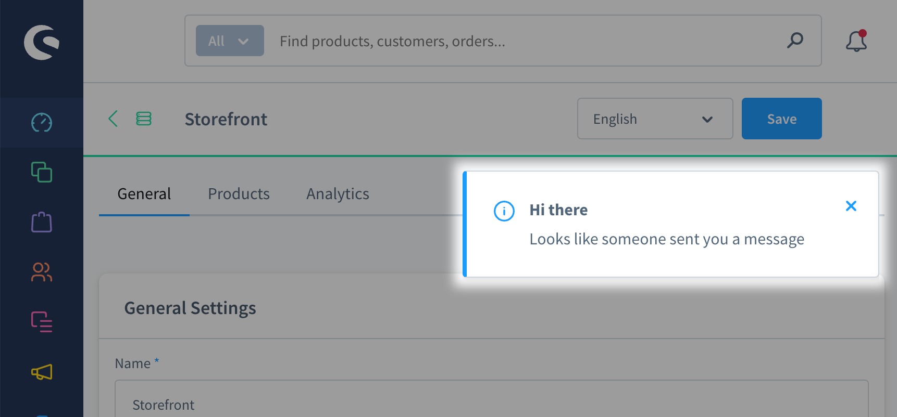
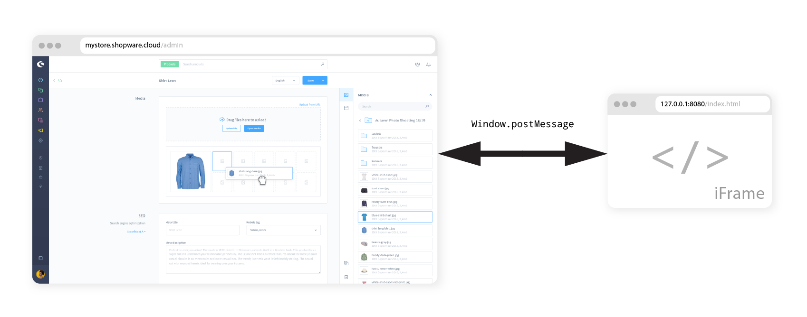

---
nav:
  title: Starter Guide - Create Admin Extensions
  position: 30

---

# Starter Guide - Create an Admin Extension

In this guide, you will learn how to set up an extension for the Administration UI.



## Prerequisites

To follow this guide, make sure you are familiar with and meet the following requirements:

* Basic CLI usage (creating files, directories, running commands)
* Installed [shopware-cli](../../../../products/cli/) tools
* We will use the following libraries/software
    * npm
    * live-server (small local development live-reloading server)


## Create the app

First, we need to create the app "wrapper", the so-called app manifest. It is just a single XML file with some basic configuration.

### Create a manifest file

We create the manifest file in a new directory. We'll call that our "project directory".

```text
SimpleNotification/
├─ manifest.xml
```

::: info
When you are using a self-hosted Shopware version, you can also create the project directory in the `custom/apps` directory of your Shopware installation. However, the descriptions in this guide apply to both Shopware cloud and self-hosted stores.
:::

Next, we will put our basic configuration into the file we just created.

::: code-group

```xml [manifest.xml]
<?xml version="1.0" encoding="UTF-8"?>
<manifest xmlns:xsi="http://www.w3.org/2001/XMLSchema-instance" xsi:noNamespaceSchemaLocation="https://raw.githubusercontent.com/shopware/shopware/trunk/src/Core/Framework/App/Manifest/Schema/manifest-2.0.xsd">
    <meta>
        <name>SimpleNotification</name>
        <label>Hi Developer App</label>
        <description>This app shows a notification in the admin panel</description>
        <author>shopware AG</author>
        <copyright>(c) shopware AG</copyright>
        <version>1.0.0</version>
        <license>MIT</license>
    </meta>
</manifest>
```

:::

## Set up communication between Shopware and the app

Next, we need to set up an entry point, so Shopware and your app can communicate. The entry point is a static `.html` file, which includes the Extension SDK script and defines our extension.



The file will be rendered as a hidden iFrame within your admin panel. Using `postMessage` requests, the iFrame and your admin panel can communicate and exchange data.

Let's create an `index.html` file in a directory called `src`.

```text
SimpleNotification/
├─ src/
│  ├─ index.html
├─ manifest.xml
```

```html
// src/index.html
<!doctype html>
<html>
    <head>
        <script src="https://unpkg.com/@shopware-ag/meteor-admin-sdk/cdn"></script>
    </head>
    <script>
        sw.notification.dispatch({
            title: 'Hi there',
            message: 'Looks like someone sent you a message'
        });
    </script>
</html>
```

This file contains the basic setup for our app to display the notification:

* The HTML is rendered in a hidden iFrame when the Administration panel is loaded.
* The Meteor Admin SDK script is loaded through a CDN and exposed as the `sw` object.
* We use the `notification.dispatch` SDK method to display a simple notification with a title and a message.

### Start the local development server

Next, we need to start the live server, so you don't always have to reload the page manually.

```bash
npm install -g live-server
live-server src
```

Now the file should be available on [http://127.0.0.1:8080](http://127.0.0.1:8080).

::: info
When you call this URL the page will be empty because the iFrame is hidden.
:::

### Register the app

Next, we need to register the app server with the Shopware shop. This is done by sending a `POST` request to the `/app/lifecycle/register` endpoint.

This server can be hosted anywhere, but for this example, we will use the [Shopware App Server SDK](https://github.com/shopware/app-sdk-js)

::: code-group

```xml [manifest.xml]
<?xml version="1.0" encoding="UTF-8"?>
<manifest xmlns:xsi="http://www.w3.org/2001/XMLSchema-instance" xsi:noNamespaceSchemaLocation="https://raw.githubusercontent.com/shopware/shopware/trunk/src/Core/Framework/App/Manifest/Schema/manifest-2.0.xsd">
  <meta>
    ...
  </meta>
  <setup>
    <registrationUrl>http://localhost:3000/app/register</registrationUrl>
    <secret>Test</secret>
  </setup>
  <webhooks>
    <webhook name="appActivate" url="http://localhost:3000/app/activate" event="app.activated"/>
    <webhook name="appDeactivated" url="http://localhost:3000/app/deactivate" event="app.deactivated"/>
    <webhook name="appDelete" url="http://localhost:3000/app/delete" event="app.deleted"/>
  </webhooks>
</manifest>
```

:::

We can install this SDK wherever on our local machine. We can choose between cloudflare, deno, bun or node. To keep it simple, we will use node.

```bash
npx tiged shopware/app-sdk-js/examples/node-hono demo-app
cd demo-app
npm install
npm start
```

This will create a new directory called `demo-app` with the app server SDK and start a local server on port 3000.

The `registrationUrl` is the URL where the app server will be registered. The `secret` is a random string that is used to verify the requests from the app server.

If you adjust the `name` of the app or the `secret` in the `manifest.xml` file, make sure to also adjust them in the app server SDKs index.ts file.

```typescript
configureAppServer(app, {
  appName: "SimpleNotification",
  appSecret: "Test",
  shopRepository: new BetterSqlite3Repository('shop.db')
});
```

Otherwise, the app server will not be able to verify the requests from the app.

The webhooks are used to notify the app server when the app is activated, deactivated or deleted. The `url` is the URL where the app server will receive the webhook requests.

### Add the entry point link to your manifest

The final step of the setup is to configure your app to use the index.html file as an entry point.

To do that, we have to add an `admin` section to our `manifest.xml` file and pass it into the `base-app-url` tag:

::: code-group

```xml [manifest.xml]
<?xml version="1.0" encoding="UTF-8"?>
<manifest xmlns:xsi="http://www.w3.org/2001/XMLSchema-instance" xsi:noNamespaceSchemaLocation="https://raw.githubusercontent.com/shopware/shopware/trunk/src/Core/Framework/App/Manifest/Schema/manifest-2.0.xsd">
    <meta>
        <!-- ... -->
    </meta>
  <setup>
    <registrationUrl>http://localhost:3000/app/register</registrationUrl>
    <secret>Test</secret>
  </setup>
  <webhooks>
    <webhook name="appActivate" url="http://localhost:3000/app/activate" event="app.activated"/>
    <webhook name="appDeactivated" url="http://localhost:3000/app/deactivate" event="app.deactivated"/>
    <webhook name="appDelete" url="http://localhost:3000/app/delete" event="app.deleted"/>
  </webhooks>
  <admin>
      <base-app-url>http://127.0.0.1:8080</base-app-url>
  </admin>
</manifest>
```

:::

Since the URL to your entry point is only available locally, you will only be able to see changes on your own machine. If you want to share it, for development purposes, you need to host the entry point file somewhere or use services to expose local files as public URLs, such as [ngrok](https://ngrok.com/).

For production usage, you should host the entry point file on a public CDN or a static site hosting.

## Install the app

In this last step, we will install the app using the Shopware CLI tools.

::: info
If this is your first time using the Shopware CLI, you have to [install](../../../../products/cli/installation) it first. Next, configure it using the `shopware-cli project config init` command.
:::

```bash
shopware-cli project extension upload SimpleNotification --activate --increase-version
```

This command will create a zip file from the specified extension directory and upload it to your configured store.
The `--increase-version` parameter increases the version specified in the `manifest.xml` file. This flag is required so Shopware picks up changes made to the `manifest.xml` since the last installation.
When the app is successfully installed, you will see the notification pop up once you open the Shopware admin panel - congratulations!

## Where to continue

This example showed end-to-end how to create a local dev environment and connect it with your Shopware Store. There is a lot more to learn and try out, so why not move on with one of those topics:

* Did you know, you can add [new sections](/resources/admin-extension-sdk/api-reference/ui/component-section) to the UI or even [entire modules](/resources/admin-extension-sdk/api-reference/ui/mainModule)?
* The Meteor Admin SDK also offers [TypeScript support](/resources/admin-extension-sdk/getting-started/installation#using-npm-require-bundling) (including autocompletion)
* Don't want to extend the admin panel? Have a look at [App Scripts](/docs/guides/plugins/apps/app-scripts/index.md)
