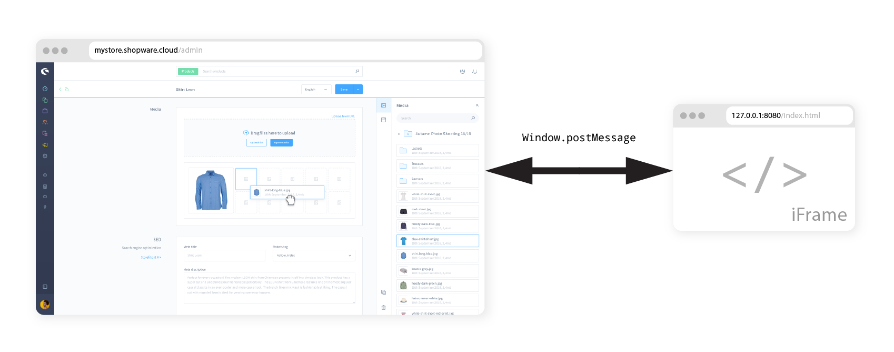

# App-Starter - Create an Admin Extension

In this guide, you will learn how to set up an extension for the administration UI.


When you are using a self-managed Shopware Version, make sure to set the feature flag `FEATURE_NEXT_17950=1` to enable the Admin Extension API.



## Prerequisites

In order to follow this guide, make sure you're familiar with and meet the following requirements:

 * Basic CLI usage (creating files, directories, running commands)
 * Installed [shopware-cli](https://sw-cli.fos.gg/) tools
 * We will use the following libraries / softwares
    * npm
    * live-server (small local development live-reloading server)

## Create the App Wrapper

First of all we need to create the app "wrapper", the so-called app manifest. It is just a single XML file with some basic configuration.

### Create manifest file

First of all, we create a new directory that contains our project.

```bash
mkdir ListingExtension
```

within that directory, we create the manifest file.

```bash
cd ListingExtension
touch manifest.xml
```


When you are using a self-managed Shopware Version, you can also create the app base directory in the `custom/apps` directory of your Shopware installation. However, the descriptions in this guide apply to both Shopware cloud and self-managed stores.


Next, we're gonna put our basic configuration into the file we just created.


```xml
<?xml version="1.0" encoding="UTF-8"?>
<manifest xmlns:xsi="http://www.w3.org/2001/XMLSchema-instance" xsi:noNamespaceSchemaLocation="https://raw.githubusercontent.com/shopware/platform/trunk/src/Core/Framework/App/Manifest/Schema/manifest-1.0.xsd">
    <meta>
        <name>ListingExtension</name>
        <label>Listing Extension App</label>
        <description>This app extends the product listing</description>
        <author>shopware AG</author>
        <copyright>(c) shopware AG</copyright>
        <version>1.0.0</version>
        <license>MIT</license>
    </meta>
</manifest>

```


## Set up communication between Shopware and the App

Next, we need to set up an entry point, so Shopware and your app can communicate. The entry point is a static `.html` file, which includes the Extension SDK script and defines our extension.



The file will be rendered as a hidden iFrame within your admin panel. Using `postMessage` requests, the iFrame and your admin panel can communicate and exchange data.

Let's create this file in a directory called `src`.

```bash
mkdir src
touch src/index.html
```


```html
<!doctype html>
<html>
    <head>
        <script src="https://unpkg.com/@shopware-ag/admin-extension-sdk/cdn"></script>
    </head>
    <script>
        sw.notification.dispatch({
            title: 'Hi there',
            message: 'Looks like someone sent you a message'
        });
    </script>
</html>

```


This file contains example code that displays a simple notification within the administration. 

### Start the local development server

Next, we need to start the live server so you don't always have to reload the page manually.

```bash
npm install -g live-server
live-server src
```

Now the file should be available on [http://127.0.0.1:8080](http://127.0.0.1:8080).

### Add the entry point link to your manifest

The final step of the setup is to configure your app to use that file as an entry point.

In order to do that, we have to add an `admin` section to our `manifest.xml` file and pass it into the `base-app-url` tag:


```xml
<?xml version="1.0" encoding="UTF-8"?>
<manifest xmlns:xsi="http://www.w3.org/2001/XMLSchema-instance" xsi:noNamespaceSchemaLocation="https://raw.githubusercontent.com/shopware/platform/trunk/src/Core/Framework/App/Manifest/Schema/manifest-1.0.xsd">
    <meta>
        <!-- ... -->
    </meta>
    <admin>
        <base-app-url>http://127.0.0.1:8080</base-app-url>
    </admin>
</manifest>
```


Since the URL passed is only available locally, you will only be able to see changes on your own machine.
If you want to share it, you need to host the entry point file somewhere or use services to expose local files as public URLs, such as [ngrok](https://ngrok.com/).

## Install the App

In this last step, we're going to install the app using the Shopware CLI tools.


If this is your first time using the Shopware CLI, you have to [install](https://sw-cli.fos.gg/install/) it first. Next, configure it using the `shopware-cli project config init` command.


```bash
shopware-cli project extension upload ListingExtension --activate --increase-version
```

This command will create a zip file from the specified extension directory and upload it to your configured store.
The `--increase-version` parameter increases the version specified in the `manifest.xml` file. This flag is required, so Shopware picks up changes made to the `manifest.xml` since the last installation.
When the app was successfully installed, you will see the notification pop up once you open the Shopware admin panel - congratulations!

## Where to continue

This example showed end-to-end how to create a local dev environment and connect it with your Shopware Store. There's a lot more to learn and try out - so why not move on with one of those topics

 * Did you know, you can add [new sections](https://shopware.github.io/admin-extension-sdk/docs/guide/api-reference/ui/component-section) to the UI or even [entire modules](https://shopware.github.io/admin-extension-sdk/docs/guide/api-reference/ui/mainModule)?
 * The Admin Extension SDK also offers [TypeScript support](https://shopware.github.io/admin-extension-sdk/docs/guide/getting-started/installation#using-npm-require-bundling) (including autocompletion)
 * Don't want to extend the admin panel? Have a look at [App Scripts](https://developer.shopware.com/docs/guides/plugins/apps/app-scripts)