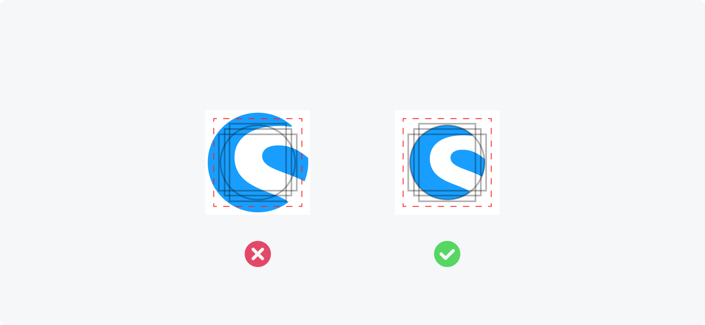
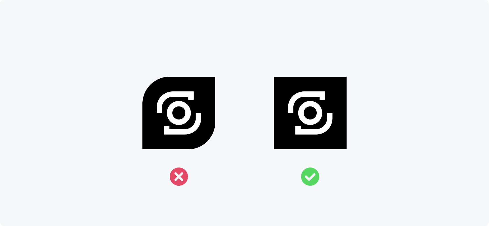
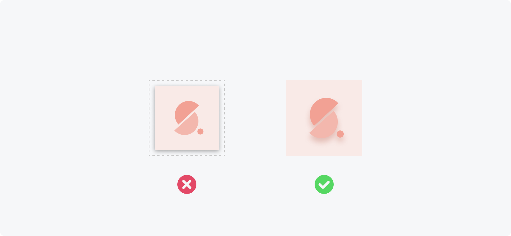
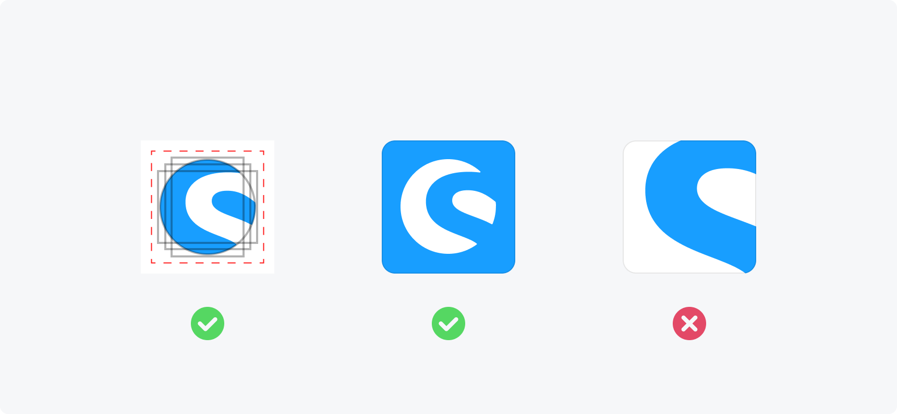

# Extension Icon Guidelines

## Why do we need guidelines?

Icon guidelines are crucial for ensuring that all extension icons fit seamlessly into Shopware UI layouts and avoid any alignment issues. By providing consistency between icons, the result is a cleaner and more uniform look that is visually appealing and easier to digest for our users.
Additionally, it ensures that all icons are of similar quality, making it easier for customers to differentiate between different extensions and make informed decisions when choosing which ones to purchase.

## Building the icon

### Technical requirements

- **Size:** 128x128 pixels
- **Format:** PNG (recommended) or JPEG
- **No transparency** (we will replace all transparency with a white background as fallback)
- **Shape:** Full-bleed square (rounded corners, shadows, borders or similar will be added by our applications related to the use case)

### Elements

**You should always prefer graphical elements or logos to photos or screenshots in your icon designs.**

Don’t use a screenshot or image as extension icon. Come up with a logo or graphical element that fits your extension.

 

**Don’t use graphical elements that look close or identical to user interface elements such as buttons, notification badges, checkboxes, switches or similar.**

Graphical elements that look similar to user interface elements could mislead users.

 

**Don't use promotional elements like "SALE" banners or similar, which imply a ranking or sale status of your extension.**

To promote your extension, you should use the provided options in the Shopware Store.

 

**To prevent text from becoming unreadable at smaller icon sizes, try to avoid using written elements whenever possible.**

Avoid using text to improve legibility on smaller icon sizes. Try to use simple graphical elements without text and align them using the sizing guidelines.

### Sizing

**Try to position elements such as logos using the sizing guidelines provided. To do this, align them to the closest fitting shape and stay within the red limit area.**

Don’t size your elements ignoring the sizing guidelines. Align your elements to the closest fitting shape and stay within the red limit area.

 

**Supporting, illustrative elements are allowed to extend beyond the red limit area of the sizing guidelines. However, you should always try to keep your main elements within these guidelines.**

Don’t scale down your illustrative elements to fit the sizing guidelines. Illustrative elements are allowed to scale beyond the sizing guidelines and fill the complete icon space.

### Background and Shape

**You should provide your icon with a full-bleed, square background. We will fallback to a white background color for any transparent area.**

We dynamically add rounded corners, borders, and even shadows to your icon based on the use case.

 

**Don't round corners or use different icon shapes such as circles, stars, diamonds, etc. in your icon file. The shape of the icon is automatically defined by Shopware products.**

Don't round corners or use different icon shapes such as circles, stars, diamonds, etc. Your icon file should contain a square, full-bleed version of your graphic without transparency.

 

**Don’t add drop shadows to the background of your icon. You can, however, use shadows within your icon design.**

Don’t add a shadow to the background of your icon. The use of shadows on elements within your icon is allowed.

### Adaptation of existing Logos

**To adapt your existing brand to the Shopware Store icon guidelines, try the following:**

- Scale and position elements according to the sizing guidelines
- Try to adjust the icon background color to best match your brand
- Don't force your logo to fill the entire icon space

Aligning your logo with the sizing guidelines will result in a consistent look and feel of your extension when listed alongside others. In addition, experimenting with your brand colors as main or background colors will increase your brand recognition when compared to other extensions.

### Download design template

To get started quickly, download our guidelines template for the design tool of your choice.

- [Figma](FigmaCommunityFile.com)
- [Sketch](../../.gitbook/assets/shopware-extension-store-icon-guidelines-sketch.sketch)
- [Adobe Illustrator](../../.gitbook/assets/shopware-extension-store-icon-guidelines-ai.ai)
- [Adobe XD](../../.gitbook/assets/shopware-extension-store-icon-guidelines-xd.xd)
- [Adobe Photoshop](../../.gitbook/assets/shopware-extension-store-icon-guidelines-ps.psd)
