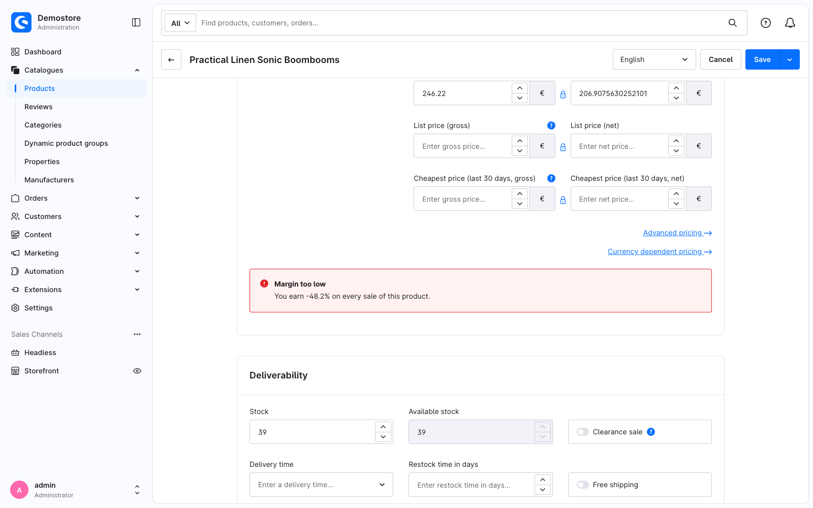

---
nav:
  title: 4. Build your own component
  position: 50

---

# Chapter 4: Build your own component

<!--@include: ../../../../../snippets/guide/administration_sfc_experimental.md-->

The override file from [Chapter 3](read-the-base-component) does three jobs at once: it decides where the banner goes, it works out the margin, and it renders the markup. In this chapter the last two move into a component of your own.

## A base component is a `.vue` file

```text
<plugin root>/src/Resources/app/administration/src/component/swag-margin-hint.vue
```

The filename rule from Chapter 2 applies here too, minus the `.override` part: this file **is** the component `swag-margin-hint`. `swag-margin-hint/index.vue` would mean the same.

Your override imports it directly, so there is nothing else to do:

```ts
import SwagMarginHint from '../component/swag-margin-hint.vue';
```

## Where the data comes from

The product form keeps the product it is editing in a store, and the core price form reads it from there. Your component does the same:

```ts
import useSwProductDetailStore from 'shopware:stores/swProductDetail';

const product = computed(() => useSwProductDetailStore().product);
```

`shopware:stores/*` is one of the virtual modules the Administration publishes for extensions: the part after the slash is the store's registry key, and the default export is its composable. There are `shopware:utils`, `shopware:data` and `shopware:mixins` alongside it.

Reading the store here is a deliberate move rather than a detour. A component that fetches what it needs works wherever it is rendered, and a plugin often ends up rendering it in more than one place.

## `swDefinePublic()`

Every base component declares what it exposes to extensions:

```ts
swDefinePublic({
    margin,
    isTooLow,
    title,
    message,
});
```

Like `swDefineOverride()`, it is auto-imported and mandatory. If you do not want to expose anything, use `swDefinePublic({})` without any entries.

What it means: **a base component is private by default.** Every top-level binding becomes ordinary component state that your own template can read, and only the names you list here become part of the API other extensions may replace.

[Chapter 5](make-it-extensible) is where that list gets used.

*Reference: [`swDefinePublic`](api-reference#swdefinepublicbindings).*

## The component

```vue
<!-- <plugin root>/src/Resources/app/administration/src/component/swag-margin-hint.vue -->
<template>
    <div class="swag-margin-hint">
        <mt-banner
            :variant="isTooLow ? 'critical' : 'positive'"
            :title="title"
        >
            {{ message }}
        </mt-banner>
    </div>
</template>

<script setup lang="ts">
import { computed } from 'vue';
import useSwProductDetailStore from 'shopware:stores/swProductDetail';

const { warnBelow = 0.2 } = defineProps<{
    warnBelow?: number;
}>();

const product = computed(() => useSwProductDetailStore().product);

// A price field holds one entry per currency; the first one is what the form shows.
function firstNetPrice(prices: unknown): number | null {
    const [first] = (prices ?? []) as { net?: number }[];

    return typeof first?.net === 'number' ? first.net : null;
}

const margin = computed(() => {
    const sellingPrice = firstNetPrice(product.value?.price);
    const purchasePrice = firstNetPrice(product.value?.purchasePrices);

    if (!sellingPrice || !purchasePrice) {
        return null;
    }

    return (sellingPrice - purchasePrice) / sellingPrice;
});

const isTooLow = computed(() => margin.value !== null && margin.value < warnBelow);

const title = computed(() => (isTooLow.value ? 'Margin too low' : 'Margin looks healthy'));

const message = computed(() => {
    if (margin.value === null) {
        return 'This product has no purchase price, so no margin can be calculated.';
    }

    return `You earn ${(margin.value * 100).toFixed(1)}% on every sale of this product.`;
});

swDefinePublic({
    margin,
    isTooLow,
    title,
    message,
});
</script>

<style scoped>
.swag-margin-hint {
    margin-top: 24px;
}
</style>
```

## The override shrinks

All the override still decides is *where*:

```vue
<!-- <plugin root>/src/Resources/app/administration/src/override/sw-product-detail-base.override.vue -->
<template>
    <sw-block extends="sw_product_detail_base_price_form">
        <sw-block-parent />

        <swag-margin-hint :warn-below="0.25" />
    </sw-block>
</template>

<script setup lang="ts">
import SwagMarginHint from '../component/swag-margin-hint.vue';

swDefineOverride({});
</script>
```

`useSwPreviousState()` is gone from this file, and so is every line of arithmetic.

## Checkpoint

Reload the product. The banner now has a colour and a heading, because the component can style itself on values the block content could not touch.



## What this replaces

<Tabs>
<Tab title="Single File Component">

```vue
<!-- component/swag-margin-hint.vue -->
<template>
    <div class="swag-margin-hint">
        <mt-banner :variant="isTooLow ? 'critical' : 'positive'" :title="title">
            {{ message }}
        </mt-banner>
    </div>
</template>

<script setup lang="ts">
import { computed } from 'vue';
import useSwProductDetailStore from 'shopware:stores/swProductDetail';

const { warnBelow = 0.2 } = defineProps<{ warnBelow?: number }>();

const product = computed(() => useSwProductDetailStore().product);
const isTooLow = computed(() => margin.value !== null && margin.value < warnBelow);
// …

swDefinePublic({ margin, isTooLow, title, message });
</script>
```

</Tab>
<Tab title="Twig / Options API">

```twig
{# component/swag-margin-hint/swag-margin-hint.html.twig #}
<div class="swag-margin-hint">
    <mt-banner :variant="isTooLow ? 'critical' : 'positive'" :title="title">
        {{ message }}
    </mt-banner>
</div>
```

```javascript
// component/swag-margin-hint/index.js
import template from './swag-margin-hint.html.twig';

export default Shopware.Component.wrapComponentConfig({
    template,

    props: {
        warnBelow: {
            type: Number,
            required: false,
            default: 0.2,
        },
    },

    computed: {
        product() {
            return Shopware.Store.get('swProductDetail').product;
        },

        isTooLow() {
            return this.margin !== null && this.margin < this.warnBelow;
        },
        // …
    },
});
```

```javascript
// main.js
Shopware.Component.register('swag-margin-hint', () => import('./component/swag-margin-hint'));
```

</Tab>
</Tabs>

The Options API version has no equivalent of `swDefinePublic`, because everything on `this` was implicitly public. That is the trade: one extra line in exchange for knowing what your component actually promises.

## Registering a component by name

Usually you do not need to register your own components anywhere: an `import` is enough, which is what this chapter does. There are two exceptions, both of them cases where something has to find your component by a *string*:

* you point a route at it, so the router resolves it by name,
* or you want to write `<swag-margin-hint />` anywhere in the Administration without importing it first.

For those, put the component in its own directory with an `index.ts` beside it:

```text
component/swag-margin-hint/
├── index.ts
└── swag-margin-hint.vue
```

```typescript
// <plugin root>/src/Resources/app/administration/src/component/swag-margin-hint/index.ts
Shopware.Component.register('swag-margin-hint', async () => {
    const component = (await import('./swag-margin-hint.vue')).default;

    return { ...component, _renderedBySfcTemplate: true } as never;
});
```

Import that `index.ts` once from `main.ts`, and the tag resolves everywhere.

`_renderedBySfcTemplate: true` tells the component factory that this component brings its own markup. A production build moves the render function inside `setup()`, where the factory does not find it, and without the flag it refuses to build the component - see the [troubleshooting page](troubleshooting#in-the-browser-console).

<PageRef page="../module-component-management/add-custom-component" title="Add custom components" sub="Registration itself, for Twig and Options API components" />

Next: [Make your component extensible](make-it-extensible).
