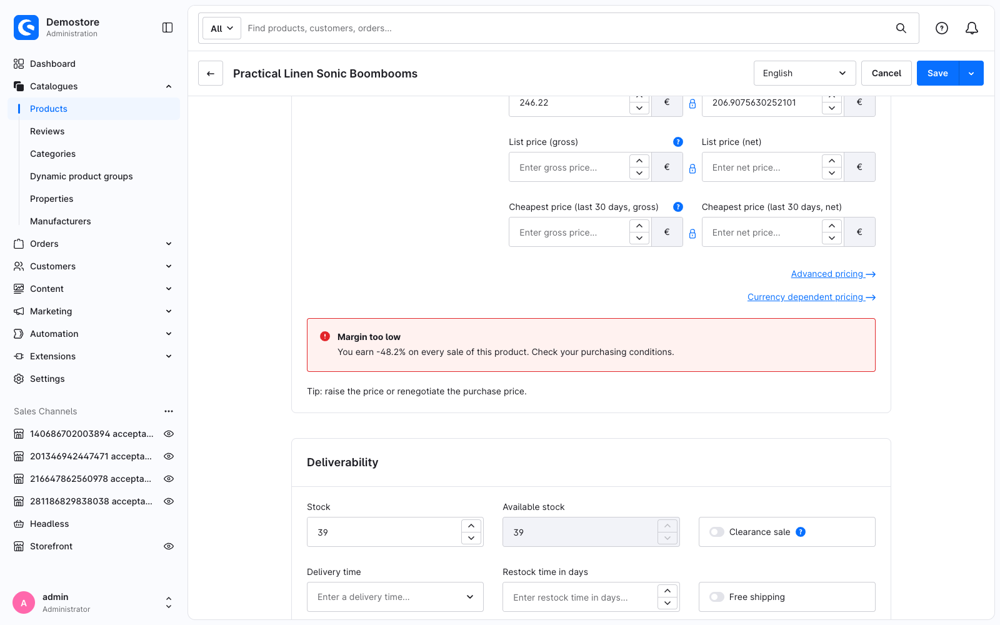

---
nav:
  title: 5. Make your component extensible
  position: 60

---

# Chapter 5: Make your component extensible

<!--@include: ../../../../../snippets/guide/administration_sfc_experimental.md-->

Your component works. Now give it the same courtesy the core page gave you in [Chapter 2](your-first-override): let other extensions change it without forking it.

There are two halves to that, and you have already met both from the other side.

## Open the markup with `<sw-block name>`

`<sw-block name="…">` declares an extension point. Whatever it wraps is the default content, and it renders exactly as before until somebody extends it:

```vue
<template>
    <div class="swag-margin-hint">
        <sw-block name="swag_margin_hint_banner">
            <mt-banner
                :variant="isTooLow ? 'critical' : 'positive'"
                :title="title"
            >
                {{ message }}
            </mt-banner>
        </sw-block>
    </div>
</template>
```

The `<script setup>` block is unchanged.

**Name it after the component and the spot.** The convention is a prefix identifying the owner, then the path through the component, in `snake_case` - core uses `sw_`, so `swag_margin_hint_banner` for a plugin block reads unambiguously next to it. Block names must be unique per component.

A block you find in core is covered by the backwards-compatibility promise, so you can rely on it until the next major version.

*Reference: [`sw-block`](api-reference#sw-block).*

## Open the state with `swDefinePublic`

You already did this in [Chapter 4](build-your-own-component#swdefinepublic):

```ts
swDefinePublic({
    margin,
    isTooLow,
    title,
    message,
});
```

That is the second half: `sw-block` lets an extension add markup, `swDefinePublic` lets it override the component's state.

## Try it out on your own component

The quickest way to see what you just built is to extend it yourself. Write a second override - against your own component this time - that replaces the message and adds a line of advice:

```vue
<!-- <plugin root>/src/Resources/app/administration/src/override-demo/swag-margin-hint.override.vue -->
<template>
    <sw-block extends="swag_margin_hint_banner">
        <sw-block-parent />

        <p class="swag-margin-hint__tip">
            Tip: raise the price or renegotiate the purchase price.
        </p>
    </sw-block>
</template>

<script setup lang="ts">
import { computed } from 'vue';

const previousState = useSwPreviousState();

const message = computed(() => `${previousState.message.value} Check your purchasing conditions.`);

swDefineOverride({
    message,
});
</script>
```

This is the first time `swDefineOverride` is given something. Every name in it replaces the binding of that name in the component being overridden - a `computed`, a `ref` or a function alike. So `message` here wins over the `message` your component computed, and `previousState.message.value` is that original, which is how the override builds on it instead of throwing it away.

The one thing you cannot override is a **prop**: it comes from whoever renders the component, so an override returning a prop name is rejected with a console error.

::: info Where the file sits
Anywhere under your Administration source directory. `override-demo/` only keeps this experiment visibly separate from the override that does the real work. The one constraint is that the filename is the whole identity, so two overrides of the *same* component need two directories.
:::

## Checkpoint

Reload the product:



Three files are on screen at once: a core Twig component providing the price card, your component providing the banner, and an override changing the banner's text and adding a line under it. None of them knows the others exist - which is the whole point of declaring the block and the public API rather than editing the component directly.

## What this replaces

<Tabs>
<Tab title="Single File Component">

```vue
<template>
    <sw-block extends="swag_margin_hint_banner">
        <sw-block-parent />
        <p>Tip: raise the price or renegotiate the purchase price.</p>
    </sw-block>
</template>

<script setup lang="ts">
import { computed } from 'vue';

const previousState = useSwPreviousState();
const message = computed(() => `${previousState.message.value} Check your purchasing conditions.`);

swDefineOverride({ message });
</script>
```

</Tab>
<Tab title="Twig / Options API">

```twig
{# swag-margin-hint.html.twig #}

    
    <p>Tip: raise the price or renegotiate the purchase price.</p>

```

```javascript
// index.js
import template from './swag-margin-hint.html.twig';

Shopware.Component.override('swag-margin-hint', {
    template,

    computed: {
        message() {
            return `${this.$super('message')} Check your purchasing conditions.`;
        },
    },
});
```

</Tab>
</Tabs>

The mapping is close to one to one:

* `this.$super('message')` becomes `previousState.message.value`
* <code v-pre></code> becomes `<sw-block-parent />`
* the `computed` block of the override config becomes the object you pass to `swDefineOverride`

## Done

You have written every kind of file the system has:

* an override that contributes markup to a component you do not own,
* an override that reads that component's state,
* a component of your own, with props and state,
* and an override of *your* component, driven by the extension points you chose to declare.

When something breaks, start at the [troubleshooting page](troubleshooting).
