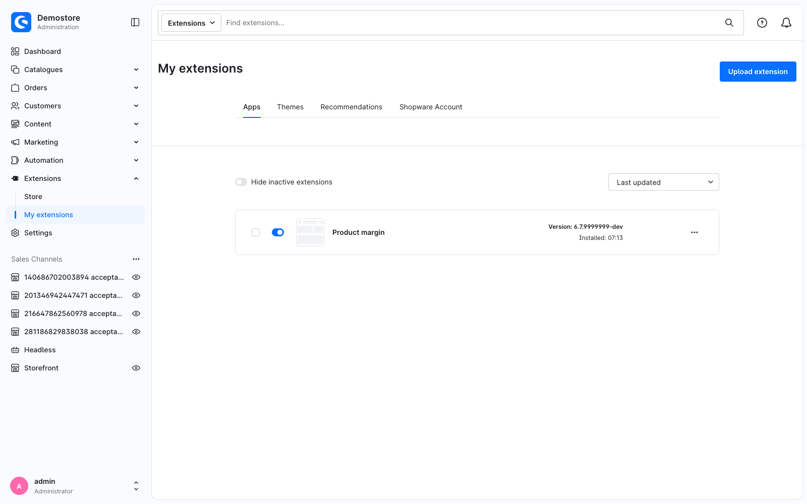

---
nav:
  title: 1. Set up your environment
  position: 20

---

# Chapter 1: Set up your environment

<!--@include: ../../../../../snippets/guide/administration_sfc_experimental.md-->

At the end of this chapter you have a running shop in Docker, an installed plugin that does nothing yet, and a build command that works. The Vue starts in [Chapter 2](your-first-override).

## A shop to develop against

Shopware CLI ships a Docker-based development environment, so you need Docker and [Shopware CLI](https://developer.shopware.com/docs/products/cli/) and nothing else. From your project root:

```bash
shopware-cli project dev
```

That starts the containers, installs Shopware if it is not installed yet, and opens a dashboard with the shop URL, the admin URL and the credentials.

<PageRef page="../../../../development/dev-environment" title="Development environment" sub="The full Shopware CLI Docker setup, its dashboard and its options" />

::: warning You need a shop built from `trunk`
Single File Component support is not part of any 6.7 release. Point your project at the `trunk` branch of [shopware/shopware](https://github.com/shopware/shopware) before you start.
:::

### Running commands inside the container

PHP runs in the `web` container, not on your host, and a host PHP usually has too little memory and no route to the database. Two ways to reach it:

<Tabs>
<Tab title="bin/console">

```bash
shopware-cli project console cache:clear
```

Shopware CLI runs the command inside the container for you. The alias `swx` is shorter and does the same:

```bash
swx plugin:refresh
```

</Tab>
<Tab title="composer and anything else">

```bash
docker compose exec web composer install
```

Or open a shell and stay there:

```bash
docker compose exec web bash
```

</Tab>
</Tabs>

Everywhere below, a `bin/console …` line means "run this through `shopware-cli project console`", and a `composer …` line means "run this inside the `web` container".

## The plugin

Create this structure below your shop's `custom/plugins` directory:

```text
custom/plugins/SwagProductMargin/
├── composer.json
└── src/
    ├── SwagProductMargin.php
    └── Resources/
        └── app/
            └── administration/
                └── src/
                    └── main.ts
```

The path matters: Shopware finds your Administration code at `src/Resources/app/administration/src/`, and `main.ts` inside it is the entry point. Written out in full, that is

```text
custom/plugins/SwagProductMargin/src/Resources/app/administration/src/
```

and the rest of this tutorial calls it `<plugin root>/src/Resources/app/administration/src/`. Everything below it is yours to organise into whatever directories you like - the build searches the whole tree. This tutorial ends up with an `override/` and a `component/` directory, but nothing depends on those names.

`main.ts` is the one file you create empty. This tutorial never puts anything in it - the build finds your code on its own - but it has to exist for the plugin to be picked up:

```typescript
// <plugin root>/src/Resources/app/administration/src/main.ts
// Intentionally empty: overrides register themselves and components are imported where they are used.
```

```json
// <plugin root>/composer.json
{
    "name": "swag/product-margin",
    "description": "Warns when a product's profit margin is too low",
    "type": "shopware-platform-plugin",
    "license": "MIT",
    "autoload": {
        "psr-4": {
            "Swag\\ProductMargin\\": "src/"
        }
    },
    "extra": {
        "shopware-plugin-class": "Swag\\ProductMargin\\SwagProductMargin",
        "label": {
            "en-GB": "Product margin"
        }
    }
}
```

```php
// <plugin root>/src/SwagProductMargin.php
<?php declare(strict_types=1);

namespace Swag\ProductMargin;

use Shopware\Core\Framework\Plugin;

class SwagProductMargin extends Plugin
{
}
```

::: info More on the PHP side
This tutorial keeps the PHP to the absolute minimum. Plugin metadata, versioning, lifecycle methods and services are covered in the [Plugin base guide](../../plugin-base-guide).
:::

Install and switch it on:

```bash
shopware-cli project console plugin:refresh
```

```bash
shopware-cli project console plugin:install --activate SwagProductMargin
```

You repeat those two whenever you *add or remove* a plugin. Editing files inside an already-activated plugin does not need them.

## Build the Administration

Your `.vue` files are compiled into the Administration bundle. Pick the right command and you save a lot of waiting:

<Tabs>
<Tab title="Watcher (while developing)">

```bash
shopware-cli project admin-watch
```

Serves the Administration with hot module replacement. Save a file, the browser updates. Use this for Chapters 2 to 5.

</Tab>
<Tab title="Full build">

```bash
shopware-cli project admin-build
```

Compiles the Administration and every extension into static assets, the way a production install runs it. Slower, but it is what your users will actually get, so run it at least once before you ship.

</Tab>
</Tabs>

<PageRef page="../../../../development/tooling/using-watchers" title="Hot module replacement" sub="Watchers and build commands for the Administration and the Storefront" />

## Turn on editor support

Everything the build rejects is also reported by ESLint, on the exact line, as you type. Setting that up before you write the first component is worth the one command:

```bash
composer admin:setup-extension-tooling
```

It writes a `tsconfig.json` and an `eslint.config.mjs` into your plugin - commit those two - and prints the settings your editor needs. You can run the same checks by hand at any point:

```bash
composer admin:check-extensions -- --only=SwagProductMargin
```

```text
  SwagProductMargin  custom/plugins/SwagProductMargin
    TypeScript ✔ passed       managed · 4.9s
    ESLint     ✔ passed       managed · 3.6s
```

The `--` is required; without it Composer eats the option.

::: info Experimental
Both commands were newly introduced and their usage may still change. Feel free to give us feedback.
:::

## Checkpoint

Open the Administration and go to **Extensions → My extensions**. `Product margin` is listed and switched on:



Nothing else is visible yet, because the plugin has no Administration code. That is [Chapter 2](your-first-override).
