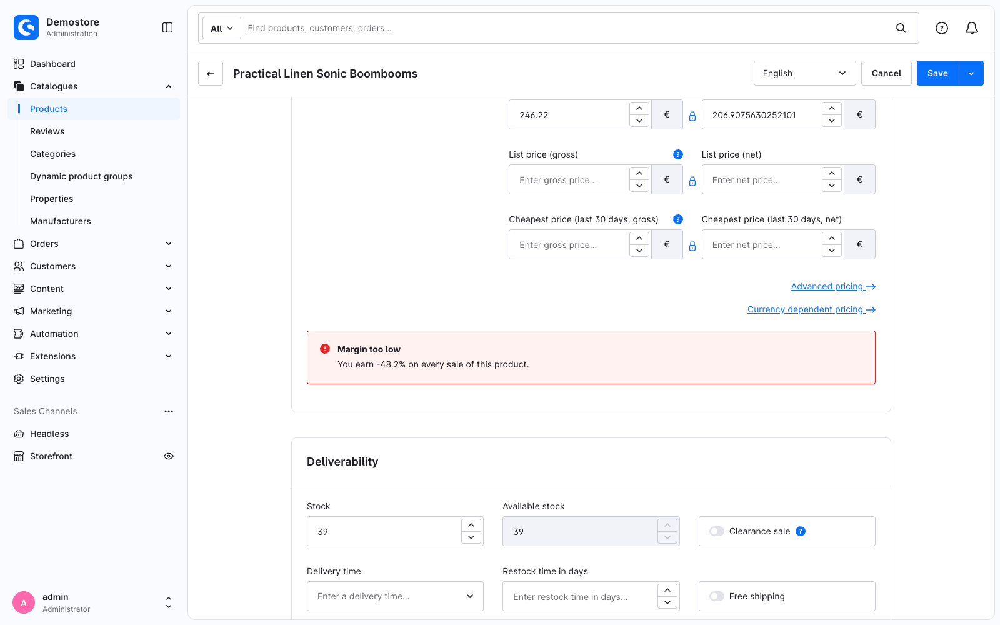

---
nav:
  title: 4. Build your own component
  position: 40

---

# Chapter 4: Build your own component

<!--@include: ../../../../../../snippets/guide/administration_sfc_experimental.md-->

The override file from [Chapter 3](read-the-base-component) does three jobs at once: it decides where the banner goes, it works out the margin, and it renders the markup. In this chapter the last two move into a component of your own.

## A base component is a `.vue` file

Create the component as a single file:

```text
<plugin root>/src/Resources/app/administration/src/component/swag-margin-hint.vue
```

The filename is the component's name: this file **is** the component `swag-margin-hint`. `swag-margin-hint/index.vue` would mean the same.

::: info Same rule as for overrides
This is the naming rule of an `.override.vue` file from [Chapter 2](your-first-override#one-file-and-its-name-is-the-registration), without the `.override` part, because this file is a component of its own.
:::

Your override imports it directly, so there is nothing else to do:

```ts
import SwagMarginHint from '../component/swag-margin-hint.vue';
```

## Where the data comes from

The product form keeps the product it is editing in a store, and the core price form reads it from there. Your component does the same:

```ts
import useSwProductDetailStore from 'shopware:stores/swProductDetail';

const product = computed(() => useSwProductDetailStore().product);
```

`shopware:stores/*` is one of the virtual modules the Administration publishes for extensions: the part after the slash is the store's registry key, and the default export is its composable. There are `shopware:composables`, `shopware:utils`, `shopware:data` and `shopware:mixins` alongside it.

Reading the store has two advantages. A component that fetches what it needs works wherever it is rendered, and a plugin often ends up rendering it in more than one place. The store is also a public API, while `previousState.product` is whatever the core component happens to expose.

## Where the strings come from

[Chapter 3](read-the-base-component) wrote its English straight into the override. A component you ship reads its strings from snippet files instead:

```text
<plugin root>/src/Resources/app/administration/src/component/
├── snippet/
│   ├── de-DE.json
│   └── en-GB.json
└── swag-margin-hint.vue
```

`snippet/en-GB.json` holds the four strings the banner needs:

```json
{
    "swag-margin": {
        "hint": {
            "tooLow": "Margin too low",
            "healthy": "Margin looks healthy",
            "noPurchasePrice": "This product has no purchase price, so no margin can be calculated.",
            "margin": "You earn {margin}% on every sale of this product."
        }
    }
}
```

`snippet/de-DE.json` repeats the same keys:

```json
{
    "swag-margin": {
        "hint": {
            "tooLow": "Marge zu niedrig",
            "healthy": "Marge sieht gut aus",
            "noPurchasePrice": "Dieses Produkt hat keinen Einkaufspreis, daher lässt sich keine Marge berechnen.",
            "margin": "Du verdienst {margin}% an jedem Verkauf dieses Produkts."
        }
    }
}
```

There is nothing to import and nothing to register. Shopware collects every `en-GB.json`, `de-DE.json` and friends from anywhere under `src/Resources/app/administration/src/` when your plugin is activated. That happens on the PHP side and does not touch the JavaScript build, so the existing [Adding snippets](../../templates-styling/adding-snippets) guide applies to a Single File Component unchanged.

Apply the changes by clearing the cache and reloading the page:

```bash
shopware-cli project console cache:clear
```

In a template you read a key with `$t()`. It is a Vue global property, so there is nothing to import:

```html
<p>{{ $t('swag-margin.hint.tooLow') }}</p>
```

A `<script setup>` block has no `this` to reach `$t` through, and an extension cannot `import { useI18n } from 'vue-i18n'` - see [troubleshooting](../troubleshooting#usei18n-does-not-work-in-a-plugin). Use the composable instead:

```ts
import { useTranslateWithFallback } from 'shopware:composables';

const { tWithFallback } = useTranslateWithFallback();

const title = computed(() => tWithFallback(isTooLow.value ? 'swag-margin.hint.tooLow' : 'swag-margin.hint.healthy'));
```

`tWithFallback()` tries the active locale, then the fallback locale, and returns the key itself when neither has an entry - so a merchant on a language your plugin does not ship still sees English rather than a blank banner.

::: info Keys with a placeholder
`tWithFallback()` takes a key and nothing else. For `"margin": "You earn {margin}% …"` you therefore either interpolate in the template, with `$t('swag-margin.hint.margin', { margin: … })`, or call `Shopware.Snippet.t(key, params)` in the script. The component below does the latter, because `message` is part of its public API and [Chapter 5](make-it-extensible) overrides it.
:::

*Reference: [`useTranslateWithFallback()`](../api-reference/composables/use-translate-with-fallback).*

## `swDefinePublic()`

Every base component declares what it exposes to extensions:

```ts
swDefinePublic({
    margin,
    isTooLow,
    title,
    message,
});
```

Like `swDefineOverride()`, it is auto-imported and mandatory. If you do not want to expose anything, use `swDefinePublic({})` without any entries.

What it means: **a base component is private by default.** Every top-level binding becomes ordinary component state that your own template can read, and only the names you list here become part of the API other extensions may replace.

[Chapter 5](make-it-extensible) is where that list gets used.

*Reference: [`swDefinePublic()`](../api-reference/macros/sw-define-public).*

## Styles

Until now, the banner sat flush against the price fields, because the content of a block gets no spacing of its own. A component brings its own styles in a `<style scoped>` block, so it can add the gap itself:

```vue
<style scoped>
.swag-margin-hint {
    margin-top: 24px;
}
</style>
```

`scoped` limits the rules to the markup of this component, so they cannot leak into the rest of the Administration. The template wraps the banner in a `div` with the class `swag-margin-hint`, which is what the rule targets.

## The component

```vue
<!-- <plugin root>/src/Resources/app/administration/src/component/swag-margin-hint.vue -->
<template>
    <div class="swag-margin-hint">
        <mt-banner
            :variant="isTooLow ? 'critical' : 'positive'"
            :title="title"
        >
            {{ message }}
        </mt-banner>
    </div>
</template>

<script setup lang="ts">
import { computed } from 'vue';
import useSwProductDetailStore from 'shopware:stores/swProductDetail';
import { useTranslateWithFallback } from 'shopware:composables';

const { warnBelow = 0.2 } = defineProps<{
    warnBelow?: number;
}>();

const { tWithFallback } = useTranslateWithFallback();

const product = computed(() => useSwProductDetailStore().product);

// A price field holds one entry per currency; the first one is what the form shows.
function firstNetPrice(prices: unknown): number | null {
    const [first] = (prices ?? []) as { net?: number }[];

    return typeof first?.net === 'number' ? first.net : null;
}

const margin = computed(() => {
    const sellingPrice = firstNetPrice(product.value?.price);
    const purchasePrice = firstNetPrice(product.value?.purchasePrices);

    if (!sellingPrice || !purchasePrice) {
        return null;
    }

    return (sellingPrice - purchasePrice) / sellingPrice;
});

const isTooLow = computed(() => margin.value !== null && margin.value < warnBelow);

const title = computed(() => tWithFallback(isTooLow.value ? 'swag-margin.hint.tooLow' : 'swag-margin.hint.healthy'));

const message = computed(() => {
    if (margin.value === null) {
        return tWithFallback('swag-margin.hint.noPurchasePrice');
    }

    return Shopware.Snippet.t('swag-margin.hint.margin', {
        margin: (margin.value * 100).toFixed(1),
    });
});

swDefinePublic({
    margin,
    isTooLow,
    title,
    message,
});
</script>

<style scoped>
.swag-margin-hint {
    margin-top: 24px;
}
</style>
```

## The override shrinks

All the override still decides is *where*:

```vue
<!-- <plugin root>/src/Resources/app/administration/src/override/sw-product-detail-base.override.vue -->
<template>
    <sw-block extends="sw_product_detail_base_price_form">
        <sw-block-parent />

        <swag-margin-hint :warn-below="0.25" />
    </sw-block>
</template>

<script setup lang="ts">
import SwagMarginHint from '../component/swag-margin-hint.vue';

swDefineOverride({});
</script>
```

`useSwPreviousState()` is gone from this file, and so is every line of arithmetic.

## Checkpoint

Reload the product. The banner looks as it did in Chapter 3 except for one thing: it no longer sits flush against the price fields. That is the gap [Chapter 2](your-first-override#checkpoint) promised, and it comes from the component's own `<style scoped>` block. Everything else changed underneath: the markup, the arithmetic and the strings now live in a component that reads the product from the store, so you can render it anywhere.



## What this replaces

<Tabs>
<Tab title="Single File Component">

```vue
<!-- component/swag-margin-hint.vue -->
<template>
    <div class="swag-margin-hint">
        <mt-banner :variant="isTooLow ? 'critical' : 'positive'" :title="title">
            {{ message }}
        </mt-banner>
    </div>
</template>

<script setup lang="ts">
import { computed } from 'vue';
import useSwProductDetailStore from 'shopware:stores/swProductDetail';
import { useTranslateWithFallback } from 'shopware:composables';

const { warnBelow = 0.2 } = defineProps<{ warnBelow?: number }>();
const { tWithFallback } = useTranslateWithFallback();

const product = computed(() => useSwProductDetailStore().product);
const isTooLow = computed(() => margin.value !== null && margin.value < warnBelow);
const title = computed(() => tWithFallback(isTooLow.value ? 'swag-margin.hint.tooLow' : 'swag-margin.hint.healthy'));
// …

swDefinePublic({ margin, isTooLow, title, message });
</script>
```

</Tab>
<Tab title="Twig / Options API">

```twig
{# component/swag-margin-hint/swag-margin-hint.html.twig #}
<div class="swag-margin-hint">
    <mt-banner :variant="isTooLow ? 'critical' : 'positive'" :title="title">
        {{ message }}
    </mt-banner>
</div>
```

```javascript
// component/swag-margin-hint/index.js
import template from './swag-margin-hint.html.twig';

export default Shopware.Component.wrapComponentConfig({
    template,

    props: {
        warnBelow: {
            type: Number,
            required: false,
            default: 0.2,
        },
    },

    computed: {
        product() {
            return Shopware.Store.get('swProductDetail').product;
        },

        isTooLow() {
            return this.margin !== null && this.margin < this.warnBelow;
        },

        title() {
            return this.$tc(this.isTooLow ? 'swag-margin.hint.tooLow' : 'swag-margin.hint.healthy');
        },
        // …
    },
});
```

```javascript
// main.js
Shopware.Component.register('swag-margin-hint', () => import('./component/swag-margin-hint'));
```

</Tab>
</Tabs>

The Options API version has no equivalent of `swDefinePublic`, because everything on `this` was implicitly public. The extra line is what makes the component's contract explicit.

The snippet files are the same in both columns, and so is where they sit: `this.$tc()` becomes `tWithFallback()` only because a `<script setup>` block has no `this`.

## Registering a component by name

Usually you do not need to register your own components anywhere: an `import` is enough, which is what this chapter does. There is one exception, the case where something has to find your component by a *string*: you want to write `<swag-margin-hint />` anywhere in the Administration without importing it first.

### Using a component in a route

A route looks like such a case, but it is not one. `Shopware.Module.register()` takes the imported component itself, and the router only looks a name up in the component registry when you actually hand it a name:

```typescript
// <plugin root>/src/Resources/app/administration/src/module/swag-product-margin/index.ts
import SwagMarginPage from './page/swag-margin-page.vue';

Shopware.Module.register('swag-product-margin', {
    type: 'plugin',
    name: 'SwagProductMargin',
    title: 'swag-margin.module.title',

    routes: {
        index: {
            component: SwagMarginPage as never,
            path: 'index',
        },
    },
});
```

The `as never` is there for TypeScript only. The module manifest types `component` as `string | App<Element>`, and a `.vue` import is neither of those, so the cast is what gets you past the type check. At runtime the router resolves only string names through the component registry and passes anything else on to Vue Router untouched.

### Using the tag without an import

For that one, put the component in its own directory with an `index.ts` beside it:

```text
component/swag-margin-hint/
├── index.ts
└── swag-margin-hint.vue
```

```typescript
// <plugin root>/src/Resources/app/administration/src/component/swag-margin-hint/index.ts
Shopware.Component.register('swag-margin-hint', async () => {
    const component = (await import('./swag-margin-hint.vue')).default;

    return { ...component, _renderedBySfcTemplate: true } as never;
});
```

Import that `index.ts` once from `main.ts`, and the tag resolves everywhere.

`_renderedBySfcTemplate: true` tells the component factory that this component brings its own markup. A production build moves the render function inside `setup()`, where the factory does not find it, and without the flag it refuses to build the component, see the [troubleshooting page](../troubleshooting#in-the-browser-console). The flag is an internal detail of the factory rather than a stable API; it is documented here because there is no other way to register a `.vue` base component by name today.

<PageRef page="../../module-component-management/add-custom-component" title="Add custom components" sub="Registration itself, for Twig and Options API components" />

Next: [Make your component extensible](make-it-extensible).
